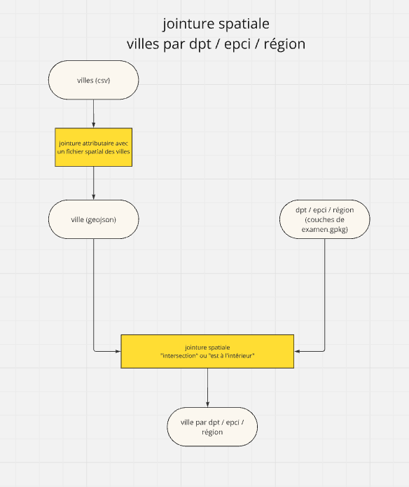

```{r setup, include=FALSE}
knitr::opts_chunk$set(eval  = FALSE)
knitr::opts_chunk$set(echo  = TRUE)
knitr::opts_chunk$set(warning  = FALSE)
``` 


```{r}
library(sf)
library(mapsf)
library(mapview)
```

# Objectif

Correction DST concept.

Les sujets tournaient autour de la jointure attributaire et spatiale avec
la place des communes choisies dans les dpt / cc / région.

Un sujet supplémentaire par rapport aux couleurs


```{r}
library(sf)
library(mapsf)
library(mapview)
```


# Les données

fichier villes.csv

```{r}
ville <- read.csv("data/sujets/DSTConcept/ville.csv")
nom <- couche$name
for (i in c(1:3)) {
  tmp <- st_read("data/sujets/DSTConcept/examen.gpkg", nom[i])
  assign(nom [i], tmp )
  }
```

# Jointure attributaire

la clé

```{r}
ville$codeDepartement
ville$codeEpci
ville$codeRegion
dpt$INSEE_DEP
region$INSEE_REG
epci$CODE_EPCI
```


la jointure


```{r}
joint <- merge(dpt, ville, by.x = "INSEE_DEP", by.y = "codeDepartement")
mapview(joint)
st_write(joint, "data/sujets/DSTConcept/examen.gpkg", "villeDpt")
```


jointure spatiale shéma de traitement



# Analyse


Choix dispersion ou pas. Evocation de critère : université parisienne etc...


# Point bonus


```{r}
sort(table(joint$NOM_DEP))

```


Comptage à partir de la table attributaire


