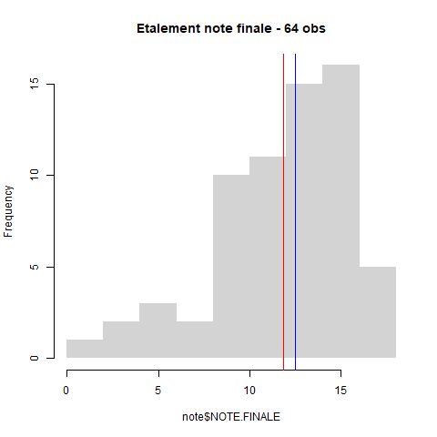

```{r setup, include=FALSE}
knitr::opts_chunk$set(eval  = TRUE)
knitr::opts_chunk$set(echo  = TRUE)
knitr::opts_chunk$set(warning  = FALSE)
``` 


# Intitulé et déroulé du cours


```{r}
data <- read.csv("data/derouleGeomatique.csv", fileEncoding = "UTF-8")
knitr::kable(data [,-1])
```


## bureaux de vote REU

intérêt de la maille du bureau de vote

Chercher *REU* au niveau de la zone de recherche de data.gouv, quelles perspectives pour les chercheurs ?

```{r}
library(sqldf)
head("data/gros/table-adresses-reu.csv")
data <- read.csv("data/gros/table-adresses-reu.csv", nrows = 10000)
str(data)
tail(data)
sqldf("select * from data where code_commune_ref like 1025")
sqldf("select * from data where id_brut_bv_reu like '01025%'")
data [data$code_commune_ref == 1001,]
data <- read.csv.sql("data/gros/table-adresses-reu.csv", sql = "select * from file where code_commune_ref like 93010 " )
```


### Cartographies bureaux de vote


https://makinacorpus.github.io/bureaux-de-vote-reconstruction/#12.39/48.91021/2.48385

https://demo-terravisu.solutions-territoriales.fr/visualiser/elections#map=14.27/48.9005/2.46921&layers=a0c5903b79811fda82ef73b9dca9aacc


# La donnée à utiliser

```{r}
library(sf)
bv <- st_read("data/gros/bureau-de-vote-insee-reu-openstreetmap.gpkg")
bondy <- bv [bv$insee == '93010',]
st_write(bondy,"data/geomatique_bvBondy.geojson")
st_write(bv,"data/gros/bv.geojson")
```


pb 75109


```{r}
paris <- (bv [grep('^75109', bv$bureau),])
mf_map(paris)
mf_map(paris2, add =T, col="red")
st_is_valid(paris)
paris2 <- st_cast(paris, "POLYGON")
st_write(paris, "data/geomatique_75109d.geojson", append = FALSE)
paris3 <- st_read("data/geomatique_75109.gpkg")
st_write(paris3, "data/geomatique_75109b.geojson", append = FALSE)
```


extraction des communes

```{r}
villes <- read.csv("data/etudiantGeomatique.csv", fileEncoding = "UTF-8")
villes <- villes$code.INSEE
bvSel <- bv [bv$insee %in% villes,]
library(mapsf)
fond <- st_read("data/gros/DEPARTEMENT_CARTO.shp")
```

enregistrement par commune

```{r}
for (v in villes){
  print(v)
  data <- bv [bv$insee == v,]
  st_write(data, paste0("data/geomatique_",v, ".geojson"), append = FALSE)
}
```


```{r}
png("img/coursGeomatique.png")
mf_init(bv)
mf_map(fond, add = T, col = "antiquewhite", border= "white")
mf_map(bvSel, add = T, col = "red", border=NA)
mf_layout("Choix des communes cours géomatique 2024", credits = "IGN")
dev.off()
st_write(bv, "data/bv.geojson")
```


# Présentation rapide (vous êtes nombreux !)

## Qui sont les étudiants ?


```{r}
etudiant <-  read.csv("data/etudiantGeomatique.csv", fileEncoding = "UTF-8")
names(etudiant)
png("img/quisontils.png", width = 8000, height = 5000, res=600)
#par(mar = c(2,16,2,4))
par(mfrow = c(1,3))
for (i in 2:4){
  par(mar=c(1, 12, 2, 2))
  barplot(sort(table(etudiant [,i])), border = NA,
          horiz = T, las = 2, cex.names = 0.8, 
          main = names (etudiant) [i])
}
dev.off()
```


## Présence et rendu des devoirs : chiffres clés

### Effectif et cours

```{r, eval=TRUE}
fic <- list.files("data/", pattern = "^cours")
fic
# on recherche le fichier le plus haut
nb <- max(as.integer(substring(fic, 6,7)))
tmp <- NULL
tab <- NULL
i <-  1
for (i in 1:nb) {
  print(i)
  nomFic <- paste0("data/cours", i, ".csv")
  data <- read.csv(nomFic, fileEncoding = "UTF-8")
  data <- data [data [,2] == "oui",]
  tmp <- table(data$groupe)
  tab <- rbind(tab , tmp)
}
tab
row.names(tab) <- paste0("cours ",seq(1,nb, by = 1))
paste0("cours ",seq(1,nb, by = 1))
knitr::kable(tab)
# Graphique
p <- barplot(tab, beside = T, main = "nombre d'étudiants par groupe et par cours", xlab = "groupe", ylab = "nb", col = terrain.colors(nb) 
        , border = NA, legend =  F)

```


### Les rendus d'exercices


```{r}
rendu <- c(56,59, 56, 45,58,49)
titre <- c("distribution", "univarié", "contingence", "khi2", "regression", "1er script")
par(mar = c(8,6,6,6))
p <- barplot(rendu, names = titre, cex.names = 0.8, las = 2, main = "rendu devoirs (effectif 75 étudiants environ)", border = NA)
text(p, y = rendu - 1, labels = rendu )
```


#### Les notes des exercices


- Le critère externe : des points faciles ?

le nom du fichier
le temps du rendu (avant la limite)

- Distribution des totaux

```{r, eval=T}
res <- read.csv("data/exo.csv",  na.strings = '-', fileEncoding = "UTF-8")
names(res)
res <- res [, c(2:5,1,6)]
# recodage : si note 2, alors note1 = 0 si NA
res$X1_Univarié.1 [is.na(res$X1_Univarié.1 )& !is.na(res$X2_Univarié.2)] <- 0
res$X1_Univarié.1 [ is.na(res$X2_Univarié.2)] <- NA
# graphique
par(mfrow= c(2,3))
for (i in (1:length(res))){
  p <-barplot(table(res[,i]), main = names(res)[i])
}
```


## Notes finales


```{r, eval=FALSE}
note <- read.csv("data/noteFinales.csv", fileEncoding = "UTF-8", na.strings = c("EN ATTENTE", "NA","-"), dec = ",")
summary(note)
png("img/noteFin.png")
hist(note$NOTE.FINALE, main = "Etalement note finale - 64 obs", freq = T, border = NA)
abline(v = mean(note$NOTE.FINALE, na.rm = T),  col = "red")
abline(v = median(note$NOTE.FINALE, na.rm=T), col = "blue")
dev.off()
```




