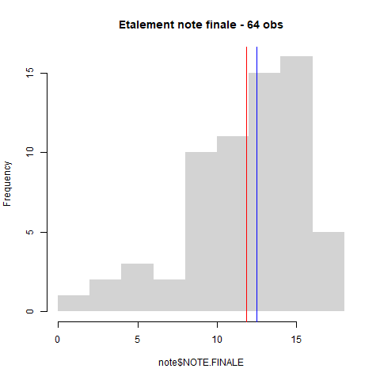

```{r setup, include=FALSE}
knitr::opts_chunk$set(eval  = TRUE)
knitr::opts_chunk$set(echo  = TRUE)
knitr::opts_chunk$set(warning  = FALSE)
``` 


# Les étudiants

*"L4GEOMAT - TD - Bases conceptuelles de la géomatique"*

```{r}
vendredi <- read.csv("data/baseGeomatique.csv", fileEncoding = "UTF-8")
vendredi <- vendredi [vendredi$prénom!="",]
tabVendredi <- table(vendredi$appétence.pour.la.géomatique..1...passionnément..4...pas.du.tout.)
barplot(tabVendredi, main = length(vendredi$prénom))
```


*"L6GECSIG - TD - Construction et utilisation des SIG"*

```{r}
jeudi <- read.csv("data/construction.csv", fileEncoding = "UTF-8")
jeudi <- jeudi [jeudi$prénom!="",]
tabJeudi <- table(jeudi$appétence.pour.la.géomatique..1.4..1.passionnément..4.pas.du.tout.)
barplot(tabJeudi, main = length(jeudi$prénom))
```


```{r}
png("img/appetence.png", width = 1000, height = 300)
par(mfrow = c(1,2))
barplot(tabVendredi, main = paste0("Vendredi : ",length(vendredi$prénom)))
barplot(tabJeudi, main = paste0("Jeudi : ",length(jeudi$prénom)))
dev.off()
```


## Passé,Futur

```{r}
table(jeudi$futur)
table(vendredi$futur)
# on recode ? géomatique urbanisme autre
vecteur <- jeudi$futur 
recodage <- function (vecteur){
  res [1:length(vecteur)] <- NA
  res [grep("géomatique", vecteur)] <- "géomatique"
  res [grep("urba", vecteur)] <- "urbanisme"
  res [grep("\\?", vecteur)] <- "?"
  table(res)
  res [is.na(res)] <- "autres"
  tab <- table(res)
  return(tab)
}
jeudiFutur <- recodage(jeudi$futur)
vendrediFutur <- recodage(vendredi$futur)
png("img/futur.png")
par(mfrow = c(2,1))
barplot(jeudiFutur, main = "jeudi")
barplot(vendrediFutur, main = "vendredi")
dev.off()
jeudiFutur
vendrediFutur
```


## Adresses mails

```{r}
nom <- c("adresseMail", "groupeTD")
names(jeudi)[2:3] <- nom
names(vendredi)[c(2,4)] <- nom
mail <- rbind(vendredi [, c(2,4)], jeudi [,c(2,3)])
mail <- mail [!is.na(mail$groupeTD),]
mail [mail$groupeTD == "",]
```


Créer une liste des mails pour tous les étudiants
(communication défi)

```{r}
liste <-paste0(mail$adresseMail, ";", collapse = "")
write(liste,"data/mailEtudiant.txt")
```


# La donnée à utiliser

```{r}
library(sf)
bv <- st_read("P:/MARANGET/cours1/bureau-de-vote-insee-reu-openstreetmap.gpkg")
bondy <- bv [bv$insee == '93010',]
st_write(bondy,"data/bvBondy.geojson")
st_write(bv,"data/gros/bv.geojson")
```

```{r}
paris <- bv [grep('^75113', bv$bureau),]
st_write (paris, "data/geomatique_75113.geojson")
```


# Présentation rapide (vous êtes nombreux !)

## Qui sont les étudiants ?


```{r}
etudiant <-  read.csv("data/cours1.csv", fileEncoding = "UTF-8")
names(etudiant)
names(etudiant)[8:9] <- c("appétence", "nb d'années")
png("img/quisontils.png", width = 10000, height = 10000, res=1800)
#par(mar = c(2,16,2,4))
par(mfrow = c(2,3))
for (i in 5:9){
  (mar = c(2,16,2,4))
  barplot(sort(table(etudiant [,i])), border = NA,
          horiz = T, las = 2, cex.names = 0.8, 
          main = names (etudiant) [i])
}
dev.off()
```


## Présence et rendu des devoirs : chiffres clés

### Effectif et cours

```{r, eval=TRUE}
fic <- list.files("data/", pattern = "^cours")
fic
# on recherche le fichier le plus haut
nb <- max(as.integer(substring(fic, 6,7)))
tmp <- NULL
tab <- NULL
i <-  1
for (i in 1:nb) {
  print(i)
  nomFic <- paste0("data/cours", i, ".csv")
  data <- read.csv(nomFic, fileEncoding = "UTF-8")
  data <- data [data [,2] == "oui",]
  tmp <- table(data$groupe)
  tab <- rbind(tab , tmp)
}
tab
row.names(tab) <- paste0("cours ",seq(1,nb, by = 1))
paste0("cours ",seq(1,nb, by = 1))
knitr::kable(tab)
# Graphique
p <- barplot(tab, beside = T, main = "nombre d'étudiants par groupe et par cours", xlab = "groupe", ylab = "nb", col = terrain.colors(nb) 
        , border = NA, legend =  F)

```


### Les rendus d'exercices


```{r}
rendu <- c(56,59, 56, 45,58,49)
titre <- c("distribution", "univarié", "contingence", "khi2", "regression", "1er script")
par(mar = c(8,6,6,6))
p <- barplot(rendu, names = titre, cex.names = 0.8, las = 2, main = "rendu devoirs (effectif 75 étudiants environ)", border = NA)
text(p, y = rendu - 1, labels = rendu )
```


#### Les notes des exercices


- Le critère externe : des points faciles ?

le nom du fichier
le temps du rendu (avant la limite)

- Distribution des totaux

```{r, eval=T}
res <- read.csv("data/exo.csv",  na.strings = '-', fileEncoding = "UTF-8")
names(res)
res <- res [, c(2:5,1,6)]
# recodage : si note 2, alors note1 = 0 si NA
res$X1_Univarié.1 [is.na(res$X1_Univarié.1 )& !is.na(res$X2_Univarié.2)] <- 0
res$X1_Univarié.1 [ is.na(res$X2_Univarié.2)] <- NA
# graphique
par(mfrow= c(2,3))
for (i in (1:length(res))){
  p <-barplot(table(res[,i]), main = names(res)[i])
}
```


## Notes finales


```{r, eval=FALSE}
note <- read.csv("data/noteFinales.csv", fileEncoding = "UTF-8", na.strings = c("EN ATTENTE", "NA","-"), dec = ",")
summary(note)
png("img/noteFin.png")
hist(note$NOTE.FINALE, main = "Etalement note finale - 64 obs", freq = T, border = NA)
abline(v = mean(note$NOTE.FINALE, na.rm = T),  col = "red")
abline(v = median(note$NOTE.FINALE, na.rm=T), col = "blue")
dev.off()
```



# Donnée utilisées en cours

## Distributions des bureaux

```{r}
# dénombrement
(tab <- sort(table (bvSel$insee)))
length(names(tab))
png("img/distributionBureauGeomatique.png")
hist(tab, main = "Distribution du nombre de bureaux choix communes étudiants",
     sub = "2128 bureaux au total pour 74 communes",
     col = "coral", border = NA,
     xlab = "nb de bureaux",
     ylab = "nb de villes")
dev.off()
```


