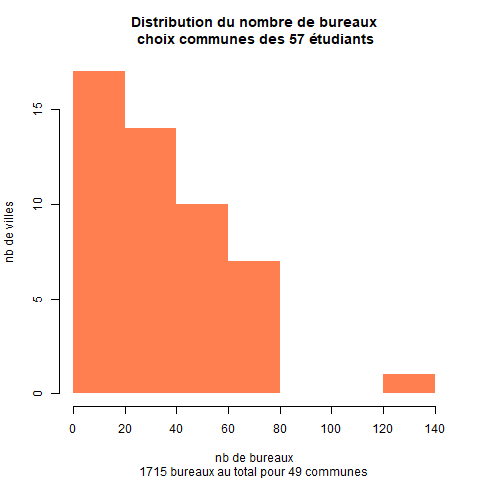

```{r setup, include=FALSE}
knitr::opts_chunk$set(eval  = TRUE)
knitr::opts_chunk$set(echo  = TRUE)
knitr::opts_chunk$set(warning  = FALSE)
``` 

Bases conceptuelles, données

# Chemin et librairies


```{r}
cheminGROS <-  paste0(Sys.getenv("USERPROFILE"), "/Downloads/")
```


# Les étudiants

*"L4GEOMAT - TD - Bases conceptuelles de la géomatique"*

```{r}
vendredi <- read.csv("data/baseGeomatique.csv", fileEncoding = "UTF-8")
vendredi <- vendredi [vendredi$prénom!="",]
tabVendredi <- table(vendredi$appétence.pour.la.géomatique..1...passionnément..4...pas.du.tout.)
barplot(tabVendredi, main = length(vendredi$prénom))
```


# Présence et rendu des devoirs : chiffres clés

### Effectif et cours

```{r, eval=TRUE}
effectif <- read.csv("data/effectif2025.csv")
nom <- paste0(effectif$niveau, "_", effectif$groupe) 
effectif <- as.matrix(effectif [, c(3:8)])
# Graphique
png("img/presence.png", width = 800, height = 800, res = 100)
p <- barplot(effectif, beside = T, main = "Nombre d'étudiants par groupe et par cours", xlab = "groupe", ylab = "nb", col = terrain.colors(4) , legend.text = nom, border = NA)
dev.off()
```


### Les rendus d'exercices


```{r}
rendu <- c(56,59, 56, 45,58,49)
titre <- c("distribution", "univarié", "contingence", "khi2", "regression", "1er script")
par(mar = c(8,6,6,6))
p <- barplot(rendu, names = titre, cex.names = 0.8, las = 2, main = "rendu devoirs (effectif 75 étudiants environ)", border = NA)
text(p, y = rendu - 1, labels = rendu )
```


#### Les notes des exercices


- Le critère externe : des points faciles ?

le nom du fichier
le temps du rendu (avant la limite)

- Distribution des totaux

```{r, eval=T}
res <- read.csv("data/exo.csv",  na.strings = '-', fileEncoding = "UTF-8")
names(res)
res <- res [, c(2:5,1,6)]
# recodage : si note 2, alors note1 = 0 si NA
res$X1_Univarié.1 [is.na(res$X1_Univarié.1 )& !is.na(res$X2_Univarié.2)] <- 0
res$X1_Univarié.1 [ is.na(res$X2_Univarié.2)] <- NA
# graphique
par(mfrow= c(2,3))
for (i in (1:length(res))){
  p <-barplot(table(res[,i]), main = names(res)[i])
}
```


## Notes finales


```{r, eval=FALSE}
note <- read.csv("data/noteFinales.csv", fileEncoding = "UTF-8", na.strings = c("EN ATTENTE", "NA","-"), dec = ",")
summary(note)
png("img/noteFin.png")
hist(note$NOTE.FINALE, main = "Etalement note finale - 64 obs", freq = T, border = NA)
abline(v = mean(note$NOTE.FINALE, na.rm = T),  col = "red")
abline(v = median(note$NOTE.FINALE, na.rm=T), col = "blue")
dev.off()
```


# Donnée utilisées en cours

## Distributions des bureaux

```{r}
# dénombrement
(tab <- sort(table (bvSel$insee)))
nb <- length(names(tab))
png("img/distributionBureauGeomatique.png")
hist(tab, main = paste0("Distribution du nombre de bureaux\n choix communes des ", length(vendredi$prenom)," étudiants"),
     sub = paste0(length(bvSel$insee), " bureaux au total pour ",nb," communes"),
     col = "coral", border = NA,
     xlab = "nb de bureaux",
     ylab = "nb de villes")
dev.off()
```



