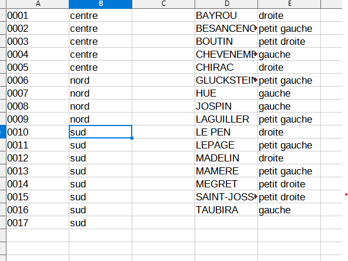
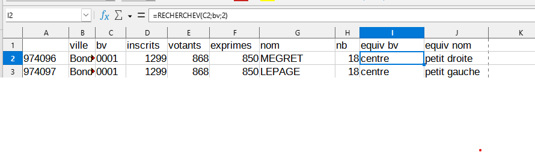
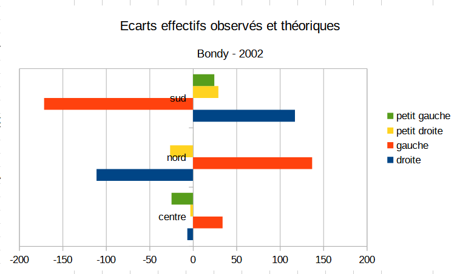

```{r setup, include=FALSE}
knitr::opts_chunk$set(eval  = TRUE)
knitr::opts_chunk$set(echo  = TRUE)
knitr::opts_chunk$set(warning  = FALSE)
``` 


# Intitulé et déroulé du cours

*"L5GEABIM Analyses bivariées et multivariées"*

```{r}
data <- read.csv("data/presentation.csv", encoding = "UTF-8", header = F)
knitr::kable(data, col.names = c("groupe", "heures", "enseignant") )
```


```{r}
data <- read.csv("data/deroule2023.csv", encoding = "UTF-8")
knitr::kable(data)
```


# La donnée

## Où les trouver ?

Au départ les données sur les élections disponibles

https://www.data.gouv.fr/fr/pages/donnees-des-elections/

intérêt de la maille du bureau de vote

Chercher *REU* au niveau de la zone de recherche de data.gouv, quelles perspectives pour les chercheurs ?


## Préparer les données

On utilise pour le cours le fichier par bureau de vote des présidentielles 2022

Cet exercice permet d'utiliser dans le tableur :

- l'ouverture d'un fichier txt pour le transformer en csv
- la suppression de colonne
- les 3 raccourcis clavier : CTRL + * , CTRL + C, CTRL + V
- Touche de sélection et de déplacement
- tri
- filtre

L'objectif est que chaque étudiant choisisse une ville (avec au moins 5 bureaux
de vote)

Pour 2022, on rajoute les étiquettes des colonnes manquantes

```{r, eval = FALSE}
# 2022
data2022 <- read.csv("data/gros/resultats-par-niveau-burvot-t1-france-entiere.csv", fileEncoding = "UTF-8", header = T)
bondy2022 <- data2022 [ data2022$Libellé.de.la.commune == "Bondy",]
str(bondy2022)
write.csv(bondy2022, "data/bondy2022.csv", fileEncoding = "UTF-8")
# 2002
data2002 <- read.csv2("data/gros/PR02_BVot_T1T2.csv", fileEncoding= "Latin1",header=F,skip=18)
str(data2002)
data2002 <- data2002 [, c(4,5,6:8,10,13)]
var <- c("ville","bv"	,"inscrits"	,"votants",	"exprimes",	"nom",	"nb")
names(data2002) <- var
str(data2002)
bondy2002 <- data2002 [ data2002$ville == "Bondy",]
write.csv(bondy2002, "data/bondy2002.csv", fileEncoding = "UTF-8")
```


## Les données des étudiants

Chaque étudiant a choisi une ville pour ses données.

```{r, eval=FALSE}
ville <- read.csv("data/cours2.csv", colClasses = "character")
ville <- ville [,3]
villeModif <- read.csv("data/cours3.csv", colClasses = "character")
ville <- c(ville, villeModif [,4])
# 68 villes différentes
ville <- unique(na.omit(ville))
# recodage pour le zéro
nb <- nchar(ville)
df <- data.frame(cbind(ville, nb))
df$ville [df$nb == 4 ]<- paste0("0", df$ville [df$nb == 4 ] )
df$nb <- nchar(df$ville)
table(df$nb)
df <- df [!(df$nb != 5),]
# liste des villes utilisées = 65
library(sf)
library(mapsf)
fr <- st_read("data/gros/COMMUNE_CARTO.shp")
names(df)
names(fr)
joint <- merge(fr, df, by.x = "INSEE_COM", by.y= "ville")
# pb sur 4 code insee
cp <- setdiff(df$ville, joint$INSEE_COM)
# TODO retrouver les code insee
# jointure ville code insee pour les résultats
data2022 <- read.csv("data/gros/resultats-par-niveau-burvot-t1-france-entiere.csv", fileEncoding = "UTF-8", header = T, colClasses = "character")
names(data2022)
str(data2022$Code.de.la.commune)
# transformation en données texte
data2022$INSEE_COM <-paste0(data2022$Code.du.département,data2022$Code.de.la.commune)
# 2e jointure
joint2 <- merge(joint, data2022, by = "INSEE_COM", )
# pourquoi 267 ?
length(unique(joint2$INSEE_COM))
# encore 3 en moins...
fond <- st_read("data/gros/DEPARTEMENT.shp")
png("img/communes.png")
mf_init(joint)
mf_map(fond, add = T, col = "antiquewhite1", border = "wheat")
mf_map(joint, col = "red", border = NA,add = T)
mf_layout("Communes choisies par les étudiants", credits = "IGN")
dev.off()
```


Des choix sur toute l'étendue du territoire de la métropole


Enregistrement des fichiers

```{r, eval=FALSE}
names(joint2)
st_write(joint2 [, c(1,8,19:118)], "data/geo.gpkg", "data2022", delete_layer = T)
write.csv(joint2 [, c(1,8, 18:117), drop = T], "data/data2022.csv", fileEncoding = "UTF-8")
```


Bureaux de vote pour chacune des communes, données texte

```{r}
data <- read.csv("data/data2022.csv", fileEncoding = "UTF-8") 
cog <- unique(data [,c("INSEE_COM","Libellé.de.la.commune")])
# 61 communes
```


## Recodage des variables


### Créer des tables de référence




### Formule rechercheV




### Résultat sur les écarts à la moyenne 2002





# Présentation rapide (vous êtes nombreux !)

## Qui sont les étudiants ?

- 74 étudiants sur 3 cours

Les questions posées sont sur le passé / présent / futur des étudiants, leur appétence en stats et 
le nombre d'années depuis le dernier apprentissage.


```{r}
etudiant <-  read.csv("data/cours1.csv", fileEncoding = "UTF-8")
names(etudiant)
names(etudiant)[8:9] <- c("appétence", "nb d'années")
png("img/quisontils.png")
par(mar = c(2,16,2,4))
par(mfrow = c(3,2))
for (i in 5:9){
  par(mar = c(2,16,2,4))
  barplot(sort(table(etudiant [,i])), border = NA,
          horiz = T, las = 2, cex.names = 0.8, 
          main = names (etudiant) [i])
}
dev.off()
```


## Présence et rendu des devoirs : chiffres clés

### Effectif et cours

```{r, eval=FALSE}
fic <- list.files("data/", pattern = "^cours")
fic
# on recherche le fichier le plus haut
nb <- max(as.integer(substring(fic, 6,7)))
tmp <- NULL
tab <- NULL
i <-  1
for (i in 1:nb) {
  print(i)
  nomFic <- paste0("data/cours", i, ".csv")
  data <- read.csv(nomFic, fileEncoding = "UTF-8")
  data <- data [data [,2] == "oui",]
  tmp <- table(data$groupe)
  tab <- rbind(tab , tmp)
}
tab
row.names(tab) <- paste0("cours ",seq(1,nb, by = 1))
paste0("cours ",seq(1,nb, by = 1))
knitr::kable(tab)
```

Graphique

```{r, eval=FALSE}
barplot(tab, beside = T, main = "nombre d'étudiants par groupe et par cours", xlab = "groupe", ylab = "nb", col = terrain.colors(nb) 
        , border = NA, legend =  F)
```


### Les rendus d'exercices


```{r}
rendu <- c(56,59, 56, 45,58,49)
titre <- c("distribution", "univarié", "contingence", "khi2", "regression", "1er script")
par(mar = c(8,6,6,6))
p <- barplot(rendu, names = titre, cex.names = 0.8, las = 2, main = "rendu devoirs (effectif 75 étudiants environ)", border = NA)
text(p, y = rendu - 1, labels = rendu )
```


#### Les notes des exercices


- Le critère externe : des points faciles ?

le nom du fichier
le temps du rendu (avant la limite)

- Distribution des totaux

```{r, eval=T}
res <- read.csv("data/exo.csv",  na.strings = '-', fileEncoding = "UTF-8")
names(res)
# recodage : si note 2, alors note1 = 0 si NA
res$dénombrement [is.na(res$dénombrement )& !is.na(res$indicateurs)] <- 0
res$dénombrement [ is.na(res$indicateurs)] <- NA
# graphique
par(mfrow= c(2,2))
for (i in (1:length(res))){
  p <-barplot(table(res[,i]), main = names(res)[i])
}
```


## Notes finales


```{r, eval=FALSE}
note <- read.csv("data/noteFin.csv", fileEncoding = "UTF-8", na.strings = "en attente", dec = ",")
summary(note$note.sur.20)
hist(note$note.sur.20, main = "Etalement note finale - 95 obs", freq = T, border = NA)
resSansZero <- note [note$note.sur.20  !=0,]
abline(v = mean(note$note.sur.20, na.rm = T),  col = "red")
 mean(note$note.sur.20)
hist(resSansZero$note.sur.20, main = "Etalement note finale - 73 obs", freq = T, border = NA)
abline(v = mean(resSansZero$note.sur.20, na.rm = T),  col = "red", lty = 2)
```


# Ressources autre que la bibliographie officielle

2 cours universitaires disponibles sur internet

- http://www.ipt.univ-paris8.fr/vgodard/enseigne/statisti/framstat.htm
- http://grasland.script.univ-paris-diderot.fr/STAT98/STAT98.htm

Pour R, la base de tout est 

R et espace (https://archives.framabook.org/r-et-espace/index.html)

