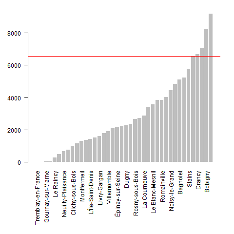

```{r setup, include=FALSE}
knitr::opts_chunk$set(eval  = TRUE)
``` 


# Intitulé du cours

*"L5GEABIM Analyses bivariées et multivariées"*

```{r}
data <- read.csv("data/presentation.csv", encoding = "UTF-8", header = F)
knitr::kable(data, col.names = c("groupe", "heures", "enseignant") )
```


# Déroulé

Il va être modifié en fonction de

- votre vitesse - s'il faut prendre plus de temps sur les basiques
- mon enseignement - trois fois le même cours

A chaque cours un exercice à faire pour le prochain cours, quelque soit l'avancement du cours.
Utiliser les ressources internet, poser des questions,...


13 cours en tout. 
2 cours d'intro rappels stats
7 sur la stat bi-variée
3 sur la multivariée
1 cours pour un devoir sur table au mi-semestre

# Evaluation

- 1 devoir maison à rendre vers la fin du semestre
- 1 devoir sur table à la mi-semestre

... et c'est tout ! (pas de partiel)

Au départ on utilise Libre Office (plutôt que Microsoft) puis R

Question : quelle utilisation de R ? des cours cette année ?

```{r}
data <- read.csv("data/deroule.csv", encoding = "UTF-8")
knitr::kable(data)
```


# Présentation rapide (vous êtes nombreux !)


## Premier cours

passé / présent / futur
appétence pour les stats
fichier framapad, https://lite.framacalc.org/9pse-coursstatsorbonne2022-9we9

74 étudiants sur 3 cours

Attention, 4 doublons de prénoms (Ambre, Camille, Marie et Sarah), j'ai rajouté l'initiale
du nom de famille.

```{r}
etudiant <-  read.csv("data/etudiant.csv", fileEncoding = "UTF-8")
tab <- table (etudiant$prénom)
names(tab)[tab >1]
write.csv(etudiant [, c("prénom", "groupe.TD")], "cours1.csv", fileEncoding = "UTF-8")
par(mar = c(2,16,2,4))
par(mfrow = c(3,2))
for (i in 3:7){
  par(mar = c(2,16,2,4))
  barplot(sort(table(etudiant [,i])), border = NA,
          horiz = T, las = 2, cex.names = 0.8, 
          main = names (etudiant) [i])
}
```


## Présence et rendu des devoirs : chiffres clés

### Effectif et cours

```{r, echo = FALSE}
tab <- table(etudiant$groupe.TD)
tab 
```


```{r,  echo = FALSE}
i <- 2
for (i in 2:3) {
  nomFic <- paste0("data/cours", i, ".csv")
  data <- read.csv(nomFic, fileEncoding = "UTF-8")
  data <- data [data [,3] == "oui",]
  tmp <- table(data$groupe.TD)
  tab <- rbind(tab , tmp)
  }
row.names(tab) <- c("cours1", "cours2", "cours3")
knitr::kable(tab)
barplot(tab, beside = T, main = "nombre d'étudiants par groupe et par cours", xlab = "groupe", ylab = "nb", col = terrain.colors(3) 
        , border = NA)
```


Désormais le framapad sert à l'émargement
https://lite.framacalc.org/9pse-coursstatsorbonne2022-9we9


### Les rendus de devoir

```{r}
rendu <- c(47,36)
titre <- c("devoir1 (distribution)", "devoir2 (univarié)")
barplot(rendu, names = titre)
```


# La donnée du cours

## La source
https://www.data.gouv.fr/fr/datasets/repertoire-des-logements-locatifs-des-bailleurs-sociaux/

### 2021

Prendre le .zip de 2021, petit test d'ouverture sous moodle (Introduction/bases informatiques)

```{r, eval=FALSE}
data <- read.csv("data/rpls2021_geolocalise_OD_REG11_DEP93.csv", sep =";")
# distribution par commune
tab <- table(data$LIBCOM)
png("img/rpls93.png")
par(mar = c(10,4,2,2))
barplot(sort(tab), las = 2, border = NA, cex.names = 0.7)
abline(tab [ names(tab) == "Bondy"],0, col ="red")
dev.off()
write.csv(sort(tab), "data/dpt93RPLSCommune.csv")
# filtre sur Bondy
filtre <- data [data$LIBCOM == "Bondy",]
write.csv(filtre, "data/rplsBondy.csv")
```




C'est normalement ce fichier de données que nous allons utiliser pour le cours.

## 2019

Il y a un problème sur la donnée, prendre plutôt le millésime 2019


# Pratique

Lorsque l'exercice le requiert, le fichier est à rendre avec son *prénom* (toujours le même svp) sous moodle.


# Ressources autre que la bibliographie officielle

2 cours universitaires disponibles sur internet

- http://www.ipt.univ-paris8.fr/vgodard/enseigne/statisti/framstat.htm
- http://grasland.script.univ-paris-diderot.fr/STAT98/STAT98.htm

# Le devoir maison

Il s'agit de prendre minimum 4 variables socio économiques à partir de l'outil insee
statistiques locales et de faire dessus une analyse factorielle et une classification
en affinant au fur et à mesure (exclusion des valeurs particulières ou choix d'échantillons).
Le devoir maison est à rendre sous forme de script R commenté (avec des #) avec le fichier de 
données en .csv

dates :

- soumission du sujet : 22/11 et 29/11, chaque étudiant doit proposer ses variables

- travail sur le devoir en classe

- rendu du devoir par les étudiants

- le devoir sera rendu sur la dernière séance

