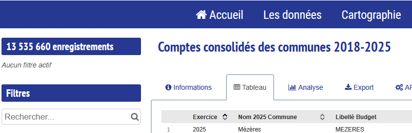
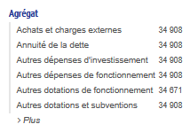
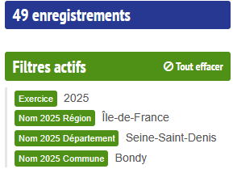
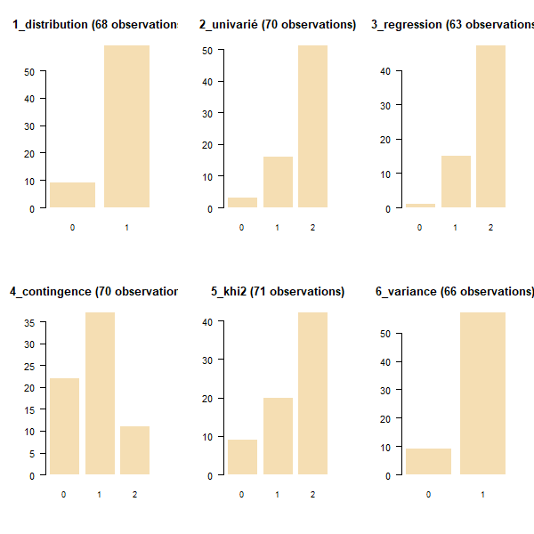
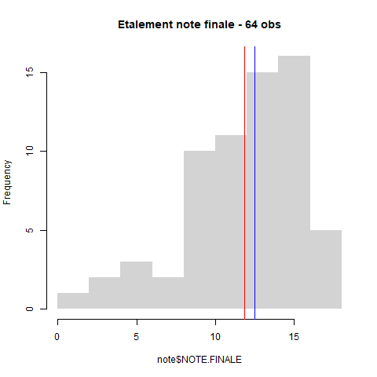

```{r setup, include=FALSE}
knitr::opts_chunk$set(eval  = TRUE)
knitr::opts_chunk$set(echo  = TRUE)
knitr::opts_chunk$set(warning  = FALSE)
``` 


# Intitulé et déroulé du cours


*"L5GEABIM Analyses bivariées et multivariées"*


```{r, eval=TRUE}
data <- read.csv("data/deroule2026.csv", encoding = "UTF-8")
knitr::kable(data)
```


Comptes des villes et élections municipales : quels sont les liens ?


# La donnée


## Où la trouver ?


Data.gouv, portail externe voire portail cartographique

### Data.gouv

définir avec wikipedia, que retenir par rapport à l'IA ?

apprendre à chercher :

- les élections (que préciser ?)

- les finances des communes (mot clé *compte des communes*)


### Le portail externe

Trouver la source originale pour les comptes des communes et apprendre à utiliser cet
outil plutôt que le fichier de data.gouv

car : 23 millions d'observations au total, un fichier de 6 G°de données


### Portail cartographique

Utiliser l'[outil](https://data.ofgl.fr/pages/cartographie/) proposé par l'OFGL

Quel est l'apport de la cartographie ?


## Extraire la donnée à partir du portail externe

Explication des différents filtres


#### Choix de base : compte consolidé et année


- compte consolidé




- pour le premier cours, ne pas faire de choix d'agrégat



savoir distinguer investissement et fonctionnement

dans quelle catégorie classer les frais de personnel ?

#### Un choix géographique différent par étudiant


```{r}
lieu <- read.csv("data/etudiant.csv")
lieu <- unique(lieu$code.insee.commune.choisie)
lieu <- lieu [!is.na(lieu)]
library(sf)
communes <- st_read("data/gros/communes-1000m.geojson")
communes <- communes [st_is_valid(communes),]

region <- aggregate(communes [,c("region")], by = list(communes$region), length)

data <- communes [communes$code %in% lieu,]
table(data$departement, data$region)
library(mapsf)
hist(region$region)
met <- region [region$region > 900,]
mf_map(met, col = "wheat", border = NA)
mf_map(data, col= "red", add = T, border = NA)
mf_layout("Choix des communes sur la métropole par les étudiants", "data.gouv et sources internes\nNovembre 2025")
```

Deux étudiants ont fait un choix hors métropole


```{r}
horsMet <- data [data$departement %in% c(971,972),]
mf_init(st_buffer(horsMet,20000))
mf_map(region, col = "wheat", border = NA, add = T)
mf_map(data, col= "red", add = T, border = NA)
mf_layout("Choix des communes hors métropole par 2 étudiants", "data.gouv et sources internes\nNovembre 2025")
```


Enregistrement de la donnée

```{r}
st_write(data, "data/data.gpkg", "data", append = F)
data <- st_drop_geometry(data)
write.csv(data, "data/communeEtudiant.csv", row.names = F)
```


#### Choix pour le cours


Le cours sera basé sur la commune de Bondy et le département du 93 (1967 enregistrements
pour tous les agrégats)




A noter, sélectionner la région permet de choisir plus facilement le département 93

```{r}
data <- read.csv2("data/agregatEnsemble.csv", dec=".")
names(data)
head(data)
str(data)
# combien d'enregistrement par ville ?
table(data$Code.Insee.2025.Commune)
# filtre sur l'agrégat et le montant par hbt)
head(data [ , c(21,28)])
# sauvegarde de la donnée
write.csv(data [,c(21,28)], "data/agregat.csv", fileEncoding = "UTF-8")
# Les agrégats ont-ils tous la même importance ?
hist(data$Montant.en...par.habitant)
```


# Présentation rapide (vous êtes nombreux !)

## Qui sont les étudiants ?

- 84 étudiants inscrits sur 3 cours (70 présents environ)

Les questions posées sont sur le passé / présent / futur des étudiants, leur appétence en stats

```{r}
etudiant <-  read.csv("data/TD3_stats_2025.csv", fileEncoding = "UTF-8")
etudiant2 <- read.csv("data/tdLundi.csv", fileEncoding = "UTF-8")
names(etudiant)
names(etudiant2)
names(etudiant2)[1] <- 'prenom'
names(etudiant2)[4] <- 'appetence'
etudiant2 <- etudiant2 [, names(etudiant)]
etudiant <- rbind(etudiant, etudiant2)
etudiant <- etudiant [!is.na(etudiant$prenom),]
table(etudiant$groupe, useNA = "always")
write.csv(etudiant, "data/etudiant.csv", fileEncoding = "UTF-8")
```


```{r}
etudiant <- read.csv("data/etudiantModifie.csv", fileEncoding = "UTF-8")
png("img/quisontils.png", width = 10000, height = 10000, res=1000)
#par(mar = c(2,16,2,4))
par(mfrow = c(2,2))
for (i in c(3,4,6,7)){
  (mar = c(2,30,2,4))
  barplot(table(etudiant [,i]), border = NA,
          horiz = T, las = 2, cex.names = 0.8, 
          main = names (etudiant) [i])
}
dev.off()
```


## Présence et rendu des devoirs : chiffres clés

### Effectif et cours

```{r}
presence <- read.csv("data/presence.csv")
knitr::kable(presence)
presence$numCours <-as.numeric(substring(presence$Cours,2,3))
par(mfrow = c(3,1))
barplot(presence$TD1~presence$numCours, col="chartreuse", beside = T, main = "Evolution de la présence groupe 1", xlab = "cours", ylab = "nb" 
        , border = NA, legend =  F)
barplot(presence$TD2~presence$numCours, col = "cyan", beside = T, main = "Evolution de la présence groupe 2", xlab = "cours", ylab = "nb" 
        , border = NA, legend =  F)
barplot(presence$TD3~presence$numCours, col="darkorange",beside = T, main = "Evolution de la présence groupe 3", xlab = "cours", ylab = "nb" 
        , border = NA, legend =  F)
```


### Les rendus d'exercices

Attention, les exercices sont à rendre 2 jours avant le cours (temps de la correction), 

- gr 3 : mercredi 20 h

- gr 1 et 2 : vendredi 20 h

Aucun retard toléré

```{r}
data <- read.csv("data/notesDM1_7.csv", na.strings = "-", fileEncoding = "UTF-8")
data <- data [, c(7:12)]
names(data)
data <- data [, c(5,1,4,2,3,6)]
titre <- c("1_distribution", "2_univarié", "3_regression", "4_contingence", "5_khi2", "6_variance")

png("img/rendu.png", width = 600, height = 600, res = 100)
par( mfrow = c(2,3))
tot <- length(data)
i <-1
for (i in c(1:tot)){
  tmp <- table(data [,i])
  barplot(tmp,  cex.names = 0.8, las = 1, 
          main = paste0(titre [i], " (", sum(tmp), " observations)"), border = NA, col = "wheat")
  }

dev.off()
```



- Le critère externe : des points faciles ?

le nom du fichier

le temps du rendu (avant la limite)

- Augmentation des erreurs avec l'exercice 4

Attention à la consigne !


## Notes finales


```{r, eval=FALSE}
note <- read.csv("data/noteFinales.csv", fileEncoding = "UTF-8", na.strings = c("EN ATTENTE", "NA","-"), dec = ",")
summary(note)
png("img/noteFin.png")
hist(note$NOTE.FINALE, main = "Etalement note finale - 64 obs", freq = T, border = NA)
abline(v = mean(note$NOTE.FINALE, na.rm = T),  col = "red")
abline(v = median(note$NOTE.FINALE, na.rm=T), col = "blue")
dev.off()
```



# Ressources autre que la bibliographie officielle


Pour R, la base de tout est 

R et espace (https://archives.framabook.org/r-et-espace/index.html)


