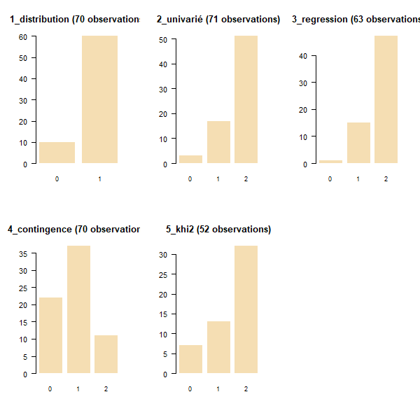

```{r setup, include=FALSE}
knitr::opts_chunk$set(eval  = FALSE)
knitr::opts_chunk$set(echo  = TRUE)
knitr::opts_chunk$set(warning  = FALSE)
``` 


# Intitulé et déroulé du cours


*"L5GEABIM Analyses bivariées et multivariées"*


```{r, eval=TRUE}
data <- read.csv("data/deroule2025.csv", encoding = "UTF-8")
knitr::kable(data)
```


# La donnée

## Où les trouver ?

Au départ les données sur les finances des communes

https://www.data.gouv.fr/datasets/comptes-des-communes-2017-2024/


## Préparer les données

23 millions d'observations au total, un fichier de 6 G°de données


voir la [source originale]( https://data.ofgl.fr/explore/dataset/ofgl-base-communes/table/?disjunctive.nomen&disjunctive.agregat&disjunctive.tranche_revenu_imposable_par_habitant&disjunctive.tranche_population&disjunctive.epci_name&disjunctive.reg_name&disjunctive.dep_name&disjunctive.com_name&sort=exer)


Portail données

https://data.ofgl.fr/explore/dataset/

Comptes consolidées, sur le département choisi


```{r, eval = FALSE}
data <- read.csv2("data/ofgl-base-communes-consolidee.csv")
names(data)
head(data)
# combien d'enregistrement par ville et par exercice ?
table(data$Code.Insee.2024.Commune, data$Exercice)
# filtre sur l'année
data <- data [ data$Exercice == 2024,]
# sauvegarde de la donnée
write.csv(data [,c(16,20,21,28)], "data/data93_2024.csv", fileEncoding = "UTF-8")

table(data$Agrégat)
```

Portail cartographie

Il est plus facile d'utiliser l'[outil](https://data.ofgl.fr/pages/cartographie/) proposé par l'Observatoire des finances et de la gestion publique locale.


# Présentation rapide (vous êtes nombreux !)

## Qui sont les étudiants ?

- 84 étudiants inscrits sur 3 cours (70 présents environ)

Les questions posées sont sur le passé / présent / futur des étudiants, leur appétence en stats

```{r}
etudiant <-  read.csv("data/TD3_stats_2025.csv", fileEncoding = "UTF-8")
etudiant2 <- read.csv("data/tdLundi.csv", fileEncoding = "UTF-8")
names(etudiant)
names(etudiant2)
names(etudiant2)[1] <- 'prenom'
names(etudiant2)[4] <- 'appetence'
etudiant2 <- etudiant2 [, names(etudiant)]
etudiant <- rbind(etudiant, etudiant2)
etudiant <- etudiant [!is.na(etudiant$prenom),]
table(etudiant$groupe, useNA = "always")
write.csv(etudiant, "data/etudiant.csv", fileEncoding = "UTF-8")
```


```{r}
etudiant <- read.csv("data/etudiantModifie.csv", fileEncoding = "UTF-8")
png("img/quisontils.png", width = 10000, height = 10000, res=1000)
#par(mar = c(2,16,2,4))
par(mfrow = c(2,2))
for (i in c(3,4,6,7)){
  (mar = c(2,30,2,4))
  barplot(table(etudiant [,i]), border = NA,
          horiz = T, las = 2, cex.names = 0.8, 
          main = names (etudiant) [i])
}
dev.off()
```


## Présence et rendu des devoirs : chiffres clés

### Effectif et cours

```{r, eval=FALSE}
presence <- read.csv("data/presence.csv")
knitr::kable(presence)
par(mfrow = c(3,1))
barplot(presence$TD1~presence$Cours, beside = T, main = "Evolution de la présence groupe 1", xlab = "cours", ylab = "nb" 
        , border = NA, legend =  F)
barplot(presence$TD2~presence$Cours, beside = T, main = "Evolution de la présence groupe 2", xlab = "cours", ylab = "nb" 
        , border = NA, legend =  F)
barplot(presence$TD3~presence$Cours, beside = T, main = "Evolution de la présence groupe 3", xlab = "cours", ylab = "nb" 
        , border = NA, legend =  F)
```


### Les rendus d'exercices


```{r}
renduTD1 <- c(24,NA,NA,NA,NA,NA)
renduTD2 <- c(28, NA,NA,NA,NA,NA)
renduTD3 <- c(28, NA,NA,NA,NA,NA)
titre <- c("distribution", "univarié", "contingence", "khi2", "regression", "1er script")
png("img/rendu.png", width = 500, height = 1000, res = 100)
par(mar = c(8,6,6,6), mfrow = c(3,1))
barplot(renduTD1, names = titre, cex.names = 0.8, las = 2, main = "rendu devoirs Gr 1 (effectif 30 étudiants)", border = NA)
text(p, y = renduTD1 - 1, labels = renduTD1 )
barplot(renduTD2, names = titre, cex.names = 0.8, las = 2, main = "rendu devoirs Gr 2 (effectif 36 étudiants)", border = NA)
text(p, y = renduTD2 - 1, labels = renduTD2 )
barplot(renduTD3, names = titre, cex.names = 0.8, las = 2, main = "rendu devoirs Gr 1 (effectif 20 étudiants)", border = NA)
text(p, y = renduTD3 - 1, labels = renduTD3 )
dev.off()
```



#### Les notes des exercices


- Le critère externe : des points faciles ?

le nom du fichier
le temps du rendu (avant la limite)

- Distribution des totaux

```{r, eval=T}
res <- read.csv("data/exo.csv",  na.strings = '-', fileEncoding = "UTF-8")
names(res)
res <- res [, c(2:5,1,6)]
# recodage : si note 2, alors note1 = 0 si NA
res$X1_Univarié.1 [is.na(res$X1_Univarié.1 )& !is.na(res$X2_Univarié.2)] <- 0
res$X1_Univarié.1 [ is.na(res$X2_Univarié.2)] <- NA
# graphique
par(mfrow= c(2,3))
for (i in (1:length(res))){
  p <-barplot(table(res[,i]), main = names(res)[i])
}
```


## Notes finales


```{r, eval=FALSE}
note <- read.csv("data/noteFinales.csv", fileEncoding = "UTF-8", na.strings = c("EN ATTENTE", "NA","-"), dec = ",")
summary(note)
png("img/noteFin.png")
hist(note$NOTE.FINALE, main = "Etalement note finale - 64 obs", freq = T, border = NA)
abline(v = mean(note$NOTE.FINALE, na.rm = T),  col = "red")
abline(v = median(note$NOTE.FINALE, na.rm=T), col = "blue")
dev.off()
```


# Ressources autre que la bibliographie officielle

2 cours universitaires disponibles sur internet

- http://www.ipt.univ-paris8.fr/vgodard/enseigne/statisti/framstat.htm
- http://grasland.script.univ-paris-diderot.fr/STAT98/STAT98.htm

Pour R, la base de tout est 

R et espace (https://archives.framabook.org/r-et-espace/index.html)


