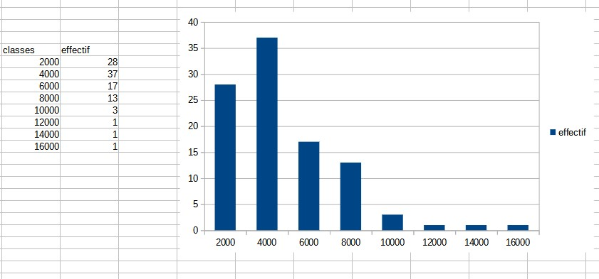
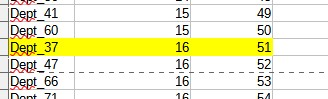

```{r setup, include=FALSE}
knitr::opts_chunk$set(echo = TRUE)
```

# Termes

## Trouver des termes pour les objets en statistiques :
exemple : 
- variable, 
- observation,
- valeur

A vous !

On retiendra pour le moment uniquement les termes : individu / population / variable et modalité

## distinguer tableau complet, tig, tableau condensé

Individu -> Modalité
Modalité -> Individus

# L'essentiel : la forme d'une distribution

## Abscisses et ordonnées


## Tiges et feuilles

discrétisation la plus rudimentaire

https://fr.khanacademy.org/math/be-4eme-secondaire2/x213a6fc6f6c9e122:statistiques-1/x213a6fc6f6c9e122:graphiques-statistiques/a/stem-and-leaf-plots-review


## Et sous un tableur

### La source
https://www.insee.fr/fr/statistiques/4487988

```{r}
data <- read.csv("data/2021-09-17_deces_quotidiens_departement_csv.csv", sep =";")
length(data$Zone)
```


### Préparation de l'exercice

#### Pour obtenir un TIG avec une seule variable, quelle variable choisir et pour quels individus ?

Réponse : 
Pour un jour donné, on prend les départements (pas la France), et une colonne de total 
pour les décès.

```{r}
head(data)
choix <- data [data$Date_evenement == '01-janv.'&data$Zone != 'France', c('Zone', 'Total_deces_2020')]
write.csv(choix, "data/choix.csv")
knitr::kable(head(choix))
```
Cet exercice permet d'utiliser dans le tableur :

- la suppression de colonne
- l'autofiltre pour sélectionner les données
- les 3 raccourcis clavier : CTRL + * , CTRL + C, CTRL + V


#### Tableau de fréquences sous Libre Office : savoirs faire

* Touche de sélection et de déplacement
* tri
* utilisation de la barre d'adresse
* formule frequence, formule matricielle (CTRL + MAJ + ENTREE)


### Quel commentaire ?

- étendue
- forme de la distribution

#### Proposer une première représentation graphique

```{r}
hist(choix$Total_deces_2020, main = "Total décès 2020", xlab = "classes", ylab = "effectif")
```

résultat avec un tableur


A explorer 

graphique en barres, lignes (lissage)

Observer la disposition des bornes : elles sont utilisées comme des étiquettes et non pas comme une série de valeur.

# Pour raffiner : les indicateurs

Nous avons déjà vu l'amplitude à travers minimum et maximum. Il y en a d'autres.
Ils servent à résumer la série statistique


## Calcul :  valeurs centrales et dispersion

### Valeurs centrales

Il s'agit de caractériser une distribution par son centre.

#### Moyenne et médiane

##### Calcul

Le calcul de la moyenne est connu. Celui de la médiane beaucoup moins.



###### Sur le tableau complet

Créer une colonne rang. Et relever le rang médian

###### Sur le tableau condensé

- Calcul des fréquences cumulées, 

- puis des fréquences relative (fréquence cumulée / fréquence totale)

- Repérer le rang 50 % en faisant jouer les bornes

#### savoir faire tableur

- valeur fixe et relative (utilisation du $ et F4)

- au niveau graphique, rajout d'un axe par le menu insertion après double clic sur 
le graphique (onglet positionnement, menu déroulant valeur)


##### Que retenir ?

Expliquer ces phrases issues du Chadule

- La médiane est dans une distribution la valeur la plus *proche* de toutes les autres

Il s'agit d'une propriété mathématique de la médiane. 

- les valeurs extrêmes *décentrent* la moyenne


#### La valeur modale

La valeur la plus fréquente. 

Quelle utilité dans notre série ?

Aucune, car il y a beaucoup de chiffres différents, la classe modale serait plutôt intéressante à mentionner si on avait une typologie agricole, par exemple.

### Dispersion : Ecart-type et variance

La distribution est-elle hétérogène ?

2 définitions : 

- écart moyen des valeurs à leur moyenne arithmétique

- moyenne du carré des écarts


Toujours sans passer par les formules, mais avec un tableau *pas à pas*, créer les indicateurs.

liste des colonnes :

- écart à la moyenne

- carré des écarts


- et à part sur une seule case : moyenne du carré des écarts (variance), l'écart type
est la racine carrée.

### Ecart interquartile

Passer par le tableau des fréquences cumulées

## Appliquer : apréhender quelques indicateurs 

Faire un commentaire sur ce qu'indiquent les indicateurs par rapport à votre série.
Consigner ce commentaire dans l'évaluation finale.

Bonus

Les étudiants ont choisi différentes dates.Les décès sont cumulés. La forme des distributions est-elle différente selon les dates ?

```{r}
data <- read.csv2("data/2021-09-17_deces_quotidiens_departement_csv.csv", fileEncoding = "UTF-8")

```


