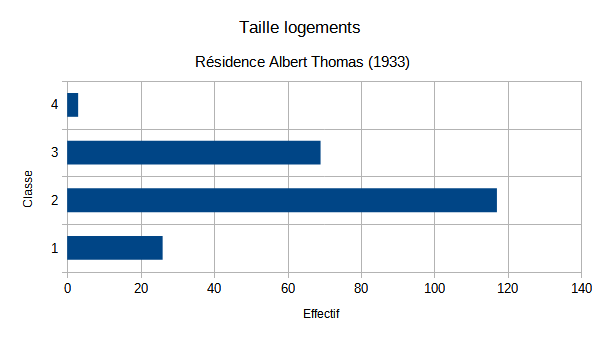
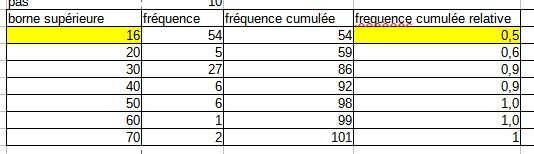

```{r setup, include=FALSE}
knitr::opts_chunk$set(echo = TRUE)
```


Télécharger et ouvrir le fichier de données du cours.

# Termes

## Trouver des termes pour les objets en statistiques :
exemple : 
- variable, 
- observation,
- valeur

A vous !

On retiendra pour le moment uniquement les termes : individu / population / variable et modalité

## distinguer tableau complet, tig, tableau condensé

Individu -> Modalité
Modalité -> Individus

# L'essentiel : la forme d'une distribution

## Abscisses et ordonnées


## Tiges et feuilles

discrétisation la plus rudimentaire

https://fr.khanacademy.org/math/be-4eme-secondaire2/x213a6fc6f6c9e122:statistiques-1/x213a6fc6f6c9e122:graphiques-statistiques/a/stem-and-leaf-plots-review


## Et sous un tableur

#### Resultat attendu



A déposer sur le moodle avec son prénom.png


### Préparation de l'exercice

#### Pour obtenir un TIG avec une seule variable, quelle variable choisir et pour quels individus ?

Dans l'exemple proposé, on choisit pour le nom d'une résidence, la colonne de la dénomination de l'appartement et le nombre de pièces.

```{r, echo=FALSE}
data <- read.csv("data/rplsBondy.csv", fileEncoding = "UTF-8")
head(data)
choix <- data [data$COMPLGEO == 'RESIDENCE ALBERT THOMAS', c("NUMAPPT","NBPIECE")]
write.csv(choix, "data/choix.csv")
knitr::kable(head(choix))
```

Cet exercice permet d'utiliser dans le tableur :

- la suppression de colonne
- l'autofiltre pour sélectionner les données
- les 3 raccourcis clavier : CTRL + * , CTRL + C, CTRL + V


#### Tableau de fréquences sous Libre Office : savoirs faire

* Touche de sélection et de déplacement
* tri
* utilisation de la barre d'adresse
* utilisation des noms pour la formule
* formule frequence, formule matricielle (CTRL + MAJ + ENTREE)
* sélection pour exporter comme image


formules du tableau


### Quel commentaire ?

- étendue
- forme de la distribution

#### Proposer une première représentation graphique

```{r, echo=FALSE}
choix <- read.csv("data/choix.csv", fileEncoding = "UTF-8")
hist(choix$NBPIECE, breaks = c(0,1,2,3,4),
     main = "Dénombrement nombre de pièces résidence Albert Thomas", xlab = "classes", ylab = "effectif")

```


A explorer 

graphique en barres, lignes (lissage)

Observer la disposition des bornes : elles sont utilisées comme des étiquettes et non pas comme une série de valeurs.

# Pour raffiner : les indicateurs

Nous avons déjà vu l'amplitude à travers minimum et maximum. Il y en a d'autres.
Ils servent à résumer la série statistique


## Calcul :  valeurs centrales et dispersion

### Valeurs centrales

Il s'agit de caractériser une distribution par son centre.

#### Moyenne et médiane

##### Calcul

Le calcul de la moyenne est connu. Celui de la médiane beaucoup moins.


###### Sur le tableau complet

Créer une colonne rang. Et relever le rang médian


###### Sur le tableau condensé

- Calcul des fréquences cumulées, 

- puis des fréquences relative (fréquence cumulée / fréquence totale)

- Repérer le rang 50 % en faisant jouer les bornes




#### savoir faire tableur

- valeur fixe et relative (utilisation du $ et F4)

- au niveau graphique, rajout d'un axe par le menu insertion après double clic sur 
le graphique (onglet positionnement, menu déroulant valeur)


##### Que retenir ?

Expliquer ces phrases issues du Chadule

- La médiane est dans une distribution la valeur la plus *proche* de toutes les autres

Il s'agit d'une propriété mathématique de la médiane. 

- les valeurs extrêmes *décentrent* la moyenne


#### La valeur modale

La valeur la plus fréquente. 

Quelle utilité dans notre série ?

Aucune, car il y a beaucoup de chiffres différents, la classe modale serait plutôt intéressante à mentionner si on avait une typologie agricole, par exemple.

### Dispersion : Ecart-type et variance

La distribution est-elle hétérogène ?

2 définitions : 

- écart moyen des valeurs à leur moyenne arithmétique

- moyenne du carré des écarts


Toujours sans passer par les formules, mais avec un tableau *pas à pas*, créer les indicateurs.

liste des colonnes :

- écart à la moyenne

- carré des écarts


- et à part sur une seule case : moyenne du carré des écarts (variance), l'écart type
est la racine carrée.

### Ecart interquartile

Passer par le tableau des fréquences cumulées, prendre les valeurs 25 % et 75 %.

## Appliquer : apréhender quelques indicateurs 

Faire un commentaire sur ce qu'indiquent les indicateurs par rapport à votre série.
Consigner ce commentaire dans l'évaluation finale.

### Corrections quelques remarques

L'objectif de l'exercice était d'obtenir un commentaire clair avec quelques repères
statistiques.

- inutile de mettre toutes les décimales de vos indicateurs ! cela ne sert à rien.

- exemple d'un commentaire clair :

*Il y a peu de départements recensant un grand nombre de décès puisque la médiane
est assez faible, la moitié des départements compte plus de 750 décès. La
moyenne est influencée par les départements comptant beaucoup de décès, c'est pourquoi elle est supérieure à la médiane : de rares départements connaissent un très grand
nombre de morts*

- attention à l'erreur :

*Le nombre de décès est élevé dans les plus gros départements*

Ce n'est pas faux mais ce n'est pas ce qui est demandé. 

- faux :

*mediane < moyenne ainsi il y a plus de jours avec de petits nombres de décès que 
de jours avec des nombres importants. Il y a une distribution dysimétrique.*

Il ne s'agit pas de jour mais de nombre de décès et de nombre de départements.

- trop technique :

*La série est assez dissymétrique, la distribution est assez proche de la valeur de
la médiane, tandis que la moyenne n'est pas pertinent en raison de ses valeurs fortes*


### Bonus

Les étudiants ont choisi différentes dates.Les décès sont cumulés. La forme des distributions est-elle différente selon les dates ?

```{r, eval=FALSE}
data <- read.csv("data/2021-09-17_deces_quotidiens_departement_csv.csv",  sep = ";", fileEncoding = "latin3")
# on ne prend que les premiers du mois
data <-  data [substring(data$Date_evenement,0,2) == "01",]
data$Date_evenement <- as.Date(data$Date_evenement, format = "%d-%b")
# pb NA
table(data$Date_evenement, useNA = "always")
# le mois d'avril n'est pas repris. 
data$Date_evenement [is.na(data$Date_evenement)] <- ("2021-04-01")
# on retire France
data <- data [data$Zone != "France",]
data$mois <- format(data$Date_evenement, format = "%m")
data$mois <- as.integer(data$mois)
i <- 1
par(mfrow = c(2,3))
for (i in 1:12) 
{
  choix <- data [data$mois == i,]
  hist(choix$Total_deces_2020, main = i, xlab = "classes", ylab = "effectif")
}

```


