```{r setup, include=FALSE}
knitr::opts_chunk$set(echo = TRUE)
```


Télécharger et ouvrir le fichier de données du cours.


```{r}
data <- read.csv2("data/potentiel-fiscal-resultat-gc.csv")
maData <- data [data$Département == '93',]
```


# Termes

## Trouver des termes pour les objets en statistiques

exemples

- variable, 

- observation,

- valeur

A vous !

On retiendra pour le moment uniquement les termes : individu / population / variable et modalité

## distinguer tableau complet, tig, tableau condensé

Individu -> Modalité

Modalité -> Individus

# L'essentiel : la forme d'une distribution

## Abscisses et ordonnées

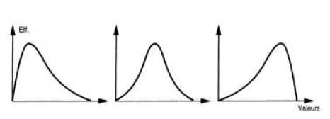


## Tiges et feuilles

discrétisation la plus rudimentaire

https://fr.khanacademy.org/math/be-4eme-secondaire2/x213a6fc6f6c9e122:statistiques-1/x213a6fc6f6c9e122:graphiques-statistiques/a/stem-and-leaf-plots-review


## Et sous un tableur

#### Resultat attendu

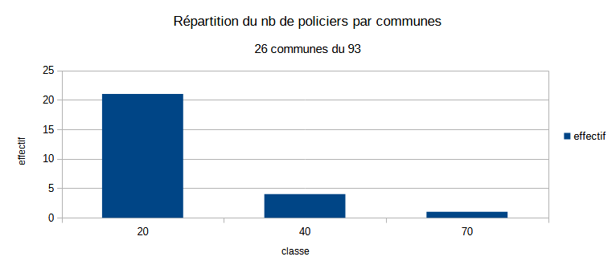


Et non pas :

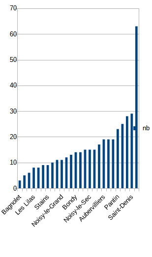


### Préparation de l'exercice

#### Filtres colonne pour TIG


Pour obtenir un TIG avec une seule variable, quelle variable choisir et pour quels individus ?

Dans l'exemple proposé du cours (*Potentiel fiscal et police municipale*), on choisit la colonne de la dénomination des communes (26 communes sur le 93) et le nombre d'agents

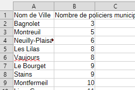


#### Savoir faire tableur

Cet exercice permet d'utiliser dans le tableur :

* raccourcis claviers de déplacement (CTRL et flèches) et de sélection (CTRL et flèches + MAJ)

* utilisation de la barre de formule

* formule simple : minimum et maximum

* formule frequence, formule matricielle (CTRL + MAJ + ENTREE)

* le graphique en barre et la personnalisation (transformation données étiquettes)


Pour mémoire, formules du tableau

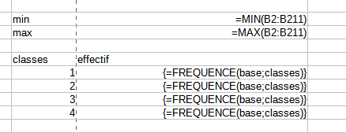


Voir également cette [vidéo](https://www.youtube.com/watch?v=xW27DzWoYI4) sur internet


### Quel commentaire ?

- étendue 

```{r}
summary(maData$Nombre.de.policiers.et.de.gardes.champêtres)
```


Concernant notre exemple, il y a une grande disparité entre les communes, certaines
ont 3 agents, d'autres 63.

- forme de la distribution

L'énorme majorité des communes ont moins de 20 agents. Une seule commune possède plus
de 60 agents, il s'agit d'Aulnay sous Bois. Son maire étant un ancien lieutenant de la 
police nationale.


## A explorer 

Autres graphiques : graphique en barres, lignes (lissage)

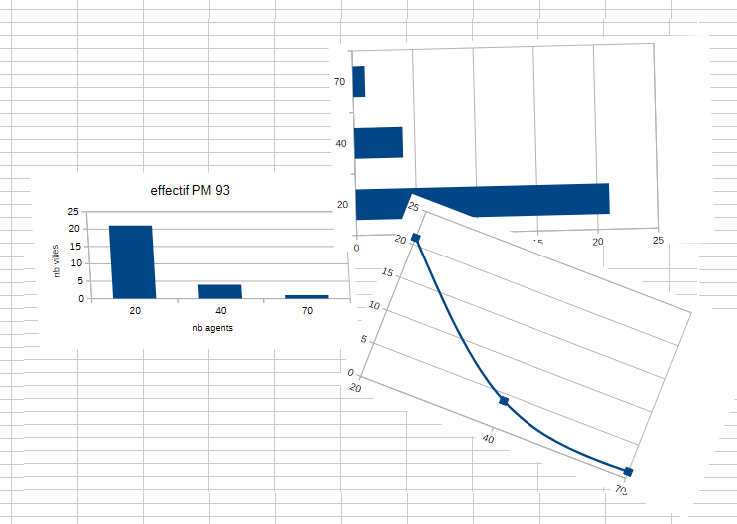


Observer la disposition des bornes : elles sont utilisées comme des étiquettes et non pas comme une série de valeurs.

Sous R, l'histogramme est un des graphiques le plus simple à obtenir.

```{r}
hist(maData$Nombre.de.policiers.et.de.gardes.champêtres, xlab = "Effectif PM", ylab = "Nb de communes",
     main = "Répartition des effectifs de PM par commune")
```

L'histogramme souligne l'originalité d'Aulnay sous bois par rapport autres communes.

## Correction exercice dénombrement des agrégats financiers (MAISON 1)


Remise 55 sur 74 inscrits.

### Le séparateur décimal (, ou . ?)

Sous Calc, l'astuce consiste à modifier les paramètres linguistiques.

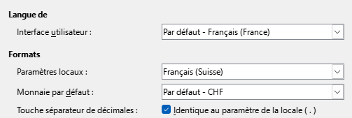

Pour un tableur, le chiffre se positionne à droite de la cellule, le texte à gauche.


### Commentaires généraux qui valent pour tous les exercices et surtout le DST


#### De quoi on parle ?

Attention à toujours définir sa donnée dés le départ y compris sa source.

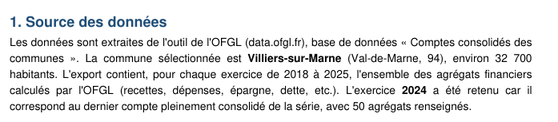


Dans le cadre de l'exercice, c'est la commune et ses agrégats financiers :

- comptes consolidés (tous les budgets de la commune)

- agrégats liés au budget (dépenses - recettes à l'équilibre), mais également solde, bilans...


#### Pour la forme 

J'ai sanctionné les copies illisibles.

A retenir :

- Ne jamais mettre un tableau de données dans sa copie !

- Ne jamais prendre en photo son écran !

- Eviter absolument une copie d'écran de l'ensemble de son écran.

Le mieux *traitement de texte* dans lequel on insère un 
graphique image (copie d'écran CTRL + MAJ + S puis CTRL + V pour coller), puis
enregistrement en .pdf au final.

Attention aux nombreuses pages inutiles si on passe directement du tableur
au traitement de texte (la palme revient à un étudiant qui m'a envoyé 63 pages)

Attention également, enregistrement en .pdf de sa copie (éviter le .pdf.pdf)

Ne pas oublier de soigner ses titres.


#### Concision du commentaire

Ne jamais oublier que l'exercice ne vaut que 1 ou 2 points et que je les corrige rapidement.

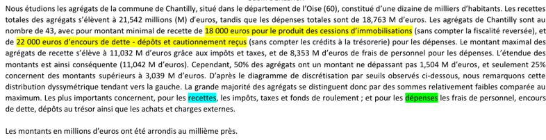


Prochain exercice, commentaire plus court. 2 phrases maximum, 1 page au total, aller à l'essentiel.

*Il y plus de gros agrégats que de petits* (ou l'inverse)

Et préciser quel agrégat est remarquable et pourquoi ?


#### Vocabulaire

Revenir sur le terme : formule *fréquence et son graphique*

Diagramme de fréquence, histogramme...

Le mieux : *Discrétisation des agrégats financiers en fonction de leur montant (euros / hbt)*


### Plus précisemment


#### Résultat faux

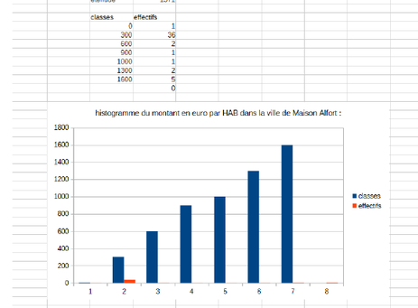


####  Problème sur les classes dans le graphique 

Il faut afficher les bornes.
  
  
  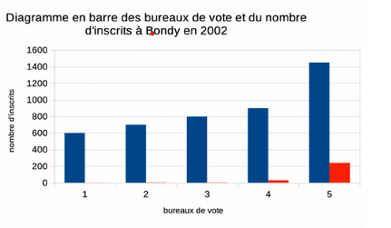

*Bug* repéré sous Libre Office

Une solution, afficher les étiquettes sur les barres


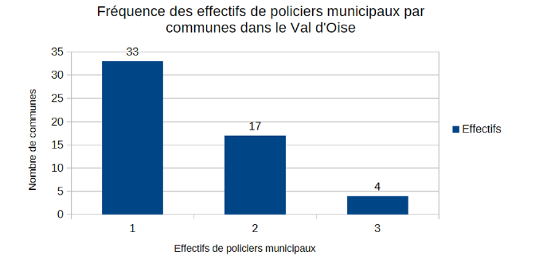


#### Autres méthodes

Une méthode différente est valide également (le tableau croisé dynamique dit pilote dans libre office)

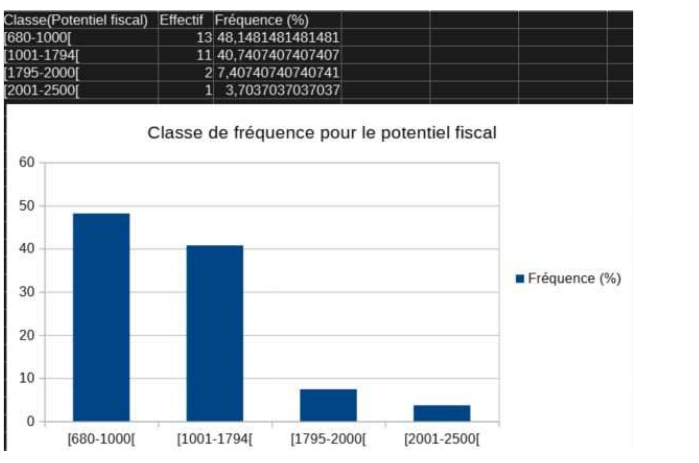


### Les agrégats à supprimer

La bonne réponse était les totaux, j'ai accepté les réponses autour des valeurs aberrantes.

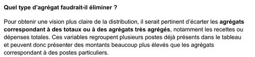


# Pour raffiner : les indicateurs

Nous avons déjà vu l'amplitude à travers minimum et maximum. Il y a d'autres indicateurs.
Ils servent à résumer la série statistique

Nous allons montrer comment calculer médiane, moyenne et écart type dans le tableur. 

Pour l'exemple, on prend un agrégat budgétaire connu : celui des frais du personnel.

Afin de pouvoir comparer les communes de taille différente, on utilise les montants par habitant.


```{r}
data <- read.csv2("data/fraisPersonnel.csv", dec= ".", fileEncoding = "UTF-8")
str(data)
hist(data$montant.par.hbt, freq = FALSE, main = "Dpt 93 - répartition des dépenses du personnel par commune", xlab = "euros par habitant")
lines(density(data$montant.par.hbt), col="red", lwd = 2)
```

La majorité des communes ont des dépenses moyennes (1000) par habitant.

Cas extrêmes : Le Raincy (peu), Tremblay (beaucoup)


## Valeurs centrales : moyenne et médiane

Il s'agit de caractériser une distribution par son centre.

### Calcul

Le calcul de la moyenne est connu. Celui de la médiane beaucoup moins.

Sur le tableau complet, créer une colonne rang. Et relever le rang médian

savoir-faire tableur : recopie incrémentée

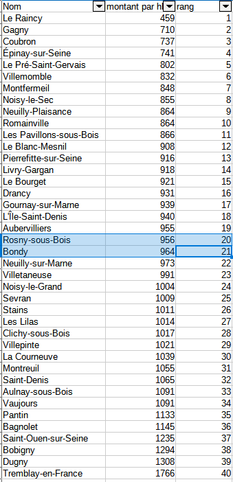


### Représentation graphique

Elle consiste à tracer moyenne et médiane sur le graphique, elle n'est pas possible
sous le tableur.


```{r}
moy <- mean(data$montant.par.hbt)
med <- median(data$montant.par.hbt)
hist(data$montant.par.hbt, main = "Distribution des dépenses de personnel par hbt")
abline(v = moy, col = 'blue')
abline(v = med, col = 'red')
```

Pour la variable *dépense de personnel*, quelle est l'indicateur le plus utile ?

### Que retenir ?

##### Expliquer ces phrases issues du Chadule

- La médiane est dans une distribution la valeur la plus *proche* de toutes les autres

Il s'agit d'une propriété mathématique de la médiane. Si la distribution est disymétrique, cette valeur est le vrai centre de la distribution.

- les valeurs extrêmes *décentrent* la moyenne

##### Rapport entre médiane et moyenne

Que peut-on dire de la forme de la distribution 

- si la moyenne est égale à la médiane ?

- si moyenne > médiane

-  si médiane > moyenne

Démonstration avec les agrégats du 93


```{r}
data <- read.csv("data/data93.csv")
# liste des agrégats
names(data)
# simplification des noms des colonnes
names(data) <- c("ville", "agregat","montant")
agregat <- names(table(data$agregat))
```


Affichage de tous les agrégats

```{r}
png("img/medmoy.png", width = 1200, height = 1200, res=90)
par(mfrow=c(7,8))
i <- 1
for (i in 1:length(agregat)){
  tmp <- data [data$agregat == agregat [i],]
  moy <- mean(tmp$montant)
  med <- median(tmp$montant)
  sigma <- sd(tmp$montant)
  mar = c(2,2,2,2)
  titre <- paste0(substring(agregat [i], 1, 15),"\n",round(sigma,0))
  hist(tmp$montant, main = titre, font.main=1,  xlab = "")
  abline(v = moy, col = 'blue')
  abline(v = med, col = 'red')
}
dev.off()
```

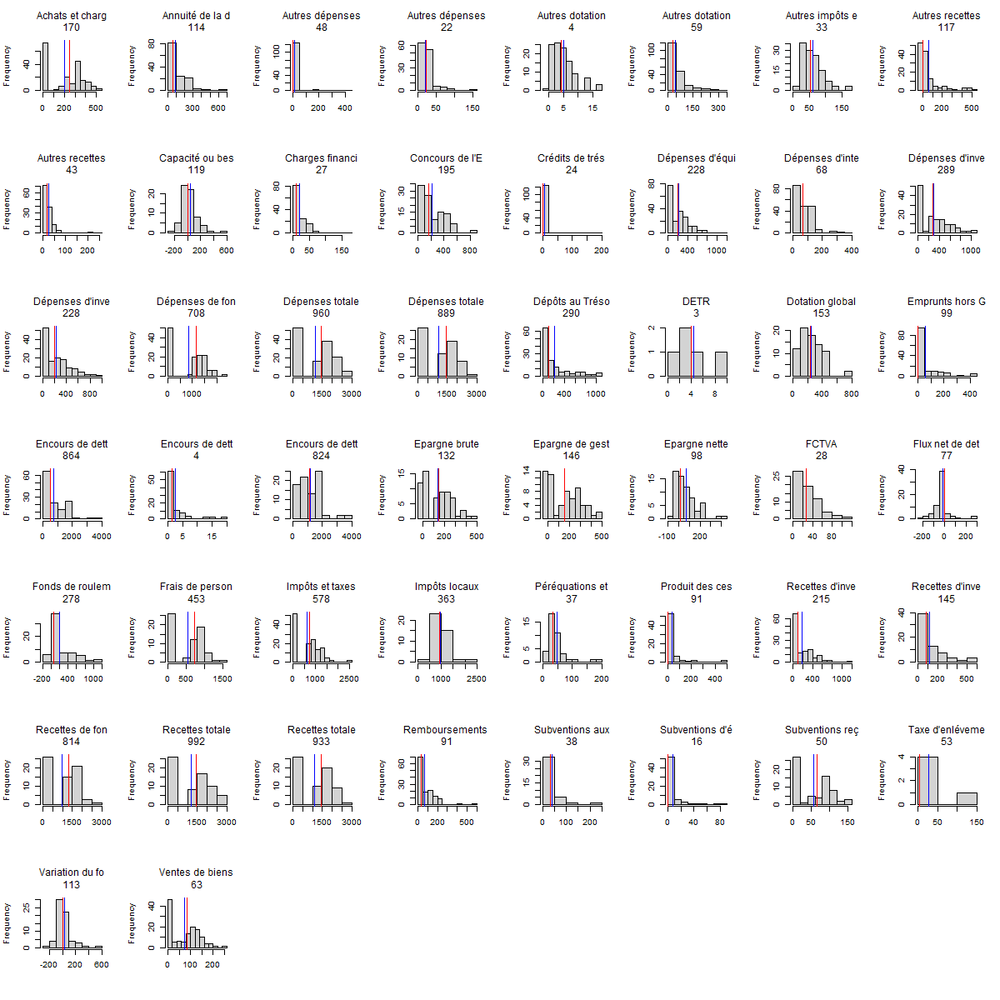

moyenne en bleue, médiane en rouge

Chercher un ou deux agrégats pour lequel médiane et moyenne sont différentes.


```{r}
liste <- split(data$montant, data$agregat)
moyenne <- sapply(liste, mean)
mediane <- sapply(liste, median)
maxi <- which((moyenne-mediane)==max(moyenne-mediane))
mini <- which((moyenne-mediane)==min(moyenne-mediane))
nulle <- which(round(moyenne-mediane,0)==0)
```


```{r}
par(mfrow=c(1,3))
# moyenne > médiane
agregat [maxi]
tmp <- data [data$agregat == agregat [maxi],]
hist(tmp$montant, main = agregat [maxi])
moy <- mean(tmp$montant)
med <- median(tmp$montant)
abline(v = moy, col = 'blue')
abline(v = med, col = 'red')
# médiane > moyenne
agregat [mini]
tmp <- data [data$agregat == agregat [mini],]
hist(tmp$montant, main = agregat [mini])
moy <- mean(tmp$montant)
med <- median(tmp$montant)
abline(v = moy, col = 'blue')
abline(v = med, col = 'red')
# Moyenne = médiane
agregat [nulle]
tmp <- data [data$agregat == agregat [nulle],]
hist(tmp$montant, main = agregat [nulle])
moy <- mean(tmp$montant)
med <- median(tmp$montant)
abline(v = moy, col = 'blue')
abline(v = med, col = 'red')
```


## Dispersion : Ecart-type et variance

La distribution des écarts-type est-elle hétérogène ?

```{r}
agg <- aggregate(data$montant, by = list(data$agregat), sd)
names(agg) <- c("agregat", "sigma")
hist(agg$sigma)

moy <- mean(agg$sigma)
med <- median(agg$sigma)
abline(v = moy, col = 'blue')
abline(v = med, col = 'red')
```

Commenter l'écart type le plus élevé

```{r}
maxiSigma <- agg$agregat [agg$sigma == max(agg$sigma)]
tmp <- data [data$agregat == maxiSigma,]
hist(tmp$montant, 
     main = paste0
      (maxiSigma,"\n",
        round(sd(tmp$montant),0)))
moy <- mean(tmp$montant)
med <- median(tmp$montant)
abline(v = moy, col = 'blue')
abline(v = med, col = 'red')
knitr::kable(head(tmp [order(tmp$montant), c(1,3)]))
knitr::kable(tail(tmp [order(tmp$montant), c(1,3)]))
```


#### 2 définitions : 

- écart moyen des valeurs à leur moyenne arithmétique

- moyenne du carré des écarts


#### Une question fondamentale : pourquoi utiliser les carrés ?

https://qastack.fr/stats/118/why-square-the-difference-instead-of-taking-the-absolute-value-in-standard-devia

et notamment, pour l'oeil du géographe :


*Une façon de penser à cela est que l’écart-type est similaire à une "distance par rapport à la moyenne".*

*Comparez cela à des distances dans un espace euclidien - ceci vous donne la vraie distance, où ce que vous avez suggéré (qui, en fait, est la déviation absolue ) ressemble plus à un calcul de distance manhattan .*


### Utilisation du tableur

Toujours sans passer par les formules, mais avec un tableau *pas à pas*, créer les indicateurs.

liste des colonnes :

- écart à la moyenne

- carré des écarts


- et à part sur une seule case : moyenne du carré des écarts (variance), l'écart type est la racine carrée.


- nommer *maMoy* la cellule contenant la moyenne

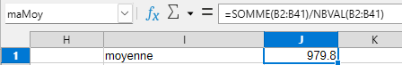


Pour mémoire, les formules :


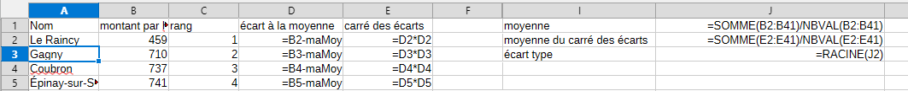


### Corrections MAISON 2 quelques remarques (attention exercice 2025)


L'objectif de l'exercice était d'obtenir un commentaire clair avec quelques repères statistiques.

#### Forme

A ne pas séparer du fond bien sûr ! 


##### Le graphique

Il ne fallait pas tracer la médiane et la moyenne sur le tableur. Certains l'ont fait mais sous Excel voire autre ?

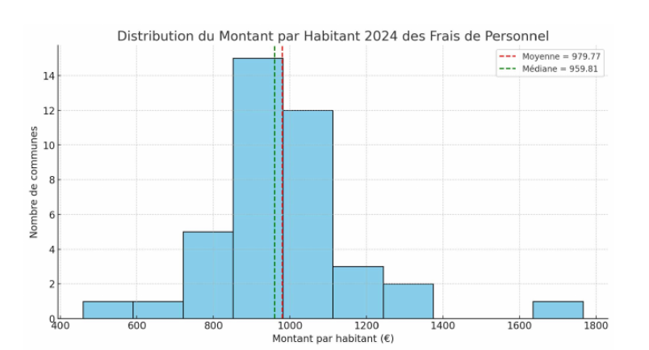
##### Aspect général


Un simple titre au graphique peut suffire


de type : chiffres / description / analyse

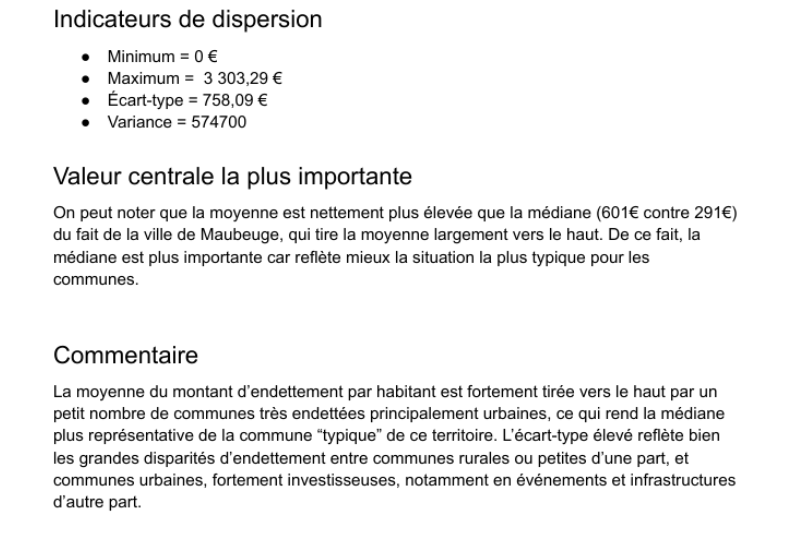

#### Problèmes de français (perles)


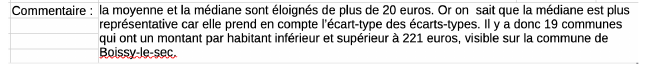

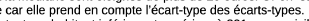


#### Fond : Quelles erreurs  ?


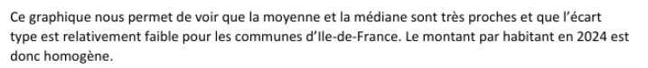


#### Fond : remarques intéressantes


##### Décentrer la moyenne de...


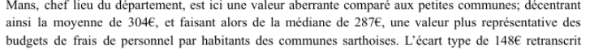

##### Analyse trop courte

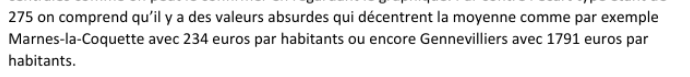

... Un peu mieux, mais Marnes-la-Coquette sous-analysé.

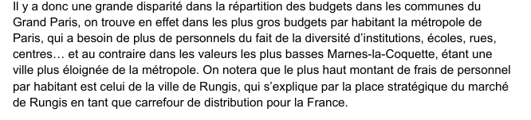

##### Trop court


##### Impeccable

Autrement dit l'analyse, ce n'est pas que des chiffres !


Bien définir son agrégat peut suffire

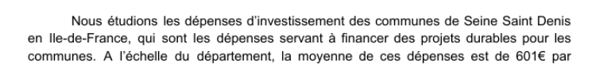


