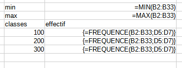
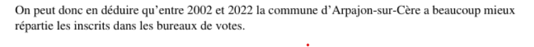

```{r setup, include=FALSE}
knitr::opts_chunk$set(echo = TRUE)
```


Télécharger et ouvrir le fichier de données du cours.

# Termes

## Trouver des termes pour les objets en statistiques

exemples

- variable, 

- observation,

- valeur

A vous !

On retiendra pour le moment uniquement les termes : individu / population / variable et modalité

## distinguer tableau complet, tig, tableau condensé

Individu -> Modalité

Modalité -> Individus

# L'essentiel : la forme d'une distribution

## Abscisses et ordonnées


## Tiges et feuilles

discrétisation la plus rudimentaire

https://fr.khanacademy.org/math/be-4eme-secondaire2/x213a6fc6f6c9e122:statistiques-1/x213a6fc6f6c9e122:graphiques-statistiques/a/stem-and-leaf-plots-review


## Et sous un tableur

#### Resultat attendu


Et non pas :


### Préparation de l'exercice

#### Pour obtenir un TIG avec une seule variable, quelle variable choisir et pour quels individus ?

Dans l'exemple proposé du cous, on choisit la colonne de la dénomination des bureaux (1 à 32) et les
abstentions à Bondy


Cet exercice permet d'utiliser dans le tableur :

* utilisation de la barre d'adresse

* formule frequence, formule matricielle (CTRL + MAJ + ENTREE)


formules du tableau




### Quel commentaire ?

- étendue
- forme de la distribution


## A explorer 

graphique en barres, lignes (lissage)

Observer la disposition des bornes : elles sont utilisées comme des étiquettes et non pas comme une série de valeurs.

## Correction exercice dénombrement des inscrits


Des retours très nombreux.

```{r}
communes <- c("Annemasse", "Tasson la demi lune", "Clamart", "Epinay-sur-Seine",
              "Santes", "Thionville", "Vitry-Sur-Seine", "Massy", "Montpon-Ménestérol", "Choisy-le-Roi", "Malakoff", "Caluire-et-Cuire", "Dieppe",
              "Levallois-Perret", "Achères", "Neuily-Sur-Seine", "Nice", "Rueil-Malmaison", "Romainville", "Lagnieu", "Sannois", "Arpajon-sur-Cère",
              "Limeil-Brévannes", "Saint-Maur", "Miribel", "Caen", "Ivry-sur-Seine", "Noirmoutier en l'île", "Orsay", "Amiens", "Troyes", "Meung-sur-Loire", "Guipavas", "Auxerre", "Issy-les-Moulineaux", "Saint-Ouen")

```

36 communes pour 55 étudiants. 

### Commentaires généraux qui valent pour tous les exercices et surtout le DST


#### Pour la forme 

Le mieux traitement de texte dans lequel on insère un 
graphique image.

Attention aux nombreuses pages inutiles si on passe directement du tableur
au traitement de texte.


#### Concision du commentaire


même si, un strict respect de la consigne donnait :


Prochain exercice, commentaire plus court. 2 phrases maximum, aller à l'essentiel.

*Il y a plus de petits bureaux de vote que de gros* (ou l'inverse)

Ou plus osé :

*La ville ne maîtrise pas le nombre d'électeurs par bureaux de vote*

Ou plus profond, répondre à la question : quelle est la répartition idéale pour les bureaux de vote ? Est-ce que mon exemple le respecte ?




#### Vocabulaire

Revenir sur le terme : formule *fréquence et son graphique*

Diagramme de fréquence, histogramme...

Le mieux : *Discrétisation des bureaux de vote en fonction des inscrits*
(cf le manuel Béguin Pumain)


### Plus précisemment

####  Problème sur les classes dans le graphique 

Il faut afficher les bornes.
  
  
  ![]](img/faux)


Affichage de l'histogramme dans R

```{r}
data <- read.csv("data/bondy2022.csv")
hist(data$V8)
```


#### Quelle opération fallait-il faire sur le fichier 2002 ?


# Pour raffiner : les indicateurs

Nous avons déjà vu l'amplitude à travers minimum et maximum. Il y en a d'autres.
Ils servent à résumer la série statistique

Nous allons montrer comment calculer médiane, moyenne et écart type dans le tableur. 

Pour l'exemple, on prend la commune choisie l'abstention (votants / inscrits) puis tous les résultats des candidats dans
chaque bureau de vote.


```{r}
bondy2002 <- read.csv("data/bondy2002.csv", fileEncoding = "UTF-8")
str(bondy2002)
table(bondy2002$bv)
# extraction abstention
data <- bondy2002 [bondy2002$nom == "MEGRET",]
png("img/inscrits2002.png")
inscrits <- data$inscrits
hist(inscrits)
dev.off()
abs <- round( (data$votants / data$inscrits) *100, 0)
write.csv(abs,"data/abstention2002.csv", 
          fileEncoding = "UTF-8")
```

Le tableau de 2002 se présente différemment de celui de 2022.

## Calcul :  valeurs centrales et dispersion

### Valeurs centrales : moyenne et médiane

Il s'agit de caractériser une distribution par son centre.

#### Calcul

Le calcul de la moyenne est connu. Celui de la médiane beaucoup moins.

Sur le tableau complet, créer une colonne rang. Et relever le rang médian


#### Savoir faire tableur

- valeur fixe et relative (utilisation du $ et F4)

- au niveau graphique, rajout d'un axe par le menu insertion après double clic sur 
le graphique (onglet positionnement, menu déroulant valeur)

```{r}
moy <- mean(abs)
med <- median(abs)
hist(abs, main = "Distribution des abstentions")
abline(v = moy, col = 'blue')
abline(v = med, col = 'red')
```

Pour la variable abstention, quelle est l'indicateur le plus utile ?

#### Que retenir ?

##### Expliquer ces phrases issues du Chadule

- La médiane est dans une distribution la valeur la plus *proche* de toutes les autres

Il s'agit d'une propriété mathématique de la médiane. 

- les valeurs extrêmes *décentrent* la moyenne

##### Rapport entre médiane et moyenne

Que peut-on dire de la forme de la distribution 

- si la moyenne est égale à la médiane ?

- si moyenne > médiane

-  si médiane > moyenne


```{r}
candidat <- unique(bondy2002$nom)
png("img/medmoy.png")
par(mfrow=c(4,4))
for (i in 1:length(candidat)){
  tmp <- bondy2002 [bondy2002$nom == candidat [i],]
  moy <- mean(tmp$nb)
  med <- median(tmp$nb)
  hist(tmp$nb, main = candidat  [i])
  abline(v = moy, col = 'blue')
  abline(v = med, col = 'red')
}
dev.off()
```


Chercher à caractériser les voix pour les différents candidats en fonction de la médiane / moyenne

### Dispersion : Ecart-type et variance

La distribution est-elle hétérogène ?

```{r}
png("img/ecartType.png")
par(mfrow=c(4,4))
for (i in 1:length(candidat)){
  tmp <- bondy2002 [bondy2002$nom == candidat [i],]
  sigma <- sd(tmp$nb)
  med <- median(tmp$nb)
  hist(tmp$nb, main = paste0(candidat  [i], " ", round(sigma,0)))
}
dev.off()
```


Commenter l'écart type le plus élevé

#### 2 définitions : 

- écart moyen des valeurs à leur moyenne arithmétique

- moyenne du carré des écarts


#### Une question fondamentale : pourquoi utiliser les carrés ?

https://qastack.fr/stats/118/why-square-the-difference-instead-of-taking-the-absolute-value-in-standard-devia

et notamment, pour l'oeil du géographe :


*Une façon de penser à cela est que l’écart-type est similaire à une "distance par rapport à la moyenne".*

*Comparez cela à des distances dans un espace euclidien - ceci vous donne la vraie distance, où ce que vous avez suggéré (qui, en fait, est la déviation absolue ) ressemble plus à un calcul de distance manhattan .*


### Utilisation du tableur

Toujours sans passer par les formules, mais avec un tableau *pas à pas*, créer les indicateurs.

liste des colonnes :

- écart à la moyenne

- carré des écarts


- et à part sur une seule case : moyenne du carré des écarts (variance), l'écart type est la racine carrée.


### Corrections quelques remarques (2022)

L'objectif de l'exercice était d'obtenir un commentaire clair avec quelques repères statistiques.


#### Les bons graphiques


##### Un graphique du TIG


##### Une diagramme de répartition


, ##### Quelles erreurs dans les graphiques suivants ?


### Les commentaires

Beaucoup d'étudiants ne voient pas la nécessité d'un commentaire...

#### Commentaire clair

*La moyenne et la médiane sont très proches. En effet, en moyenne, les logements de la résidence possèdent 3 pièces et 50 % des logements possèdent moins de 3 pièces. On peut en déduire que la série est assez homogène.De plus, l'écart type est faible, ce qui signifie que les valeurs sont peu dispersées autour de la moyenne et donc il vient confirmer que la série est homogène.*


#### trop technique 


#### Des commentaires intéressants


##### Un peu confus.


##### Une réflexion sur le terme *hétérogène*


