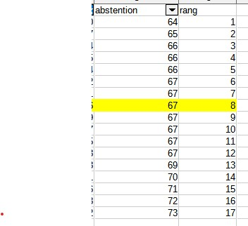

```{r setup, include=FALSE}
knitr::opts_chunk$set(echo = TRUE)
```


Télécharger et ouvrir le fichier de données du cours.

# Termes

## Trouver des termes pour les objets en statistiques

exemples

- variable, 

- observation,

- valeur

A vous !

On retiendra pour le moment uniquement les termes : individu / population / variable et modalité

## distinguer tableau complet, tig, tableau condensé

Individu -> Modalité

Modalité -> Individus

# L'essentiel : la forme d'une distribution

## Abscisses et ordonnées


## Tiges et feuilles

discrétisation la plus rudimentaire

https://fr.khanacademy.org/math/be-4eme-secondaire2/x213a6fc6f6c9e122:statistiques-1/x213a6fc6f6c9e122:graphiques-statistiques/a/stem-and-leaf-plots-review


## Et sous un tableur

#### Resultat attendu


Et non pas :


### Préparation de l'exercice

#### Pour obtenir un TIG avec une seule variable, quelle variable choisir et pour quels individus ?

Dans l'exemple proposé du cous, on choisit la colonne de la dénomination des bureaux (1 à 32) et les
abstentions à Bondy


Cet exercice permet d'utiliser dans le tableur :

* utilisation de la barre d'adresse

* utilisation des noms pour la formule

https://help.libreoffice.org/6.2/fr/text/scalc/guide/value_with_name.html

* formule frequence, formule matricielle (CTRL + MAJ + ENTREE)

* sélection pour exporter comme image


formules du tableau


### Quel commentaire ?

- étendue
- forme de la distribution


## A explorer 

graphique en barres, lignes (lissage)

Observer la disposition des bornes : elles sont utilisées comme des étiquettes et non pas comme une série de valeurs.

## Correction graphiques étudiants

En fonction du rendu

# Pour raffiner : les indicateurs

Nous avons déjà vu l'amplitude à travers minimum et maximum. Il y en a d'autres.
Ils servent à résumer la série statistique


Pour l'exemple, on prend la commune choisie


```{r}
data <- read.csv("data/bondy_2022.csv", fileEncoding = "UTF-8")
str(data)
abstention <- data [ , c("Code.du.b.vote","Abstentions")]
write.csv(abstention, "data/abstention2022.csv", fileEncoding = "UTF-8")
```


A votre avis pourquoi ? (cf forum sur le moodle)

## Calcul :  valeurs centrales et dispersion

### Valeurs centrales

Il s'agit de caractériser une distribution par son centre.

#### Moyenne et médiane

##### Calcul

Le calcul de la moyenne est connu. Celui de la médiane beaucoup moins.


###### Sur le tableau complet

Créer une colonne rang. Et relever le rang médian




#### savoir faire tableur

- valeur fixe et relative (utilisation du $ et F4)

- au niveau graphique, rajout d'un axe par le menu insertion après double clic sur 
le graphique (onglet positionnement, menu déroulant valeur)


##### Que retenir ?

Expliquer ces phrases issues du Chadule

- La médiane est dans une distribution la valeur la plus *proche* de toutes les autres

Il s'agit d'une propriété mathématique de la médiane. 

- les valeurs extrêmes *décentrent* la moyenne


### Dispersion : Ecart-type et variance

La distribution est-elle hétérogène ?

#### 2 définitions : 

- écart moyen des valeurs à leur moyenne arithmétique

- moyenne du carré des écarts


#### Une question fondamentale : pourquoi utiliser les carrés ?

https://qastack.fr/stats/118/why-square-the-difference-instead-of-taking-the-absolute-value-in-standard-devia

et notamment, pour l'oeil du géographe :


*Une façon de penser à cela est que l’écart-type est similaire à une "distance par rapport à la moyenne".*

*Comparez cela à des distances dans un espace euclidien - ceci vous donne la vraie distance, où ce que vous avez suggéré (qui, en fait, est la déviation absolue ) ressemble plus à un calcul de distance manhattan .*


### Exercice en cours

Toujours sans passer par les formules, mais avec un tableau *pas à pas*, créer les indicateurs.

liste des colonnes :

- écart à la moyenne

- carré des écarts


- et à part sur une seule case : moyenne du carré des écarts (variance), l'écart type est la racine carrée.


## Appliquer : appréhender quelques indicateurs 

intitulé exercice *valeurs centrales et dispersion*

Sur une des résidences (sauf la cité du Stade) utilisée en cours, faire le graphique du TIG et indiquer la valeur centrale.

Rajouter une ligne de commentaire expliquant moyenne / médiane et écart type.


### Corrections quelques remarques 

L'objectif de l'exercice était d'obtenir un commentaire clair avec quelques repères statistiques.


#### Les bons graphiques


##### Un graphique du TIG


##### Une diagramme de répartition


##### Quelles erreurs dans les graphiques suivants ?


### Les commentaires

Beaucoup d'étudiants ne voient pas la nécessité d'un commentaire...

#### Commentaire clair

*La moyenne et la médiane sont très proches. En effet, en moyenne, les logements de la résidence possèdent 3 pièces et 50 % des logements possèdent moins de 3 pièces. On peut en déduire que la série est assez homogène.De plus, l'écart type est faible, ce qui signifie que les valeurs sont peu dispersées autour de la moyenne et donc il vient confirmer que la série est homogène.*


#### trop technique 


#### Des commentaires intéressants


##### Un peu confus.


##### Une réflexion sur le terme *hétérogène*


