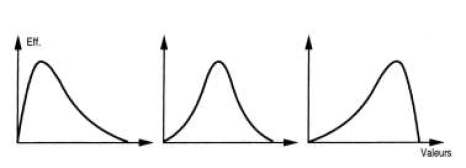
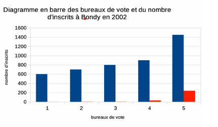
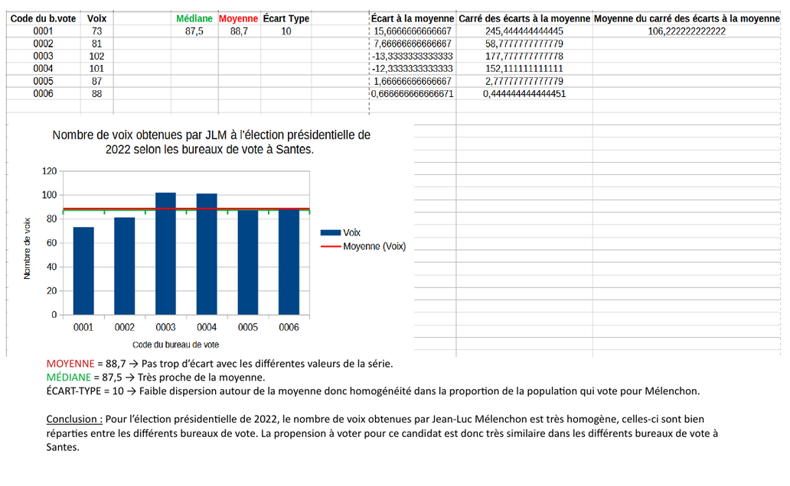

```{r setup, include=FALSE}
knitr::opts_chunk$set(echo = TRUE)
```


Télécharger et ouvrir le fichier de données du cours.


```{r}
data <- read.csv2("data/potentiel-fiscal-resultat-gc.csv")
maData <- data [data$Département == '93',]
```


# Termes

## Trouver des termes pour les objets en statistiques

exemples

- variable, 

- observation,

- valeur

A vous !

On retiendra pour le moment uniquement les termes : individu / population / variable et modalité

## distinguer tableau complet, tig, tableau condensé

Individu -> Modalité

Modalité -> Individus

# L'essentiel : la forme d'une distribution

## Abscisses et ordonnées




## Tiges et feuilles

discrétisation la plus rudimentaire

https://fr.khanacademy.org/math/be-4eme-secondaire2/x213a6fc6f6c9e122:statistiques-1/x213a6fc6f6c9e122:graphiques-statistiques/a/stem-and-leaf-plots-review


## Et sous un tableur

#### Resultat attendu


Et non pas :


### Préparation de l'exercice

#### Pour obtenir un TIG avec une seule variable, quelle variable choisir et pour quels individus ?

Dans l'exemple proposé du cours (*Potentiel fiscal et police municipale*), on choisit la colonne de la dénomination des communes (26 communes sur le 93) et le nombre d'agents


Cet exercice permet d'utiliser dans le tableur :

* utilisation de la barre de formule

* formule frequence, formule matricielle (CTRL + MAJ + ENTREE)

* le graphique en barre et la personnalisation (transformation données étiquettes)


formules du tableau


### Quel commentaire ?

- étendue 

```{r}
summary(maData$Nombre.de.policiers.et.de.gardes.champêtres)
```


Concernant notre exemple, il y a une grande disparité entre les communes, certaines
ont 3 agents, d'autres 63

- forme de la distribution

L'énorme majorité des communes ont moins de 20 agents. Une seule commune possède plus
de 60 agents, il s'agit d'Aulnay sous Bois. Son maire étant un ancien lieutenant de la 
police nationale.


## A explorer 

graphique en barres, lignes (lissage)

Observer la disposition des bornes : elles sont utilisées comme des étiquettes et non pas comme une série de valeurs.

Sous R, l'histogramme est un des graphiques le plus simple à obtenir.

```{r}
hist(maData$Nombre.de.policiers.et.de.gardes.champêtres)
```

L'histogramme souligne l'originalité d'Aulnay sous bois par rapport autres communes.

## Correction exercice dénombrement des agrégats financiers


Des retours très nombreux (46 sur 60). Beaucoup d'étudiants ont buté sur la difficulté de la numérotation décimale et ont utilisé le fichier vu en classe, pas de problème dans le cadre d'un exercice.


### Le séparateur décimal (, ou . ?)

Sous Calc, l'astuce consiste à modifier les paramètres linguistiques.


Pour un tableur, le chiffre se positionne à droite de la cellule, le texte à gauche.

L'autre solution était d'utiliser le format excel.


### Commentaires généraux qui valent pour tous les exercices et surtout le DST


#### De quoi on parle ?

Attention à toujours définir sa donnée dés le départ y compris sa source.


Dans le cadre de notre cours,
c'est la commune et son *département* (ou *sa communauté de communes*) puis l'agrégat choisi.


#### Pour la forme 

Ne jamais mettre un tableau de données dans sa copie !

Ne jamais prendre en photo son écran !

Le mieux *traitement de texte* dans lequel on insère un 
graphique image (copie d'écran CTRL + MAJ + S puis CTRL + V pour coller), puis
enregistrement en .pdf au final.

Attention aux nombreuses pages inutiles si on passe directement du tableur
au traitement de texte.


Soigner ses titres

Par contre, pas de carte, ce n'est pas le sujet du cours.
La discrétisation avec un logiciel SIG est souvent automatisée, et ce cours permet
de faire les choses *à la main*.


#### Concision du commentaire


même si, un strict respect de la consigne donnait :


Prochain exercice, commentaire plus court. 2 phrases maximum, 1 page au total, aller à l'essentiel.

*Il y plus de grosses dépenses en fonctionnement que de petites* (ou l'inverse)

Ou plus osé :

*Certaines villes ne maîtrisent pas leurs dépenses de personnel*

Et préciser quelle ville est remarquable et pourquoi ?


#### Vocabulaire

Revenir sur le terme : formule *fréquence et son graphique*

Diagramme de fréquence, histogramme...

Le mieux : *Discrétisation des dépenses de personnel en fonction des villes*


### Plus précisemment

####  Problème sur les classes dans le graphique 

Il faut afficher les bornes.
  
  
  

*Bug* repéré sous Libre Office

Une solution, afficher les étiquettes sur les barres


#### Autres méthodes

Une méthode différente est valide également (le tableau croisé dynamique)


# Pour raffiner : les indicateurs

Nous avons déjà vu l'amplitude à travers minimum et maximum. Il y en a d'autres.
Ils servent à résumer la série statistique

Nous allons montrer comment calculer médiane, moyenne et écart type dans le tableur. 

Pour l'exemple, on prend l'agrégat financier de l'exercice : celui des frais du personnel.

Afin de pouvoir comparer les communes de taille différente, on utilise plutôt les montants par habitant.


```{r}
data <- read.csv2("data/fraisPersonnel.csv", dec= ".", fileEncoding = "UTF-8")
str(data)
hist(data$montant.par.hbt, freq = FALSE)
lines(density(data$montant.par.hbt), col="red", lwd = 2)
```


## Valeurs centrales : moyenne et médiane

Il s'agit de caractériser une distribution par son centre.

### Calcul

Le calcul de la moyenne est connu. Celui de la médiane beaucoup moins.

Sur le tableau complet, créer une colonne rang. Et relever le rang médian


### Savoir faire tableur

- nommer la plage de données 


### Représentation graphique

Elle consiste à tracer moyenne et médiane sur le graphique, elle n'est pas possible
sous le tableur.


```{r}
moy <- mean(data$montant.par.hbt)
med <- median(data$montant.par.hbt)
hist(data$montant.par.hbt, main = "Distribution des dépenses de personnel par hbt")
abline(v = moy, col = 'blue')
abline(v = med, col = 'red')
```

Pour la variable *dépense de personnel*, quelle est l'indicateur le plus utile ?

### Que retenir ?

##### Expliquer ces phrases issues du Chadule

- La médiane est dans une distribution la valeur la plus *proche* de toutes les autres

Il s'agit d'une propriété mathématique de la médiane. Si la distribution est disymétrique, cette valeur est le vrai centre de la distribution.

- les valeurs extrêmes *décentrent* la moyenne

##### Rapport entre médiane et moyenne

Que peut-on dire de la forme de la distribution 

- si la moyenne est égale à la médiane ?

- si moyenne > médiane

-  si médiane > moyenne

Démonstration avec les agrégats du 93


```{r}
data <- read.csv("data/data93.csv")
# liste des agrégats
names(data)
table(data$Exercice)
# filtre sur le budget principal et l'année
table(data$Type.de.budget)
data <- data [data$Exercice == 2018 & data$Type.de.budget == 'Budget principal', c("Nom.2024.Commune", "Agrégat", "Montant.en...par.habitant" )]
# simplification des noms des colonnes
names(data) <- c("ville", "agregat","montant")
agregat <- names(table(data$agregat))
table(data$ville)
```


```{r}
png("img/medmoy.png", width = 1200, height = 1200, res=90)
par(mfrow=c(7,7))
i <- 1
for (i in 1:length(agregat)){
  tmp <- data [data$agregat == agregat [i],]
  moy <- mean(tmp$montant)
  med <- median(tmp$montant)
  sigma <- sd(tmp$montant)
  mar = c(2,2,2,2)
  titre <- paste0(substring(agregat [i], 1, 15),"\n",round(sigma,0))
  hist(tmp$montant, main = titre, font.main=1,  xlab = "")
  abline(v = moy, col = 'blue')
  abline(v = med, col = 'red')
}
dev.off()
```


moyenne en bleue, médiane en rouge

Chercher un ou deux agrégats pour lequel médiane et moyenne sont différentes.


```{r}
par(mfrow=c(1,2))
# moyenne > médiane
agregat [43]
tmp <- data [data$agregat == agregat [43],]
hist(tmp$montant, main = agregat [43])
moy <- mean(tmp$montant)
med <- median(tmp$montant)
abline(v = moy, col = 'blue')
abline(v = med, col = 'red')
# également
agregat [37]
tmp <- data [data$agregat == agregat [37],]
hist(tmp$montant, main = agregat [37])
moy <- mean(tmp$montant)
med <- median(tmp$montant)
abline(v = moy, col = 'blue')
abline(v = med, col = 'red')
```


## Dispersion : Ecart-type et variance

La distribution est-elle hétérogène ?

```{r}
agg <- aggregate(data$montant, by = list(data$agregat), sd)
names(agg) <- c("agregat", "sigma")
hist(agg$sigma)
moy <- mean(agg$sigma)
med <- median(agg$sigma)
abline(v = moy, col = 'blue')
abline(v = med, col = 'red')
```

Commenter l'écart type le plus élevé

```{r}
agg$agregat [agg$sigma == max(agg$sigma)]
sel <- agregat [23]
tmp <- data [data$agregat == sel,]
hist(tmp$montant, 
     main = paste0
      (sel,"\n",
        round(sd(tmp$montant),0)))
moy <- mean(tmp$montant)
med <- median(tmp$montant)
abline(v = moy, col = 'blue')
abline(v = med, col = 'red')
knitr::kable(tmp [order(tmp$montant), c(1,3)])
```


#### 2 définitions : 

- écart moyen des valeurs à leur moyenne arithmétique

- moyenne du carré des écarts


#### Une question fondamentale : pourquoi utiliser les carrés ?

https://qastack.fr/stats/118/why-square-the-difference-instead-of-taking-the-absolute-value-in-standard-devia

et notamment, pour l'oeil du géographe :


*Une façon de penser à cela est que l’écart-type est similaire à une "distance par rapport à la moyenne".*

*Comparez cela à des distances dans un espace euclidien - ceci vous donne la vraie distance, où ce que vous avez suggéré (qui, en fait, est la déviation absolue ) ressemble plus à un calcul de distance manhattan .*


### Utilisation du tableur

Toujours sans passer par les formules, mais avec un tableau *pas à pas*, créer les indicateurs.

liste des colonnes :

- écart à la moyenne

- carré des écarts


- et à part sur une seule case : moyenne du carré des écarts (variance), l'écart type est la racine carrée.


### Corrections quelques remarques (attention correction exercice 2023) 

L'objectif de l'exercice était d'obtenir un commentaire clair avec quelques repères statistiques.





##### Quelles erreurs  ?


##### Facile à évaluer

- Mise en forme : zéro

Pas d'export direct de vos tableaux excel, svp !

étudiants exportant leur .pdf en entier 5

1 page suffit, quelques lignes de commentaire pas technique

A l'inverse, penser quand même à mettre ville, année, et candidat


- Pas de respect de la consigne : zéro

exemple : variable des inscrits, graphique de la fréquence.


* Le plus original :


Pourquoi prendre le carré des moyennes ?

* le plus incompréhensible :


* attention aux commentaires trop techniques


##### Non pris en compte

- Affichage de la médiane : ce n'est pas très facile sous le tableur.


- graphique du TIG et forme de la distribution

Attention, le graphique du TIG ne permet pas de voir la forme de la distribution.

Du coup, sans doute beaucoup d'étudiants n'ont pas osé parler de symétrie / dissymétrie. 

Le candidat a un petit nombre de votes dans beaucoup de bureaux, les valeurs faibles tirent la moyenne vers le bas,  moyenne < médiane (cas Taubira)
Le candidat a un grand nombre de votes dans beaucoup de bureaux, les valeurs fortes tirent la moyenne vers le haut,  moyenne > médiane (cas Chevènement)

Dans les 2 cas, on analyse la médiane, c'est elle qui est la valeur centrale la plus représentative.

##### Erreurs intéressantes par rapport à l'écart type


- Sauf cas extrême, L'écart type ne peut pas avoir le même ordre de grandeur que la moyenne / médiane.

- Attention, ce n'est pas parce que médiane et moyenne se confondent que l'écart type est petit...

ex : vote pour un candidat clivant mais peu représentatif : 10 voix par bureau en moyenne.
mais 5 bureaux avec 20 voix et 5 autres avec 0 voix
Dans ce cas, la valeur de la moyenne (10) est égale à celle de l'écart type.

- La taille de l'écart type est à rapporter à l'indicateur central pour qualifier son importance.

ex : écart type 25 sur une moyenne autour de 100

