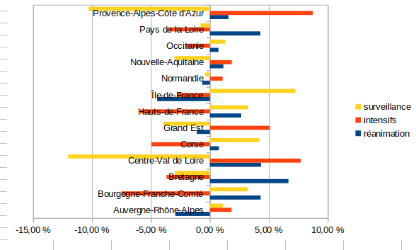
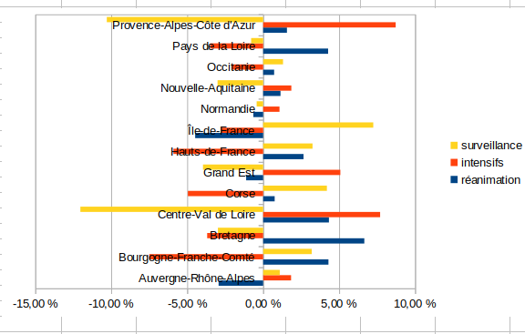
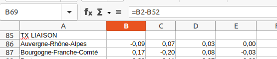
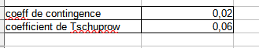

```{r setup, include=FALSE}
knitr::opts_chunk$set(echo = TRUE)
```

# Données d'exemple

hypothèse : relation entre les régions et les types de lits

Deux distributions connues par classe quelque soit la nature des modalités.

Attention, valeur plancher 5

```{r}
data <- read.csv("data/lits.csv", fileEncoding = "UTF-8")
dpt <- read.csv("data/departements-region.csv", fileEncoding = "UTF-8")
dataM <- merge(data, dpt, by.x = "Département", by.y = "num_dep" )
agg <- aggregate (dataM[,c("réanimation", "intensifs","surveillance")], by = list(dataM$region_name), sum)
write.csv(agg, "data/litsRegion.csv")
```

Pour l'exercice, on utilise les lits par région plutôt que par dpt


# Tableau de contingence

Au sens anglais du terme, *ce qui peut exister*

## Analyse d'un tableau de contingence

- Il faut présenter les sources, la structure et le contenu du tableau.

- Lister les questions susceptibles d'être posées

- Analyse des distributions marginales


## Fréquences conditionnelles en ligne et colonne

Pour pouvoir comparer les régions, chaque groupe est ramené à une même base
égale à 100.


savoir-faire tableur

- Objectif : saisir une seule cellule et étendre la formule.
quelle élément fixer, ligne ou colonne ?

- Graphique par types de lit


commentaire

- répartition des régions puis lorsque ramené à une base 100, répartition des lits
dans les régions (on peut comparer)

- les écarts au total des types de lit sont plus parlants



Qu'apporterait une étude des fréquences conditionnelles en colonnes ?

## Effectifs théoriques et observées

### Analogie du jeu du dé et de la pièce

### Tableau d'indépendance

Pour le vérifier, les distributions univariées restent inchangées.

La première case reçoit la formule :

- effectif / total lg * effectif / total colonne FREQUENCE CONJOINTE

- cette fréquence est multipliée par la totalité de l'effectif pour avoir l' EFFECTIF


### Ecarts entre observés et théoriques

Que signifie une valeur zéro ?

Utiliser les notions

- d'attraction et de répulsion pour les signes.
- sur représentation / sous représentation




On peut également le taux de liaison, c'est à dire le rapport entre la différence 
et l'effectif à l'indépendance.



Le commentaire sera du type : "Le nombre de lits de réanimation s'écarte de 9 % de
la valeur théorique qui indiquerait une situation ou les deux modalités ne seraient 
pas liés"


## Le Khi2 

rappel : métrique euclidienne plutôt que les valeurs absolues on utilise les carrés


#### Le Khi2 partiel

On met les écarts rapportés à la valeur théorique d'indépendance au carré.


#### Le Khi2

C'est le total des khi2 partiels (dans notre exemple 224 085)

degré de liberté
lg -1 * col -1

13 régions et 3 types de lit = quel degré de liberté ? 

risque 5 %

lecture du khi2 38.89

#### Rejet de H0 ou pas

HO hypothèse d'indépendance. son rejet implique qu'il y a une relation.

Les variables lits et régions ont une relation avec une marge d'erreur de 5 %

### Intensité de la liaison

indicateur entre 0 et 1. 1 pour très forte intensité.

Le plus simple est le coefficient de contingence peut mesurer cette relation.

C'est le Khi2 rapporté à la somme Khi2 et de l'effectif total



*Savoir-faire tableur*

Utiliser les noms plutôt que les cellules fixées

D'autres coefficients permet de reprendre le nombre de degrés de liberté et ainsi de
s'affranchir de la taille du tableau.


Dans notre cas, il est de 0.9
