```{r setup, include=FALSE}
knitr::opts_chunk$set(echo = TRUE)
knitr::opts_chunk$set(eval = TRUE)
```

# Données d'exemple

On travaille à présent sur un croisement 


- d'un agrégat financier (frais du personnel)

- d'un résultat électoral (la gauche, la droite, etc...)

La donnée est fournie pour le cours par département (voir le moodle)


Enoncer les hypothèses possibles de la comparaison, attention variable explicative (X) et à expliquer (Y)


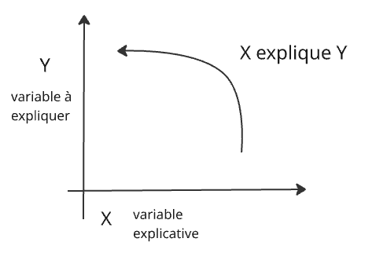


Pour le cours, le vote pour la gauche (X) amène la non maîtrise des frais de personnel (Y) 


Pour mémoire, l'hypothèse nulle (H~0~) est l'absence de relation entre vote pour la gauche et frais de personnel.


```{r, echo = T}
data <- read.csv("data/baseCours3_93.csv", fileEncoding = "UTF-8", dec =".")
# Quelle est la nuance majoritaire dans le dpt en 2020 ?
table(data$bloc)
# filtre
GAU <- data [data$bloc == "GAU",]
```

Sous libre office, on peut utiliser un tableau dynamique pour dénombrer le nombre de blocs sur l'ensemble des villes.

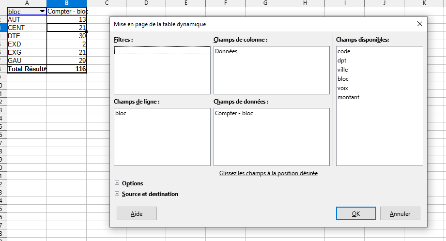


# Nuage de points

## Quel bloc choisir ?

Pour le 93, quel bloc est lié aux frais de personnel (Y) ?

```{r, echo=T}
data <- read.csv("data/baseCours3_93.csv", fileEncoding = "UTF-8", dec =".")
noms <- names(table(data$bloc))
png("img/blocChoix.png", width = 2400, height = 1600, res = 400)
par(mfrow = c(2,3))
for (n in noms){
  tmp <- data [data$bloc==n,]
  plot(tmp$voix, tmp$montant,  xlab = n, ylab = "montant frais", col="coral", pch =  19)
}
dev.off()
```


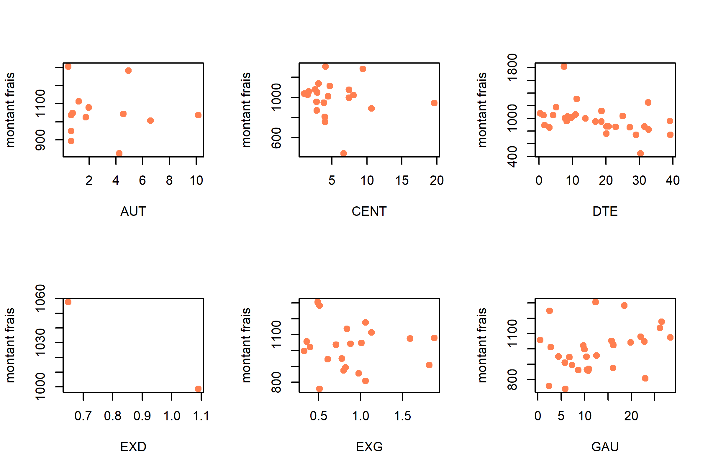

Attention, encore une fois, variable explicative et expliquée.


## Savoirs faire tableur


- graphique XY, attention à la série et aux plages

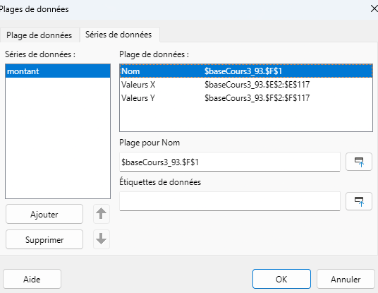

- insertion courbe de tendance linéaire et afficher le R²


## Simplification des chiffres

### Redéfinition des bornes

Retour sur les distributions pour enlever les valeurs aberrantes

```{r}
hist(data$voix)
hist(data$montant)
```

On recherche des bornes permettant d'avoir un nuage de points "cohérent".
Avec le tableur, on fait le graphique puis on ajuste avec le filtre au niveau de la donnée.

Le graphique se met automatiquement à jour

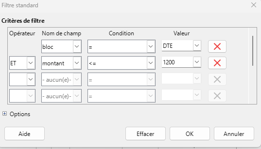
Observer les variations du R²

### Filtre sous R

```{r}
sel <- data [(data$montant<1200 & data$bloc == 'GAU') ,]
par(mfrow = c(1,2))
plot(GAU$voix, GAU$montant)
plot(sel$voix, sel$montant)
```

Désormais, on travaille sur la sélection et la totalité de la série pour vérifier
que la restriction des bornes est utile.


# Droite de régression

## Un peu de mathématiques

La droite de régression minimise la somme des carrés des distances verticales entre chacun des points du nuage et la droite recherchée.

Pour une droite aX+b

- a (la pente) = covariance / variance X

- b (ordonnée de l'origine) = moyenne de Y - a * moyenne de X

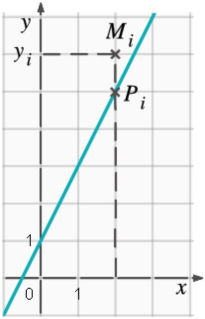
La distance MP doit être minimale d'où le terme *droite des moindres carrées*


## Droite de régression sous R

```{r, echo=TRUE}
par(mfrow = c(2,1))
plot(GAU$voix, GAU$montant, pch=20)
# modèle de régression
lm <- lm(GAU$montant~GAU$voix)
abline(lm, lty =2, lwd = 1, col = "red")
text( GAU$voix, GAU$montant,labels = as.character(row.names(GAU))
      , cex=0.6, pos = 2)
# Pour la sélection
plot(sel$voix, sel$montant, pch=20)
# modèle de régression
lm <- lm(sel$montant~sel$voix)
abline(lm, lty =2, lwd = 1, col = "red")
text( sel$voix, sel$montant,labels = as.character(row.names(sel))
      , cex=0.6, pos = 1, pch = 19)
```


Visuellement, on voit bien qu'il existe un lien entre les deux variables, mais il y a beaucoup de points éparses (les résidus)

Il s'agit maintenant de mesurer précisemment l'intensité du lien à l'aide de calculs (voir
après la correction de l'exercice)


# Correction exercice droite de régression (attention exercice 2025)

### Analyse : le message est passé

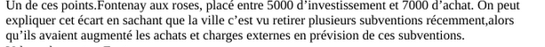


### Vocabulaire


Les variables


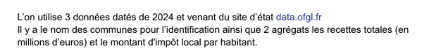

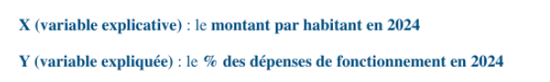
Hypothèse nulle

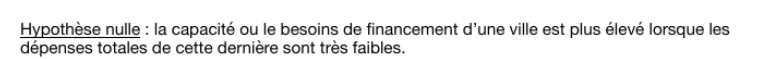

## Le graphique

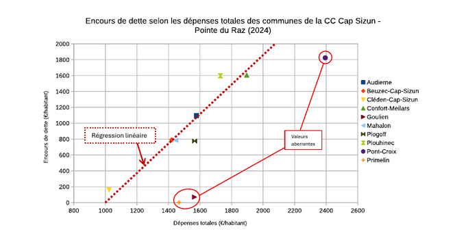
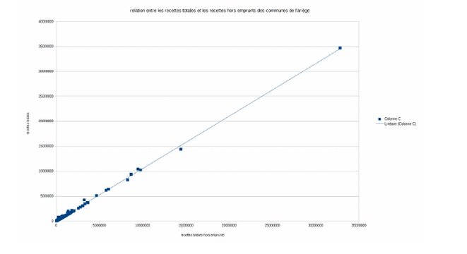


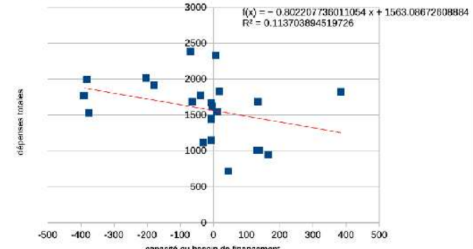

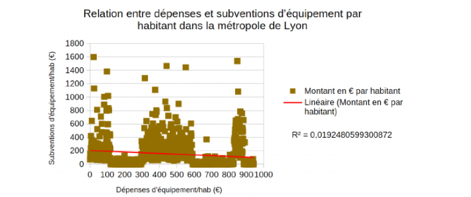


# Coefficient de correlation

Autrement dit, le coefficient de Bravais-Pearson (1896).
Pearson propose une formule mathématique pour la notion de corrélation.

Savoir-faire tableur : utiliser les noms pour les colonnes


### Premier temps

On rajoute des colonnes pour chaque variable :

- écart à la moyenne

- carré ( = *distance* plutôt que *différence*)

et pour les deux variables

- produit des écarts (pour étudier le rapport entre 2 variables, techniquement on utilise une division ou une multiplication)

### Deuxième temps

Dans un nouveau tableau, pour chaque variable

- moyenne

- carré de la somme des écarts à la moyenne 

- Variance

- Ecart type

puis covariance (produit des écarts / nb de valeurs)

et coeff (cov / produit des écarts types)


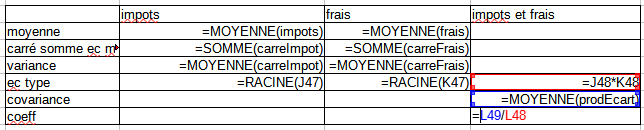

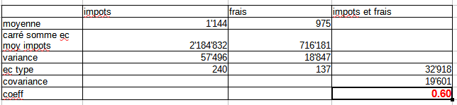


### Interprétation

Le coefficient évolue de -1 à +1

- Si r = 0, les variables ne sont pas corrélées.

- Dans les autres cas, les variables sont corrélées négativement ou positivement.

- plus la variable est proche de 1, plus l'intensité de la relation entre les deux variables est forte.

Dans notre exemple, lien assez faible au départ puis plus fort avec la sélection

```{r}
varCorr <- data [, c( "voix", "montant")]
cor(varCorr)
# Et avec la sélection
varCorr <- sel [, c( "voix", "montant")]
cor(varCorr)
```

Le coefficient est plus fort si les deux valeurs d'un montant supérieur à 1200 sont
supprimées.

# Coefficient de détermination

Au niveau mathématiques, c'est le carré du coefficient de corrélation linéaire

Mais c'est surtout :

Le rapport entre 

- la variation de Y expliquée par le modèle

et

- la variation totale de Y


```{r}
cor(varCorr)^2
```


Le vote à gauche explique 27 % du montant des frais du personnel dans le meilleur des cas.

Les 73 % restant sont liés à d'autres facteurs.

# Etude des résidus

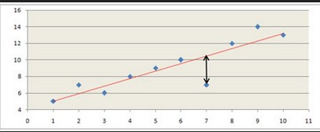


Identifiez graphiquement 2 points isolés de la droite de régression.

Dans notre exemple, ce sont les ville 17, 95 et 34

```{r}
GAU [c(17,34,95),]
```


A Rosny sous Bois, les frais de personnel sont bas mais les impôt sont élévés.
A Clichy sous Bois, les frais de personnel sont élévés mais les impots sont bas.


# Cartographie des résidus


```{r, eval=F}
library(sf)
communes <- st_read("data/communes93.geojson")
communes <- communes [!is.na(communes$ref.INSEE), c("name", "ref.INSEE")]
```


```{r, eval=FALSE}
residus <- lm$residuals
hist(residus)
sel <- cbind(sel, residus)
# on calcule les résidus
jointure <- merge(communes, sel, by.x = "name", by.y = "ville")
summary(jointure$residus)
```

```{r, eval=FALSE}
library(mapsf)
png("img/residusCarte.png")
mf_map(jointure, var = "residus", type="choro", breaks = c(-500, -250,0,250,500), pal = cm.colors(4), border = NA, leg_pos = c(2.31589950651953, 48.8793057936166) )
mf_label(communes, var = "name", overlap = FALSE, col= "wheat4", cex = 0.8)
mf_layout("vote de gauche et frais de personnel : étude des résidus", credits = "OFGL 2025, elections municipales 1er tour 2020")
dev.off()
```


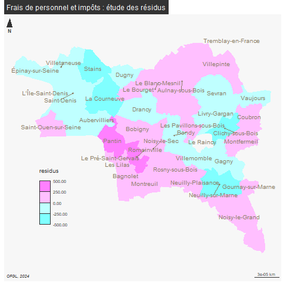

Tremblay et Rosny sous Bois sont écartées, elles représentaient des extrêmes.

Les villes dans les teintes les plus foncées s'éloignent le plus du modèle.


