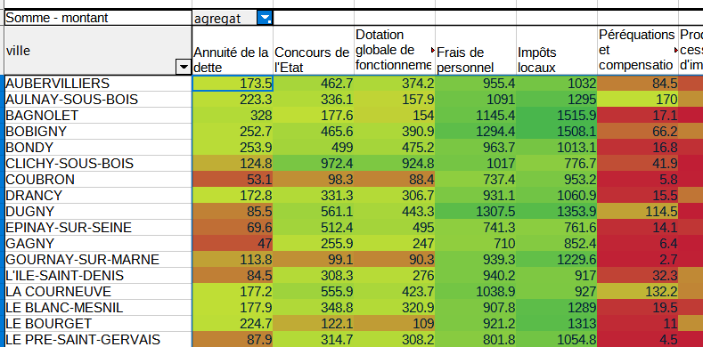

```{r setup, include=FALSE}
knitr::opts_chunk$set(echo = FALSE)
knitr::opts_chunk$set(warning = FALSE)
```

# Déroulement

## Données d'exemple


hypothèse : relation entre les bv et les candidats


Deux distributions de variables de catégorie.

## Différentes étapes

- Tableau de contingence

- calcul du khi2

- comparaison avec le khi2 théorique


# Tableau de contingence

Au sens anglais du terme, *ce qui peut exister*


## Création

Utiliser l'outil de table dynamique (dans le menu données) pour le créer

Résultat attendu :


## Analyse d'un tableau de contingence

- Il faut présenter les sources, la structure et le contenu du tableau.

- Lister les questions susceptibles d'être posées, notamment en étudiant les fréquences conditionnelles


### Format conditionnel



Cet outil est-il utile ici ?

### Fréquences conditionnelles en ligne et colonne

Pour pouvoir comparer les bureaux de vote, chaque groupe est ramené à une même base
égale à 100.


savoir-faire tableur

- Objectif : saisir une seule cellule et étendre la formule.
quelle élément fixer, ligne ou colonne ?

- utilisation du %


Analyse après avoir mis le format conditionnel.

- répartition des candidats puis lorsque ramené à une base 100, on peut comparer entre les zones.

- les écarts à la moyenne par candidat sont plus parlants


Qu'apporterait une étude des fréquences conditionnelles en colonnes ?


# Khi2 : un exemple sur un dé truqué

Le dé est-il truqué ?

```{r}
face <- seq(1,6)
effectif <- c(15,7,4,11, 6, 17)
total <-  sum(effectif)
knitr::kable(data.frame(face,effectif))
```

Le nombre total de lancers est de 60.

## Hypothèse d'indépendance

hypothèse H0 : le dé n'est pas truqué (il y a indépendance entre la face et le
nombre de fois où elle sort)

## Effectifs théoriques

Sur le total des lancers (60), chaque face aurait pû sortir 10 fois.

```{r}
effectifThéorique <- rep (10,6)
df <- data.frame(face, effectif, effectifThéorique)
knitr::kable(df)
```

## Calcul du khi2

distance entre effectifs théoriques et observés

Elle se mesure avec le khi2

On calcule l'écart, puis le carré de cet écart et on pondère par l'effectif théorique.

```{r, echo = T}
(ecart <- df$effectif - df$effectifThéorique)
(distance <-  ecart^2)
(relatif <- distance / df$effectifThéorique)
(khi2 <- sum(relatif))
```

## Test du khi2

### Paramètres du test

- degré de liberté : 5

C'est le nombre de valeurs possibles -1 (car on peut déterminer la 6e valeur à partir des 5 autres)

- Pour un risque à 0,05 (5 chances sur 100 de se tromper)

### Résultat

Lecture dans la table du khi2


le khi2 théorique est de 11,7, il est donc inférieur au khi2 observé.

Quand le khi2 théorique est inférieur, le test est rejeté.

Le test est rejeté avec un risque de 5 %

Donc, le dé est truqué.

