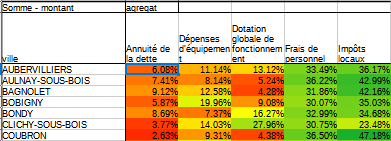

```{r setup, include=FALSE}
knitr::opts_chunk$set(echo = TRUE)
```

# Données d'exemple

hypothèse : relation entre les régions et les types de lits

Deux distributions connues par classe quelque soit la nature des modalités.

Attention, valeur plancher 5

```{r}
data <- read.csv("data/lits.csv", fileEncoding = "UTF-8")
dpt <- read.csv("data/departements-region.csv", fileEncoding = "UTF-8")
dataM <- merge(data, dpt, by.x = "Département", by.y = "num_dep" )
agg <- aggregate (dataM[,c("réanimation", "intensifs","surveillance")], by = list(dataM$region_name), sum)
write.csv(agg, "data/litsRegion.csv")
```

Pour l'exercice, on utilise les lits par région plutôt que par dpt


# Tableau de contingence

Au sens anglais du terme, *ce qui peut exister*

## Analyse d'un tableau de contingence

- Il faut présenter les sources, la structure et le contenu du tableau.

- Lister les questions susceptibles d'être posées

- Analyse des distributions marginales


## Fréquences conditionnelles en ligne et colonne

Pour pouvoir comparer les régions, chaque groupe est ramené à une même base
égale à 100.

```{r}
data <- read.csv("data/litsRegion.csv")
data <- data [,c(-1,-2)]
# On passe en matrice
data <- as.matrix(data)
freqLg <- prop.table(data,1)*100
knitr::kable(freqLg, title = "Fréquence conditionnelle ligne")
```


savoir-faire tableur

- Objectif : saisir une seule cellule et étendre la formule.
quelle élément fixer, ligne ou colonne ?

- Graphique par types de lit




commentaire

- répartition des régions puis lorsque ramené à une base 100, répartition des lits
dans les régions (on peut comparer)

- les écarts au total des types de lit sont plus parlants


Qu'apporterait une étude des fréquences conditionnelles en colonnes ?

## Correction du quizz sur les tableaux de contingence

### Données

#### Mauvaise réponse

* Il y a 3 variables : les lits de réanimation, les lits intensifs et les lits de surveillance, tout cela par région*


#### Bonne réponse

* Les lits par région *

#### Très bonne réponse


* Il y a 2 variables : les régions et le type de lit (réanimation, surveillance et intensif)
Ces deux données sont de type catégorie.*

### Hypothèse


#### Mauvaise réponse

* Il serait logique que chaque région ait une capacité adaptée à sa population*

Il n'y a pas de variable population dans les données donc pas d'hypothèse autour de la population.

#### Bonne réponse


* Les répartitions de type de lit ne sont pas les mêmes entre les régions*

### Fréquences conditionnelles en ligne

#### Mauvaise réponse

* On peut voir sur la même base qui est 100 la différence pour les 3 données pour une seule région*


Il manque des exemples précis.

#### Bonne réponse

* Les régions ont une plus forte proportion de lits de surveillance que des autres types de lit (42 % en moyenne). 
Les lits intensifs et de réanimation sont en part égales.
Mais il y a des différences entre les régions. Par exemple, la Bretagne compte beaucoup de lits de réanimation. A l'inverse, l'Ile de France en a peu.
La PAC et le centre val de Loire ont moins de lits de surveillance.
Donc les répartitions sont différentes entre région.*


### Fréquences conditionnelles en colonne

La bonne réponse était qu'il n'est pas nécessaire de l'étudier.
En effet, la répartition des lits de réanimation entre les différentes régions ne fait que réfléter l'effectif de la population de chaque région.
Or, nous n'avons pas cette variable dans le tableau.

## Effectifs théoriques et observées

### Analogie du jeu du dé et de la pièce

### Tableau d'indépendance

Pour le vérifier, les distributions univariées restent inchangées.

La première case reçoit la formule :

- effectif / total lg * effectif / total colonne FREQUENCE CONJOINTE

- cette fréquence est multipliée par la totalité de l'effectif pour avoir l' EFFECTIF


### Ecarts entre observés et théoriques

Que signifie une valeur zéro ?

Utiliser les notions

- d'attraction et de répulsion pour les signes.
- sur représentation / sous représentation


On peut également le taux de liaison, c'est à dire le rapport entre l'écart observé - théorique et l'effectif de l'observation.


Le commentaire sera du type : "Le nombre de lits de réanimation s'écarte de 9 % de
la valeur théorique qui indiquerait une situation ou les deux modalités ne seraient 
pas liés"


## Le Khi2 

rappel : métrique euclidienne plutôt que les valeurs absolues on utilise les carrés


#### Le Khi2 partiel

On met les écarts rapportés à la valeur théorique d'indépendance au carré.
Puis on divise par l'effectif.


#### Le Khi2

```{r}
data <- read.csv("data/litsRegion.csv")
data <- data [,c(-1,-2)]
# On passe en matrice
data <- as.matrix(data)
chisq.test(data)
```


C'est le total des khi2 partiels (dans notre exemple 330)

On définit :

- degré de liberté
lg -1 * col -1

13 régions et 3 types de lit = 24

- risque 1, 5 et 10 %

Sur internet, dans n'importe quelle table, on cherche les valeurs correspondantes.

#### Rejet de H0 ou pas


HO hypothèse d'indépendance. son rejet implique qu'il y a une relation.

Les variables lits et régions ont une relation avec une marge d'erreur de 5 %

### Intensité de la liaison

indicateur entre 0 et 1. 1 pour très forte intensité.


#### Coefficient de contingence

Le plus simple est le coefficient de contingence peut mesurer cette relation.

C'est le Khi2 rapporté à la somme Khi2 et de l'effectif total


#### Coefficient de Tschuprow

D'autres coefficients permet de reprendre le nombre de degrés de liberté et ainsi de
s'affranchir de la taille du tableau.

Celui de Tschuprow est le khi2 calculé rapporté à l'effectif total multiplié par la racine carré du nombre de degré de liberté.


*Savoir-faire tableur*

Utiliser les noms plutôt que les cellules fixées

### Interprétation des coefficients

Ils sont très faibles, donc même si les variables sont dépendantes l'une de l'autre, l'intensité de la relation est faible.

# Correction du quizz

## Ecarts entre observés et théoriques

Penser à utiliser les terme attraction / répulsion ou sur et sous représentation.


### Bonne réponse


Sera bonne toute réponse commentant le graphique.

#### exemple

* Il y a par exemple, une sur représentation du nombre de lits intensifs dans les régions PACA et Centre Val de Loire ainsi qu'une anomalie sur le nombre de lits en Bretagne *

Bien, mais je me demande de quelle anomalie il s'agit. Si je dois aller voir le graphique pour la comprendre, ce n'est pas bon.

#### Meilleur exemple


* En PACA, les lits de surveillance sont sous représentés tandis qu'en Ile de France, ils sont sur représentés *

* La région PACA est répulsive pour les lits de surveillance au contraire de l'Ile de France*

## Rejet de l'hypothèse

* On constate que le khi2 calculé est supérieur au khi2 théorique donc nous ne sommes pas dans une situation de hasard *

## Intensité de la relation

* Elle existe mais elle est très faible (Proche de 0 ; 0.018)*


