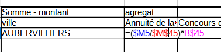

```{r setup, include=FALSE}
knitr::opts_chunk$set(echo = TRUE)
```

# Déroulement

## Données d'exemple


hypothèse : relation entre les secteurs géographiques / les résidences et les types d'appartements (du studio au plus de 5 pièces)


Deux distributions connues par classe quelque soit la nature des modalités.

## Différentes étapes

- Tableau de contingence

- calcul du khi2

- comparaison avec le khi2 théorique


# Exploration des données

## Discrétisation des données

Afin de vraiment comprendre, on saisit des modalités différentes : à votre avis comment va-t-on les classer ?

Attention, valeur plancher 5


```{r, echo=FALSE}
library(sf)
zone <- st_read("data/logement.gpkg", "quartiersBailleurs")
rpls <- st_read("data/logement.gpkg", "RPLS")
table(rpls$NBPIECE, useNA = "always")
barplot(table(rpls$NBPIECE, useNA = "always"))
#table(rpls$FINAN, useNA = "always")
# recodification
FINAN <- as.integer(names(table(rpls$FINAN)))
equiv <- "moins pauvres"
code <- data.frame(FINAN, equiv)
choix <- c("très pauvres", "pauvres", "moins pauvres")
code$equiv [ code$FINAN < 13 ] <- choix [1]
code$equiv [ code$FINAN > 48 | code$FINAN == 13] <- choix [2]
jointure1 <- merge  (rpls, code, by = "FINAN")
#table(jointure$equiv)
# pour nb pièces
NBPIECE <-  as.integer(names(table(rpls$NBPIECE)))
taille <- "moyen"
code <- data.frame(NBPIECE, taille)
code$taille [ code$NBPIECE < 3 ] <- "petit"
code$taille [ code$NBPIECE > 4] <- "grand"
jointure2 <- merge  (rpls, code, by = "NBPIECE")
# zones
inter <- st_intersection(jointure2, zone)
rplsPieceZone <- inter [, c("taille", "NOM_IRIS"), drop = T]
write.csv(rplsPieceZone, "data/rplsPieceZone.csv", fileEncoding = "UTF-8")
inter <- st_intersection(jointure1, zone)
rplsTypeZone <- inter [, c("equiv", "NOM_IRIS"), drop = T]
write.csv(rplsTypeZone, "data/rplsTypeZone.csv", fileEncoding = "UTF-8")
#table(rplsTypeZone$equiv,rplsTypeZone$NOM_IRIS)
```

## Cartographies de base


### Les points logements

```{r, echo=FALSE}
library(mapsf)
mf_map(zone)
mf_map(jointure2, type = "typo", var = "taille", add = T)
mf_layout("Taille appartement bailleur social", credits = "RPLS2019")
```


Quel est le problème de cette cartographie ?


```{r}
zone <- st_read("data/logement.gpkg", "quartiersBailleurs")
```

## Carte des zones

```{r}
mf_map(zone, type = "typo", var = "NOM_IRIS")
mf_layout("Zones inventaire bailleurs sociaux", credits = "sources internes, Bondy, 2013")
```


# Tableau de contingence

Au sens anglais du terme, *ce qui peut exister*


## Création

Utiliser l'outil de table dynamique (dans le menu données) pour le créer

Résultat attendu :

```{r}
data <- read.csv("data/rplsPieceZone.csv", fileEncoding = "UTF-8")
tab <- table(data$NOM_IRIS, data$taille)
knitr::kable(addmargins(tab))
```


## Analyse d'un tableau de contingence

- Il faut présenter les sources, la structure et le contenu du tableau.

- Lister les questions susceptibles d'être posées, notamment en étudiant les fréquences conditionnelles


### Format conditionnel


Cet outil est-il utile ici ?

### Fréquences conditionnelles en ligne et colonne

Pour pouvoir comparer les zones, chaque groupe est ramené à une même base
égale à 100.

```{r}
freqLg <- round(prop.table(table(data$NOM_IRIS, data$taille), margin = 1)*100,0)
knitr::kable(freqLg, title = "Fréquence conditionnelle ligne")
```


savoir-faire tableur

- Objectif : saisir une seule cellule et étendre la formule.
quelle élément fixer, ligne ou colonne ?

- utilisation du %


analyse

- répartition des types d'appartement puis lorsque ramené à une base 100, on peut comparer entre les zones.

- les écarts à la moyenne par type d'appartements sont plus parlants


Qu'apporterait une étude des fréquences conditionnelles en colonnes ?


# Khi2 : un exemple sur un dé truqué

Le dé est-il truqué ?

```{r}
face <- seq(1,6)
effectif <- c(15,7,4,11, 6, 17)
total <-  sum(effectif)
knitr::kable(data.frame(face,effectif))
```

Le nombre total de lancers est de 60.

## Hypothèse d'indépendance

hypothèse H0 : le dé n'est pas truqué (il y a indépendance entre la face et le
nombre de fois où elle sort)

## Effectifs théoriques

Sur le total des lancers (60), chaque face aurait pû sortir 10 fois.

```{r}
effectifThéorique <- rep (10,6)
df <- data.frame(face, effectif, effectifThéorique)
knitr::kable(df)
```

## Calcul du khi2

distance entre effectifs théoriques et observés

Elle se mesure avec le khi2

On calcule l'écart, puis le carré de cet écart et on pondère par l'effectif théorique.

```{r}
(ecart <- df$effectif - df$effectifThéorique)
(distance <-  ecart^2)
(relatif <- distance / df$effectifThéorique)
(khi2 <- sum(relatif))
```

## Test du khi2

### Paramètres du test

- degré de liberté : 5

C'est le nombre de valeurs possibles -1 (car on peut déterminer la 6e valeur à partir des 5 autres)

- Pour un risque à 0,05 (5 chances sur 100 de se tromper)

### Résultat

Lecture dans la table du khi2


le khi2 théorique est de 11,7, il est donc inférieur au khi2 observé.

Quand le khi2 théorique est inférieur, le test est rejeté.

Le test est rejeté avec un risque de 5 %

Donc, le dé est truqué.

# Retour à la comparaison secteur / type d'appartement

## Ennoncer l'hypothèse H0

Le type d'appartement est indépendant quartier.

## Effectif théorique

La première case reçoit la formule :

- (total lg / total) * total colonne

C'est ce qu'on appelle également le produit des marges




 ## Ecarts entre observés et théoriques

Que signifie une valeur zéro ?

Utiliser la notion

- sur représentation / sous représentation


Les petits appartements sont sous-représentés à Blanqui et à la remise à Jorelle par rapport à une distribution identique entre les quartiers.


## Le Khi2 

Le khi2 va permettre de valider le rejet de l'hypothèse d'indépendance.

rappel : métrique euclidienne plutôt que les valeurs absolues on utilise les carrés


### Le Khi2 partiel

On met les écarts rapportés à la valeur théorique d'indépendance au carré.
Puis on divise par l'effectif théorique.


### Le Khi2


Le total de tous les khi2 partiels


```{r}
data <- read.csv("data/rplsPieceZone.csv")
tab <- table(data$NOM_IRIS, data$taille)
test <- chisq.test(tab)
test$expected
```


C'est le total des khi2 partiels (dans notre exemple 338)

On définit :

- degré de liberté
lg -1 * col -1

8 zone et 3 types d'appartements = 7 * 2 = 14


- risque 1, 5 et 10 %

Sur internet, dans n'importe quelle table, on cherche les valeurs correspondantes.

### Rejet de H0 ou pas


HO hypothèse d'indépendance. son rejet implique qu'il y a une relation.

Les variables nombre de pièces et zones ont une relation avec une marge d'erreur très faible puisque le khi2 augmente quand le risque d'erreur baisse.

Les logiciels de stats proposent le risque limite, la valeur de bascule entre le rejet et l'acceptation de l'hypothèse nulle.


# Pourquoi le khi2 ?

## Les fréquences conditionnelles suffisent-t-elles ?

Comparaison des 2 tableaux

Estimation des écarts fondés sur la pondération des masses

## Le khi2 met en évidence les variations faibles autour de la moyenne

A partir de quand le khi2 devient inférieur ?

Et si on retire la Remise à Jorelle ?


```{r}
tab2 <- tab [-c(6),]
tab2
chisq.test(tab2)
```

En faisant d'autres essais, le khi2 diminue autour de 100, mais reste largement au dessus du khi2 théorique (entre 33 et 42)

## Et en carto...

Graphique

```{r}

dimnames(tab)
plot(tab, main = "type d'appartement par quartier",col= terrain.colors(3), border = NA, las = 2)
```

Carte des contributions au khi2


```{r}
names(test)
chi2partiel <- round(((test$observed - test$expected)^2 / test$expected),0)
chi2partielSomme <- apply(chi2partiel, 1,sum)
chi2partielFreq <- chi2partielSomme/ sum(chi2partielSomme)
hist(chi2partielFreq)
```

```{r}
df <- data.frame(NOM_IRIS = names(chi2partielFreq),
                 contrib = chi2partielFreq, row.names = NULL
                 )
jointure <- merge(zone, df, by ="NOM_IRIS")
jointure$num <- rownames(jointure)
mf_init(zone)
mf_map(jointure, type = "choro", border = "antiquewhite2", var = "contrib", add = T)
mf_map(jointure2, pch = 20, col = "antiquewhite3",border = NA, add = T)
mf_label(jointure, var = "num", overlap = FALSE, col= "white",bg ="black", halo = T, cex = 1.5)
mf_layout("Taille appartement bailleur social : contribution au chi2", credits = "RPLS2019")
```

Cette carte permet de commencer à classifier les quartiers par rapport à un modèle d'indépendance, une répartition des logements sociaux type.
Il serait sans doute intéressant de répéter l'opération mais sur chaque résidence pour avoir une cartographie plus fine du territoire.

# Un autre exemple : type de logement social et quartier

## Barème


Importance des commentaires, même non demandés, ils donnaient un sens à tous ces chiffres !

J'avais mis tableau juste pour le khi2, j'ai fini par noter si le tableau était présent ou pas.

### Données

#### Mauvaises réponses (mais intéressantes)

*Dans chacun des 8 quartiers (IRIS) de Bondy, le nombre de foyers pauvres et leur degré de pauvreté*

- il manque le terme *variable* et le type *categorie*, ceci dit la réponse est juste et surtout élégante.


*Notre base de données est composée de 3 variables, la 1e, l'identifiant.. la 2e est une variable de catégorie et la dernière nomIRIS est une variable de catégorie. La base de données permet de comprendre si les IRIS qui apparaissent dans le tableaur sont des IRIS qui s'en sortent plutôt bien moins bien et pas du tout.*

- attention aux termes ! *base de données*

- La première variable est la population et non pas une variable comme les autres

- la formulation de l'hypothèse est maladroite (mais elle est là, du coup je l'ai noté comme commentaire du tableau de contingence)

#### Bonne réponse

*Les zones et le type de logement social*

#### Très bonne réponse


*Il y a 2 variables : les zones de logements sociaux et le type de logement social (moins pauvre, pauvre et très pauvres). Ces deux variables sont de type catégorie.*

#### Très très bonne réponse

*Nous avons deux variables, la première, le financement et la seconde, le zonage par regroupement d'IRIS, la donnée FINAN du tableau est de type catégorielle (Très pauvre, pauvre, moins pauvre). Elle décrit le type de financement par appartement (càd le loyer versé).*


- recodage FINAN en equiv
- inventaire de logement social, de l'iris à la zone.


Deux étudiants ont mis en titre *Type de financement et zone géographique*, impeccable !


## Tableau de contingence


Une première observation du tableau nous permet de noter des chiffres très disparates d'un quartier à l'autre. La très grosse majorité des logements sociaux quelque soit le quartier sont de type *pauvres*.
Les *très pauvres* et *pauvres* représentent la même quantité.
Seul le quartier des Merisiers a quasiment autant de logements *très pauvres*, *moins pauvres*. 

## Effectifs théoriques

Il s'agit de mesurer relativement à la répartition des logements, l'effectif au hasard.
Ainsi, on voit bien que les logements *très  pauvres* et *moins pauvres* sont en quantité égale dans toutes les zones.


## Calcul du khi2

Le khi2 calculé est largement supérieur au khi2 du tableau.

```{r}
data <- read.csv("data/rplsTypeZone.csv", fileEncoding = "UTF-8")
tab <- table(data$NOM_IRIS, data$equiv)
khi2 <- chisq.test(tab)
khi2$expected
khi2
```

Donc il y n'y a pas d'indépendance entre les variables.

### Unique exemple de réponse


*On peut donc voir que le test n'est pas valide, le khi2 calculé étant supérieur au khi2 théorique, l'hypothèse du lien entre le financement des logements (maison) et des IRIS est donc nulle*


Analyse de cette réponse.


(j'ai quand même mis deux points, le truc n'est pas facile et j'attendais un essai)


### Ce que j'attend désormais

Si on regarde la contribution de chaque zone au modèle, on voit qu'un quartier
se singularise complètement par rapport aux autres, De Lattre de Tassigny possède autant de logement *moins pauvre* que *pauvre*. Du coup il contribue pour quasiment la moitié au khi2.
Centre-ville et Noue Caillet ont une sur représentation de logements très pauvres.
Tous les autres quartiers s'écartent moins du modèle.


```{r}
khi2partiel <- (khi2$observed - khi2$expected) ^2 / khi2$expected
contrib <- round(apply(khi2partiel,1,sum)/sum(khi2partiel),2)
hist(contrib)
```

## Cartographie


```{r}
library(mapsf)
df <- data.frame(NOM_IRIS = names(contrib),
                 contrib = contrib, row.names = NULL
                 )
jointure <- merge(zone, df, by ="NOM_IRIS")
jointure$num <- rownames(jointure)
mf_init(zone)
mf_map(jointure, type = "choro", breaks = c(0, 0.1, 0.2,0.50), border = "antiquewhite2", var = "contrib", add = T)
mf_map(jointure2, pch = 20, col = "antiquewhite3",border = NA, add = T)
mf_label(jointure, var = "num", overlap = FALSE, col= "white",bg ="black", halo = T, cex = 1.5)
mf_layout("Type appartement bailleur social : contribution au chi2", credits = "RPLS2019")
```


