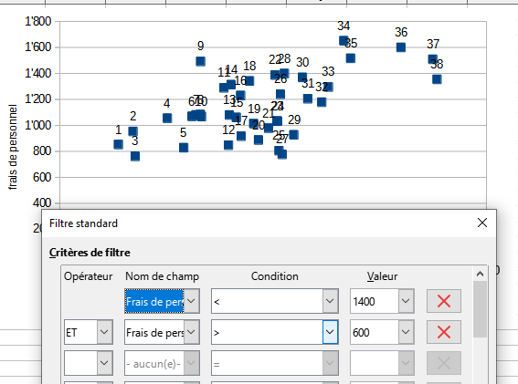
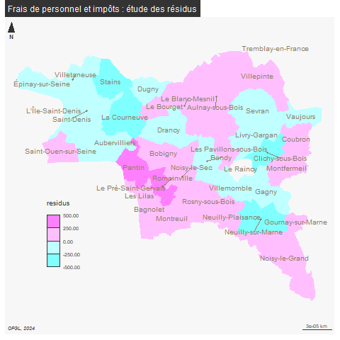

```{r setup, include=FALSE}
knitr::opts_chunk$set(echo = TRUE)
knitr::opts_chunk$set(eval = TRUE)
```

# Données d'exemple

On travaille à présent sur un croisement de deux agrégats financiers. On récupère la donnée à partir de l'interface [les données de l'ofgl](https://data.ofgl.fr/explore/?exclude.theme=INTERNE&disjunctive.theme&disjunctive.publisher&disjunctive.keyword&sort=title) plutôt que celle de *la cartographie*.


Enoncer les hypothèses possibles de la comparaison, attention variable explicative (X) et à expliquer (Y)


Pour le cours, l'hypothèse est que la non maîtrise des frais de personnel (X) amène l'augmentation des impôts locaux (Y) sur le 93 (budgets).


Pour mémoire, l'hypothèse nulle (H~0~) est l'absence de relation entre impôts locaux et frais de personnel.


```{r, echo = F}
data <- read.csv("data/data93_2024.csv", fileEncoding = "UTF-8", dec =".")
noms <- names(table(data$Agrégat))
# filtre
data <- data [data$Agrégat %in% noms [c(36,38)], c(2,4,5)]
# mise en forme 1 colonne par agrégat
impots <- data [data$Agrégat == 'Impôts locaux',]
personnel <-  data [data$Agrégat == 'Frais de personnel',]
data <- merge(impots [,c(1,3)], personnel[,c(1,3)], by = "Nom.2024.Commune")
names(data) <- c("ville", "impots", "fraisPersonnel")
write.csv(data, "data/regression.csv", row.names = F)
```

# Nuage de points

## Quel agregat choisir ?

Quelle variable est liée aux frais de personnel (X) ?

```{r, echo=T}
data <- read.csv("data/data93_2024.csv", row.names = 1,dec = ",")
noms <- names(table(data$Agrégat))
png("img/agregatChoix.png", width = 2400, height = 2400, res = 100)
par(mfrow = c(8,8))
for (n in noms){
  tmp <- data [data$Agrégat==n,]
  jointure <- merge(tmp, personnel, by = "Nom.2024.Commune")
  plot(jointure$Montant.en...par.habitant.y,jointure$Montant.en...par.habitant.x,  xlab = "Frais de personnel", ylab = n, col="coral", pch =  16)
}
dev.off()
```


Attention, encore une fois, variable explicative et expliquée.


## Savoirs faire tableur


Mise en forme du tableau 

- tcd le fameux *tableau croisé dynamique* (données table dynamique dans Calc)


- sélectionner uniquement les 2 colonnes de données (filtre sur tcd)


- types de diagramme ; xy - dispersion


Attention, le diagramme ne s'affiche pas correctement à partir du tcd, il faut faire une copie des deux variables.

## Simplification des chiffres

### Redéfinition des bornes

Retour sur les distributions pour enlever les valeurs aberrantes

```{r}
hist(personnel$Montant.en...par.habitant)
hist(impots$Montant.en...par.habitant)
```

On recherche des bornes permettant d'avoir un nuage de points "cohérent".
Avec le tableur, on fait le graphique puis on ajuste avec le filtre au niveau de la donnée.

Le graphique se met automatiquement à jour




#### Filtre sous R

```{r}
data <- read.csv("data/regression.csv", fileEncoding = "UTF-8")
sel <- data [(data$fraisPersonnel>600 & data$fraisPersonnel<1400) ,]
par(mfrow = c(1,2))
plot(data$fraisPersonnel, data$impots)
plot(sel$fraisPersonnel, sel$impots)
```

Désormais, on travaille sur la sélection et la totalité de la série pour vérifier
que la restriction des bornes est utile.


# Droite de régression

La droite de régression minimise la somme des carrés des distances verticales entre chacun des points du nuage et la droite recherchée.

Pour une droite aX+b

- a (la pente) = covariance / variance X

- b (ordonnée de l'origine) = moyenne de Y - a * moyenne de X


La distance MP doit être minimale d'où le terme *droite des moindres carrées*


### Correction exercice droite de régression

#### Analyse : le message est passé


#### Vocabulaire


Les variables


Hypothèse nulle


#### Le graphique


### Droite de régression sous R

```{r, echo=TRUE}
par(mfrow = c(2,1))
plot(data$fraisPersonnel, data$impots, pch=20)
# modèle de régression
lm <- lm(data$impots~data$fraisPersonnel)
abline(lm, lty =2, lwd = 1, col = "red")
text( data$fraisPersonnel, data$impots,labels = as.character(row.names(sel))
      , cex=0.6, pos = 2)
# Pour la sélection
plot(sel$fraisPersonnel, sel$impots, pch=20)
# modèle de régression
lm <- lm(sel$impots~sel$fraisPersonnel)
abline(lm, lty =2, lwd = 1, col = "red")
text( sel$fraisPersonnel, sel$impots,labels = as.character(row.names(sel))
      , cex=0.6, pos = 1, pch = 19)
```


### Dans Calc

Dans Calc, cliquer sur les points et insérer courbe de tendance
(Trouver comment afficher l'équation de la droite.)


Visuellement, on voit bien qu'il existe un lien entre les deux variables, mais il y a beaucoup de points éparses (les résidus)

Il s'agit maintenant de mesurer précisemment l'intensité du lien à l'aide de calculs.

# Intensité du lien : covariance et coefficient de Bravais-Pearson

Savoir-faire tableur : utiliser les noms pour les colonnes


### Premier temps

On rajoute des colonnes pour chaque variable :

- écart à la moyenne

- carré ( = *distance* plutôt que *différence*)

et pour les deux variables

- produit des écarts (pour étudier le rapport entre 2 variables, techniquement on utilise une division ou une multiplication)

### Deuxième temps

Dans un nouveau tableau, pour chaque variable

- moyenne

- carré de la somme des écarts à la moyenne 

- Variance

- Ecart type

puis covariance (produit des écarts / nb de valeurs)

et coeff (cov / produit des écarts types)


### Interprétation

Le coefficient évolue de -1 à +1

- Si r = 0, les variables ne sont pas corrélées.

- Dans les autres cas, les variables sont corrélées négativement ou positivement.

- plus la variable est proche de 1, plus l'intensité de la relation entre les deux variables est forte.

Dans notre exemple, lien assez fort

```{r}
varCorr <- data [, c( "fraisPersonnel", "impots")]
cor(varCorr)
# Et avec la sélection
varCorr <- sel [, c( "fraisPersonnel", "impots")]
cor(varCorr)
```

Le coefficient est plus fort si les deux valeurs extrêmes, Rosny et Tremblay sont conservées.

# Coefficient de détermination

C'est le carré du coefficient de corrélation linéaire

```{r}
cor(varCorr)^2
```


Les frais du personnel explique 35 % du montant des impôts dans le meilleur des cas.

Les 75 % restant sont liés à d'autres facteurs.

# Etude des résidus


Identifiez graphiquement 2 points isolés de la droite de régression.

Dans notre exemple, ce sont les ville 28 et 30

```{r}
sel [c(30,6),]
```


A Rosny sous Bois, les frais de personnel sont bas mais les impôt sont élévés.
A Clichy sous Bois, les frais de personnel sont élévés mais les impots sont bas.


# Cartographie des résidus


```{r, eval=F}
library(sf)
communes <- st_read("data/communes93.geojson")
communes <- communes [!is.na(communes$ref.INSEE), c("name", "ref.INSEE")]
```


```{r, eval=FALSE}
residus <- lm$residuals
hist(residus)
sel <- cbind(sel, residus)
# on calcule les résidus
jointure <- merge(communes, sel, by.x = "name", by.y = "ville")
summary(jointure$residus)
```

```{r, eval=FALSE}
library(mapsf)
png("img/residusCarte.png")
mf_map(jointure, var = "residus", type="choro", breaks = c(-500, -250,0,250,500), pal = cm.colors(4), border = NA, leg_pos = c(2.31589950651953, 48.8793057936166) )
mf_label(communes, var = "name", overlap = FALSE, col= "wheat4", cex = 0.8)
mf_layout("Frais de personnel et impôts : étude des résidus", credits = "OFGL, 2024")
dev.off()
```




Tremblay et Rosny sous Bois sont écartées, elles représentaient des extrêmes.

Les villes dans les teintes les plus foncées s'éloignent le plus du modèle.


