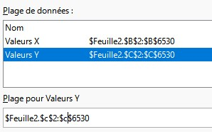
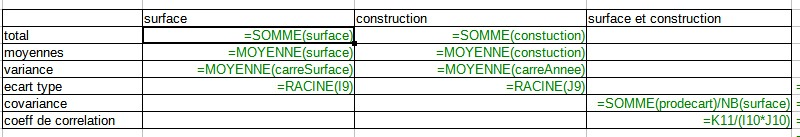
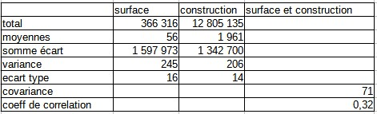
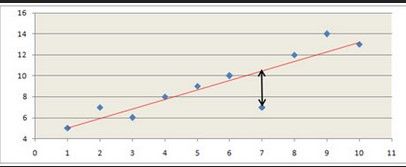
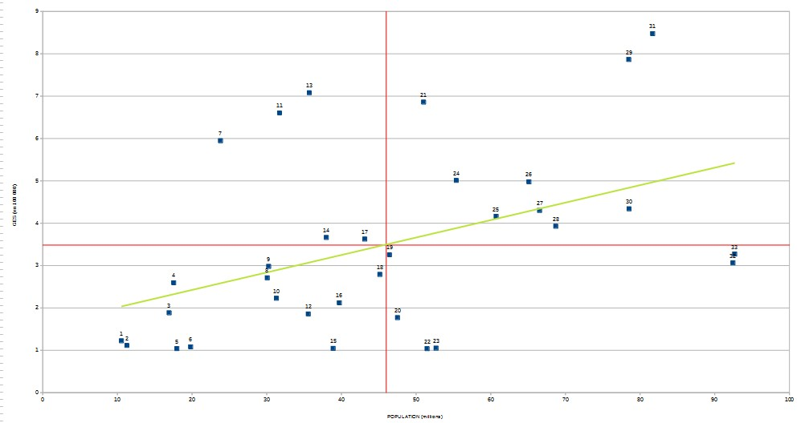

```{r setup, include=FALSE}
knitr::opts_chunk$set(echo = FALSE)
```

# Données d'exemple

Toujours les mêmes, mais il s'agit d'avoir deux variables continues, on va prend année et surface.

Comprendre les variables

Enoncer les hypothèses possibles de la comparaison, attention variable explicative (Y) et à expliquer (X)

(cf moodle exercice *Introduction =régression*)


```{r}
data <- read.csv("data/rpls2019.csv", fileEncoding = "UTF-8", dec =".")
data <- data [, c("SURFHAB","CONSTRUCT", "COMPLGEO","X","Y")] 
summary(data)
write.csv(na.omit(data), "data/rplsSurfConst.csv")
```

# Nuage de points

## Quelle représentation ?

```{r, echo=F}
data <- read.csv("data/rplsSurfConst.csv")
plot(data$SURFHAB, data$CONSTRUCT)
```

...ou...

```{r}
plot(data$CONSTRUCT, data$SURFHAB)
```

variable explicative et expliquée.

## Savoirs faire tableur

- sélectionner uniquement les 2 colonnes de données

- types de diagramme ; xy - dispersion

- intervertir x et y (onglet série de données) 




## Simplification des chiffres

### Redéfinition des bornes

Retour sur les distributions pour enlever les valeurs aberrantes

```{r}
hist(data$SURFHAB)
hist(data$CONSTRUCT)
```

On recherche des bornes permettant d'avoir un nuage de points "cohérent".
Avec le tableur, on fait le graphique puis on ajuste avec le filtre.

```{r}
data <- data [data$SURFHAB %in% c(20:120) ,]
data <- data [data$CONSTRUCT > 1930,]
plot(data$CONSTRUCT, data$SURFHAB)
```


# Droite de régression

La droite de régression minimise la somme des carrés des distances verticales entre chacun des points du nuage et la droite recherchée.

Pour une droite aX+b

- a (la pente) = covariance / variance X

- b (ordonnée de l'origine) = moyenne de y - a * moyenne de y


```{r}
plot(data$CONSTRUCT, data$SURFHAB)
lm <- lm(data$SURFHAB~data$CONSTRUCT)
abline(lm, lty =2, lwd = 1, col = "red")
```


Dans calc, cliquer sur les points et insérer courbe de tendance
(on peut également afficher l'équation de la droite.)

Visuellement, on voit bien qu'il existe un lien entre les deux variables, mais la pente de la droite n'est pas très forte. 

Il s'agit maintenant de mesurer précisemment l'intensité du lien à l'aide de calculs.

# Intensité du lien : covariance et coefficient de Bravais-Pearson

Savoir-faire tableur : utiliser les noms pour les colonnes construction et surface etc...


### Premier temps

On rajoute des colonnes pour chaque variable:
- écart à la moyenne
- carré
et pour les deux variables
- produit des écarts

### Deuxième temps

Dans un nouveau tableau, pour chaque variable
- moyenne
- carré de la somme des écarts à la moyenne 
- Variance
- Ecart type

puis covariance (produit des écarts / nb de valeurs)

et coeff (cov / produit des écarts types)





### Interprétation

Le coefficient évolue de -1 à +1

- Si r = 0, les variables ne sont pas corrélées.

- Dans les autres cas, les variables sont corrélées négativement ou positivement.


- plus la variable est proche de 1, plus l'intensité de la relation entre les deux variables est forte.

Dans notre exemple, lien moyen.

```{r}
varCorr <- data [, c( "SURFHAB", "CONSTRUCT")]
cor(varCorr)
```


# Coefficient de détermination

C'est le carré du coefficient de corrélation linéaire

```{r}
cor(varCorr)^2
```


La surface habitable explique environ 10 % de l'année de construction.

Les 90 % restant sont liés à d'autres facteurs.

# Etude des résidus




Identifiez graphiquement 2 points éloignés de la droite de régression et tenter un 
commentaire.



# cartographie des résidus

```{r}
library(sf)
library(mapsf)
residus <- rstudent(lm)
hist(residus)
# on calcule les résidus
data <- cbind(data, residus)
datasf <- st_as_sf(data, coords = c("X","Y"), crs = 2154)
dataResidu <- datasf [datasf$residus < -2 | datasf$residus > + 2, drop = F]

zone <- st_read("data/logement.gpkg", "quartiersBailleurs", quiet = T)
mf_map(zone, border = "antiquewhite1", col = "antiquewhite3")
mf_map(datasf, pch = 20, col = "green", add = T)
mf_map(dataResidu, pch = 20, col = "red", add = T)
mf_legend(type = "typo", val = c("résidus", "residus remarquables"), title ="",
          pal = c("green", "red"))
mf_layout("année construction et surface appartement : étude des résidus", credits = "RPLS2019")
```


