```{r setup, include=FALSE}
knitr::opts_chunk$set(echo = FALSE)
knitr::opts_chunk$set(warning = FALSE)
knitr::opts_chunk$set(eval = TRUE)
```

# Déroulement

## Données d'exemple


hypothèse : relation entre les villes et les agrégats

Deux distributions de variables de catégorie.

## Différentes étapes

- Tableau de contingence

- calcul du khi2

- comparaison avec le khi2 théorique


# Tableau de contingence

Au sens anglais du terme, *ce qui peut exister*


## Création

Utiliser l'outil de table dynamique (dans le menu données) pour le créer

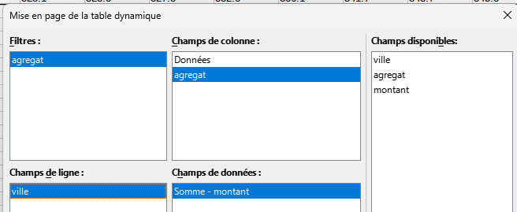

Résultat attendu :

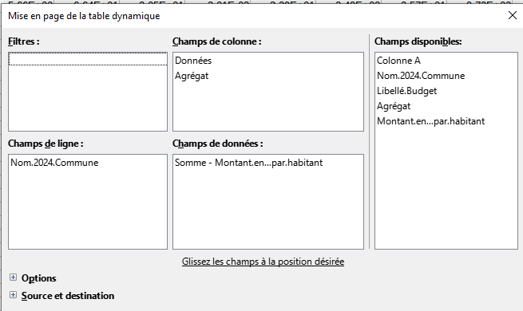


## Analyse d'un tableau de contingence

- Il faut présenter les sources, la structure et le contenu du tableau.

- Lister les questions susceptibles d'être posées, notamment en étudiant les fréquences conditionnelles


### Format conditionnel

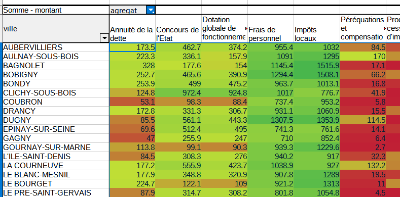

Cet outil est-il utile ici ?

### Fréquences conditionnelles en ligne et colonne

Pour pouvoir comparer les villes, chaque groupe est ramené à une même base
égale à 100.


savoir-faire tableur

- Objectif : saisir une seule cellule et étendre la formule.
quelle élément fixer, ligne ou colonne ?

- utilisation du %

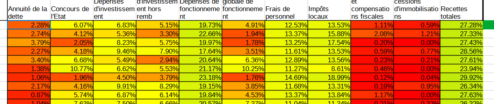

Analyse après avoir mis le format conditionnel.

- répartition des candidats puis lorsque ramené à une base 100, on peut comparer entre les zones.

- les écarts à la moyenne par candidat sont plus parlants

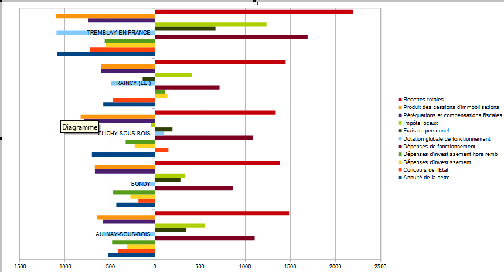

Qu'apporterait une étude des fréquences conditionnelles en colonnes ?

# Tableau de contingence : correction

## Manipulation du tableau

Il fallait travailler sur les élections 2022. 
Le tableau est présenté en longueur.

Pour pouvoir obtenir un tableau de contingence :

- Récupérer le nom de chaque candidat avec une formule


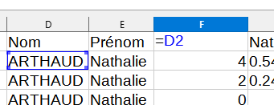
- faire une recopie incrémentée sur la droite

- transposer le tableau et faire une copie spéciale valeurs uniquement (CTRL + MAJ + V)

- poser un filtre et récupérer uniquement les noms des candidats

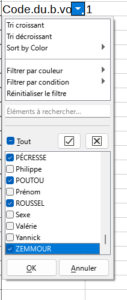

- ne pas oublier de faire un copier - coller du tableau final en transposant

## Correction rapide

### Description de la donnée

Il s'agit des résultats de la présidentielle sur 2022 à Bondy (chiffres du ministère de l'intérieur via data.gouv.fr)

La donnée comporte 2 variables :

- les 32 bureaux de vote
-  les 12 candidats

### Graphique

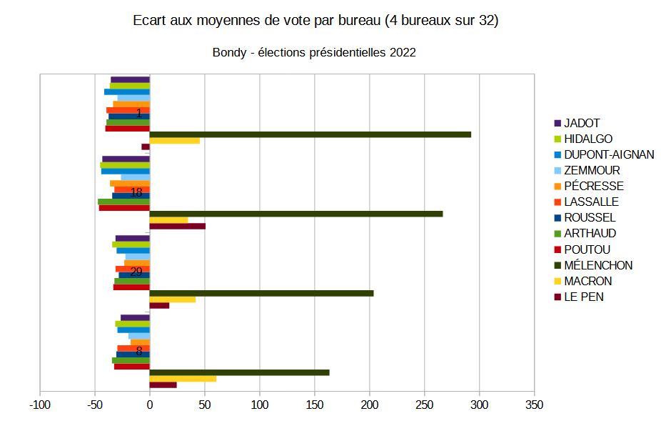

Remarquer le titre

au niveau de la présentation des séries, la boite de dialogue *plages de données* permet de classer les séries

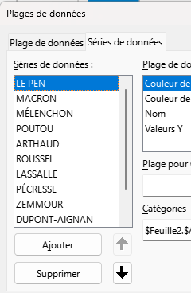

### Analyse

Sur les 12 candidats, 3 arrivent en tête dans tous les bureaux avec cependant un 
vote majoritaire pour Mélenchon dans l'échantillon des 4 bureaux. Les voies se répartissent de manière quasiment homogène sur les 9 autres candidats.
Même si les bureaux restent différents, les répartitions des votes se ressemblent. Les différences entre bureaux étaient plus marquées en 2002.


### Observations sur les villes choisies


```{r, eval =F}
library(sf)
data <- st_read("data/geo.gpkg", "data2022")
ind <- grep("^Voix", names(data))
data <- data [,c(1:4,ind)]
nb <-length(unique(data$INSEE_COM))
cog <-unique(data$INSEE_COM)
i <- 2
for (i in 1:nb) {
  tmp <- data [data$INSEE_COM == cog [i], ]
  tmp <- st_drop_geometry(tmp)
  apply(tmp, 1, sum)
}
```


# Khi2 : un exemple sur un dé truqué

Le dé est-il truqué ?

```{r}
face <- seq(1,6)
effectif <- c(15,7,4,11, 6, 17)
total <-  sum(effectif)
knitr::kable(data.frame(face,effectif))
```

Le nombre total de lancers est de 60.

## Hypothèse d'indépendance

hypothèse H0 : le dé n'est pas truqué (il y a indépendance entre la face et le
nombre de fois où elle sort)

## Effectifs théoriques

Sur le total des lancers (60), chaque face aurait pû sortir 10 fois.

```{r}
effectifThéorique <- rep (10,6)
df <- data.frame(face, effectif, effectifThéorique)
knitr::kable(df)
```

## Calcul du khi2

distance entre effectifs théoriques et observés

Elle se mesure avec le khi2

On calcule l'écart, puis le carré de cet écart et on pondère par l'effectif théorique.

```{r, echo = T}
(ecart <- df$effectif - df$effectifThéorique)
(distance <-  ecart^2)
(relatif <- distance / df$effectifThéorique)
(khi2 <- sum(relatif))
```

## Test du khi2

### Paramètres du test

- degré de liberté : 5

C'est le nombre de valeurs possibles -1 (car on peut déterminer la 6e valeur à partir des 5 autres)

- Pour un risque à 0,05 (5 chances sur 100 de se tromper)

### Résultat

Lecture dans la table du khi2

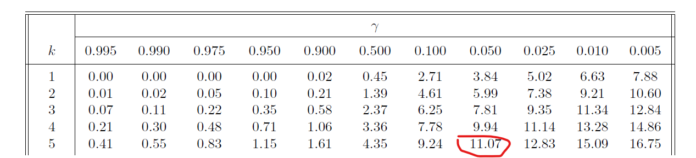
le khi2 théorique est de 11,7, il est donc inférieur au khi2 observé.

Quand le khi2 théorique est inférieur, le test est rejeté.

Le test est rejeté avec un risque de 5 % mais on aurait pu aller jusqu'au risque de 2.5 % (1 chance sur 25)

Donc, le dé est truqué.


# Mise en pratique sur les résultats des votes 2002


## Ennoncer l'hypothèse H0

La répartition des votes entre les différents candidats est indépendant du bureau de vote.

## Effectif théorique

La première case reçoit la formule :

- (total lg / total) * total colonne

C'est ce qu'on appelle également le produit des marges

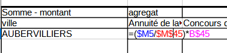


## Ecarts entre observés et théoriques

Que signifie une valeur zéro ?

Utiliser la notion

- sur représentation / sous représentation


Sur les bureaux 1 et 2, on observe une sur-représentation de Bayrou et une sous-représentation
de Taubira. (en principe, les bureaux 1 et 2 sont plutôt au centre ville)


## Le Khi2 

Le khi2 va permettre de valider le rejet de l'hypothèse d'indépendance.

rappel : métrique euclidienne plutôt que les valeurs absolues on utilise les carrés


### Le Khi2 partiel

- On met les écarts rapportés à la valeur théorique d'indépendance au carré (on mesure ainsi une *distance*)

- on divise par l'effectif théorique (on relativise)


### Le Khi2

C'est le total des khi2 partiels (dans notre exemple 768)


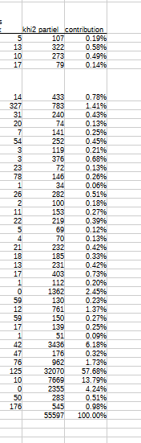

On définit :

- degré de liberté
lg -1 * col -1

16 candidats et 17 bureaux


- risque 1, 5 et 10 %

Sur internet, dans n'importe quelle table, on cherche les valeurs correspondantes.

https://jeanpaullaurent.fr/media/docetud/table_khi2_complete.pdf

Comme le nombre de degrés de liberté est important, on peut aussi utiliser la formule du tableur

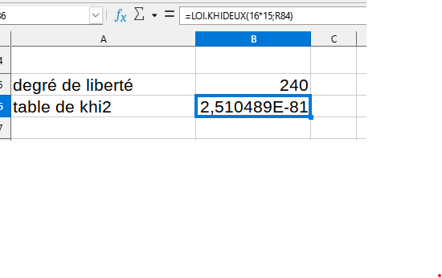


### Rejet de H0 ou pas


HO hypothèse d'indépendance. son rejet implique qu'il y a une relation.

Les variables bureau de vote et candidats ont une relation avec une marge d'erreur très faible puisque le khi2 augmente quand le risque d'erreur baisse.

Les logiciels de stats proposent le risque limite, la valeur de bascule entre le rejet et l'acceptation de l'hypothèse nulle.


# Correction exercice

Rappel de la consigne 

Sur votre commune, pour 2002 et 2022, recoder les données et faire le khi2 pour les 2 élections afin de montrer l'existence d'une relation entre les bureaux de vote et les tendances politiques.  Commenter les contributions au khi2 si c'est le cas.

rendu : un .pdf avec votre prénom comportant 

    - la justification du recodage
    
    - les 2 exemples de khi2 partiels,
    
    - les 2 tests d'indépendance,
    
    - et le commentaire.
    

Privilégier les termes : variable, catégorie, individu, distance, H0, indépendance, risque d’erreur.


## données 2022 et 2002

```{r}
tab2022 <- read.table("data/tabBondy2022.csv", row.names = 1,header = T, sep = ",", fileEncoding = "UTF-8")
tab2002 <- read.csv("data/bondy2002.csv")
tab2002 <- xtabs(tab2002$nb~tab2002$bv+tab2002$nom)
knitr::kable(head(tab2002), caption = "2002")
knitr::kable(head(tab2022), caption = "2022")
```

On remarque en passant que les ordres de grandeur des votes sont différents.
Il y a moins de voix exprimées en 2022 qu'en 2002.

## Recodage

Le recodage se fait entre petits et grands en fonction des résultats nationaux


```{r, echo=T}
names(tab2022) <- c("petit gauche", "petit gauche", "droite", "petit droit", "droite", "petit droit", "gauche", "petit gauche", "petit gauche", "petit droit",
                    "petit gauche", "petit droit")
categ <-unique(names(tab2022))
colnames(tab2002) <- c("petit droit", "petit gauche", "petit droit", "petit gauche", "droite", "petit gauche", "gauche", "gauche", "petit gauche", "droite", "petit gauche", "petit droit", "petit gauche", "petit droit", "petit droit", "gauche")
```


## Agrégation données

On somme les colonnes ayant le même terme, c'est une agrégation.

```{r}
# fonction pour sommer les colonnes correspondant au tendance
grouperCol <- function(col, tab){
  ind <-grep(col,colnames(tab))
  if (length(ind) > 1){
    v <- rowSums(tab [, ind])
  }else{
    v <- tab [,ind]
  }
  return(v)
}
# liste pour manipuler les 2 tableaux
nomTab <- c("tab2002", "tab2022")
ltab <- list(tab2002,tab2022)
for (i in c(1:2)){
tab <- ltab [[i]]  
df <- NULL
  for (j in  (1:4)){
    v <- grouperCol(categ [j], tab )
    df <- cbind(v, df)
  }
df <- as.data.frame(df)
names(df) <- rev(categ)
assign(nomTab [i], df)
}
write.table(tab2022,"data/tab2022Tendance.csv")
write.table(tab2002, "data/tab2002Tendance.csv")
```


```{r}
tendance2022 <- read.table("data/tab2022Tendance.csv")
tendance2002 <- read.table("data/tab2002Tendance.csv")
knitr::kable(head(tendance2022), caption = "Début 2022", row.names = T)
knitr::kable(head(tendance2002), caption = "Début 2002", row.names = T)
```


La différence d'ordre de grandeur est ici flagrante...

```{r}
tab <- list(tendance2002, tendance2022)
ltest <- lapply(tab, chisq.test)
names (ltest) <- c("election 2002","election 2022")
ltest
```

Mais il y a indépendance bureau de vote et candidats en 2002 comme en 2022.


## Analyse des khi2 partiels

Les tableaux pouvaient être affichés, mais on pouvait penser à afficher la distribution des khi2 partiel (en % du total)

```{r}
par(mfrow= c(2,1))
khi2Partiels <- function(test){
  res <- round(
    apply( (test$expected - test$observed) ^2/test$expected, 1,sum)
    ,0)
  resPtc <- (res / sum(res)) * 100
}
res <-lapply(ltest, khi2Partiels)
knitr::kable(res$`election 2002`, col.names = "khi2 partiel", caption = "2002", row.names = T)
knitr::kable(res$`election 2022`, col.names = "khi2 partiel", caption = "2022")
hist(res$`election 2002`, main = "2002", xlab = "contrib khi2 (%)", ylab = "Effectif")
hist(res$`election 2022`, main = "2022", xlab = "contrib khi2 (%)", ylab = "Effectif")
```

Dans les deux cas, il y a beaucoup de bureaux qui sont proches de l'indépendance.
En 2002, la dispersion est plus importante. Donc 3 bureaux ont un profil très spécifiques.
En 2022, un seul bureau est important pour la spécificité des résultats de l'élection.
Il s'agit du bureau 5. La caractéristique est d'avoir une polarisation des voix de gauche par rapport aux autres bureaux bondynois.

```{r}
tendance2022 <- read.table("data/tab2022Tendance.csv")
tendance2022$b.vote <- rownames(tendance2022)
knitr::kable(tendance2022 [tendance2022$b.vote %in% c(5, 14, 24),] , row.names = F)
```

Le bureau 24 apporte une plus forte contribution au modèle observé que le bureau 14.
La droite représente 1/3 de la gauche et les petits candidats ont moins de voix.
Le bureau 14 est plus proche de l'indépendance, la droite représente la moitié de la gauche et les petits candidats ont un peu plus de voix.


# Complément cartographique


Une cartographie semble intéressante mais seuls les périmètres de 2022 sont connus.


```{r}
vecteur <- res$`election 2022`
df <- data.frame(bv = names(vecteur),
                 contrib = vecteur, row.names = NULL)
hist(df$contrib)
bks <- c(0,4,10, 16)
library(sf)
library(mapsf)
png("img/khi2Carte.png")
bv <- st_read("data/vote.gpkg", "bureauPolyZone", quiet=T)
jointure <- merge(bv, df, by.x ="numBureau", by.y="bv")
#jointure$num <- rownames(jointure)
mf_init(bv)
mf_map(jointure, type = "choro", border = "antiquewhite2", var = "contrib", breaks = bks ,leg_val_rnd = 0,add = T)
mf_label(jointure, var = "numBureau", overlap = FALSE, col= "white",bg ="black", halo = T, cex = 0.8)
mf_layout("Votes par bureau 2022 : contribution au chi2", credits = "data.gouv")
dev.off()
```

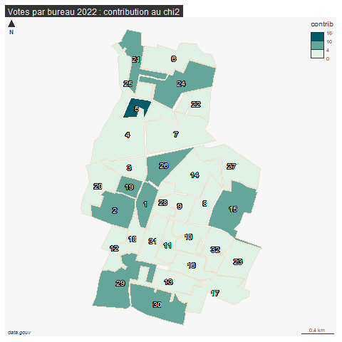

Cette carte permet de situer précisemment les bureaux qui s'écartent le plus de modèle bondinois, en l’occurrence, il s'agit d'abord du bureau 5. On peut imaginer soit un trucage de l'élection, soit les efforts d'un groupe militant spécifique.

Ce qui est intéressant ici est que ces bureaux sont situés sur l'ensemble du 
territoire de la commune, dans les zones pavillonnaires.


# En guise de conclusion : pourquoi le khi2 ?

## Les fréquences conditionnelles suffisent-t-elles ?

Comparaison des 2 tableaux

Fréquence conditionnelle en ligne


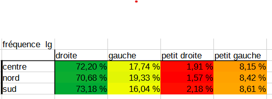


La distance entre les données observées et théoriques

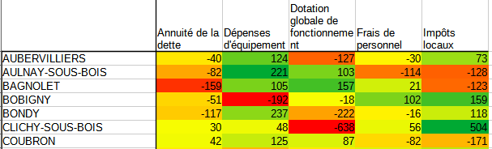

Estimation des écarts fondés sur la pondération des masses


