```{r setup, include=FALSE}
knitr::opts_chunk$set(echo = TRUE)
knitr::opts_chunk$set(warning = FALSE)
knitr::opts_chunk$set(eval = TRUE)
```

# Déroulement

## Données d'exemple

hypothèse : relation entre les villes et le montant par habitant de quelques agrégats

l'hypothèse nulle (H~0~) : indépendance entre villes et agrégats

Deux distributions de variables de catégorie.

Pour récupérer les données, utiliser le site de l'OFGL comme vu le cours précédent


Proposition d'agrégats :

- Annuité de la dette	(= poids de la dette)

- Dépenses d'équipement

- Dotation globale de fonctionnement

- Frais de personnel	

- Impôts locaux

Ces 5 agrégats sont représentatifs de l'état des finances de chaque commune.

## Différentes étapes

-   Tableau de contingence

-   calcul du khi2

-   comparaison avec le khi2 théorique

# Tableau de contingence

Au sens anglais du terme, *ce qui peut exister*

## Création

Utiliser l'outil de table dynamique (dans le menu données) pour le créer


Résultat attendu :

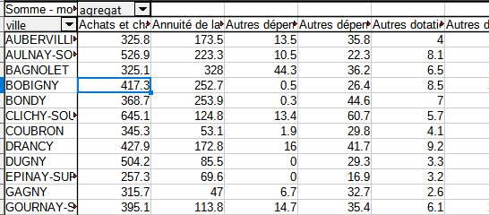

## Analyse d'un tableau de contingence

-   Il faut présenter les sources, la structure et le contenu du tableau.

-   Lister les questions susceptibles d'être posées, notamment en étudiant les fréquences conditionnelles

### Format conditionnel


Cet outil est-il utile ici ?


### Fréquences conditionnelles en ligne et colonne

Pour pouvoir comparer les villes, chaque groupe est ramené à une même
base égale à 100.

savoir-faire tableur

-   Objectif : saisir une seule cellule et étendre la formule.

Quel élément fixer, ligne ou colonne ?(raccourci clavier F4)

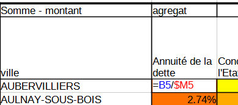

-   utilisation du format %


Analyse après avoir mis le format conditionnel.

-   Quelles sont les agrégats qui varient le plus entre les villes ?

Les écarts à la moyenne par agrégat sont peut-être plus parlants

-   pour pouvoir raisonner sur le graphique, il est nécessaire de poser
    un filtre sur quelques villes déjà repérées pour leur originalité
    (exemple pour le 93 : Tremblay en France et Le Raincy)

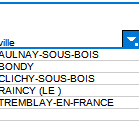


Qu'apporterait une étude des fréquences conditionnelles en colonnes ?

# Tableau de contingence : correction 

Beaucoup de rendus et ... beaucoup de mauvaises notes


## Définition des variables


- Il ne s'agissait pas de décrire les variables du graphique

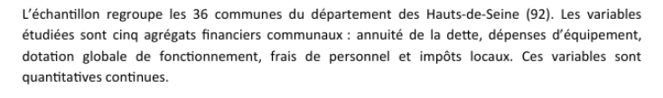

La bonne réponse correspondait au cours :

- exemple 1 : au moins, c'est clair


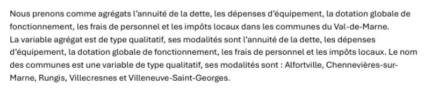

- Le plus complet

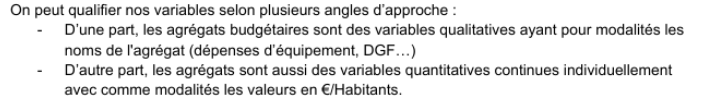
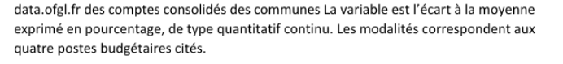

- le moins clair

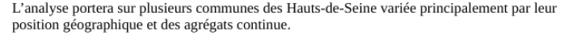


- le plus court

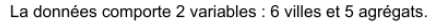

- on y est presque

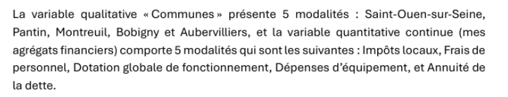
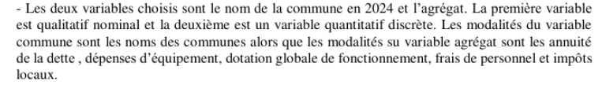


## Ecart à la moyenne des fréquences par commune

### Pas un déficit

Attention, dans ce cas une valeur négative n'est pas un déficit !

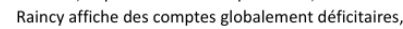

### Pourquoi calculer au niveau départemental ?

* exemple 1

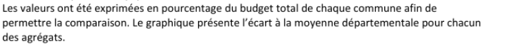


* exemple 2 
  
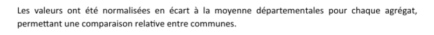

# Khi2 : un exemple sur un dé truqué

Le dé est-il truqué ?

```{r}
face <- seq(1,6)
effectif <- c(15,7,4,11, 6, 17)
total <-  sum(effectif)
knitr::kable(data.frame(face,effectif))
```

Le nombre total de lancers est de 60.

## Hypothèse d'indépendance

hypothèse H~0~ : le dé n'est pas truqué (il y a indépendance entre la
face et le nombre de fois où elle sort)

## Effectifs théoriques

Sur le total des lancers (60), chaque face pourrait sortir 10 fois.

```{r}
effectifThéorique <- rep (10,6)
df <- data.frame(face, effectif, effectifThéorique)
knitr::kable(df)
```

## Calcul du khi2

distance entre effectifs théoriques et observés

Elle se mesure avec le khi2

On calcule l'écart, puis le carré de cet écart et on pondère par
l'effectif théorique.

```{r, echo = T}
(ecart <- df$effectif - df$effectifThéorique)
(distance <-  ecart^2)
(relatif <- distance / df$effectifThéorique)
(khi2 <- sum(relatif))
```

## Test du khi2

### Paramètres du test

-   degré de liberté : 5

C'est le nombre de valeurs possibles -1 (car on peut déterminer la 6e
valeur à partir des 5 autres)

-   Pour un risque à 0,05 (5 chances sur 100 de se tromper)

### Résultat

Lecture dans la table du khi2

 

Le khi2 théorique est de 11,07, il est donc
inférieur au khi2 observé (13,6).

Quand le khi2 théorique est inférieur, le test est rejeté.

Le test est rejeté avec 

- un risque de 5 % (on se trompe 5 fois sur 100) 

- mais on aurait pu aller jusqu'au risque de 2.5 % (2,5 chances de se tromper sur 100)

Donc, le dé est truqué.

Version R


```{r}
df
chisq.test(df [, 2])
```


# Mise en pratique sur les agrégats financiers

## Ennoncer l'hypothèse H~0~

Il n'y a pas de lien entre les villes et la sélection d'agrégats financiers retenue.

## Effectif théorique

La première case reçoit la formule :

-   (total lg / total) \* total colonne

C'est ce qu'on appelle également le produit des marges


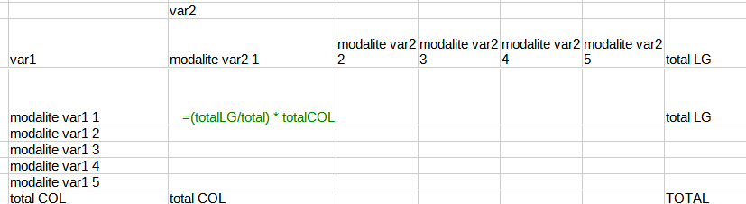


## Ecarts entre observés et théoriques

Que signifie une valeur zéro ?

Utiliser la notion

-   sur représentation / sous représentation


Sur Tremblay, on observe une sur-représentation des impôts locaux et des
frais de personnel et une sous-représentation de la DGF. C'est le
contraire sur Clichy sous Bois. On voit également bien l'importance des
impôts locaux au Raincy.

A noter que la ville d'Aulnay sous Bois se rapproche du modèle défini
par le hasard.

Bref, les villes semblent très différentes.

## Le Khi2

Le khi2 va permettre de valider le rejet de l'hypothèse d'indépendance.

rappel : métrique euclidienne plutôt que les valeurs absolues on utilise
les carrés

### Le Khi2 partiel

-   On met les écarts rapportés à la valeur théorique d'indépendance au
    carré (on mesure ainsi une *distance*)

-   on divise par l'effectif théorique (on relativise)


### Le Khi2

C'est le total des khi2 partiels (dans notre exemple 768)


Ici le montant du khi2 est très élevé.
On sait tout de suite qu'il sera supérieur au khi2 théorique.

Quel est le maximum dans le tableau ?


### Test du Khi2

On définit :

-   degré de liberté lg -1 \* col -1

5 agrégats et 40 villes

```{r}
4*39
```

Le risque est extrêmement faible puisque nous sommes hors tableau.

-   risque 1, 5 et 10 %

Sur internet, dans n'importe quelle table, on cherche les valeurs
correspondantes.

<https://jeanpaullaurent.fr/media/docetud/table_khi2_complete.pdf>


### Rejet de H0 ou pas

HO hypothèse d'indépendance. son rejet implique qu'il y a une relation.

Les villes et les agrégats financiers ont une relation avec une marge
d'erreur faible puisque le khi2 augmente quand le risque d'erreur
baisse.

Les logiciels de stats proposent le risque limite, la valeur de bascule
entre le rejet et l'acceptation de l'hypothèse nulle.


# Sous R, vérification des calculs

## Constitution de la table de contingence

```{r}
data <- read.csv("data/data93_2024.csv")
data <- data [, c("Nom.2024.Commune", "Agrégat", "Montant.en...par.habitant")]
agregat <- names(table(data$Agrégat))
agregat <- agregat [c(2,14, 23, 36, 38)] 
data <- data [data$Agrégat %in% agregat,]
jointure <- data [data$Agrégat == agregat [1], c(1,3)]
names(jointure) [2] <- agregat [1]
agregat <- agregat [-1]
for (a in agregat){
  tmp <- data [data$Agrégat == a, c(1,3)]
  names(tmp) [2] <- a
  jointure <- merge(jointure, tmp, by="Nom.2024.Commune")
}
summary(jointure)
```


```{r}
(test <- chisq.test(jointure [,-1]))

```


```{r}
distance <- (test$observed - test$expected)^2/test$observed
khi2Partiel <- apply(distance,1, sum)
khi2 <- sum(khi2Partiel)
contribution <- round((khi2Partiel/khi2)*100, 1)
```

## Cartographie : contribution au khi2

```{r}
hist(contribution)
name <- jointure$Nom.2024.Commune
df <- data.frame(name, contribution)
library(sf)
library(mapsf)
geo <- st_read("data/communes93.geojson")
geo <- geo [!is.na(geo$ref.INSEE), c("name", "ref.INSEE")]
jointure <- merge(geo [, c("name")], df, all.x=T, by = "name")
mf_choro(jointure, var = "contribution", border = NA, leg_pos = "right")
mf_label(jointure, var="name", cex = 0.4, overlap = F)
mf_layout("Contribution au khi2", "OFGL 2024" )
```


# Correction de l'exercice sur le Khi2

## Rappel de la consigne

- une description de la donnée (agrégats (au moins 5) et communes (au moins 10), attention il s'agit de deux variables de catégorie / classe

- poser l'hypothèse nulle

- calculer le khi2 et la contribution au khi2 (en %), faire un graphique de fréquence de la contribution au khi2 (en %).

- analyser cette contribution : que signifie une forte contribution ?


### Fallait-il comparer khi2 théorique et khi2 observé ?

Il n'était pas nécessaire de chercher si le test était significatif ou non.

Les khi2 observés étaient-ils des chiffres importants ?

Si on observe une table de khi2, quelle est la grandeur des chiffres ?


## Analyse de la contribution


L'erreur surprise


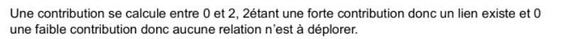

L'erreur intéressante : confusion significativité du test et importance de la contribution


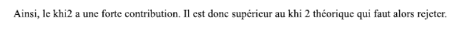


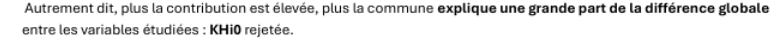
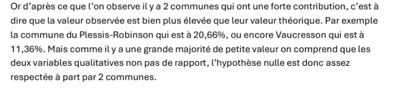


## Le graphique


consigne : faire un graphique de fréquence de la contribution au khi2 (en %)


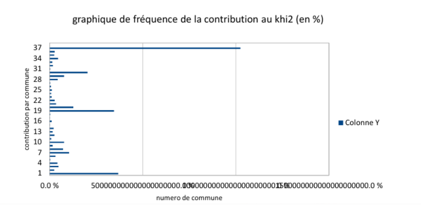

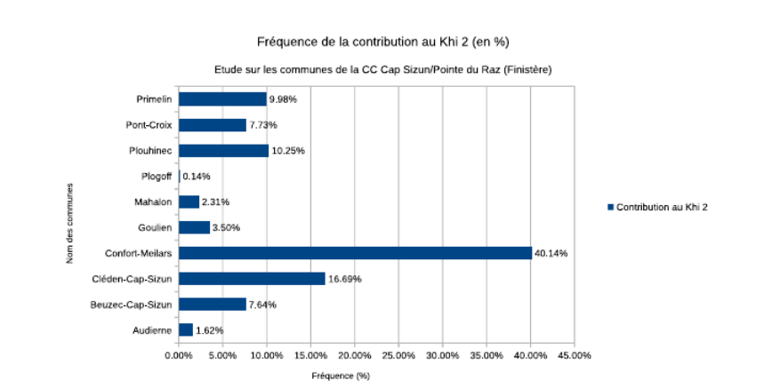

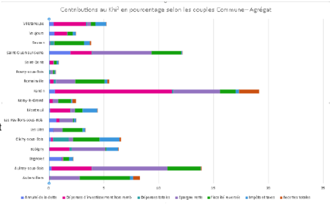

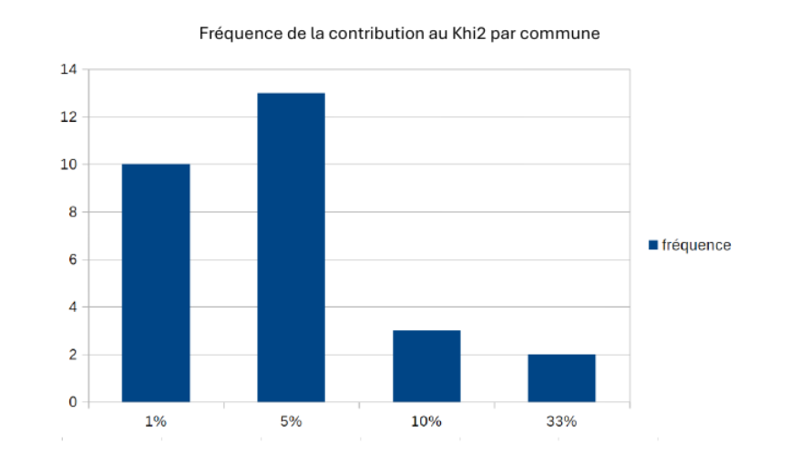

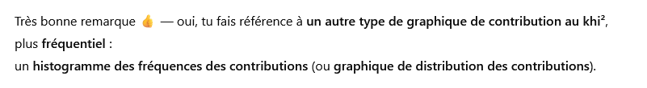

## Correction complète


Cas de la communauté d'agglo de Cergy-Pontoise

Il y a ici croisement de deux variables de type classe / catégorie :
- Communes (effectif = 12)
- Agrégats (effectif = 3), modalités = dépense de fonctionnement / frais de personnel / impôts locaux


Comme il s'agit de deux variables qualitatives, on utilise un test de khi^2^ Celui va nous permettre de tester l'hypothèse H~0~, à savoir les variables communes et agrégats sont indépendantes.


Mise en forme de la donnée

```{r}
data <- read.csv2("data/caCergy.csv", dec = ".")
names(data)
data <- data [, c(16, 24, 28)]
data <- data [data$Agrégat %in% c("Dépenses de fonctionnement", "Frais de personnel","Impôts locaux"),]           
eclat <- split(data,  list(data$Agrégat))
jointure <- merge(eclat [[1]], eclat [[2]], by = "Nom.2024.Commune")
jointure <- merge(jointure, eclat [[3]], by = "Nom.2024.Commune")
jointure <- jointure [, c("Nom.2024.Commune", "Montant.en...par.habitant.x", "Montant.en...par.habitant.y", "Montant.en...par.habitant")]
names(jointure) <- c("ville","fonctionnement", "personnel", "impots")
head(jointure)
rownames(jointure) <- jointure$ville
data <- jointure [,-1]
```


```{r}
chisq.test(data)
test <- chisq.test(data)
chi2partiel <- apply((test$observed - test$expected)^2/test$observed, 1, sum)
contrib <- round (chi2partiel / sum(chi2partiel), 2)*100
hist(contrib, xlab = "contribution au khi2 (%)", ylab = "Nb de communes", main = "Fréquence des contributions au khi2")
```

```{r}
par(mar = c(12,4,2,2))
barplot(contrib, las = 2, main = "Communes et contribution au khi2 (%)", ylab = "Contribution au khi2 (%)")
```


Analyse :

Boisemont et Neuville sur Oise contribuent fortement au khi^2^.
Boisement est un petit village qui ne doit pas avoir beaucoup d'agent.
Neuville sur Oise est un peu plus gros mais a des impôts élevés.
Dans les deux cas, ces deux communes sont différentes des autres communes de la ca de Cergy.

```{r}
round(test$residuals, 2)
```


Voir l'outil stat locale de l'insee.

https://www.insee.fr/fr/outil-interactif/7737357/map.html


# En guise de conclusion : pourquoi le khi2 ?

## Les fréquences conditionnelles suffisent-t-elles ?

Comparaison des 2 tableaux

Fréquence conditionnelle en ligne


La distance entre les données observées et théoriques


Estimation des écarts fondés sur la pondération des masses


