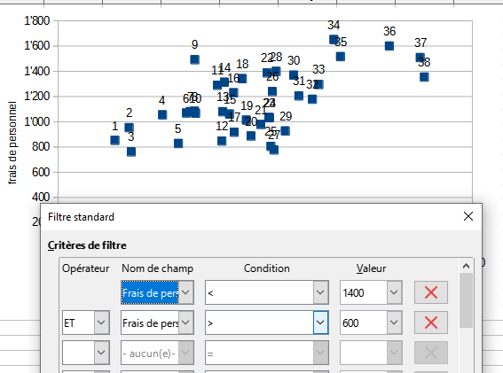
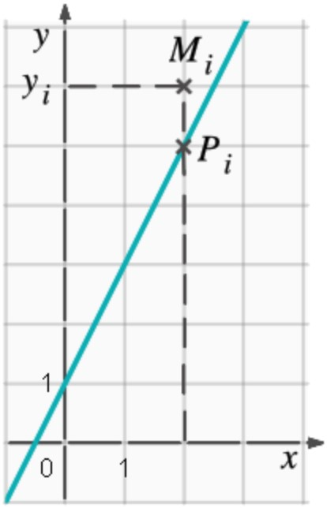
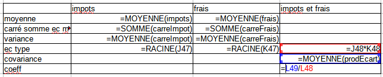
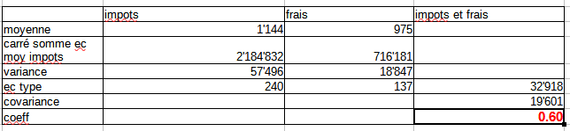
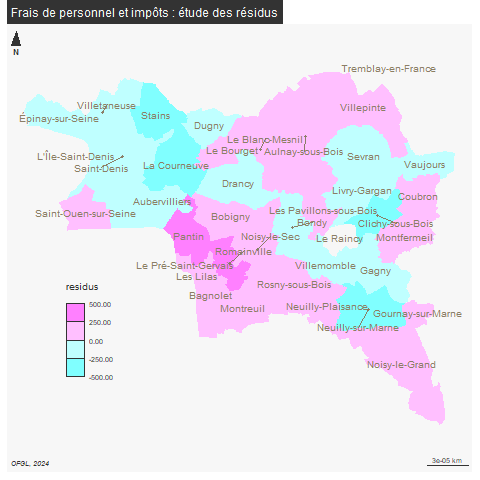

```{r setup, include=FALSE}
knitr::opts_chunk$set(echo = FALSE)
knitr::opts_chunk$set(eval = TRUE)
```

# Données d'exemple

On travaille à présent sur les suffrages exprimés et l'abstention.

Comprendre les variables

Enoncer les hypothèses possibles de la comparaison, attention variable explicative (X) et à expliquer (Y)

(cf moodle exercice *Introduction =régression*)


```{r}
data <- read.csv("data/bondy2022.csv", fileEncoding = "UTF-8", dec =".")
names(data)
ind <- grep("^Voix",names(data))
ind <- c(ind, 8,10)
data <- data [, c(ind)] 
candidats <- c("ARTHAUD",	"ROUSSEL",	"MACRON",	"LASSALLE",	"LE PEN",	"ZEMMOUR",	"MÉLENCHON",
                 "HIDALGO",	"JADOT",	"PÉCRESSE",	"POUTOU",	"DUPONT-AIGNAN")

names(data) [1:12] <- candidats
write.csv(data, "data/abs2022.csv")
```

# Nuage de points

## Quel candidat choisir ?

```{r, echo=F}
data <- read.csv("data/abs2022.csv", row.names = 1,dec = ",")
row.names(data) <- data$Code.du.b.vote
data <- data [,-13]
par(mfrow = c(3,4))
for (i in 1:12){
  plot(data$Abstentions, data [,i], xlab = "nb abst", ylab = "nb voix", main =  names (data)[i] )
}
```


variable explicative et expliquée.

```{r}
write.csv (data, "data/abstentions2022VF.csv")
```


## Savoirs faire tableur

- sélectionner uniquement les 2 colonnes de données

- types de diagramme ; xy - dispersion

- intervertir x et y (onglet série de données) 


## Simplification des chiffres

### Redéfinition des bornes

Retour sur les distributions pour enlever les valeurs aberrantes

```{r}
hist(data$Abstentions)
hist(data$ZEMMOUR)
```

On recherche des bornes permettant d'avoir un nuage de points "cohérent".
Avec le tableur, on fait le graphique puis on ajuste avec le filtre.

Le graphique se met automatiquement à jour



```{r}
sel <- data [data$Abstentions %in% c(150:300) ,]
sel <- sel [sel$ZEMMOUR %in% c(5:32),]
par(mfrow = c(1,2))
plot(data$Abstentions, data$ZEMMOUR)
plot(sel$Abstentions, sel$ZEMMOUR)
```

Désormais, on travaille sur la sélection et la totalité de la série pour vérifier
que la restriction des bornes est utile.


# Droite de régression

La droite de régression minimise la somme des carrés des distances verticales entre chacun des points du nuage et la droite recherchée.

Pour une droite aX+b

- a (la pente) = covariance / variance X

- b (ordonnée de l'origine) = moyenne de Y - a * moyenne de X


La distance MP doit être minimale d'où le terme *droite des moindres carrées*


```{r}
par(mfrow = c(2,1))
plot(data$Abstentions, data$ZEMMOUR)
# modèle de régression
lm <- lm(data$ZEMMOUR~data$Abstentions)
abline(lm, lty =2, lwd = 1, col = "red")
text( data$Abstentions, data$ZEMMOUR,labels = as.character(row.names(data))
      , cex=0.6, pos = 1)
# Pour la sélection
plot(sel$Abstentions, sel$ZEMMOUR)
# modèle de régression
lm2 <- lm(sel$ZEMMOUR~sel$Abstentions)
abline(lm2, lty =2, lwd = 1, col = "red")
text( sel$Abstentions, sel$ZEMMOUR,labels = as.character(row.names(sel)), 
      cex = 0.6,pos = 1)
```


Dans calc, cliquer sur les points et insérer courbe de tendance
(on peut également afficher l'équation de la droite.)

Visuellement, on voit bien qu'il existe un lien entre les deux variables, mais il y a beaucoup de points éparses (les résidus)

Il s'agit maintenant de mesurer précisemment l'intensité du lien à l'aide de calculs.

# Intensité du lien : covariance et coefficient de Bravais-Pearson

Savoir-faire tableur : utiliser les noms pour les colonnes


### Premier temps

On rajoute des colonnes pour chaque variable :

- écart à la moyenne

- carré ( = *distance* plutôt que *différence*)

et pour les deux variables

- produit des écarts (pour étudier le rapport entre 2 variables, techniquement on utilise une division ou une multiplication)

### Deuxième temps

Dans un nouveau tableau, pour chaque variable

- moyenne

- carré de la somme des écarts à la moyenne 

- Variance

- Ecart type

puis covariance (produit des écarts / nb de valeurs)

et coeff (cov / produit des écarts types)







### Interprétation

Le coefficient évolue de -1 à +1

- Si r = 0, les variables ne sont pas corrélées.

- Dans les autres cas, les variables sont corrélées négativement ou positivement.

- plus la variable est proche de 1, plus l'intensité de la relation entre les deux variables est forte.

Dans notre exemple, lien faible

```{r}
varCorr <- data [, c( "Abstentions", "ZEMMOUR")]
cor(varCorr)
# Et avec la sélection
varCorr <- sel [, c( "Abstentions", "ZEMMOUR")]
cor(varCorr)
```

Le coefficient augmente mais il reste faible même en ayant supprimé 13 observations.

# Coefficient de détermination

C'est le carré du coefficient de corrélation linéaire

```{r}
cor(varCorr)^2
```


L'abstention explique 19 % du vote pour Zemmour dans le meilleur des cas.
Cela reste très peu.

Les 81 % restant sont liés à d'autres facteurs.

# Etude des résidus


Identifiez graphiquement 2 points éloignés de la droite de régression.

Il peut s'agit par exemple des valeurs minimum et maximum des vote pour Zemmour.

Le bureau 5 apparaît une nouvelle fois confirmant son originalité. Le petit
nombre de voix pour Zemmour n'implique pas une grande abstention.

Pour le bureau 2,  l'abstention déja importante est à mettre en parallèle
avec le nombre maximum de voix pour Zemmour dans le cadre de ce bureau.


# cartographie des résidus


```{r, eval=F}
library(sf)
bv <- st_read("data/vote.gpkg", "bureauPolyZone")
```


```{r, eval=FALSE}
residus <- lm$residuals
hist(residus)
# on calcule les résidus
data <- cbind(bv, residus)
dataResidu <- data [data$residus < -5 | data$residus > + 5, drop = F]

```

```{r, eval=FALSE}
library(mapsf)
png("img/residusCarte.png")
mf_map(data, var = "residus", type="choro", breaks = c(-15, -5,0,10,30), pal = terrain.colors(4))
mf_label(bv, var = "numBureau", overlap = FALSE, col= "white",bg ="black", halo = T, cex = 0.8)
mf_layout("Abstention et Zemmour : étude des résidus", credits = "Ministère de l'intérieur; 2022")
dev.off()
```





