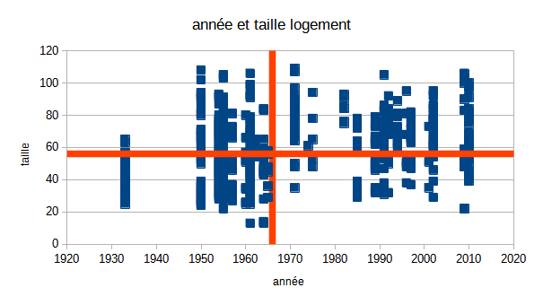

```{r setup, include=FALSE}
knitr::opts_chunk$set(echo = TRUE)
```

# Données d'exemple

Toujours les mêmes, mais il s'agit d'avoir deux variables continues, on va prendre
année et surface.

Comprendre les variables

Enoncer les hypothèses

De quel type sont les variables ?

```{r}
data <- read.csv("data/rplsBondy.csv")
data <- data [, c("SURFHAB","CONSTRUCT", "COMPLGEO")] 
summary(data)
write.csv(data, "data/rplsSurfConst.csv")
```

# Nuage de points

## Quelle présentation ?

```{r, echo=T}
plot(data$SURFHAB, data$CONSTRUCT)
```

...ou...

```{r}
plot(data$CONSTRUCT, data$SURFHAB)
```

## Savoirs faire tableur

- sélectionner uniquement les 2 colonnes de données

- types de diagramme ; xy - dispersion

- intervertir x et y (onglet série de données) : comprendre le rôle des deux variables


## Simplification des chiffres

### Redéfinition des bornes

Retour sur les distributions pour enlever les valeurs aberrantes

```{r}
hist(data$SURFHAB)

```

On recherche des bornes permettant d'avoir un nuage de points "cohérent".
Avec le tableur, on fait le graphique puis on ajuste avec le filtre.


# Intensité du lien

## Affichage des moyennes

Savoir-faire tableur : axes secondaires

Pour le premier : courbe valeur moyenne, pour le second axe secondaire



On observe les quadrants, ils permettent de déterminer le sens de la corrélation.

## Covariance et coefficient de Bravais-Pearson

Savoir-faire tableur : utiliser les noms pour les colonnes construction et surface


### Premier temps

On rajoute des colonnes pour chaque variable:
- écart à la moyenne
- carré
et pour les deux variables
- produit des écarts

### Deuxième temps

Dans un nouveau tableau, pour chaque variable
- moyenne
- somme des écarts à la moyenne 
- Variance
- Ecart type

puis covariance (produit des écarts / effectif)

et coeff (cov / produit des écarts types)


### Interprétation

Le coefficient évolue de -1 à +1

- Si r = 0, les variables ne sont pas corrélées.

- Dans les autres cas, les variables sont corrélées négativement ou positivement.


- plus la variable est proche de 1, plus l'intensité de la relation entre les deux variables est forte.

Dans notre exemple, lien moyen.

```{r}
varCorr <- data [, c( "SURFHAB", "CONSTRUCT")]
cor(varCorr)
```


# Droite de régression

La droite de régression minimise la somme des carrés des distances verticales entre chacun des points du nuage et la droite recherchée.

Pour une droite aX+b

- a (la pente) = covariance / variance X

- b (ordonnée de l'origine) = moyenne de y - a * moyenne de y


```{r}
plot(data$CONSTRUCT, data$SURFHAB, 
       xlim = c(1935,2022), ylim = c(c(0, 125)))
data <- data [data$SURFHAB < 120 | data$CONSTRUCT > 1935, ]
lm <- lm(data$SURFHAB~data$CONSTRUCT)
abline(lm, lty =2)
```


Dans calc, cliquer sur les points et insérer courbe de tendance


# Coefficient de détermination

C'est le carré du coefficient de corrélation linéaire

```{r}
cor(varCorr)^2
```


La surface habitable explique environ 10 % de l'année de construction.

Les 90 % restant sont liés à d'autres facteurs.

# Etude des résidus


Identifiez graphiquement 2 points éloignés de la droite de régression et tenter un 
commentaire.


