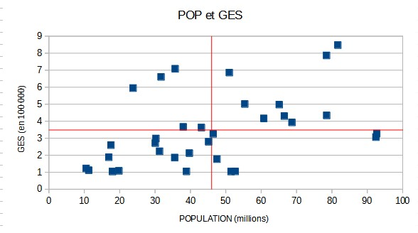

```{r setup, include=FALSE}
knitr::opts_chunk$set(echo = TRUE)
```

# Données d'exemple

https://databank.worldbank.org/indicator/SP.POP.TOTL/1ff4a498/Popular-Indicators
https://donnees.banquemondiale.org/indicator/EN.ATM.GHGT.KT.CE

Comprendre les variables

Enoncer les hypothèses

De quel type sont les variables ?

```{r}
pop <- read.csv("data/POPU.csv")
pop <- pop [pop$Series.Code =="SP.POP.TOTL", c(4,20)]
pop$X2015..YR2015. <- as.integer(pop$X2015..YR2015.)
pop <- pop[ !is.na(pop$X2015..YR2015.),]
ges <- read.csv("data/GES.csv", skip = 4)
ges <-  ges [, c("Country.Code", "X2015")]
ges <- ges [!is.na(ges$X2015),]
data <-  merge(ges, pop, by = "Country.Code")
names(data) <- c("code", "ges", "pop")
write.csv(data, "data/popges2015.csv")
```

# Nuage de points

```{r}
plot(data$pop, data$ges)
text(data$pop,data$ges,
     labels = row.names(data$code),
     cex = 0.6, pos = 4, col = "red")
```


## Simplification des chiffres

### Redéfinition des bornes

Retour sur les distributions pour enlever les valeurs aberrantes

```{r}
barplot(data$ges)
table(data$ges >  2* 10^6)
barplot(data$pop)
table(data$pop > 3* 10^8)
plot(data$pop, data$ges, 
       xlim = c(2*10^7,1.5*10^8), ylim = c(2*10^5, 2 * 10^6))
```

On recherche des bornes permettant d'avoir un nuage de points "cohérent".
Avec le tableur, on fait le graphique puis on ajuste avec le filtre.

### Changement d'unités

Le GES peut être divisé par 100 000 et la population par 1 000 000. Pourquoi ?



# Intensité du lien

## Affichage des moyennes

On observe les quadrants, ils permettent de déterminer le sens de la corrélation.

## Coefficient de Bravais-Pearson

Rajouter des colonnes pour calculer

- écarts à la moyenne (nb - moyenne du nb)
- carrés des écarts
- produit des écarts

Puis dans un nouveau tableau

- somme des écarts à la moyenne 
- Variance
- Ecart type

puis covariance (produit des écarts / effectif)

et coeff (cov / produit des écarts types)


Interprétation

Le coefficient évolue de -1 à +1

- Si r = 0, les variables ne sont pas corrélées.

- Dans les autres cas, les variables sont corrélées négativement ou positivement.


- plus la variable est proche de 1, plus l'intensité de la relation entre les deux variables est forte.

Dans notre exemple, lien moyen.

# Droite de régression

La droite de régression minimise la somme des carrés des distances verticales entre chacun des points du nuage et la droite recherchée.

Pour une droite aX+b

- a (la pente) = covariance / variance X

- b (ordonnée de l'origine) = moyenne de y - a * moyenne de y


Dans calc, cliquer sur les points et insérer courbe de tendance


# Coefficient de détermination

C'est le carré du coefficient de corrélation linéaire

La population explique environ 17 % de l'émission du gaz à effet de serre.

Les 83 % restant sont liés à d'autres facteurs.

# Etude des résidus


Identifiez deux pays et formuler une explication

