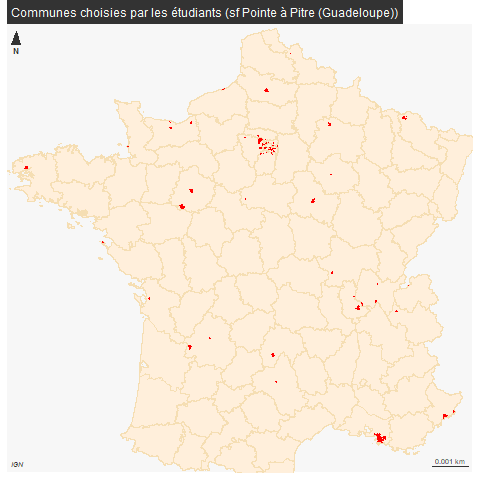

```{r setup, include=FALSE}
knitr::opts_chunk$set(echo = TRUE)
knitr::opts_chunk$set(eval = FALSE)
```

# Présentation des données


## Lecture du cog


```{r}
cog <- read.csv("data/cog.csv", fileEncoding = "UTF-8" , colClasses = "character")
```


Le cog permet d'avoir l'équivalent libellé ville / code INSEE
Il s'agit des 72 villes choisies par les étudiants, sur toute l'étendue du territoire.




## Les 4 sources proposées

```{r, eval = T}
data <- read.csv("data/examenVar.csv")
knitr::kable(data)
```

L'important c'est

```{r}
t <- t(data [1,])
t <- t [-1,]
knitr::kable(t, col.names = "lien donnée géométrie", row.names = F)
```


##  Base logement (IRIS)


### Extraction

```{r}
lgt <- read.csv("data/gros/lgt.csv", fileEncoding = "UTF-8")
```


###  Bondy


```{r}
bondy <- lgt [lgt$X.COM. == "93010",]
plot(bondy$P19_LOGVAC, bondy$P19_MAISON)
```


### Enregistrement par dpt

```{r}
lgt$dpt <- substring(lgt$COM,1,2)
dpt <- unique(lgt$dpt)
for (d in dpt){
  sel <- lgt [lgt$dpt == d,]
  write.csv2(sel [,-98], paste0("data/examen/lgt/", d, "_lgtEXAMEN.csv"), fileEncoding = "UTF-8", quote = c(1:3,5), row.names = F)
}
# on attend 31 fichiers
list.files("data/examen/lgt")
```


## Carreaux Filosofi


```{r}
library(sf)
library(mapsf)
car <- st_read("data/gros/carreaux_200m_met.gpkg")
# extraction du premier code insee du carreau
car$cog <- substring(car$lcog_geo,1,5)
carSel <- car [car$cog %in% cog$INSEE_COM,]
length(unique(carSel$cog))
```

toujours 61


Bondy


```{r}
bondy <- carSel [carSel$lcog_geo == '93010',]
plot(bondy$men_pauv, bondy$men_mais)
hist(bondy$men_pauv)
str(bondy)
```

Enregistrement des carreaux par commune

```{r}
valDpt <- unique(vfSel$Code.departement)
carSel$dpt <- substring(carSel$lcog_geo,1,2)
carSel <- carSel [,c(37,1:33), drop = T]
for (i in valDpt){
  sel <- carSel [carSel$dpt == i,]
  write.csv2(sel, paste0("data/examen/car/", i, "_carEXAMEN.csv"), fileEncoding = "UTF-8")
}
```

## Valeurs foncières


test bondy

```{r}
bondy <- vfSel [vfSel$cog == '93010',]
tab <- table(bondy$Valeur.fonciere)
hist(bondy$Valeur.fonciere)
table(bondy$Voie [bondy$Valeur.fonciere > 30000000])
barplot(table(bondy$Voie [bondy$Valeur.fonciere < 3000]), las = 2)
```

On enregistre le fichier.

```{r}
names(vfSel)
write.csv(vfSel [, c(48,1:43)], "data/gros/vfEXAMEN.csv", fileEncoding = "UTF-8")
```


on enregistre par dpt


```{r}
valDpt <- unique(vfSel$Code.departement)
for (i in valDpt){
  sel <- vfSel [vfSel$Code.departement == i,]
  write.csv2(sel [, c(48,1:43)], paste0("data/examen/vf/", i, "_vfEXAMEN.csv"), fileEncoding = "UTF-8")
}
```


# Corrections

## Généralités aux 3 groupes

Description des données et notamment de la base géographique


# Choix des variables


# Graphiques à commenter


## Groupe 1 logement

### Distribution du logement par nombre d'Iris


### Ecart observés / théoriques ancienneté logement par iris


### Distribution des khi2 partiels


### Régression


## Groupe 2 Filosofi


### Distribution du nb d'individus par carreaux


### Ecart observés / théoriques tranches d'age population par carreau


### Distribution des khi2 partiels


### Régression


