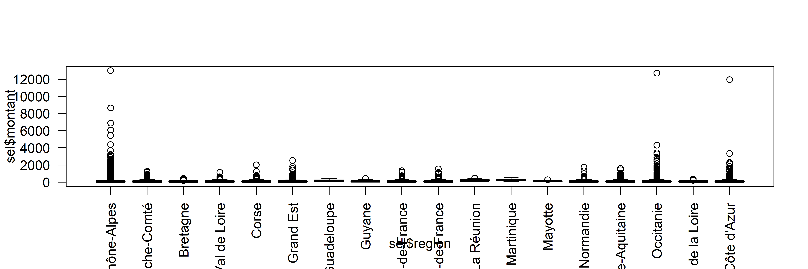

```{r setup, include=FALSE}
knitr::opts_chunk$set(echo = TRUE)
```

# Intro :  rappels divers

## Théorie

- le khi2, la régression, et la variance

- démarche générale 

Avec le khi2, on a vu surtout le test et sa significativité.

Avec la régression, on a abordé uniquement le coefficient de corrélation sans montrer le test.

Avec la variance, nous allons aborder test, significativité et intensité.

## Outils

- xls ou csv

- libre office ou R

# Donnée et objet de l'exercice


La variance est utilisée en géographie pour tester des groupements spatiaux.


## Hypothèse 

Nous allons étudier la relation entre une variable quantitative et une donnée géographique.

R va nous permettre de mettre en place la donnée d'exemple.

## Préparer la donnée

### Que faut-il faire ?

Choisir au moins deux entités administratives, pour nous, le 93 et le 92 et observer si
l'épargne nette est équivalente.

Il s'agit de l'épargne disponible pour financer l'investissement des collectivités.


### Remarques sur R

- opérateur d'assignation

- les accolades pour l'indexation

- le $ pour la variable

- la complétion avec tabulation


Parcours du script et exercice moodle pour voir si c'est compris.

### Le script


```{r}
# lecture du fichier. Quelle remarque faire ?
data <-  read.csv2("data/variance.csv", fileEncoding = "UTF-8", dec =".")
# on ne conserve que le montant par habitant
names (data)
# colonnes 6 et 22, 16 pour avoir le nom de la commune
sel <- data [, c(6,28,16)]
# liste des dpts
unique(sel$Nom.2024.Département)
# combien de communes  par dpt ?
table(sel$Nom.2024.Département)
# répartition des communes par dpt ok, on aura quasiment autant de valeurs pour le 92 et le 93
names (sel) <- c("dpt", "montant", "commune")
# on renomme les variables plus simplement
```


# Représentation graphique

## La commande boxplot

La boite à moustaches permet de comparer rapidement des distributions.
Les moustaches montrent les 1ers et 9e déciles. Les limites des boites correspondent au 1e et 3e quartile
Le trait indique la médiane.
Les valeurs aberrantes sont les points isolés.


```{r}
boxplot(sel$montant~sel$dpt )
# Un peu de couleur et des titres
boxplot(sel$montant~sel$dpt, xlab ="Département", ylab="montant épargne nette (euros par hbt)",
        col=rainbow(2))
# Affichage des moyennes sur les boites à moustache
moyenne <- tapply(sel$montant, sel$dpt, mean)
points(moyenne, pch = 2,  col="black", cex = 2)
```

Ce graphique permet de comparer 2 départements.
Les variations entre les groupes sont-elles plus importantes que les 
variations au sein des groupes eux-mêmes ?
A priori, dans le 92, l'amplitude est plus étendue. Les distributions sont très symétriques (la médiane semble au centre de la boite).
Il y a autant de communes avec une épargne nette basse qu'avec une épargne dette élevée.


Il existe une très forte valeur négative pour chacun des 2 départements.

```{r}
sel [sel$montant < 0,]
```

Les deux communes sont Le Plessis-Robinson pour le 92 et Le Bourget pour le 93

En fait, pour les Hauts de Seine, cette valeur décentre un peu la moyenne.

Mis à part l'amplitude, les deux départements se ressemblent.


## Correction exercice sur la boite à moustaches

Le but de l'exercice était d'utiliser un filtre permettant de faire une *jolie* boite
à moustaches.

Mais il s'agissait également de faire une rapide analyse en utilisant les noms des variables.

Pour cela, un premier exercice avait été fait en cours sur l'analyse faite en classe.
*Boîte à moustaches - analyse* (26 réponses sur 60 étudiants présents environ)


```{r}
data <- read.csv("data/boiteMoustacheCorrection.csv")
knitr::kable(t(data))
```


Globalement, les étudiants ont réussi à faire les 2 séries de boites à moustaches (avec
et sans filtre).

A noter, des étudiants qui utilisent un histogramme, et un autre qui n'a pas réussi à 
ouvrir correctement son fichier.

Le commentaire les plus intéressant :

- une opposition entre départements ruraux et département avec une grande métropole.


# La variance

## Rappel

Pour mémoire, la variance est la moyenne du carré des écarts à la moyenne.

Dans le tableur, nous aurions fait une série de tableaux de calcul autour des 
écarts à la moyennes (en mettant des carrés). Dans R, c'est une formule var.


## Calcul de la variance avec et sans la formule

Pour les 2 dpts

```{r}
var(sel$montant)
# Pour l'ensemble de la zone, sans formule
mean((sel$montant - mean(sel$montant))^2)
```

Le résultat est légèrement différent, car le logiciel pondère la variance en soustrayant 1 à l'effectif. Plus la série est grande, moins cela a d'importance.

Pour chaque dpt

```{r}
# on utilise un tapply
tapply(sel$montant, sel$dpt,var)
```

La variance est quatre fois plus importante dans le 92 que dans le 93.

# Analyse de la variance

Attention à bien distinguer la *variance* de la *variation*.

La première est la moyenne du carré des écarts, la seconde est juste la somme du carré des écarts.

La *variation* est une quantité qui se décompose en :

- les *variations* à l'intérieur de chaque groupe (variation intra groupe)

- les *variations* entre les groupes (variation inter groupe)

La variation totale est la somme des deux. La significativité et l'intensité sont calculées avec ces trois grandeurs.

significativité = rapport inter / intra

intensité = rapport inter / total

### La formule ANOVA dans R

ANalyse Ordinaire de la VAriance

Sous R, il suffit de lancer une formule.

```{r}
# transformation en variable de catégorie (une précaution)
sel$dpt <- as.factor(sel$dpt)
modele <- lm (montant ~ dpt, data = sel)
anova(modele)
test <- anova(modele)
```


Sum Sq = la somme des carrés des écarts (SCE)

Mean Sq =  la moyenne des carrés des écarts, c'est la variance sauf qu'au lieu de faire
une moyenne classique, on utilise *les degrés de liberté* pour le dénominateur.

Pour la variation intergroupe, il s'agit du nombre de groupes (dans notre cas, 92 et 93 -1)

Pour la variation intragroupe, l'effectif - le nombre de groupe.

```{r}
# le nombre de lignes pour les 2 dpts - le nb de dpt
length(sel$dpt) - length(unique(sel$dpt))
```


La première ligne (dpt) c'est pour la variation inter-groupe

La deuxième (Residuals) c'est pour l'intérieur des groupes (l'intra)

Que dire ce ces chiffres ?

Comme pour le khi2, on peut faire un test et calculer l'intensité.

### Significativité

F value = Test de Fisher, c'est le test de significativité pour l'analyse de la variance.

Le test est mesuré par le rapport entre la variation intergroupe et la variation intragroupe (avec les degrés de liberté).

Si ce rapport est élevé, cela signifie que la variation intergroupe est importante relativement à la variation intra, donc qu'il y a une vraie différence entre les écarts à la moyenne des groupes.


```{r}
# variation inter / variation intra.
test$`Mean Sq` [1] / test$`Mean Sq` [2]
test$`F value`
```

Plus la variation intra augmente, plus le rapport diminue, moins il y a de différence entre les groupes.


#### La table de fisher

Comme pour le khi2, on compare à un test obtenu par le hasard (donc une table).


F calculé

```{r}
Ftable <- qf(p=.05, df1=1, df2=74, lower.tail=FALSE)
Fcalcule <- test$`Mean Sq` [1] / test$`Mean Sq` [2]
Ftable
Fcalcule
```

Le F théorique est supérieur au F calculé pour un risque de 5 %

Il y a indépendance entre les départements et la distribution du montant de l'épargne nette.

#### Avec R, importance de la p-value

Le chiffre le plus rapide à analyser, c'est la p-value, il indique la taille de la différence entre les moyennes des 2 départements

Plus il est petit, plus il y a de différence, plus il est gros, plus les écarts aux moyennes se ressemblent et donc l'hypothèse d'indépendance peut être rejetée.

C'est la même logique que pour le khi2 (cf exemple khi2 dans l'introduction aux bivariées). 

Dans notre cas, la pvalue indique un risque important. Concrètement, il faudrait aller chercher la table du risque à  % de Fisher.

```{r}
qf(p=.5348, df1=1, df2=74, lower.tail=FALSE)
```


On a plus de 50 % de chance de se tromper si on rejette l'indépendance, il ne faut donc pas la rejeter.

93 92 ont une même répartition de la dette

###  Intensité

On mesure également l'intensité, la proportion de la variation expliquée par les modalités dans la variation totale (entre 0 et 1)

variation intergroupe / variation totale


```{r}
test$`Mean Sq` [1] / sum(test$`Mean Sq`)
```

L'intensité est faible, un plus d'un quart de la variation est expliquée par la structure spatiale.


# Exercices d'application


## Du département à la région

Le choix est fait de comparer les variations de chaque région.

### Hypothèse

Il s'agit d'observer s'il y a une variation entre les régions sur l'ensemble du pays au niveau de l'épargne.

L'hypothèse nulle, comme d'habitude, est qu'il n'y en a pas.

### Script

```{r}
data <- read.csv2("data/varianceSubention.csv", dec = ".")
sel <- data [,c(4,28)]
head(sel)
names(sel) <- c("region", "montant")
(tab <- table(sel$region))
# Que remarque t on au niveau du nombre de dpts par région ?
(region <- names(tab) [tab > 2000])
sel2 <- sel [sel$region %in% region,]
table(sel2$region)
```


```{r}
png("img/varianceRegion.png", width = 6000, height = 2000, res = 600)
boxplot(sel$montant~sel$region, las =2)
dev.off()
png("img/varianceRegion2.png", width = 6000, height = 2000, res = 600)
boxplot(sel2$montant~sel2$region, las =2)
dev.off()
```





```{r}
summary(sel2$montant)
sel3 <- sel2 [sel2$montant < 200 & sel2$montant > - 200,]
png("img/varianceRegion3.png", width = 6000, height = 2000, res = 600)
boxplot(sel3$montant~sel3$region, las=2, xlab = "")
dev.off()
```


```{r}
modele <- lm (montant ~ region, data = sel2)
anova(modele)
# Intensité
test <- anova(modele)
test$`Mean Sq` [1] / sum(test$`Mean Sq`)
```

L'échelon régional permet d'expliquer 96% de la variation de la dette, mais pas celui de département.
(Mais on a conservé uniquement les valeurs entre -200 et 200)


