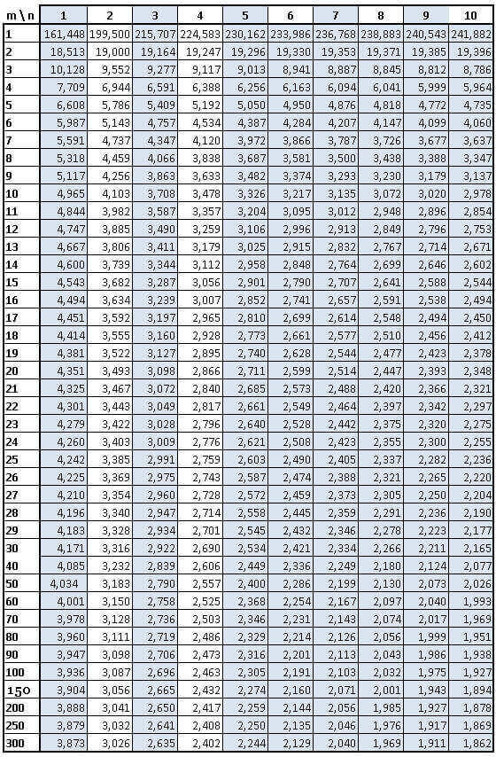

```{r setup, include=FALSE}
knitr::opts_chunk$set(echo = TRUE)
```

# Intro :  rappels divers

## Théorie

- le khi2, la régression, et la variance

- démarche générale 

Avec le khi2, on a vu surtout le test et sa significativité.

Avec la régression, on a abordé uniquement le coefficient de corrélation sans montrer le test.

Avec la variance, nous allons aborder test, significativité et intensité.

## Outils

- xls ou csv

- libre office ou R

# Donnée et objet de l'exercice

Suite à l'examen, on a 3 séries de données sous les iris (logement), les carreaux (revenus), et les parcelles cadastrales (valeurs fp,co_res)

On va tester s'il y a une répartition spatiale spécifique des éléments pour chacune de ces données. 

Nous allons d'abord examiner les valeurs foncières.

Notre exemple reste Bondy.

La variance est en effet très souvent utilisée en géographie pour tester des groupements spatiaux.


## Hypothèse 

Nous allons étudier la relation entre une variable quantitative et une donnée géographique .

R va nous permettre de mettre en place la donnée d'exemple.

## Préparer la donnée

### Que faut-il faire ?

Lire les fichiers, notament celui où est Bondy, le 93
Extraire la donnée quantitative la plus représentative
Enregistrer ce rapport dans un fichier


### Remarques sur R

- opérateur d'assignation

- les accolades

- la complétion avec tabulation


Parcours du script et exercice moodle pour voir si c'est compris.

### Le script


```{r}
# lecture du fichier. Quelle remarque faire ?
vf <-  read.csv2("data/examen/vf/93_vfEXAMEN.csv", fileEncoding = "UTF-8")
# extraction de Bondy
vf_Bondy <- vf [ vf$cog == '93010',]
str(vf_Bondy)
# on ne conserve que la valeur foncière
vf_Bondy <- vf_Bondy [, c("Section","Valeur.fonciere")]
# liste des sections
unique(vf_Bondy$Section)
# combien de valeurs foncières par section ?
table(vf_Bondy$Section)
# inégale répartition des valeurs foncières
```


# Représentation graphique

La boite à moustaches permet de comparer rapidement des distributions.
Les moustaches montrent les 1ers et 9e déciles. Les limites des boites correspondent au 1e et 3e quartile
Le trait indique la médiane.
Les valeurs aberrantes sont les points isolés.


Il s'agit d'obtenir un graphique lisible, pour cela, on filtre la donnée en fonction
des graphiques obtenus.

```{r}
boxplot(vf_Bondy$Valeur.fonciere~vf_Bondy$Section)
# Trop de sections, on va prendre uniquement les sections où il y a beaucoup de données.
# D'après le dénombrement
hist(table(vf_Bondy$Section))
# On décide de filtrer au dessus de la 1e borne 50
ind <- which((table(vf_Bondy$Section) > 50))
sectionSup50 <- names(ind)
vf_BondySup50 <- vf_Bondy [vf_Bondy$Section %in% sectionSup50,]
boxplot(vf_BondySup50$Valeur.fonciere~vf_BondySup50$Section)
# la section P et H  paraîssent des cas à part
vf_BondySup50_sansPH <- vf_BondySup50 [!(vf_BondySup50$Section %in%  c('P','H')),]
boxplot(vf_BondySup50_sansPH$Valeur.fonciere~vf_BondySup50_sansPH$Section)
# avec quelques options pour faire plus joli
# on décide de diviser la valeur foncière par 100 000 afin d'avoir moins de zéros.
vf_BondySup50_sansPH$Valeur.fonciere <- vf_BondySup50_sansPH$Valeur.fonciere / 100000
boxplot(vf_BondySup50_sansPH$Valeur.fonciere~vf_BondySup50_sansPH$Section, xlab ="Section", ylab="montant valeur foncière (centaines de milliers)",
        col=rainbow(8))
# Affichage des moyennes sur les boites à moustache
moyenne <- tapply(vf_BondySup50_sansPH$Valeur.fonciere, vf_BondySup50_sansPH$Section, mean)
points(moyenne, pch = 8,  col="black", cex = 2)
```

Ce graphique permet de comparer 7 sections.
Les variations entre les groupes sont-elles plus importantes que les 
variations au sein des groupes eux-mêmes ?
A priori, dans les sections AT et J, l'amplitude est très étendue et la distribution est très asymétrique (la médiane est quasiment au plancher de la boite).
Beaucoup de petites ventes, et quelques grosses ventes entre 50 M et 150 000.
Les sections A, AJ, B, G et M ont une distribution symétrique et une amplitude beaucoup plus faible.


Il existe une valeur aberrante dans la section AT

```{r}
hist(vf_BondySup50_sansPH$Valeur.fonciere [vf_BondySup50_sansPH$Section == "AT"],
     main = "Distribution montant valeur foncière section AT", xlab = "montant (centaines de milliers)", ylab = "effectif")
```

La section AT a une très grosse vente. 

On enregistre la donnée filtrée pour pouvoir repartir de cette donnée déjà plus cohérente
que la donnée d'origine.

```{r}
write.csv(vf_BondySup50_sansPH, "data/vf_BondySup50_sansPH.csv", fileEncoding = "UTF-8")
```


# La variance

## Rappel

Pour mémoire, la variance est le carré de la moyenne des écarts à la moyenne.

Dans le tableur, nous aurions fait une série de tableaux de calcul autour des 
écarts à la moyennes (en mettant des carrés). Dans r, c'est une formule var.

## Préparer la donnée

On repart de la donnée filtrée dans laquelle on a supprimée toutes les sections ayant moins de
50 ventes et P et H qui représentaient des profils trop particuliers.

```{r}
data <- read.csv("data/vf_BondySup50_sansPH.csv", fileEncoding = "UTF-8")
# pour être plus lisible, on a divisé les montants par 100 000
hist(data$Valeur.fonciere, xlab = "valeur foncière (en centaine de milliers", ylab = "nb de ventes")
boxplot(data$Valeur.fonciere)
# on supprime également les valeurs aberrantes
data <- data [data$Valeur.fonciere < 10,]
```

On applique un nouveau filtre

## Calcul de la variance avec et sans la formule

```{r}
var(data$Valeur.fonciere)
# Variance pour chaque zone, on utilise un tapply
tapply(data$Valeur.fonciere, data$Section,var)
# verif pour la section AT
sel <-  data[data$Section == 'AT',c("Section", "Valeur.fonciere")]
mean((sel$Valeur.fonciere - mean(sel$Valeur.fonciere))^2)
var(sel$Valeur.fonciere)
```

Le résultat est légèrement différent, car le logiciel pondère la variance en soustrayant 1 à l'effectif. Plus la série est grande, moins cela a d'importance.

## Analyse de la variance


Un nouveau graphique nous permet de comprendre en quoi la variance permet de comparer
des séries entre elles


```{r}
boxplot(data$Valeur.fonciere~ data$Section)
```

La variance est une quantité qui se décompose en :

- les variations à l'intérieur de chaque groupe (variation intra groupe)

- les variations entre les groupes (variation inter groupe)

La variation totale est la somme des deux. La significativité et l'intensité sont calculées avec ces trois grandeurs.

significativité = rapport inter / intra

intensité = rapport inter / total

### La formule ANOVA dans R

ANalyse Ordinaire de la VAriance

Sous R, il suffit de lancer une formule.

```{r}
# transformation en variable de catégorie (une précaution)
data$Section <- as.factor(data$Section)
modele <- lm (Valeur.fonciere ~ Section, data = data)
anova(modele)
```


Sum Sq = la somme des carrés des écarts (SCE)

Mean Sq =  la moyenne des carrés des écarts, c'est la variance.

La première ligne c'est pour la variation inter-groupe , la deuxième c'est pour l'intérieur des groupes (l'intra)

Que dire ce ces chiffres ?

Comme pour le khi2, on peut faire un test et calculer l'intensité.

### Significativité

F value = Test de Fisher, c'est le test de significativité pour la variance.

Le test est mesuré par le rapport entre la variation intergroupe et la variation intragroupe (avec les degrés de liberté).

Si ce rapport est élevé, cela signifie que la variation intergroupe est importante relativement à la variation intra, donc qu'il y a une vraie différence entre les écarts à la moyenne des groupes.


```{r}
# variation inter / variation intra.
383 / 17
# plus la variation intra augmente, plus le rapport diminue, moins il y a de différence entre les groupes.
```


Concernant les degré de liberté pour les données intra, on prend tous les effectifs et on enlève le nombre de sections (cf les 2 chiffres df)

```{r}
# toutes les valeurs foncières
eff <-length(data$Valeur.fonciere)
# toutes les sections
df1 <- length(unique(data$Section)) -1
df2 <- eff - length(unique(data$Section)) 
```


#### La table de fisher

Comme pour le khi2, on compare à un test obtenu par le hasard (donc une table).


F calculé

```{r}
Ftable <- qf(p=.05, df1=6, df2=518, lower.tail=FALSE)
Fcalcule <- 383 / 17
```

Le F théorique est inférieur au F calculé pour un risque de 5 %

Il n'y a donc pas indépendance entre les sections et la distribution du montant de la valeur foncière.

#### Avec R, importance de la p-value

Le chiffre le plus rapide à analyser, c'est la p-value, il indique la taille de la différence entre les moyennes des 5 sections.

Plus il est petit, plus il y a de différence, plus il est gros, plus les écarts aux moyennes se ressemblent et donc l'hypothèse d'indépendance peut être rejetée.

C'est la même logique que pour le khi2 (cf exemple khi2 dans l'introduction aux bivariées). 

Dans notre cas, la pvalue indique un risque très faible Concrètement, il faudrait aller chercher la table du risque à  % de Fisher.

```{r}
qf(p=2.2e-23, df1=6, df2=518, lower.tail=FALSE)
```


On a très peu chances de se tromper si on rejette l'indépendance, il faut donc la rejeter.

Les 7 sections correspondent à une répartition spécifique du montant de la valeur foncière. 

### Intensité

On mesure quand même l'intensité, la proportion de la variation expliquée par les modalités dans la variation totale (entre 0 et 1)

variation intergroupe / variation totale


```{r}
383/(383 + 17)
```

L'intensité est forte, plus de 95 % de la variation est expliquée par la structure spatiale.


# Exercices d'application

## Deux sections


On peut prendre les sections AT et J, au vu des boites à moustaches, la différence entre les 2 variances
est plus faible

```{r}
vf_Bondy_AT_J <- vf_BondySup50 [ vf_BondySup50$Section %in% c("AT", "J"),]
vf_Bondy_AT_J$Valeur.fonciere <- vf_Bondy_AT_J$Valeur.fonciere /100000
boxplot(vf_Bondy_AT_J$Valeur.fonciere~vf_Bondy_AT_J$Section, xlab ="Section", ylab="montant valeur foncière (centaines de milliers)",
        col=rainbow(2))

```


```{r}
# on renomme la donnée avec un nom plus simple et on divise par 100000
data <- vf_Bondy_AT_J
# transformation en variable de catégorie
data$Section <- as.factor(data$Section)
modele <- lm (Valeur.fonciere ~ Section, data = data)
anova(modele)
```


```{r}
#Ftable
qf(p=.05, df1=1, df2=173, lower.tail=FALSE)
qf(p=.28, df1=1, df2=173, lower.tail=FALSE)
```

Pour un risque de 5 %, le test est rejeté, il y a indépendance entre les sections.

Pour un risque de quasiment de 28 % il serait accepté...

## Les différents groupes et les notes

### Hypothèse

Il s'agit d'observer s'il y a une variation entre les groupes en terme de notation.
L'hypothèse est que le groupe 2 aura des meilleurs notes car le cours du groupe 1 sert de brouillon, et le groupe 3 digère.

#### Script

```{r,echo=FALSE, eval=FALSE}
note <- read.csv("data/noteExamen.csv")
summary(note$NOTE)
par(mfrow = c(2,1))
boxplot(note$NOTE~note$GROUPE)
modele <- lm (NOTE ~ GROUPE, data = note)
anova(modele)
65/(65+12)
```


```{r, eval= FALSE}
note <- read.csv("data/noteDSTsimplifie.csv", fileEncoding = "UTF-8")
summary(note$note)
boxplot(note$note~note$groupe)
modele <- lm (note ~ groupe, data = note)
anova(modele)
45/ (45 +15)
```


### Correction (année 2022)

#### Boite à moustaches

Il existe des différences entre les groupes, la variation des notes au sein de chaque groupe est différente. Seul le 3e groupe a une distribution symétrique.

Le premier groupe a des notes de faible amplitudes mais avec 3 notes très fortes.
Et le 2e groupe a beaucoup de notes basses.

La variance entre les groupes risque donc d'être plus importante que la variance intragroupe.

####  Pvalue

Le chiffre de la p-value (0.039) est bas. Donc la relation est significative.
H0 est rejetée avec un risque de 4 %.


#### Intensité

L'intensité est forte, plus de 75 % de la variation est expliquée par la structure en groupe.