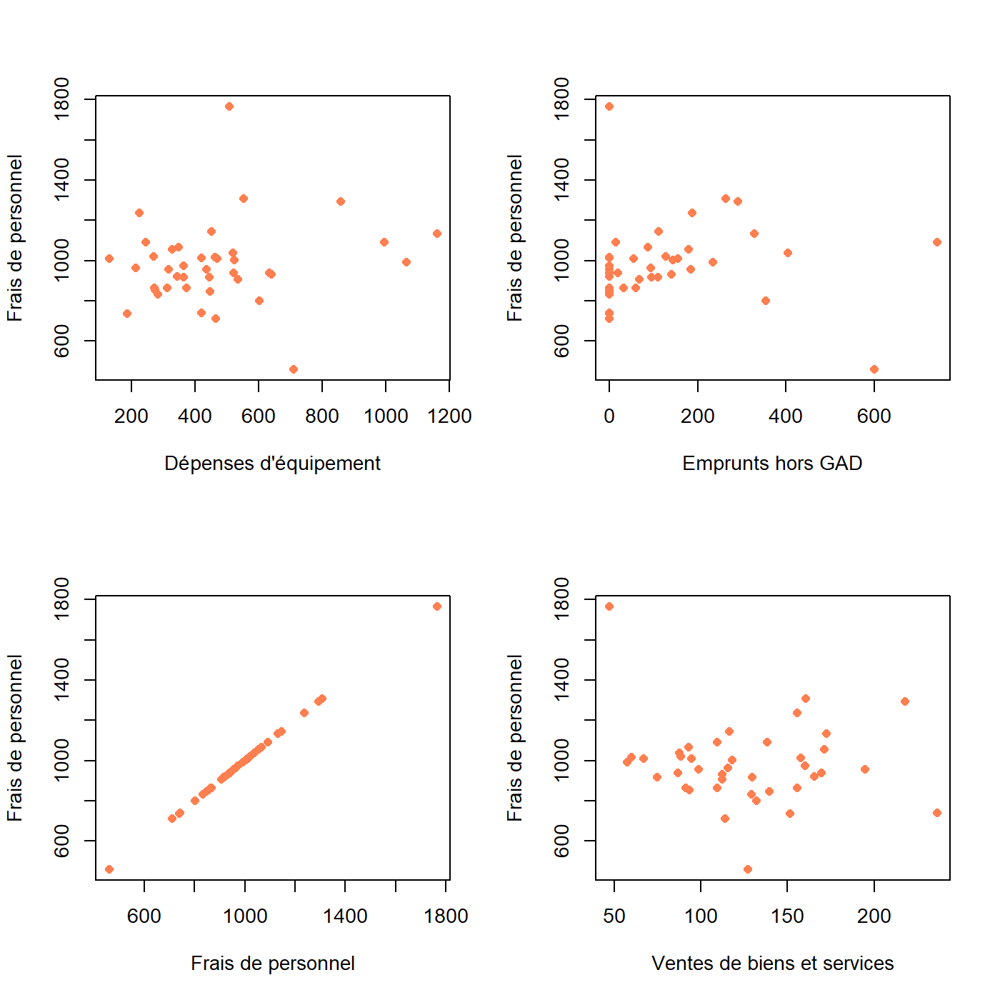
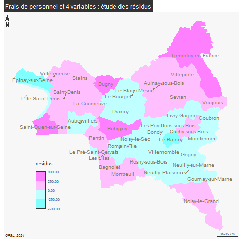

```{r setup, include=FALSE}
knitr::opts_chunk$set(eval  = TRUE)
knitr::opts_chunk$set(echo  = TRUE)
knitr::opts_chunk$set(warning  = FALSE)
``` 


```{r}
library(sf)
library(mapsf)
```


# Préparation de la donnée

Il s'agit de réfléchir à de nombreux X pour expliquer un seul Y

Dans notre exemple, nous reprenons comme 

- facteur à expliquer (Y) = les frais de personnel

- facteurs explicatifs (X) = les dépenses d'équipement, les emprunts, et les ventes de biens et service

Le choix des variables est très important, il ne faut notamment pas qu'elles soient corrélées entre elles, ce qui, sur nos données, est assez difficile puisqu'il s'agit de comptes équilibrés.

... Mais avoir une situation où une seule variable est expliquée par plusieurs autres reste une gageure.

exemples utilisés dans l'ouvrage de référence, le chadule :

- précipitation par longitude et latitude

- vote pour LE PEN et étrangers, délinquants, chômeurs, population urbaine


```{r}
data <- read.csv2("data/dataRegressionMultiple.csv", fileEncoding = "UTF-8", dec = ".")
names(data)
# filtre colonne
data <- data [, c(16, 24,28)]
names(data) <- c("commune", "agregat", "montant")
table(data$agregat)
```


# Etude de chaque régression 


```{r}
varX <- names(table(data$agregat))
personnel <- data [data$agregat == "Frais de personnel", c(1,3)]
names (personnel) [2] <- "personnel"
png("img/regressionChoix.png", width = 1400, height = 1400, res = 200)
par(mfrow = c(2,2))
fin <- personnel
for (v in varX){
  tmp <- data [data$agregat==v, c(1,3)]
  names(tmp) [2] <- v
  jointure <- merge(tmp, personnel, by = "commune")
  plot(jointure [,v] ,jointure$personnel,  ylab = "Frais de personnel", xlab = v, col="coral", pch =  16)
  tmp <- jointure [, 2]
  fin <- cbind(fin, tmp)
}
dev.off()
names(fin)  [3:6] <- varX 
names(fin) [3:6] <- c("equipement", "emprunt", "personnel2", "services")
```




A vue de nez, il peut exister une relation entre les variables choisies et les dépenses
de personnel, même s'il y a beaucoup de valeurs aberrantes.


# Modèle de régression multiple


## Préparation de la donnée

```{r}
head(fin)
rownames(fin) <- fin$commune
fin <- fin [, c(2,3,4,6)]
```

On obtient ainsi un tableau dont les étiquettes sont intégrées dans l'entête des lignes
et qui ne contient que des chiffres.

## Coefficient de correlation / détermination

```{r}
pairs(fin)
cor(fin)
cor(fin)^2
```


Seule la 1e ligne nous interesse

```{r}
modele <- lm (formula = personnel ~ equipement + emprunt + services, data = fin)
modele <- lm (formula = personnel ~ ., data = fin)
```

Tout s'est-il bien déroulé ?


```{r}
summary(modele)
```


Le modèle n'est pas utile la valeur p est trop importante.

Aucune des variables n'a un lien significatif (pas d'étoiles)

Si équipement et emprunt restent constants, les services sont associés à une baisse
de 0,16 quand les dépenses de personnel augmentent d'une unité.


Résidus


```{r}
hist(modele$residuals)
residus <- modele$residuals
residus <- as.data.frame(residus)
residus$name <- row.names(residus)
```


```{r, eval=F}
library(sf)
communes <- st_read("data/communes93.geojson")
communes <- communes [!is.na(communes$ref.INSEE), c("name", "ref.INSEE")]
communes$name
residus$name
# on calcule les résidus
jointure <- merge(communes, residus, by = "name")
setdiff(residus$name, jointure$name)
summary(jointure$residus)
jointure
```


```{r, eval=FALSE}
library(mapsf)
png("img/residusCarte2.png")
mf_map(jointure, var = "residus", type="choro", breaks = c(-600, -250,0,250,800), pal = cm.colors(4), border = NA, leg_pos = c(2.31589950651953, 48.8793057936166) )
mf_label(communes, var = "name", overlap = FALSE, col= "wheat4", cex = 0.8)
mf_layout("Frais de personnel et 4 variables : étude des résidus", credits = "OFGL, 2024")
dev.off()
```




Deuxième modèle

Que se passe-t-il si on retire les valeurs aberrantes ?


```{r}
fin <- fin [fin$personnel > 500 & fin$personnel < 1600,]
modele <- lm (formula = personnel ~ ., data = fin)
summary(modele)
hist(modele$residuals)
```

Le modèle n'est pas plus significatif, même si la vente de services se distingue.
