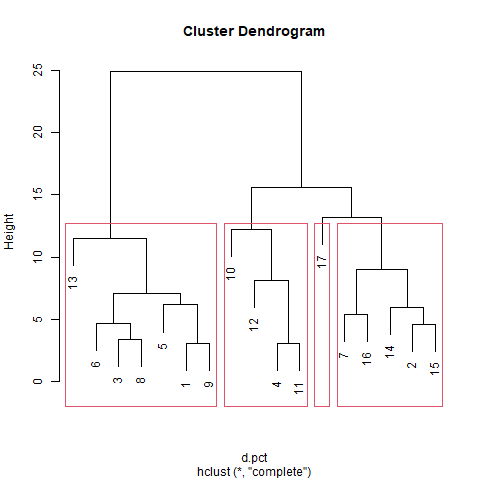
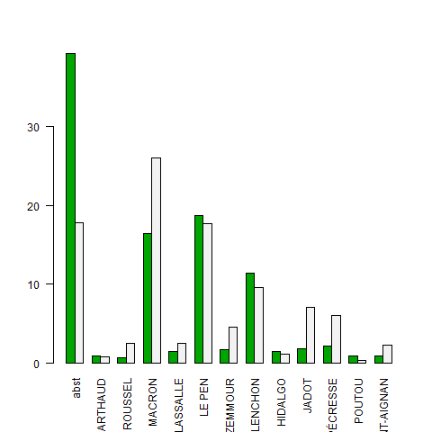
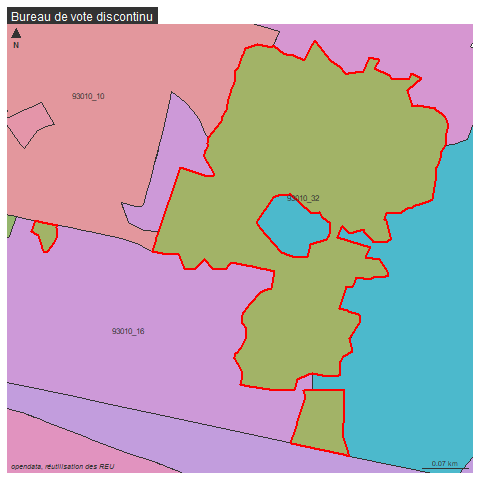
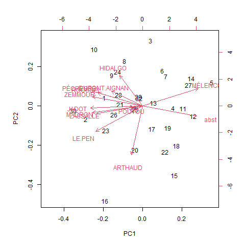

```{r setup, include=FALSE}
knitr::opts_chunk$set(eval  = TRUE)
knitr::opts_chunk$set(echo  = TRUE)
knitr::opts_chunk$set(warning  = FALSE)
``` 


# Préparation de la donnée

On lit la donnée, on filtre sur Bondy

```{r}
data <- read.csv("data/election2022.csv", fileEncoding = "UTF-8", dec = ",")
names(data)
data <- data [data$INSEE_COM == '93010',]
#data <- data [data$INSEE_COM == '72154',]
# la flèche
```

On la met en forme au niveau des colonnes :

- colonne des % des inscrits

- récupération des noms des candidats

```{r}
ind <- grep("Ins", names(data))
pct <- data [, ind]
ind <- grep("Nom", names(data))
# la 1e ligne suffit
noms <- data [1,ind]
# on attribue les noms des candidats
names(pct) [c(7:18)] 
names(pct) [c(7:18)] <- noms
```

On retient uniquement l'abstention

```{r}
pct <- pct [,c(2, 7:18)]
names(pct) [1] <- "abst"
```

On attribue les numéros des bureaux

```{r}
rownames(pct) <- c(1:length(data$Code.du.b.vote))
rownames(pct)
```

On sauvegarde pour pouvoir l'utiliser à nouveau

```{r}
write.csv(pct, "data/pctBondy.csv", fileEncoding = "UTF-8")
```


# Exploration de la donnée

```{r}
pct <- read.csv("data/pctBondy.csv", fileEncoding = "UTF-8")
# élimination de la 1e colonne si nécessaire
pct <- pct [,-1]
summary(pct)
cor(pct)
pairs(pct)
```


# ACP analyse en composante principale

```{r}
pct <- read.csv("data/pctBondy.csv")
res <- prcomp(pct, scale. = F)
plot(res)
png("img/acpCentreNONReduite.png")
biplot(res)
dev.off()
```


Deux graphiques superposés : 

- cercle des corrélations (les candidats)

- nuage de points (les bureaux de vote)

On résume la donnée sur 2 axes seulement (PC1 et PC2)


Dans le cercle de correlations :

- longueur flèche (mauvaise / bonne représentation)

- position - proche / opposée - orthogonale (= aucune relation)

# Classification hiérarchique

```{r}
# matrice des distances
d.pct <- dist(pct)
cah <- hclust(d.pct)
plot(cah)
```

Dendrogramme avec matérialisation des groupes

```{r}
#png("img/lafleche3.png")
plot(cah)
rect.hclust(cah,k=4)
groupes.cah <- cutree(cah,k=4)
#dev.off()
#liste des groupes
print(sort(groupes.cah))
```

# Quelques remarques autour de ces premiers résultats


## Correspondance cercle de correlation et dendrogramme


 


Cas de la Flèche : isolement du bureau 17

L'abstention est beaucoup plus basse qu'ailleurs (17), Mélenchon très sous représenté et Macron sur représenté.

On prend le bureau 13 qui est à l'opposé sur le cercle de corrélation

```{r, eval=FALSE}
# on filtre sur les deux bureaux
pct_13_17 <- pct [c(13,17),]
# on transforme en matrice pour pouvoir faire un graphique de comparaison des répartitions
mat <- as.matrix(pct_13_17)
png("img/lafleche2.png")
barplot(mat, las = 2, beside = T, col = terrain.colors(2))
dev.off()
```



## Quelques graphiques pour mieux observer


### Comparer les bureaux variable par variable


```{r}
commune <- read.csv("data/election2022.csv", fileEncoding = "UTF-8", dec =",")
commune <- commune [commune$INSEE_COM == '93010',]
barplot(commune$Inscrits~commune$Code.du.b.vote, las =2)
barplot(commune$Abstentions~commune$Code.du.b.vote, las =2)
```


### Plus complexe, bureau par bureau

Il faut transformer en matrice

```{r}
data <- read.csv("data/pctBondy.csv")
data <- data [,-1]
# suppression 1e colonne si nécessaire
matrice <- as.matrix(data)
boxplot(matrice, las= 2)
# transposition de la matrice
boxplot(t(matrice))
```


```{r}
candidats <- colnames(matrice)
matrice <- matrice [1:5,]
colnames(matrice)
barplot(t(matrice), beside = T, 
        xlab = "bureaux de vote", names.arg = c(1:5), legend.text = candidats)

```


# Deuxième approche de l'ACP, on filtre

Deux directions possibles :

- on cherche les autres candidats

- on zoome sur certains bureaux de vote

## Les candidats

On veut montrer uniquement les petits candidats

```{r}
names(pct)
pct <- pct [, c(2,3,5,7,9,10:13)]
```

Et on reproduit le code.


## Les bureaux de vote

On choisit un bureau dans chacun des 4 groupes : 3 15 29 13

```{r}
pct <- read.csv("data/pctBondy.csv", fileEncoding = "UTF-8")
pct <- pct [,-1]
pct <- pct [c(3,15,29,13),]
acp <- prcomp(pct)
biplot(acp)
```


# Compléments pour le devoir maison

voir item scriptEtudiant.html pour le groupe 1

## Une vision cartographique


https://demo-terravisu.solutions-territoriales.fr/visualiser/elections#map=14.27/48.9005/2.46921&layers=a0c5903b79811fda82ef73b9dca9aacc

Cette carte permet de comprendre les problèmes liés à la base.
En effet, comme le dessin du bureau est fait automatiquement, il y a des bureaux discontinus.


```{r}
library(sf)
library(mapsf)
bv <- st_read("data/gros/geo.gpkg", "bv")
bvBondy <- bv [bv$insee == '93010',]
bureau <- substring(bvBondy$bureau,7,9)
rownames(bvBondy) <- bureau
bv32 <- bvBondy [rownames(bvBondy)==32,]
png("img/bv32.png")
mf_init(bv32)
mf_map(bvBondy, type = "typo", var = "bureau", add = T, leg_pos = NA)
mf_map(bv32, col = NA, border ="red",lwd=2, add = T)
mf_label(bvBondy, var = "bureau", overlap = F)
mf_layout("Bureau de vote discontinu", "opendata, réutilisation des REU")
dev.off()
```



Cette carte permet également de savoir situer les bureaux de vote sur la commune, et éventuellement d'opposer nord, centre et sud par exemple.


## Filtrer la base du devoir maison : pb éventuels

### Disparition de bureaux

Cela fonctionne mais on a perdu 2 bureaux


```{r}
base <- read.csv("data/devoirMaison/base.csv", fileEncoding = "UTF-8")
bondy <- base [base$INSEE_COM == '93010',]
length(bondy$bureau)
```

### Doublons


```{r}
table(bondy$bureau)
# 2 fois le bureau 7
# la commande duplicated permet de voir les doublons
# le ! indique que l'on ne veut pas du doublon
doublon <- bondy [duplicated(bondy$bureau),]
bondy <- bondy [!duplicated(bondy$bureau),]
```


## Centrer et réduire


### Comprendre l'option "scale." dans la commande

```{r, eval=FALSE}
res <- prcomp(pct, scale. = FALSE)
```





Idem avec la classification

```{r}
pct.cr <- scale(pct, center = T, scale = T)
```

