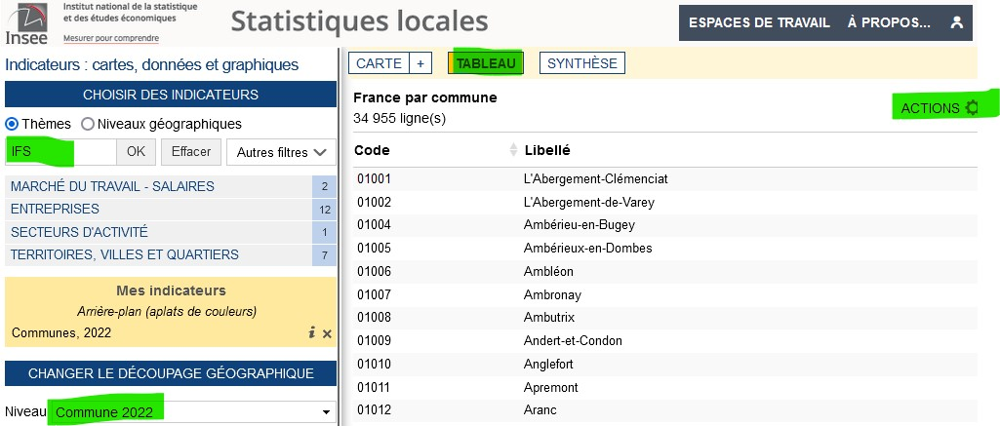

```{r setup, include=FALSE}
knitr::opts_chunk$set(echo = TRUE)
```

# L'hypothèse

## Une démarche d'exploration

On parle ici d'analyse factorielle. Il ne s'agit pas de facteur explicatif mais de
synthèse, de résumé, de description.

Comme toujours, c'est la préparation des données qui va nous prendre le plus de temps
mais il est également très important d'essayer de formuler une hypothèse dés le départ.

## Formuler une hypothèse dés le départ


### La première


Formuler une hypothèse avec les 4 variables sélectionnées.

Par exemple, nous allons voir si le nombre d'entreprises a un lien avec 

- le nombre de résidences principales (recrutement local) 

- la part des non diplômés (les non diplômés vont sur un emploi proche) 

- et l’implantation des maisons france service (les maisons france service permettent le développement de l’emploi local)

(exercice moodle)

### Autour du logement social

Partir d'une hypothèse fictive autour du logement social. On a vu par exemple que

- l'année de construction ne permettait pas d'expliquer la surface habitable, 

ou que

- souvent les ménages les plus modestes n'obtenaient pas les grands appartements.

Quelles peuvent être les autres facteurs pour ces deux états de fait ?


# La donnée

Il s’agit de rendre les variables comparables entre elles.

## Recherche

Comparaison donnée RPLS et insee à la base communes avec un outil très intuitif

https://statistiques-locales.insee.fr


### Exploration autour de l'outil

Chercher à construire un tableau au niveau des *communes* avec


Quels sont les outils de l'interface à utiliser ?

- zone de recherche (attention, il faut cliquer sur les items)

- tableau

- exporter (.en csv)

- attention également au maillage, nous allons utiliser celui de la commune (certaines 
statistiques ne sont pas disponibles au niveau communal)




# Normaliser sa donnée


## Alléger sa donnée

```{r}
# pb sur lecodes postaux
data <- read.csv2("data/dataMultivariee2.csv", 
                 encoding = "UTF-8", dec = ".", 
                 na.strings = "N/A", 
                 colClasses = c("character", "character", "numeric", "numeric", "numeric", "numeric"), skip = 2)
# voir la structure du fichier
str(data)
# rownames
rownames(data) <- data [,1]
data <- data [,3:6]
names(data) <- c( "nbEnt", "RP", "nbDipl", "IFS")
pairs(data)
```

La donnée est trop lourde pour nos machines. 

### Solution 1 : choisir une zone spécifique

On va d'abord juste le faire sur la région parisienne, c’est à dire les dpts 75, 77, 78, 91, 92, 93, 94, et 95


```{r, eval=FALSE}
data <- read.csv("data/dataMultivarie.csv", encoding = "UTF-8", dec = ".", na.strings = "N/A")
data$dpt <- substring(data$Code,1,2)
data <- data [data$dpt %in% c(75, 77, 78, 91, 92, 93, 94,95),]
```

Refaire les étiquettes et le pairs

```{r, echo = FALSE, eval=FALSE}
rownames(data) <- data [,1]
data <- data [,3:6]
pairs(data)
names(data) <- c( "nbEnt", "RP", "nonDipl", "IFS")
```


Qu’en pensez-vous ? Est-il possible de comparer ces variables ?


### Solution 2 : utilisation du fichier des logements sociaux > 2000 sur la France entière

```{r}
rpls <- read.csv("data/fr2000verif.csv", fileEncoding = "UTF-8")
str(rpls)
data <- read.csv2("data/dataMultivariee2.csv", 
                 encoding = "UTF-8", dec = ".", 
                 na.strings = "N/A", 
                 colClasses = c("character", "character", "numeric", "numeric", "numeric", "numeric"), skip = 2)
# jointure entre les 2 fichiers avec le code insee
jointure <- merge(rpls, data, by = "Code")
# on a 302 communes, il en manque 37...
# On sauvegarde la donnée
write.csv(jointure, "data/base.csv", fileEncoding = "UTF-8")
```


## Examen des données

On examine désormais la donnée résultante de la jointure.

```{r}
data <- read.csv("data/base.csv", fileEncoding = "UTF-8")
str(data)
names(data)
rownames(data) <- data [,2]
data <- data [,c(4,7:10)]
names(data) <- c( "rpls", "nbEnt", "RP", "nonDipl", "IFS")
pairs(data)
```


#### Valeurs manquantes

Une analyse factorielle n'admet pas les NA, les valeurs manquantes.


```{r}
summary(data)
data <- data [!is.na(data$nonDipl),]
```


#### Valeurs aberrantes

Pour chaque variable, il faut chercher s'il n'y a pas de valeur aberrante.

"Les individus trop spécifiques brouillent le résumé." (Chaudule, p. 138)


```{r}
summary(data)
rownames(data)
# Suppression de valeur extrême nbEntreprises, autres suppressions ?
# 1ere étape on l'identifie
data [data$nbEnt > 50000,]
# Il s'agit de la 1e commune en nb de RPLS, Toulouse
data <- data [data$nbEnt < 50000,]
```

Refaire la commande pairs et chercher d'autres valeurs aberrantes

Par exemple, au niveau du nombre de diplômés.

```{r, eval = F}
summary(data$nonDipl )
obs <- data [data$nbDipl > 20,]
# Il existe une commune dont le nb de diplômés est 100 % !
# C'est Blandy.
data [data$nbDipl == 100,]
obs
summary(obs$nbDipl)
hist(obs$nbDipl)
hist(obs$nbDipl, breaks = c(20,21, 22, 23,24, 25,26, 100))
data <- data [data$nbDipl < 50,]
```


On décide également d'enlever, les communes où il y a trop peu
de non diplômés.


```{r, eval = F}
data <- data [data$nbDipl > 21, ]
```


Faut-il garder la variable sur les Maisons France Services ?

### Coefficients de variation


Les coefficients de variation permettent également une première approche


```{r}

coeffVariation <- function (x) {mean(x)/sd(x)}
coeff <- sapply(data, coeffVariation)
sd <- sapply(data, sd)
moy <- sapply(data, mean)
tab <- cbind(moy,sd, coeff)
round(tab,2)
```


On observe que la variabilité des non diplômés est la plus importante, les autres variables
évoluent à la même hauteur.
L'IFS est particulière.

## Centrage et réduction


Il faut pouvoir comparer les valeurs des variables *indépendamment de l'unité originelle*

écart à la moyenne de la valeur / écart-type

2 opérations :

- centrage : écart à la moyenne (comme une translation graphique)

- réduction : division par l'écart type, on exprime la différence en écart-type (comme un 
changement d'échelle)


La variable standardisée a pour moyenne 0 et pour écart-type 1


```{r}
data_cr <- scale (data)
pairs(data_cr)
write.csv(data_cr, "data/base_cr", fileEncoding = "UTF-8")
```


