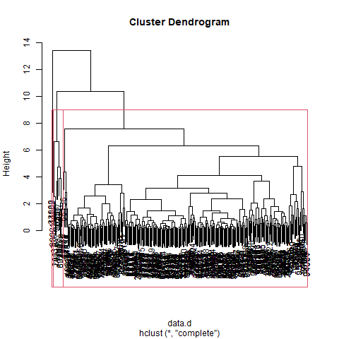
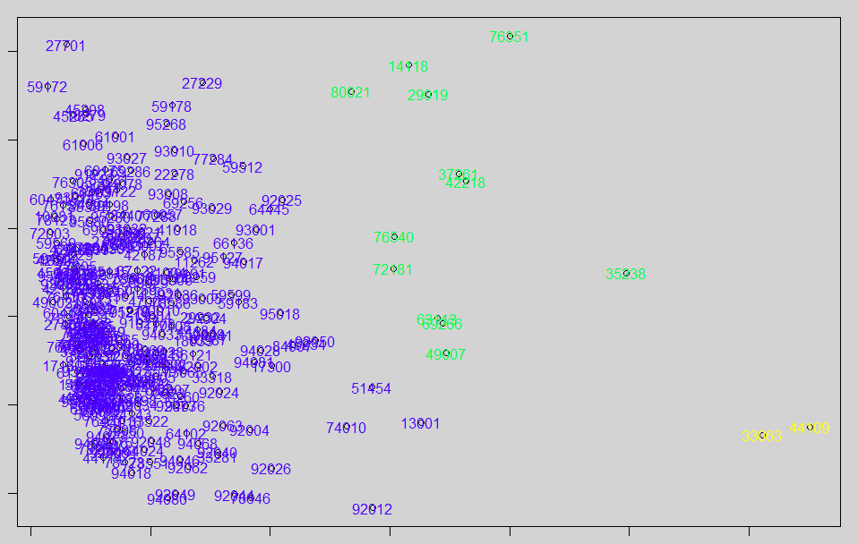

```{r setup, include=FALSE}
knitr::opts_chunk$set(echo = TRUE)
```

# Définition

L'analyse factorielle et les classifications sont les deux grands types de méthodes 
descriptives en statistiques multivariées.

Les analyses factorielles résument l'information en colonnes. Les méthodes de classification
s'attachent aux lignes.

La combinaison des deux permet un résumé complet.

On repart donc de la même donnée que pour l'analyse factorielle, les communes  

- rpls

- nombre d'emplois locaux

- diplôme

- logement

# Analyse factorielle

## Les axes en géométrie

Les axes factoriels rendent comptent le mieux possible de la
dispersion du nuage de points.

Un facteur regroupe des informations communes à plusieurs variables.

Le premier axe prend en compte le maximum d'information.

Le deuxième prend en compte le maximum d'information à partir des résidus du premier.

Et ainsi de suite ...

... d'où l'importance de l'informatique pour traiter du multicritère !


## Les calculs sous R


### Les axes factoriels : composition

```{r}
data_cr <- read.csv("data/base_cr", row.names = 1, fileEncoding = "UTF-8")
str(data_cr)
acp <- prcomp(data_cr)
# par défaut direction négative on inverse
acp$rotation <- -1 * acp$rotation
acp$rotation
```

La taille des axes illustre leur importance (voir commentaire graphique)

### Importance des axes

```{r}
acp$sdev^2 / sum(acp$sdev^2)
```

58 % de la variance pris en compte par le premier axe, etc...

Près des 3/4 de la variance dépend des 2 premiers axes.

Le premier axe résume la variation de la moitié des valeurs des 4 variables.

L'axe 3 a une haute valeur pour l'implantation des Maisons France Service.

Le nombre d'emploi et le diplôme sont liés et s'opposent au surlogement et aux
taux de natalité.


### Graphique et interprétation

```{r}
biplot(acp, scale = 0)
# Pour voir les axes, on zoome et on met les individus en blancs.
biplot(acp, col = c("white", "red"), scale = 0, xlim = c(-2, 2), ylim = c(-2,4))
```

#### Sans les individus


3 notions importantes :

- petit grand axe : prise en compte de la variable

Ici, toutes les variables semblent avoir la même importance

- oppositions des axes

2 variables s'opposent, par exemple le nombre d'entreprises est presque en opposition*
avec le le nombre de non diplômés.

- axes voisins 

Les variables sont corrélées.

Ici, on observe que nombre d'entreprises, résidences principales et RPLS sont corrélées d'un côté 
et IFS et non diplômés de l'autre.


#### Avec les individus

Les communes proches suivent le même modèle de données. Leur position dans
le graphique montre leur rapport aux variables.

Dans le cas présent, il faudrait pouvoir examiner mieux les variables, on peut effectuer
des zoomes.

```{r}
biplot(acp, col = c("black", "red"), scale = 0, xlim = c(-1, 0), ylim = c(-2,0))
```

Par exemple, les communes autour de l'axe IFS se distinguent par rapport à cette variable.


## Second traitement

Supprimer les valeurs posant problème et relancer les calculs. Essayer d'interpréter.


# Classification

```{r, eval=F}
# Centrage et réduction
data.cr <- scale(data, center = T, scale = T)
# matrice des distances entre les individus
data.d <- dist(data.cr)
# classification
cah <- hclust(data.d)
# dendogramme
png("img/dendo.png")
plot(cah)
# matérialisation des groupes
rect.hclust(cah, k = 3)
dev.off()
# découpage
groupes.cah <- cutree(cah, k = 3)
liste <- sort(groupes.cah)
head(liste)
```




# Représentation graphique

Il s'agit de représenter les groupes par des couleurs sur l'ACP précédente (dans
le premier axe)

```{r, eval = F}
data_cr <- read.csv("data/base_cr", row.names = 1, fileEncoding = "UTF-8")
acp <- princomp(data_cr, cor = T, scores = T)
par(bg = "lightgrey", mar = c(1,1,1,1))
plot(acp$scores[,1],acp$scores[,2], type = "p")
text(acp$scores[,1],acp$scores[,2],col=c(topo.colors(3))[groupes.cah],cex
=1,labels=rownames(data))
```




# Deuxième traitement

Retirer les valeurs aberrantes, jouer sur la taille des groupes et rejouer la classification, puis analyser.


