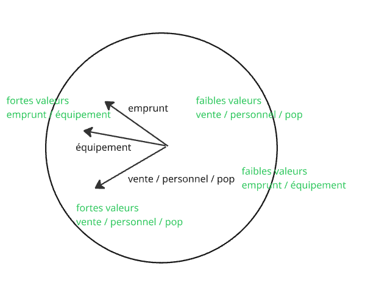

```{r setup, include=FALSE}
knitr::opts_chunk$set(eval  = TRUE)
knitr::opts_chunk$set(echo  = TRUE)
knitr::opts_chunk$set(warning  = FALSE)
``` 


Les analyses factorielles sont une démarche descriptive. Il s'agit de résumer de grands 
tableaux d'informations en passant des colonnes aux axes factoriels.


Attention, contrairement à la régression il ne s'agit pas d'expliquer mais de résumer.


Autrement dit, quelle est la meilleure de représenter en 2D, un objet de plusieurs dimensions ?


# Préparation de la donnée

On reprend la donnée construite pour la régression multiple

```{r}
data <- read.csv("data/baseMultivarie.csv", row.names = 2 )
# les noms de commune deviennent des étiquettes, on vérifie avec le head
head(data)
# attention supprimer la première colonne X
data <- data [, -1]
```


Il s'agit d'une matrice numérique de 5 variables et 40 individus.

L'ACP permet de traiter des tableaux beaucoup plus importants.


# Exploration de la donnée

Commandes à faire à chaque fois que l'on découvre une donnée

```{r}
summary(data)
# ordres de grandeur
round(cor(data),1)
# relations (numériques)
pairs(data)
# relations (graphiques)
```


# ACP analyse en composante principale

## Termes de vocabulaire

Définir 

- matrice d'information spatiale

- analyse en composante principale

- matrice d'inertie

- axe d'allongement principal

- axe factoriel

- vecteur propre

- valeur propre

- qualité de représentation d'une variable à un axe

- contribution d'une variable à un axe


## Centrer - réduire

Centrer et réduire permet de comparer les variables dont les ordres de grandeur sont très différents. On dit aussi *normer*, *standardiser*

Centrer : on compte les écarts à la moyenne

Réduire : on divise toutes les valeurs par l'écart type.


## Une seule commande mais deux choix pour le paramètre

```{r}
res <- prcomp(data, scale. = F)
# ACP normée
res2 <- prcomp(data, scale. = T)
```


## Premier résultat : les axes factoriels

```{r}
par(mfrow = c(2,2))
plot(res, "Valeur propre des axes factoriels", col="brown", border= NA)
variance <- summary(res)$importance [2,]
barplot(variance, main= "% d'inertie de chaque axe", col ="brown", border= NA)
plot(res2, "Valeur propre des axes factoriels (ACP normée)", col="chartreuse", border= NA)
variance <- summary(res2)$importance [2,]
barplot(variance, main= "% d'inertie de chaque axe (ACP normée)", col = "chartreuse",border= NA)
```


Un axe d'allongement très marqué. Interrelations entre variables fortes permettant
une structure de l'espace.

Dans notre cas, le nuage de point s'explique très bien avec un seul axe, c'est un 
objet de type *banane*. {width="100"}

La difficulté de calcul de l'ACP vient de cette notion itérative : on calcule un 
premier axe, puis le deuxième...

## Deuxième résultat : le biplot

### Affichage variables et individus

```{r}
par(mfrow=c(2,3), bg="cornsilk")
biplot(res, main= "Résultat d'une ACP", col=c("black", "brown"))
biplot(res, col= c("white", "brown"),  main = "Variables")
biplot(res, col= c("black", "white"), main = "Individus")
biplot(res2, main= "Résultat d'une ACP normée", col= c("black", "chartreuse"))
biplot(res2, col= c("white", "chartreuse"),  main = "Variables")
biplot(res2, col= c("black", "white"), main = "Individus")
```


Deux graphiques superposés : 

- cercle des corrélations (les variables : les agrégats et la population)

- nuage de points (les communes du 93)

On résume la donnée sur 2 axes seulement (PC1 et PC2)

### Interprétation des variables : longueur et position

Dans le cercle de corrélations, retenir 2 éléments :

- *longueur* flèche (mauvaise / bonne représentation)

- *position*  proche / opposée - orthogonale (= aucune relation)

```{r}
# le résultat premier est  les coordonnées sur les axes de chaque variable
res$rotation
# les coordonnées sur les axes de chaque individu
res$x
```


Dans notre cas, l'ACP non normée permet de voir qu'équipement et personnel sont les
2 variables les mieux représentées, mais c'est omettre la population qui n'a pas 
du tout la même unité que les données financières.

Du coup, dans le second cas, les variables ont quasiment toute la même variation (la réduction se fait à l'écart type)

```{r}
par(mfrow= c(1,1))
biplot(res2, col= c("white", "chartreuse"),  main = "Variables")
res2
```

Les dépenses d'équipement sont corrélées avec deux groupes de variable (emprunt) et 
un deuxième groupe constitué des variables vente / population et personnel.

Par contre, emprunt et vente / personnel et population ne sont quasiment pas corrélés.

L'ACP permet ainsi de simplifier la description des variables.

### Interprétation des individus


L'ACP permet de situer les individus par rapport aux variables.

```{r}
biplot(res2, main= "Résultat d'une ACP normée", col= c("black", "chartreuse"))
row.names(data)
# La Courneuve / Pantin 14 et 28 (Emprunt important)
data [c(14,28),]
# Aubervilliers / Aulnay sous Bois (population et personnel)
data [c(1,2),]
```


Au niveau des individus, il faudrait procéder groupe par groupe pour identifier chacun,
c'est le rôle des classifications.


# Classification hiérarchique

## Dendogramme

```{r}
par(mfrow=c(1,2))
# matrice des distances
ddata <- dist(data)
cah <- hclust(ddata)
plot(cah, cex=0.5, main = "CAH")
# normée
data2 <- scale(data, center = T, scale = T)
ddata2 <- dist(data2)
cah2 <- hclust(ddata2)
plot(cah2, cex=0.5, main = "CAH normée")
```


Dendrogramme avec matérialisation des groupes

```{r}
par(mfrow=c(1,2))
plot(cah,  cex=0.5,  main = "CAH")
rect.hclust(cah,k=4)
groupes.cah <- cutree(cah,k=4)
# normée
plot(cah2, cex=0.5, main = "CAH normée")
rect.hclust(cah2,k=4)
groupes.cah2 <- cutree(cah2,k=4)
```

Observer Pantin / La Courneuve et Aubervilliers / Aulnay sous Bois, par exemple


## Cartographie


```{r}
library(sf)
library(mapsf)
library(RColorBrewer)
palette <- brewer.pal(4, "Accent")
geo <- st_read("data/communes93.geojson")
# transformation de la liste des groupes en dataframe
df <- data.frame(groupe = groupes.cah2, name=names(groupes.cah2))
# jointure entre la géométrie et la donnée
jointure <- merge(geo, df,  by = "name")
mf_map(jointure, type = "typo", var = "groupe", border = NA, leg_pos = NA, pal = palette)
mf_legend("typo", title="",val= c("groupe 1 : importance de l'emprunt",
                         "groupe 2 : équipements",
                          "groupe 3 : moins d'emprunt",
"groupe 4 : population / personnel et vente des services"),  pal = palette, pos = "bottomleft")
mf_layout("CAH normée = groupes", "OFGL 2025")
```


