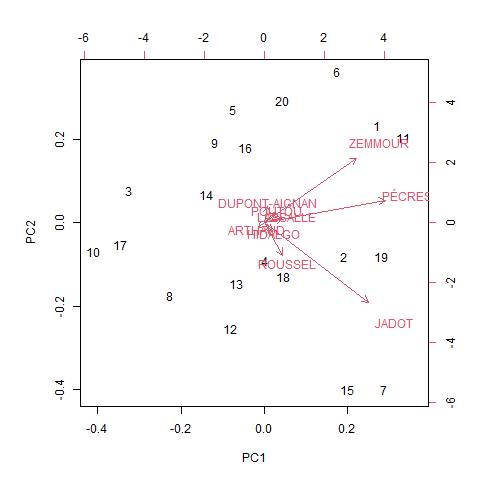

```{r setup, include=FALSE}
knitr::opts_chunk$set(eval  = TRUE)
knitr::opts_chunk$set(echo  = TRUE)
knitr::opts_chunk$set(warning  = FALSE)
``` 


```{r}
library(sf)
library(mapsf)
```


Les analyses factorielles sont une démarche descriptive. Il s'agit de résumer de grands 
tableaux d'informations en passant des colonnes aux axes factoriels.


Attention, contrairement à la régression il ne s'agit pas d'expliquer mais de résumer.


# Préparation de la donnée

On reprend la donnée construite pour la régression multiple

```{r}
data <- read.csv("data/baseMultivarie.csv", row.names = 1 )
head(data)
```

Il s'agit d'une matrice numérique.


# Exploration de la donnée

Il s'agit de commandes à faire à chaque fois que l'on découvre une donnée

```{r}
summary(data)
cor(data)
pairs(data)
```


# ACP analyse en composante principale

```{r}
res <- prcomp(data, scale. = F)
plot(res)
png("img/acpCentreNONReduite.png")
biplot(res)
dev.off()
```


Deux graphiques superposés : 

- cercle des corrélations (les agrégats et la population)

- nuage de points (les communes du 93)

On résume la donnée sur 2 axes seulement (PC1 et PC2)


Dans le cercle de corrélations :

- longueur flèche (mauvaise / bonne représentation)

- position - proche / opposée - orthogonale (= aucune relation)

# Classification hiérarchique

```{r}
# matrice des distances
ddata <- dist(data)
cah <- hclust(ddata)
plot(cah)
```

Dendrogramme avec matérialisation des groupes

```{r}
#png("img/lafleche3.png")
plot(cah)
rect.hclust(cah,k=4)
groupes.cah <- cutree(cah,k=4)
#dev.off()
#liste des groupes
print(sort(groupes.cah))
```

# Quelques remarques autour de ces premiers résultats


## Correspondance cercle de correlation et dendrogramme


```{r, eval=FALSE}
# on filtre sur les communes de Pantin et d'Aulnay sous Bois
rownames(data)
sel <- data [c(2,28),]
# on transforme en matrice pour pouvoir faire un graphique de comparaison des répartitions
mat <- as.matrix(sel)
png("img/lafleche.png")
barplot(mat, las = 2, beside = T, col = terrain.colors(2), border = NA)
dev.off()
```


## Quelques graphiques pour mieux observer


### Comparer les communes variable par variable


```{r}
par(mfrow = c(2,1))
barplot(data$vente~rownames(data), las =2)
barplot(data$personnel~rownames(data), las =2)
```


### Plus complexe, commune par commune

Il faut transformer en matrice

```{r}
matrice <- as.matrix(data)
boxplot((matrice), las= 2)
# transposition de la matrice
boxplot(t(matrice), las=2)
```


# Deuxième approche de l'ACP, on filtre

Deux directions possibles :

- on distingue petites et grandes villes

- on zoome sur certaines villes

## Les variables

On veut montrer uniquement les petites villes, celles dont la population est moindre

```{r}
hist(data$pop)
data <- data [data$pop < 6,]
```

Et on reproduit le code jusqu'à l'ACP

```{r}
png("img/ptit.png")
biplot(res)
dev.off()
```




## Les communes

On choisit une ville dans chacun des r4 groupes : Pantin, Aubervilliers, Vaujours et Villepinte

```{r}
data <- read.csv("data/baseMultivarie.csv", row.names = 1)
sel <- data [row.names(data) %in% c("Pantin", "Aubervilliers", "Vaujours","Villepinte"),]
acp <- prcomp(sel)
biplot(acp)
```


## Centrer et réduire

Centrer et réduire permet de comparer les variables dont les montants sont très différents.

Centrer : on compte les écarts à la moyenne

Réduire : on divise toutes les valeurs par l'écart type.

### Comprendre l'option "scale." dans la commande


Il faut faire varier l'option avec FALSE et TRUE.

Le FALSE permet d'obtenir uniquement les variables les plus importantes.

```{r}
acp <- prcomp(data, scale. = FALSE)
biplot(acp)
```

Le TRUE permet de pouvoir comparer toutes les variables

```{r}
acp <- prcomp(data, scale. = TRUE)
biplot(acp)
```


### Idem avec la classification

```{r, eval=FALSE}
data.cr <- scale(data, center = T, scale = T)
```

### Au niveau des données

On peut également utiliser la fonction scale pour les données elles-mêmes

```{r}
par(mfrow = c(2,2))
# transformation en matrice
mat <- as.matrix(data [, c("emprunt", "pop")])
# graphiques pour comparer les 2 variables par bureau de vote
barplot(mat, beside=T, border = NA)
hist(mat)
# on ne voit rien, il faut centrer réduire
mat <- scale(mat)
barplot(mat, beside = T, border = NA)
hist(mat)
```