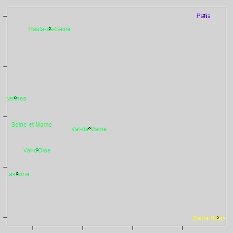

# Travail sur criminalité et RPLS

```{r}
data <- read.csv("data/ines.csv", dec = ",")
names(data)
rownames(data)<- data [,2]
data <- data [, c(3:7)]
names(data) <- c("coups", "pauvreté", "cambriolages", "pop", "rpls")
pairs(data)
data_cr <- scale (data)
pairs(data_cr)
acp <- prcomp(data_cr, scale =  F)
png("img/biplotPrcomp.png")
biplot(acp, scale = 0)
dev.off()
```


```{r}
# matrice des distances entre les individus
data.d <- dist(data_cr)
# classification
cah <- hclust(data.d)
plot(cah)
# découpage
groupes.cah <- cutree(cah, k = 3)
liste <- sort(groupes.cah)

acp <- princomp(data_cr, cor = F, scores = T)
png("img/biplotPrincomp.png")
par(bg = "lightgrey", mar = c(1,1,1,1))
plot(acp$scores[,1],acp$scores[,2], type = "p")
text(acp$scores[,1],acp$scores[,2],col=c(topo.colors(3))[groupes.cah],cex
     =1,labels=rownames(data))
dev.off()
```



# Quelques ajouts


## Problème des NA

Selon les données choisies, les NA vont être sous la forme "N/A" ou "N/A - résultat non disponible" ou "N/A- résultatnondisponible" etc...

```{r}
data <- read.csv('data/pbNA.csv', fileEncoding = "UTF-8", dec = ".")
str(data)
# Cela ne fonctionne pas, il faut des numériques, on fait une recherche autour du motif N/A
i <- grep("N/A", data$taille.menages)
data [i,]
# Il y a deux sortes de NA, la ligne d'import sera donc :
data <- read.csv('data/pbNA.csv', fileEncoding = "UTF-8", dec =".",
                 na.strings = c("N/A - résultat non disponible", "N/A - division par 0"))
```


D'autres solutions étaient bien sûr possibles :

- travailler le fichier sous le tableur pour le faire entrer sous R

- attendre la jointure et passer en numérique uniquement les colonnes (as.numeric)


## Examen de la jointure

Pourquoi y a t il des communes du RPLS qui ne sont pas reprises alors qu'on utilise le code INSEE ?

### Question 1 : pourquoi commence t on par le fichier rpls ?


```{r}
# fusion avec le fichier
data <- read.csv2("data/dataMultivariee2.csv", encoding = "UTF-8", skip = 2,
                  na.strings = c("N/A"), dec =".")
rpls <- read.csv("data/rplsFr.csv", fileEncoding = "UTF-8")
length(rpls$Code)
length(data$Code)
jointure <- merge(rpls, data, by = "Code")
length(rpls$Code)-length(jointure$Code)
```


### Question 2 : pourquoi 37 communes manquantes ?


```{r}
jointure <- jointure [order (jointure$Code),]
# comparer avt après
i <- setdiff(rpls$Code, jointure$Code)
rpls [rpls$Code %in% i,]
# Donc Paris / Lyon / Marseille automatiquement hors jeu
rpls [grep ("Marseille", rpls$LIBCOM),]
# ... et même pas de RPLS à Marseille ?
```

## Comment repérer des valeurs ?

grep, which, filtre


## Différence entre les 2 graphiques d'ACP

Le premier sert à afficher axes et valeurs.

Le second sert à colorier les groupes de la classification.

Le premier est à l'inverse du deuxième.
Pour pouvoir situer les données par rapport aux axes,il est intéresser de retourner le 1er.


```{r}
data_cr <- read.csv("data/base_cr", row.names = 1, fileEncoding = "UTF-8")
str(data_cr)
acp <- prcomp(data_cr, scale =  F)
acp$rotation
biplot(acp, col = c("blue", "red"), scale = 0, xlim = c(-2, 2), ylim = c(-2,4))
```


```{r}
# pb rotation
data_cr <- read.csv("data/base_cr", row.names = 1, fileEncoding = "UTF-8")
str(data_cr)
acp <- prcomp(data_cr, scale =  F)
acp$rotation
biplot(acp, col = c("blue", "red"), scale = 0, xlim = c(-2, 2), ylim = c(-2,4))
biplot(acp, col = c("blue", "red"), scale = 0, xlim = c(0, 3), ylim = c(0,3))
```


```{r}
# on prend 2 valeurs rapprochées 92025 et 64 445 (Colombes et Pau)
jointure [ jointure$Code %in% c("92025", "64445"),]
# Elles ont effectivement des profils très similaires. mais une variation RP et RPLS
jointure [ jointure$Code %in% c("80021"),]
# Amiens est plus importante, et les variables sont plus importantes également mais
# il y a un déficit de rpls par rapport à Pau
which(rownames (data_cr) == "80021")
data_cr [ 18,]


# Avec les groupes
# Centrage et réduction : on repart du fichier
data_cr <- read.csv("data/base_cr", row.names = 1, fileEncoding = "UTF-8")
# matrice des distances entre les individus
data.d <- dist(data_cr)
# classification
cah <- hclust(data.d)
# découpage
groupes.cah <- cutree(cah, k = 8)
liste <- sort(groupes.cah)
acp <- princomp(data_cr, cor = F, scores = T)
par(bg = "lightgrey", mar = c(1,1,1,1))
plot(acp$scores[,1],acp$scores[,2], type = "p")
text(acp$scores[,1],acp$scores[,2],col=c(topo.colors(8))[groupes.cah],cex
     =1,labels=rownames(data))
# Oy sonT Amiens Pau et Colombes ?
```

```


