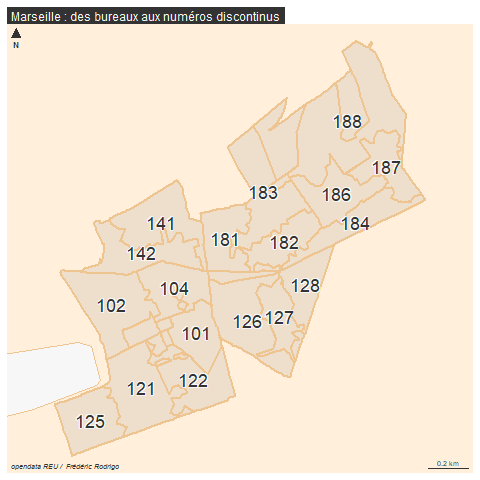
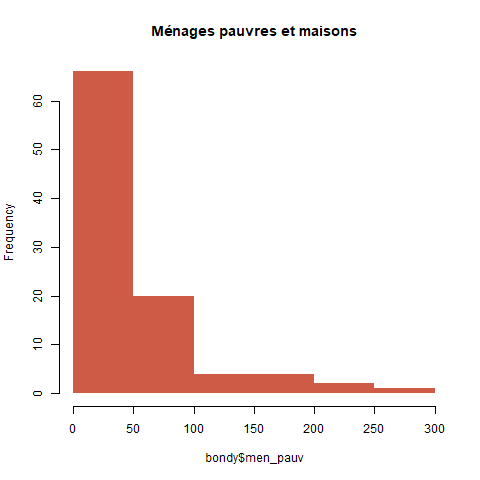
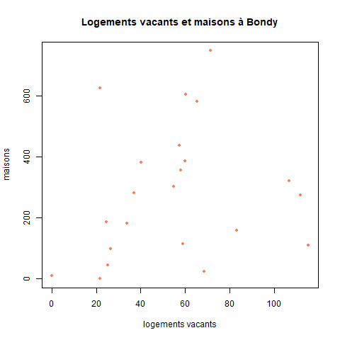
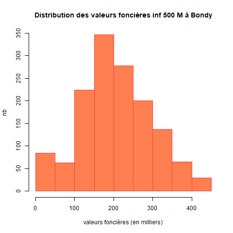
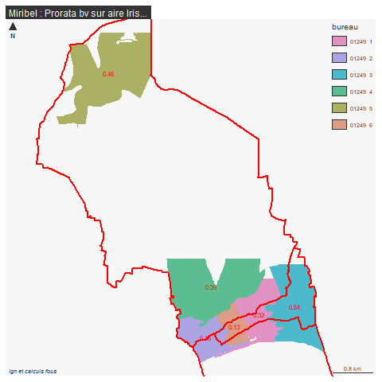

```{r setup, include=FALSE}
knitr::opts_chunk$set(eval  = FALSE)
knitr::opts_chunk$set(echo  = TRUE)
knitr::opts_chunk$set(warning  = FALSE)
``` 


# Objectif

Pour l'examen (y compris celui de rattrapage), on extrait pour chaque ville choisie par les étudiants :

- les données foncières à la parcelle

- l'enquête filosofi au carreau

- le recensement à l'iris

- le rpls à l'appartement


Ces 4 sources seront utilisées pour le devoir maison, afin de permettre à l'étudiant de choisir.

Ces 4 sources seront agrégées au bureau de vote via les centroides pour l'élection de 2022 (on dispose des bureaux uniquement pour cette élection)

## Démarche

5 étapes

- on définit le nombre de communes concernées

- extractions pour les fichiers spatiaux et les fichiers texte (diminuer la taille
des fichiers)

- intersection bv et centroides fichiers spatiaux

- jointure attributaire centroide, fichers de données

- agrégation des données au bv


```{r}
library(sf)
library(mapsf)
```


# cog

Définition de la liste des villes de base.

Des pb seront à traiter : Pointe à Pitre, Lyon, Marseille

Chaque étudiant a choisi une ville pour ses données. Ces villes sont choisies au cours2,
jusqu'au cours 9 pour les modifications

Rochefort est rajouté à la main

## Constitution de la liste 

à partir de la feuille d'émargement


```{r}
# recup fichier ville
ville <- read.csv("data/cours2.csv", colClasses = "character")
ville <- ville [,3]
villeModif <- read.csv("data/cours3.csv", colClasses = "character")
ville <- c(ville, villeModif [,4])
# recup dernier cours
villeModif <- read.csv("data/cours9.csv", colClasses = "character")
# rajout Rochefort
ville <- c(ville, 17299)
ville <- c(ville, villeModif [,4])
# 78 villes différentes
ville <- unique(na.omit(ville))
# recodage pour le zéro
nb <- nchar(ville)
df <- data.frame(cbind(ville, nb))
df$ville [df$nb == 4 ]<- paste0("0", df$ville [df$nb == 4 ] )
df$nb <- nchar(df$ville)
table(df$nb)
df [(df$nb != 5),]
df <- df [!(df$nb != 5),]
# liste des villes utilisées avec code à 5 chiffres = 73
```

Les étudiants ont choisi 73 code insee.


## Jointure 

Attention, la lecture du code insee peut se faire comme un chiffre et donc la donnée sera faussée.
Toujours vérifier que le code insee est une variable de type alphanumérique.


```{r}
fr <- st_read("data/gros/COMMUNE_CARTO.shp")
# le code INSEE a 5 chiffres y compris le zéro
names(df)
names(fr)
joint <- merge(fr, df, by.x = "INSEE_COM", by.y= "ville")
# la jointure est de 68
# pb sur 5 code insee qui doivent etre des cp
cp <- setdiff(df$ville, joint$INSEE_COM)
```

retrouver les code insee à partir des cp pour ces 5 communes
utilisation de l'api

```{r}
library(httr)
library(jsonlite)
equiv <- NULL
for (i in cp){
  rqt <- paste0("https://geo.api.gouv.fr/communes?codePostal=",i)
  res <- httr::GET(rqt)
# dans res, on remarque le status à 200, c'est ok. et le format json
  tmp <- fromJSON(rawToChar(res$content))
  equiv <- rbind(equiv, tmp)
}
str(equiv)
# bizarrement le cp est en liste donc on remet en vecteur et on fait un tab 
# histoire de repérer les doublons cp
equiv$codesPostaux <- unlist(equiv$codesPostaux)
table(equiv$codesPostaux)
equiv <- equiv [, c("code", "nom")]
df <- rbind(df, data.frame(ville=equiv$code, nb = 5))
```

79 villes = 73 + 5 code insee liés à des cp

```{r}
joint <- merge(fr, df, by.x = "INSEE_COM", by.y= "ville")
joint <- unique(joint)
```

72 villes récupérées, il y avait des doublons.

quelques tests sur quelques villes

```{r}
joint$NOM_COM_M[grep("ROCHE|ISSY|VITRY|ACH|POIN", joint$NOM_COM_M)]
```

2 points de vigilance :

- Pb Lyon et Marseille / uniquement les arrondissements 1

- Guadeloupe / Pointe à Pitre (DROM 971, code insee ville 97120)

```{r}
joint$INSEE_COM [joint$INSEE_COM == "13055"] <- "13201"
joint$INSEE_COM [joint$INSEE_COM == "69123"] <- "69381"
joint [joint$INSEE_COM == "97120",]
```


premier enregistrement

```{r}
#toutes les données pour le fichier géométrie
st_write(joint,"data/gros/geo.gpkg", "cog", delete_layer =  T)
write.csv(joint [, c("INSEE_COM", "NOM_COM_M"), drop = T], "data/cog.csv", fileEncoding = "UTF-8", quote = T, row.names = F)
# quote permet d'avoir du texte pour le code insee
```


## Cartographie (sans Pointe à Pitre)

```{r}
cogGEOM <- st_read("data/gros/geo.gpkg", "cog") 
cogGEOM <- cogGEOM [-72,]
```


```{r, eval=FALSE}
png("img/communes.png")
fond <- st_read("data/gros/DEPARTEMENT.shp")
mf_init(cogGEOM)
mf_map(fond, add = T, col = "antiquewhite1", border = "wheat")
mf_map(cogGEOM, col = "red", border = NA,add = T)
mf_layout("Communes choisies par les étudiants (sf Pointe à Pitre (Guadeloupe))", credits = "IGN")
dev.off()
```


Des choix sur toute l'étendue du territoire de la métropole


# Extraction des données

On charge le cog et cogG (pour géographie)

```{r}
cog <- read.csv("data/cog.csv", colClasses = "character")
# le colclasses permet de régler le pb du code insee
str(cog)
st_layers("data/gros/geo.gpkg")
cogG <-  st_read("data/gros/geo.gpkg", "cog")
```


## Données spatiales


### bv

```{r}
bv <- st_read("data/gros/bureau-de-vote-insee-reu-openstreetmap.gpkg")
bv <- bv [, c("insee", "nom", "bureau")]
bv <- st_transform(bv, 2154)
fond <- st_transform(fond, 2154)
```


Ville à un seul bv : uniquement Drom

```{r}
bv [bv$nom == "Drom",]
bv$bureau  [bv$nom == "Drom"] <- paste0(bv$insee [bv$nom == "Drom"], "_1")
```


```{r}
# le bureau est la concaténation du num bureau et du code INSEE
bv$insee <- substring(bv$bureau, 1,5)
```


```{r}
bvSel <- bv [bv$insee %in% cog$INSEE_COM,]
# dénombrement
(tab <- sort(table (bvSel$insee)))
png("img/distributionBureau.png")
hist(tab, main = "Distribution du nombre de bureaux choix communes étudiants",
     col = "coral", border = NA,
     xlab = "nb de bureaux",
     ylab = "nb de villes")
dev.off()
```


```{r}
# 68 596 bureaux deviennent 2078
length(unique(bvSel$insee))
manquants <- setdiff(cog$INSEE_COM, bvSel$insee)
```

Rapport nb bureaux taille ville


```{r}
# récupération de la population par ville
df <- as.data.frame(tab) 
names(df) <- c("INSEE_COM", "nbBureaux")
joint <- merge(cogG, df, by = "INSEE_COM")
joint$POPULATION <- joint$POPULATION/1000
png("img/bvPOP.png")
plot(joint$nbBureaux, joint$POPULATION, col="coral3", pch = 20,
     xlab = "Nb de bureaux", ylab = "population (en milliers)")
# on soustrait les 2 valeurs.
joint2 <- joint [joint$POPULATION < 400,]
modele <- lm(POPULATION~nbBureaux, joint2)
abline(modele, col = "darkgoldenrod1")
dev.off()
```


Cartographie de Marseille pour voir logique des nom de bureau

```{r}
st_crs(fond)
mars <- bvSel [bvSel$nom == 'Marseille',]
png("img/pbMarseille.png")
mf_init(mars)
mf_base(mars,bg = "cadetblue2", add = T)
mf_map(fond, col = "antiquewhite1", border = "burlywood2", bg ="cadetblue2", add = T)
mf_map(mars, col = "antiquewhite2", border = "burlywood2", lwd = 2, add = T)
mars$bureau2 <- substring(mars$bureau,7,9)
mf_label(mars, var = "bureau2", cex = 1.5, halo = T)
mf_layout("Marseille : des bureaux aux numéros discontinus", "opendata REU /  Frédéric Rodrigo")
dev.off()
```





2113 bureaux au total

enregistrement

```{r}
st_write(bvSel, "data/gros/geo.gpkg", "bv", delete_layer = T)
```

### Iris


```{r}
iris <- st_read("data/gros/IRIS-GE_3-0_SHP_LAMB93_FXX-ED2023-01-01/IRIS.shp")
```

```{r}
names(iris)
# verif code INSEE
str(iris$INSEE_COM)
str(iris$CODE_IRIS)
# filtre
irisSel <- iris [iris$INSEE_COM %in% cog$INSEE_COM,]
length(unique(irisSel$INSEE_COM))
manquants <- setdiff(cog$INSEE_COM, irisSel$INSEE_COM)
cog$NOM_COM_M [cog$INSEE_COM %in% manquants]
```

1356 iris

rajout Pointe à pitre (changemetn proj)

```{r}
iris <- st_read("data/gros/IRIS-GE_3-0_SHP_RGAF09UTM20_GLP-ED2023-01-01/")
irisSelPAP <- iris [iris$NOM_COM == 'Pointe-à-Pitre',]
irisSelPAP <- st_transform(irisSelPAP,2154)
iris <- rbind(irisSel, irisSelPAP)
```


enregistrement

```{r}
st_write(iris, "data/gros/geo.gpkg", "iris", delete_layer = T)
```


### Carreaux Filosofi

```{r}
car <- st_read("data/gros/carreaux_200m_met.gpkg")
# extraction du premier code insee du carreau + la quote pour pb zero
car$cog <- paste0(substring(car$lcog_geo,1,5))
carSel <- car [car$cog %in% cog$INSEE_COM,]
length(unique(carSel$cog))
```

toujours 71, manque pointe à pitre

Pas de filosofi à la Guadeloupe - moindre qualité des sources.


Bondy, carreaux et stats

```{r}
bv <- st_read( "data/gros/geo.gpkg", "bv")
```


```{r}
bondy <- carSel [carSel$lcog_geo == '93010',]
bvBondy <- bv [bv$nom == 'Bondy',]
png("img/carreauxStat1.png")
plot(bondy$men_pauv, bondy$men_mais, col = "coral3", pch = 20, main = "carreau IRIS, relation ménage pauvre et maison à Bondy")
modele <- lm(bondy$men_mais~bondy$men_pauv)
abline(modele, col = "darkgoldenrod1", lwd = 2)
dev.off()
png("img/carreauxStat2.png")
hist(bondy$men_pauv, main = "Ménages pauvres et maisons", col ="coral3", border = NA)
dev.off()
png("img/carreauxCarto.png")
mf_init(bondy)
mf_map(bvBondy, col ="antiquewhite1", border = "darkgoldenrod1", add = T )
mf_map(bondy, type = "choro", var = "men_pauv" , border = "white", alpha = 0.7, add = T)
mf_layout("carreaux ménages pauvres", "IGN / INSEE")
dev.off()
```







Enregistrement des carreaux par dpt

```{r}
st_write(carSel, "data/gros/geo.gpkg", "car", delete_layer = T)
```

16 M carreaux

```{r}
valDpt <- unique(vfSel$Code.departement)
carSel$dpt <- substring(carSel$lcog_geo,1,2)
carSel <- carSel [,c(37,1:33), drop = T]
for (i in valDpt){
  sel <- carSel [carSel$dpt == i,]
  write.csv2(sel, paste0("data/examen/car/", i, "_carEXAMEN.csv"), fileEncoding = "UTF-8")
}
```


## RPLS

Le RPLS est par région et par dpt en idf

```{r}
fic <- list.files("data/gros/RPLS")
regFic <- substring(fic, 28,29)
refRPLS <- data.frame(reg = regFic, fic = fic)
refRPLS
# equiv code insee et region
ref <- read.csv("data/gros/table-appartenance-geo-communes-23.csv", fileEncoding = "UTF-8")
cog <- read.csv("data/cog.csv", fileEncoding = "UTF-8")
cog$INSEE_COM <- substring(cog$INSEE_COM_TXT, 2, 6)
joint <- merge(cog, ref [, c("CODGEO", "REG", "DEP")], by.x = "INSEE_COM", by.y = "CODGEO")
reg <-names(table(joint$REG))
# 12 régions sur 19
r <- reg [1]
reg <- reg [-c(1:3)]
rpls <- NULL
for (r in reg){
  refFIC <- refRPLS$fic [refRPLS$reg == r]
  print(r)
  fic <- read.csv2(paste0("data/gros/RPLS/", refFIC), header = T, quote = "")
  commune <- joint$INSEE_COM [joint$REG == r] 
  for (c in commune){
     tmp <-  fic [fic$DEPCOM == c,]
     rpls <- rbind (rpls, tmp)
  }
  }
write.csv(rpls, "data/gros/rpls.csv")
head(rpls)
```

pb lecture reg27

```{r}
fic <- read.csv2(paste0("data/gros/RPLS/", refFIC), quote="")
write.csv(fic, paste0("data/gros/RPLS", refFIC), fileEncoding = "UTF-8", quote = "")
```


## Données texte

### résultats des élections 2022

Comme avec les bv, les points de vigilance sont :

- les arrondissements de Lyon et Marseille

- le DROM Guadeloupe

- le bv unique 

le code bureau est juste un numéro. 

L'objectif serait dés cette étape d'utiliser le code bureau : insee et numéro bureau.


```{r}
bv <- st_read("data/gros/geo.gpkg", "bv")
nomBureauMars <- substring(bv$bureau [bv$nom == "Marseille"], 7,9)
cog <- read.csv("data/cog.csv", fileEncoding = "UTF-8", colClasses = "character")
# jointure ville code insee pour les résultats
election2022 <- read.csv("data/gros/resultats-par-niveau-burvot-t1-france-entiere.csv", fileEncoding = "UTF-8", header = T, colClasses = "character")
```


```{r, eval=FALSE}
# INSEE_COM code insee
election2022$INSEE_COM<-paste0(election2022$Code.du.département,election2022$Code.de.la.commune)
```


```{r}
# Pb pointe à pitre
election2022[grep("Pointe-à-Pitre", election2022$Libellé.de.la.commune),]
# le code dpt est ZA120 on le remplace par le cog officiel
election2022$INSEE_COM[election2022$INSEE_COM =="ZA120"] <- 97120
# extraction
election2022Sel <- election2022 [election2022$INSEE_COM %in% cog$INSEE_COM,]
length(unique(election2022Sel$INSEE_COM))
# 72 youpi au cas où ce n'est pas le cas :
pb <- setdiff(cog$INSEE_COM, election2022$INSEE_COM)
cog[cog$INSEE_COM %in% pb ,]
```

Même pb qu'avec les bv

syntaxe : num bureau

combien de bv dans le fichier bv ? 17 et 18

```{r}
pb <- election2022 [election2022$INSEE_COM %in% c('13055', '69123'),]
write.csv(pb, "data/pb.csv", fileEncoding = "UTF-8", row.names = F, quote=TRUE)
pb <- read.csv("data/pb.csv", fileEncoding = "UTF-8")
lyon <- pb [pb$Libellé.de.la.commune == 'Lyon',]
lyon <- lyon [lyon$Code.du.b.vote %in% c(101:117),]
lyon$INSEE_COM <- '69381'
mars <- pb [pb$Libellé.de.la.commune == 'Marseille',]
mars <- mars [mars$Code.du.b.vote %in% nomBureauMars,]
mars$Code.de.la.commune <- '13201'
election2022Sel <- rbind(election2022Sel, lyon, mars)
```

2133 bureaux


```{r}
election2022Sel$Code.du.b.vote <- paste0(election2022Sel$INSEE_COM, "_", election2022Sel$Code.du.b.vote)
write.csv(election2022Sel,"data/election2022.csv", fileEncoding = "UTF-8", row.names = FALSE)
```


remplacer les en têtes par les noms, on extrait les candidats

le remplacement se fera en fonction des colonnes choisies % ou inscrits ou sexe etc...

```{r}
election2022 <- read.csv("data/election2022.csv", fileEncoding = "UTF-8")
ind <- grep("Nom", names(election2022))
candidats  <- t(unique(election2022[, c(ind)]))
candidats <- as.vector(candidats)
write.csv(candidats,"data/candidats.csv")
```


### Valeurs foncières


```{r}
cog <- read.csv("data/cog.csv", colClasses = "character", fileEncoding = "UTF-8")
vf <- read.csv("data/gros/valeursfoncieres-2022.txt", sep ="|", dec = ",", fileEncoding = "UTF-8")
```

attention gros fichier

code INSEE

pb des zéros, un import en txt n'a pas réglé la question.


```{r}
names(vf)
vf$lg <- sapply(vf$Code.commune, nchar)
vf$dpt <- sapply(vf$Code.departement, nchar)
table(vf$dpt)
table(vf$Code.departement [vf$dpt == "3"])
# on supprime les  sf pointe à pitre
vf[grep("POINTE A PITRE", vf$Commune),]
vf$dpt[grep("POINTE A PITRE", vf$Commune)] <-  2
vf<- vf [vf$dpt < 3, ] 
table(vf$lg, useNA = "always")
# pour le code commune on rajoute deux zéros et on coupe
vf$com <- paste0('00', vf$Code.commune)
table(sapply(vf$com, nchar))
right = function (string, char) {
    substr(string,nchar(string)-(char-1),nchar(string))
}
vf$comF <- right(vf$com, 3)
table(sapply(vf$comF, nchar))
# cas pointe à pitre
vf$cog <- paste0(vf$Code.departement, vf$comF)
table(sapply(vf$cog, nchar))
vf$cog [nchar(vf$cog)==6] <- "97120"
```

extraction des 72 communes


```{r}
vfSel <- vf [vf$cog %in% cog$INSEE_COM,]
length(unique(vfSel$cog))
```

71 communes

```{r}
manquants <- setdiff(cog$INSEE_COM, vfSel$cog)
```

Thionville pas de valeur foncière

test bondy

```{r}
bondy <- vfSel [vfSel$cog == "93010",]
summary(bondy$Valeur.fonciere)
tab <- table(bondy$Valeur.fonciere)
# on se base sur le 3e quartile
bondySel <- bondy [bondy$Valeur.fonciere < 446001,]
# division par 1000
bondySel$Valeur.fonciere <- bondySel$Valeur.fonciere/1000
png("img/bondyvf.png")
hist(bondySel$Valeur.fonciere, col = "coral", border = " brown1",
     main = "Distribution des valeurs foncières inf 500 M à Bondy",
     xlab = "valeurs foncières (en milliers)",
     ylab = "nb")
dev.off()
```




```{r}
names(vfSel)
write.csv(vfSel [, c(48,9:43)], "data/gros/vf.csv", fileEncoding = "UTF-8")
```


on enregistre par dpt


```{r}
valDpt <- unique(vfSel$Code.departement)
for (i in valDpt){
  sel <- vfSel [vfSel$Code.departement == i,]
  write.csv2(sel [, c(48,1:43)], paste0("data/examen/vf/", i, "_vfEXAMEN.csv"), fileEncoding = "UTF-8")
}
```


###  Base logement (IRIS)


```{r}
lgt <- read.csv2("data/gros/base-ic-logement-2019.CSV", dec = ".")
lgt <- lgt [lgt$COM %in% cog$INSEE_COM,]
unique(lgt$COM)
```

72 communes

test Bondy


```{r}
bondy <- lgt [lgt$COM == '93010',]
png("data/vfBondy.png")
plot(bondy$P19_LOGVAC, bondy$P19_MAISON, pch = 20, col ="coral",
     main = "Logements vacants et maisons à Bondy",
     xlab = "logements vacants", ylab = "maisons")
dev.off()
```


enregistrement

```{r}
write.csv(lgt, "data/gros/lgt.csv", fileEncoding = "UTF-8", quote = T)
valDpt <- unique(vfSel$Code.departement)
lgtSel$dpt <- substring(lgtSel$COM,1,2)
for (i in valDpt){
  sel <- lgtSel [lgtSel$dpt == i,]
  write.csv2(sel [, c(48,1:43)], paste0("data/examen/lgt/", i, "_lgtEXAMEN.csv"), fileEncoding = "UTF-8")
}
```


### RPLS

Le RPLS est en point appartement, on l'agrège en pt immeuble

Le RPLS est par région et par dpt en idf

```{r}
fic <- list.files("data/gros/RPLS")
regFic <- substring(fic, 28,29)
refRPLS <- data.frame(reg = regFic, fic = fic)
refRPLS
# equiv code insee et region
ref <- read.csv("data/gros/table-appartenance-geo-communes-23.csv", fileEncoding = "UTF-8")
cog <- read.csv("data/cog.csv", fileEncoding = "UTF-8")
cog$INSEE_COM <- substring(cog$INSEE_COM_TXT, 2, 6)
joint <- merge(cog, ref [, c("CODGEO", "REG", "DEP")], by.x = "INSEE_COM", by.y = "CODGEO")
reg <-names(table(joint$REG))
# 12 régions sur 19
r <- reg [1]
reg <- reg [-c(1:3)]
rpls <- NULL
for (r in reg){
  refFIC <- refRPLS$fic [refRPLS$reg == r]
  print(r)
  fic <- read.csv2(paste0("data/gros/RPLS/", refFIC), header = T, quote = "")
  commune <- joint$INSEE_COM [joint$REG == r] 
  for (c in commune){
     tmp <-  fic [fic$DEPCOM == c,]
     rpls <- rbind (rpls, tmp)
  }
  }
write.csv(rpls, "data/gros/rpls.csv")
head(rpls)
```


pb lecture reg27

```{r}
fic <- read.csv2(paste0("data/gros/RPLS/", refFIC), quote="")
write.csv(fic, paste0("data/gros/RPLS", refFIC), fileEncoding = "UTF-8", quote = "")
```


# Intersection par bureaux de vote

On a déjà les bv et les carreaux

```{r}
st_layers("data/gros/geo.gpkg")
bv <- st_read("data/gros/geo.gpkg", "bv")
car <- st_read("data/gros/geo.gpkg", "car")
iris <- st_read("data/gros/geo.gpkg", "iris")# 1364
```


```{r}
cogG <- st_read("data/geo.gpkg", "cog")
cogG <- st_transform(cogG, 2154)
cogG$aire <- st_area(cogG)
```


## Nettoyage du bv


Le bv pas valide pour les intersection

```{r}
bv <- bv [st_is_valid(bv),]
bv <- st_cast(bv, "POLYGON")
# Du coup, pl polygone pour un bureau on supprime les petits poly
bv$aire <- st_area(bv)/10000
library(units)
bv$aire <- drop_units(bv$aire)
bv <- bv [bv$aire > 5,]
```

2113 au départ 2098, puis 2096 à la fin


##  vf / parcelle : intégration du cadastre


C'est en fait l'intersection bv et cadastre

On récupère le cadastre, on intersecte parcelle et bv et on enregistre le fichier
dans bv.gpkg avec le code insee.


### données

```{r}
cog <- read.csv("data/cog.csv", colClasses = "character")
library(R.utils)#gunzip
```


### traitement

Le cadastre est téléchargé par commune (etalab), dézippé et intersecté.
L'extraction va dans le bv.gpkg, une couche par commune


```{r}
dpt <- substring(cog$INSEE_COM,1,2)
code <- substring(cog$INSEE_COM,1,6)

# en cas de sous boucle. pour diminuer les communes concernés
dpt <- dpt [1:6]
code <- code [1:6]
i <-1
dpt <- "971"
code <- "97120"
nomZIP <- "cadastre-97120-parcelles.json.gz"
##### NE PAS JOUER

for (i in 1:length(dpt)){
  nomZIP <- paste0(dpt [i], "_", code [i],".gz")
  nomGEO <- paste0(dpt [i], "_", code [i],".geojson")
  print(paste0(i, "_",nomZIP))
  # pour éviter de télécharger pl fois test
  if (file.exists(nomZIP)==FALSE ){
    fic <- download.file(paste0("https://cadastre.data.gouv.fr/data/etalab-cadastre/2023-07-01/geojson/communes/", dpt [i],"/",code [i],"/cadastre-", code [i],"-parcelles.json.gz"), nomZIP)
  }
  
  exdir <- paste0("data/gros/cadastre/",nomGEO)
  # gunzip pour des gz
  gunzip(nomZIP, exdir, overwrite = T )
  cadastre <- st_read(paste0("data/gros/cadastre/",nomGEO))
  # 2154 obligatoire pour intersecter
  cadastre <- st_transform(cadastre,2154)
  # extraction bv
  bvSel <- bv [bv$insee == code [i],]
  # intersection avec bv
  inter <- st_intersection(bvSel [, c("bureau")], st_centroid( cadastre [, c("section", "numero")]))
  st_write(inter, "data/gros/bv.gpkg", paste0("bv_",code [i]), delete_layer = T)
}
```


### Bilan

```{r}
st_layers("data/gros/bv.gpkg")
# 72 couches
```


### Union

```{r}
lireGPKG <- function(numCouche){
  fic <- st_layers("data/gros/bv.gpkg")
  couche <- fic$name
  cadastre <- st_read("data/gros/bv.gpkg", couche [numCouche])
  cadastre$INSEE_COM <- substring(couche [numCouche], 4, 8)
  st_write(cadastre, "data/gros/geoInter.gpkg", "cadastre", append = T )
}
couche <- c(1:72)
lapply(couche, lireGPKG)
```


### vérif

Drom 1 seul bv, on intersecte à la parcelle

```{r}
data <- st_read("data/gros/geoInter.gpkg", "cadastre")
data [data$INSEE_COM == '01150',]
```


## lgt / iris : prorata

Croisement iris / bv

### Carto repère sur l'Ile de France

```{r}
fond <- st_read("data/gros/DEPARTEMENT.shp")
fond <- st_transform(fond, 2154)
```


Histoire de repérer quelques communes test

```{r}
png("img/idF.png", height = 1200, width = 1200, res = 200)
fond <- fond [fond$INSEE_REG == 11,]
mf_map(fond, col = "antiquewhite1", border = "pink")
mf_map(iris, col= "white", border = "blue", add = T)
mf_map(bv, border = "red", col = NA, add = T)
etik <- bv [!duplicated(bv$insee),]
mf_label(etik, var = "nom",overlap = F )
mf_layout("iris, bv et ile de france", "ign")
dev.off()
```


### Traitement

Les iris sont plus gros que les bureaux de vote, donc on prend les centroides 
des bureaux de vote.

Puis on divise par l'iris par le prorata du bv / aire de l'iris

```{r}
inter <- st_intersection(iris, st_centroid(bv) )
bvC <- st_centroid(bv)
```


```{r}
code <- cog$INSEE_COM
for (c in code){
  print(c)
  interSel <- inter [inter$INSEE_COM == c,]
  irisSel <- unique (interSel$CODE_IRIS)
  for (i in irisSel){
    aireIris  <- st_area(iris$geom [iris$CODE_IRIS == i])/10000
    inter$prorata [inter$INSEE_COM == c & inter$CODE_IRIS == i] <- inter$aire [inter$INSEE_COM == c & inter$CODE_IRIS == i]  / sum(inter$aire  [inter$INSEE_COM == c & inter$CODE_IRIS == i])
    inter$prorataIris [inter$INSEE_COM == c & inter$CODE_IRIS == i] <- aireIris * inter$prorata [inter$INSEE_COM == c & inter$CODE_IRIS == i] 
}
}
```

### Quelques verif

Bondy

```{r}
# verif sur Bondy
code <-"93010"
# on rejoue la boucle
i <-irisSel [1]
table(inter$CODE_IRIS [inter$NOM_COM == 'Bondy'])
inter [inter$INSEE_COM == '93010'&  inter$CODE_IRIS == '930100202' ,]
st_area(iris$geom [iris$CODE_IRIS == '930100202'])/10000
17*0.42
# le prorata est le rapport entre surface par rapport à la surface totale
# le prorata iris est la verif sur la surface.
# verif sur pointe à pitre... il n'y a pas d'iris pap normalement
inter [inter$INSEE_COM == '97120',]
inter$prorata <- round(inter$prorata, 2)
```


```{r}
st_write(inter, "data/gros/geoInter.gpkg", "iris", delete_layer = T)
```


Autre cas d'école Arpajon et Miribel


```{r}
bvSel <- bv [bv$nom == "Arpajon",]
interSel <- inter [inter$NOM_COM == 'Arpajon',] 
png("img/arpajon.png")
mf_map(bvSel, "typo", var = "bureau", border = NA)
mf_map(iris, col = NA, lwd = 2, border = "red", add = T)
mf_label(interSel, var = "prorata", col = "red")
mf_layout("Arpajon : Prorata bv sur aire Iris...", "ign et calculs fous")
dev.off()
```


```{r}
bvSel <- bv [bv$nom == "Miribel",]
interSel <- inter [inter$NOM_COM == 'Miribel',] 
png("img/miribel.png")
mf_map(bvSel, "typo", border = NA, var = "bureau")
mf_map(iris, col = NA, lwd = 2, border = "red", add = T)
mf_label(interSel, var = "prorata", col = "red")
mf_layout("Miribel : Prorata bv sur aire Iris...", "ign et calculs fous")
dev.off()
```





Guadeloupe

```{r}
guadeloupe <- iris [iris$INSEE_COM == "97120",]
png("img/guadeloupe.png")
mf_init(guadeloupe)
bvG <- bv [bv$insee == "97120",]
mf_map(bvG,  "typo", var = "bureau",add = T, leg_pos = "", border = NA)
mf_map(guadeloupe, col = NA, border = "red", add = T)
mf_label(interSel, "prorata", halo = T, cex = 1.5)
mf_layout("Guadeloupe : IRIS et bureaux", "REU, Frédérique Rodrigo")
dev.off()
```


## bv / car : sans pb

```{r}
carC <- st_centroid(car)
inter <- st_intersection(bv, carC)
# il peut y avoir pl carreaux dans un bv mais pas pl bv dans un carreau
names(inter)
st_write(inter, "data/gros/geoInter.gpkg", "car", delete_layer = T)
```


# Jointure et agrégation au bv des données texte

## données

### csv

```{r}
election2022 <- read.csv("data/election2022.csv", fileEncoding = "UTF-8")
vf <- read.csv("data/gros/vf.csv", fileEncoding = "UTF-8", dec = ".", colClasses = "character")
lgt <- read.csv("data/gros/lgt.csv", fileEncoding = "UTF-8")
#rpls <- list.files("data/gros/RPLS")
cog <- read.csv("data/cog.csv", fileEncoding = "UTF-8", colClasses = "character")
```

Pas de donnée csv dans les carreaux, elles sont déjà dedans

Pour chaque fichier attention au cog

### Spatial


Tout est dans geoInter.gpkg

```{r}
st_layers("data/gros/geoInter.gpkg")
car <- st_read("data/gros/geoInter.gpkg", "car")
iris <- st_read("data/gros/geoInter.gpkg", "iris") # 2091
cadastre <- st_read("data/gros/geoInter.gpkg", "cadastre")
```


## Verif

```{r}
setdiff(cog$INSEE_COM, iris$INSEE_COM)
```


## Traitement

### car

Il y a plusieurs carreaux pour un meme bureau de vote.
On somme les valeurs (il s'agit des ménages fiscaux par bv)

```{r}
names(car)
v <- names(car)[11:38]
agg <- aggregate(car [, v], by = list(car$bureau), sum)
names(agg)[1] <- "bureau"
agg <- st_drop_geometry(agg)
write.csv(agg,"data/devoirMaison/filosofi.csv", fileEncoding = "UTF-8", row.names = F)
```

### vf

#### Jointure

Constitution des clés pour la jointure 

```{r}
str(cadastre)
cadastre$cle <- paste0(cadastre$INSEE_COM, "_", cadastre$section, cadastre$numero)
str(vf)
vf$cle <- paste0(vf$cog, "_", vf$Section, vf$No.plan)
```


670 M et 190 M enregistrements


```{r}
joint <- merge(cadastre, vf, by = "cle")
```


189 549...
170 M

#### Agrégation


On va faire la moyenne des ventes, surfaces (bati et terrain)

Essai de type local

```{r}
names(joint)
v <- names(joint)[c(10,38,39,42)]
joint$Valeur.fonciere <-as.numeric(joint$Valeur.fonciere)
joint$Surface.reelle.bati <-as.numeric(joint$Surface.reelle.bati)
joint$Surface.terrain <-as.numeric(joint$Surface.terrain)
joint$Nombre.pieces.principales <- as.numeric(joint$Nombre.pieces.principales)
agg <- aggregate(joint [,v], by = list(joint$bureau), mean, na.rm=T, na.action=NULL)
names(agg)[1] <- "bureau"
agg <- st_drop_geometry(agg)
write.csv(agg, "data/devoirMaison/vfMoyenne.csv", fileEncoding = "UTF-8", row.names = FALSE)
```

### IRIS

On fait la jointure puis on proratise la valeur avec le prorata


2091


La jointure se fait sur le code IRIS pb zéro

```{r}
table(sapply((iris$CODE_IRIS), nchar))
table(sapply(lgt$IRIS, nchar))
lgt$n <- sapply(lgt$IRIS, nchar)
lgt$IRIS [lgt$n ==8 ] <- paste0("0", lgt$IRIS [lgt$n==8])
```


```{r}
iris
str(lgt$IRIS)
str(iris$CODE_IRIS)
```

1365 et 2079

```{r}
joint <- merge(iris, lgt, by.x = "CODE_IRIS", by.y = "IRIS")
```

2089
On en a perdu 2

```{r}
setdiff(cog$INSEE_COM, joint$INSEE_COM)
# ms pas de commune perdue
lgt$COM
lgt$IRIS [lgt$COM == "1249"]
iris [iris$CODE_IRIS == "12490101",]
iris [iris$NOM_COM == "Miribel",]
```


attention bureau unique à DROM 01150_1


```{r}
names(joint)
# choix de variables
var <- c( "P19_MAISON","P19_RP_120M2P","P19_RP_ACHTOT","P19_RP_ACH19",         "P19_RP_ACH45", "P19_RP_ACH70","P19_RP_ACH90","P19_RP_ACH05", "P19_RP_ACH15",
"P19_RP_CCCOLL")
convertir <- function(var) {
  var <- as.numeric(var)
}
joint <- st_drop_geometry(joint)
col <- NULL
v <- "prorata"
tmp <- NULL
nom <- NULL
for (v in var){
  tmp <- ( joint[,v])
 tmp <-convertir(tmp)
 col <- cbind(col, tmp)
 nom <- c(nom, v)
}
# on a une matrice, on utilise la colonne prorata pour tt traiter
prorata <- convertir(joint [,"prorata"])
data <- prorata*col
data <- as.data.frame(data)
names(data) <- nom
data <- cbind(joint$bureau, data)
names(data)[1] <- "bureau"
write.csv(data, "data/devoirMaison/lgt.csv", fileEncoding = "UTF-8", row.names = F)
```

2089

## Traitement final : concaténation de tous les fichiers.


### Vérification

pour chacun des fichiers, on vérifie le nb de communes concernées et le code bureau.


```{r}
fic <- list.files("data/devoirMaison/")
fic <- fic [-c(1:3)]
f <- fic [1]
for (f in fic){
  print(f)
  tmp <- read.csv(paste0("data/devoirMaison/", f), fileEncoding = "UTF-8")
  assign(f, tmp)
}
# élection
names(election.csv)[8] <- "bureau"
length(unique(election.csv [, c("INSEE_COM")]))
# filosofi.csv
filosofi.csv$INSEE_COM <- substring(filosofi.csv$bureau,1,5)
length(unique(filosofi.csv$INSEE_COM))
filosofi.csv$bureau
# normal il manque pointe à pitre
#lgt.csv
names(lgt.csv)
lgt.csv$INSEE_COM <- substring(lgt.csv$bureau, 1,5)
length(unique(lgt.csv$INSEE_COM))
```


```{r}
fic <- list.files("data/devoirMaison/")
fic <- fic [-c(1:4)]
fin <- election.csv
fin$bureau
filosofi.csv$bureau
for (f in fic){
  print(f)
  tmp <- read.csv(paste0("data/devoirMaison/", f), fileEncoding = "UTF-8")
  fin <- merge(tmp,fin, by = "bureau", all.x = T)
}
write.csv(fin,"data/devoirMaison/base.csv", fileEncoding = "UTF-8")
length(unique(fin$Libellé.de.la.commune))

```

2204 obs

67 communes

```{r}
bondy <- fin [fin$Libellé.de.la.commune == "Bondy",]
bondy
```

On a perdu un bv...


```{r}
setdiff(cog$INSEE_COM, fin$INSEE_COM)
setdiff(cog$INSEE_COM, election.csv$Code.de.la.commune)

```

