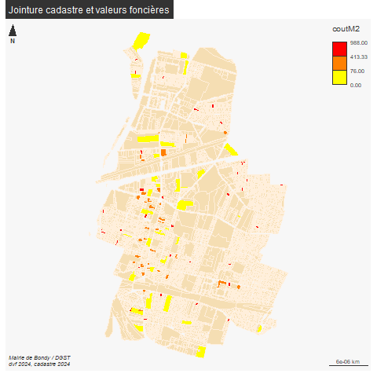

```{r setup, include=FALSE}
knitr::opts_chunk$set(eval  = FALSE)
knitr::opts_chunk$set(echo  = TRUE)
knitr::opts_chunk$set(warning  = FALSE)
``` 


```{r}
library(sf)
library(mapsf)
library(mapview)
```

# Objectif

On extrait pour chaque ville choisie par les étudiants :

- la géométrie de la ville d'après le cog (pb code insee)

- les plui manquants(exploitation de l'api geourbanisme)

- les données foncières à la parcelle


# Démarche

Pour les cog, pb Paris et codes postaux

Pour les plui, exploitation api PLUi

Pour les dvf :

- agrégation dvf à la parcelle (moyenne des transactions et élimination des aberrants)

- intersection zones urbaines et centroides parcelles  fichiers spatiaux

- jointure attributaire centroide, fichers de données


# Base cog


Définition de la liste des villes de base.

Une première définition a été faite mais on reprend la liste.

## Constitution de la liste 

à partir de la feuille d'émargement TD3


```{r}
# recup fichier ville en character pour les codes commençant par zéro
ville <- read.csv("data/constructionCours3.csv", colClasses = "character")
ville <- ville [,5]
# 57 villes différentes42 uniques 
ville <- unique(na.omit(ville))
ville <- ville [-1]
```

57 étudiants ont choisi 41 code insee différents.


## Première jointure


```{r}
fr <- st_read("data/gros/communes-20220101.shp")
# le code INSEE a 5 chiffres y compris le zéro
names(fr)
sel <- fr [fr$insee %in% ville,]
sel$insee
mapview(sel)
pb <- setdiff(ville, sel$insee)
```

11 pb dont codes insee Paris

## Paris

```{r}
Paris <- fr [fr$insee == "75056",]
pbParis <- pb [grep("^75", pb)]
mf_map(Paris)
# téléchargements arrondissements
paris <- st_read("data/gros/arrondissements.geojson")
mf_map(paris, add = T)
parisSel <- paris [paris$c_arinsee %in% pbParis,] 
mf_map(parisSel, add = T, col="red")
mf_label(parisSel, var = "l_ar")
```

5 arrondissements, 12, 15, 16, 18 et 20

Reste pb faux codes insee, grrrr

```{r}
pb <- pb [pb!=pbParis]
# encore un faux ami issu de Paris
pb <- pb [-4]
```

## Codes postaux

retrouver les code insee à partir des cp pour ces 5 communes
utilisation de l'api

```{r}
library(httr)
library(jsonlite)
equiv <- NULL
for (i in pb){
  rqt <- paste0("https://geo.api.gouv.fr/communes?codePostal=",i)
  res <- httr::GET(rqt)
# dans res, on remarque le status à 200, c'est ok. et le format json
  tmp <- fromJSON(rawToChar(res$content))
  equiv <- rbind(equiv, tmp)
}
str(equiv)
equiv$code
selPb <- fr [fr$insee %in% equiv$code,]
```


## Enregistrement


```{r}
sel <- rbind (sel, selPb)
sel <- sel [,c("insee", "nom")]
parisSel <- parisSel [,c("c_arinsee", "l_ar")]
names(parisSel)[1:2] <- c("insee", "nom")
tot <- rbind(parisSel, sel)
st_write(tot, "data/construction.gpkg", "villes", delete_layer = T)
```


dernière vérif

On a 1 ville en trop, mais c'était un cp Paris

```{r}
setdiff(ville, tot$insee)
pb
```


## Cartographie France

### Flux IGN dpt

Idée : utiliser les flux ign opur récupérer uniquement les dpt

```{r}
library(httr) # generic webservice package
library(ows4R) # interface pour services ogc
```


```{r}
wfs <- "https://data.geopf.fr/wfs/ows"
# connexion
dpt_client <- WFSClient$new(wfs, serviceVersion = "2.0.0")
```

format R6 OOP paradigme (objet$method())

On repère la couche dpt

```{r}
retour <- dpt_client$getFeatureTypes(pretty = TRUE)
retour [grep("departement", retour$title),]
```


```{r}
url <- parse_url(wfs)
url
url$query <- list(service = "wfs",
                  #version = "2.0.0", # facultative
                  request = "GetFeature",
                  typename = "BDCARTO_V5:departement",
                  outputFormat = "application/json"
                  )
request <- build_url(url)
data <- st_read(request)
```

```{r}
tot$dep <- substring(tot$insee,1,2)
dpt <- unique(names(table(tot$dep)))
```


```{r}
dptSel <- data [data$code_insee %in% dpt,]
```


## Carto


```{r, eval=FALSE}
png("img/communes.png")
mf_init(dptSel)
mf_map(data, col = "wheat2" , border = NA,add = T)
mf_map(dptSel, add = T, col = "antiquewhite1", border = "wheat")
mf_map(tot, col = "red", border = NA,add = T)
mf_label(tot, var = "dpt")
mf_layout("Communes choisies par les étudiants", credits = "IGN")
dev.off()
```


Nb de choix par zone

```{r}
table(tot$dep)
```


# PLUi

Certains étudiants ne sont pas parvenus à télécharger leur PLUi.
Essai de le télécharger via rqt wfs

```{r}
data <- read.csv("data/constructionChoixGroupe.csv")
table(data$PLUI, useNA = "always")
fr <- st_read("data/gros/communes-20220101.shp")
inseePlui <- unique(data$choix.de.la.commune..code.INSEE. [data$PLUI =="non"])
communesSel <- fr [fr$insee %in% (inseePlui),]
mapview(communesSel)
knitr::kable(communesSel [, c("insee", "nom"), drop = T], row.names = F)
```


WFS

pour mémoire, l'output standard pour un flux wfs est en GML.
OGC standard

```{r}
library(httr) # generic webservice package
library(ows4R) # interface pour services ogc
wfs <- "https://data.geopf.fr/wfs/ows"
plui_client <- WFSClient$new(wfs, serviceVersion = "2.0.0")
url <- parse_url(wfs)
url$query <- list(service = "wfs",
                  #version = "2.0.0", # facultative
                  request = "GetFeature",
                  typename = "wfs_du:habillage_surf",
                  outputFormat = "application/json"
                  )
request <- build_url(url)
data <- st_read(request)
table(data$partition)
dataSel <- data [data$partition == "DU_01075",]
mapview(dataSel)
```


```{r}
plui_client <- WFSClient$new(wfs, serviceVersion = "2.0.0")
plui_client
```
format R6 OOP paradigme (objet$method())

```{r}
plui_client$getFeatureTypes(pretty = TRUE)
```


```{r}
url$query <- list(service = "wfs",
                  #version = "2.0.0", # optional
                  request = "GetFeature",
                  typename = "region",
                  outputFormat = "application/json"
                  )
request <- build_url(url)
region <- st_read(request)
region$nom
mf_map(region [c(1:13),])
```


```{r}
bondy <- st_read("data/bvBondy.geojson")
bb <- st_bbox(bondy)
bb <- round(bb,0)
bbTransf <-paste0(bb, sep = ",", collapse = "")
nchar(bbTransf)
bbTransf <- substring(bbTransf, 1,nchar(bbTransf))

bbTransf <- paste0("\"", bbTransf, "\"")
```


```{r}
url$query <- list(service = "wfs",
                  #version = "2.0.0", # optional
                  request = "GetFeature",
                  typename = "BDGEODESIQUE:site",
                  #bbox = bbTransf,
                  outputFormat = "application/json"
                  #resultType = "hits"
                  )
request <- build_url(url)
res <- GET(request)
res
urba <- st_read(request)
```


# Valeurs foncières

## Filtre sur les villes

```{r}
cog <- st_read("data/construction.gpkg", "villes")
table(cog$insee)
# pas de souci hors métropole ou 0 quelque chose
vf <- read.csv("data/gros/ValeursFoncieres-2024-S1.txt", sep ="|", dec = ",", fileEncoding = "UTF-8")
```

attention gros fichier et pas de code INSEE


cas Paris, on change les codes insee

```{r}
cpParis <- gsub("751", "750", cog$insee [ grep("^75",cog$insee)])
cpParis
```


```{r}
library(httr)
library(jsonlite)
equiv <- NULL
for (c in cog$insee){
  rqt <- paste0("https://geo.api.gouv.fr/communes?code=",c)
  res <- httr::GET(rqt)
# dans res, on remarque le status à 200, c'est ok. et le format json
  tmp <- fromJSON(rawToChar(res$content))
  equiv <- rbind(equiv, tmp)
}
str(equiv)
# les codes postaux sont en liste car pl cp 
setdiff(cog$insee,equiv$code)
cp <- unlist(equiv$codesPostaux)
cp <- c(cpParis,cp, "93140")
```


On filtre les vf en excluant les dpt hors métropole et 
commençant par zéro

```{r}
names(vf)
vf$lg <- sapply(vf$Code.postal, nchar)
table(vf$lg)
# on supprime les !=2, on en a pas besoin
vf <- vf [vf$lg == 5,]
vf$dpt <- sapply(vf$Code.departement, nchar)
table(vf$dpt)
vf <- vf [vf$dpt == 2,]
```


```{r}
vfSel <- vf [vf$Code.postal %in% cp,]
length(unique(vfSel$Code.postal))
```

50 communes

```{r}
manquants <- setdiff(cp, vfSel$Code.postal)
```


```{r}
names(vfSel)
head(vfSel)
noms <- c("Code.postal", "Commune", "Valeur.fonciere", "Section", "No.plan")
write.csv(vfSel [,  noms], "data/vf.csv", fileEncoding = "UTF-8", row.names = F)
```


##  vf / parcelle : préparation à la jointure


la clé est numéro parcelle + nom section

On récupère le cadastre et jointure cadastre / vf

Il faut également agréger à la parcelle (moyenne)

### données et clé

```{r}
vf <- read.csv("data/vf.csv", fileEncoding = "UTF-8")
vf
vf$cle <- paste0(vf$Section, vf$No.plan)
vf <- vf [, -c(1,2)]
cog <- st_read("data/construction.gpkg", "villes")
library(R.utils)#gunzip
```


### Agrégation sur la parcelle


On va faire la moyenne des ventes, surfaces (bati et terrain)

Essai de type local

```{r}
names(vf)
class(vf$Valeur.fonciere)
summary(vf$Valeur.fonciere)
# Nettoyage
vf <- vf [!is.na(vf$Valeur.fonciere),]
```


```{r}
agg <- aggregate(vf [,c( "Valeur.fonciere")], by = list(cp= vf$Code.postal,
                                                        ville = vf$Commune, 
                                                        cle = vf$cle), 
                 mean, na.action=na.omit)
names(agg) [4] <- c("montantMoyen")
agg$montantCourt <- agg$montantMoyen /10000
write.csv(agg, "data/vfMoyenne.csv", fileEncoding = "UTF-8", row.names = FALSE)
hist(agg$montantCourt)
summary(agg$montantCourt)
plot(agg$montantCourt)
hist(agg$montantCourt [agg$montantCourt < 100])
```


La moyenne n'est peut-être pas la valeur la plus intéressante
car elle cache la valeur terrain nu et vente sur plan (cas Delattre)


```{r}
aggMax <- aggregate(vf [,c( "Valeur.fonciere")], 
                 by = list(cp= vf$Code.postal,                                                 ville = vf$Commune, 
                           cle = vf$cle), 
                 max)
summary(aggMax)
```

Peut-être plus facile à interpréter

```{r}
aggNb <- aggregate(vf [,c( "Valeur.fonciere")], 
                 by = list(cp= vf$Code.postal,                                                 ville = vf$Commune, 
                           cle = vf$cle), 
                 length)
names(aggNb)[4] <- "nb"
summary(aggNb)
write.csv(aggNb,"data/vfNb.csv", fileEncoding = "UTF-8")
```


On lie les deux

```{r}
vfNb <- read.csv("data/vfNb.csv", fileEncoding = "UTF-8")
vfMoy <- read.csv("data/vfMoyenne.csv", fileEncoding = "UTF-8")
```

```{r}
agg <- aggNb
vf93010 <- agg [agg$cp== 93140,]
vf93010
cadastre <- st_read("data/cadastre-93010-parcelles.json")
cadastre$cle <- paste0(cadastre$section, cadastre$numero)
joint <- merge(cadastre, vf93010, by = "cle")
joint$coutM2 <- round(joint$montantMoyen/st_area(joint$geometry),0)
library(units)
joint$coutM2 <- drop_units(joint$coutM2)
summary(joint$coutM2)
plot(joint$coutM2)
joint <- joint [joint$coutM2 < 1000,]
# 105
mapview(joint)
png("img/valeursFoncieres2024Bondy.png")
mf_map(cadastre, col = "wheat", border="antiquewhite1")

mf_choro(joint, nbreaks = 3, pal=rev(heat.colors(3)), var = "coutM2", border = NA, add = T)
mf_layout("Jointure cadastre et valeurs foncières", "Mairie de Bondy / DGST\ndvf 2024, cadastre 2024")
dev.off()
```




Enregistremetn poour récupérer les champs numériques

```{r}
joint <- st_drop_geometry(joint)
write.csv(joint, "data/gros/jointureVFCadastre.csv", fileEncoding = "UTF-8", row.names = F)
vf <- read.csv("data/gros/jointureVFCadastre.csv", fileEncoding = "UTF-8")
str(vf)
```


# Jointure spatiale

Espaces paysagers et zonage N

```{r}
ep <- st_read("data/")

```

# Jointure vfMoy et vfNb


```{r}
cle <- paste(vfMoy)
vf <- merge(vfMoy, vfNb [, c("cp","ville","cle", "nb")], by = c("cp","ville","cle"))
write.csv(vf,"data/vf.csv", fileEncoding = "UTF-8")
```


# Eclatement des fichiers par dpt


```{r}
vf <- read.csv("data/vf.csv", fileEncoding = "UTF-8")
vf$dpt <- substring(vf$cp,1,2)
dpt <- unique(vf$dpt)
for (d in dpt){
  tmp <- vf [vf$dpt == d,]
  write.csv(tmp, paste0("data/vf_", d, ".csv"), fileEncoding = "UTF-8")
}
```

