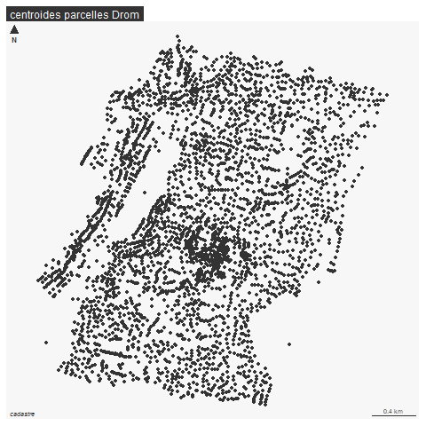

```{r setup, include=FALSE}
knitr::opts_chunk$set(eval  = FALSE)
knitr::opts_chunk$set(echo  = TRUE)
knitr::opts_chunk$set(warning  = FALSE)
``` 


```{r}
library(sf)
library(mapsf)
library(mapview)
```

# Objectif

On extrait pour chaque ville choisie par les étudiants :

- la géométrie de la ville d'après le cog (pb code insee)

- les plui manquants(exploitation de l'api geourbanisme)

- les données foncières à la parcelle


# Démarche

Pour les cog, pb Paris et codes postaux

Pour les plui, exploitation api PLUi

Pour les dvf :

- agrégation dvf à la parcelle (moyenne des transactions et élimination des aberrants)

- intersection zones urbaines et centroides parcelles  fichiers spatiaux

- jointure attributaire centroide, fichers de données


# Base cog


Définition de la liste des villes de base.

Une première définition a été faite mais on reprend la liste.

## Constitution de la liste 

à partir de la feuille d'émargement TD3


```{r}
# recup fichier ville en character pour les codes commençant par zéro
ville <- read.csv("data/constructionCours3.csv", colClasses = "character")
ville <- ville [,5]
# 57 villes différentes42 uniques 
ville <- unique(na.omit(ville))
ville <- ville [-1]
```

57 étudiants ont choisi 41 code insee différents.


## Première jointure


```{r}
fr <- st_read("data/gros/communes-20220101.shp")
# le code INSEE a 5 chiffres y compris le zéro
names(fr)
sel <- fr [fr$insee %in% ville,]
sel$insee
mapview(sel)
pb <- setdiff(ville, sel$insee)
```

11 pb dont codes insee Paris

## Paris

```{r}
Paris <- fr [fr$insee == "75056",]
pbParis <- pb [grep("^75", pb)]
mf_map(Paris)
# téléchargements arrondissements
paris <- st_read("data/gros/arrondissements.geojson")
mf_map(paris, add = T)
parisSel <- paris [paris$c_arinsee %in% pbParis,] 
mf_map(parisSel, add = T, col="red")
mf_label(parisSel, var = "l_ar")
```

5 arrondissements, 12, 15, 16, 18 et 20

Reste pb faux codes insee, grrrr

```{r}
pb <- pb [pb!=pbParis]
# encore un faux ami issu de Paris
pb <- pb [-4]
```

## Codes postaux

retrouver les code insee à partir des cp pour ces 5 communes
utilisation de l'api

```{r}
library(httr)
library(jsonlite)
equiv <- NULL
for (i in pb){
  rqt <- paste0("https://geo.api.gouv.fr/communes?codePostal=",i)
  res <- httr::GET(rqt)
# dans res, on remarque le status à 200, c'est ok. et le format json
  tmp <- fromJSON(rawToChar(res$content))
  equiv <- rbind(equiv, tmp)
}
str(equiv)
equiv$code
selPb <- fr [fr$insee %in% equiv$code,]
```


## Enregistrement


```{r}
sel <- rbind (sel, selPb)
sel <- sel [,c("insee", "nom")]
parisSel <- parisSel [,c("c_arinsee", "l_ar")]
names(parisSel)[1:2] <- c("insee", "nom")
tot <- rbind(parisSel, sel)
st_write(tot, "data/construction.gpkg", "villes", delete_layer = T)
```


dernière vérif

On a 1 ville en trop, mais c'était un cp Paris

```{r}
setdiff(ville, tot$insee)
pb
```


## Cartographie France

### Flux IGN dpt

Idée : utiliser les flux ign opur récupérer uniquement les dpt

```{r}
library(httr) # generic webservice package
library(ows4R) # interface pour services ogc
```


```{r}
wfs <- "https://data.geopf.fr/wfs/ows"
# connexion
dpt_client <- WFSClient$new(wfs, serviceVersion = "2.0.0")
```

format R6 OOP paradigme (objet$method())

On repère la couche dpt

```{r}
retour <- dpt_client$getFeatureTypes(pretty = TRUE)
retour [grep("departement", retour$title),]
```


```{r}
url <- parse_url(wfs)
url
url$query <- list(service = "wfs",
                  #version = "2.0.0", # facultative
                  request = "GetFeature",
                  typename = "BDCARTO_V5:departement",
                  outputFormat = "application/json"
                  )
request <- build_url(url)
data <- st_read(request)
```

```{r}
tot$dep <- substring(tot$insee,1,2)
dpt <- unique(names(table(tot$dep)))
```


```{r}
dptSel <- data [data$code_insee %in% dpt,]
```


## Carto


```{r, eval=FALSE}
png("img/communes.png")
mf_init(dptSel)
mf_map(data, col = "wheat2" , border = NA,add = T)
mf_map(dptSel, add = T, col = "antiquewhite1", border = "wheat")
mf_map(tot, col = "red", border = NA,add = T)
mf_label(tot, var = "dpt")
mf_layout("Communes choisies par les étudiants", credits = "IGN")
dev.off()
```


Nb de choix par zone

```{r}
table(tot$dep)
```


# PLUi

Certains étudiants ne sont pas parvenus à télécharger leur PLUi.
Essai de le télécharger via rqt wfs

```{r}
data <- read.csv("data/constructionChoixGroupe.csv")
table(data$PLUI, useNA = "always")
fr <- st_read("data/gros/communes-20220101.shp")
inseePlui <- unique(data$choix.de.la.commune..code.INSEE. [data$PLUI =="non"])
communesSel <- fr [fr$insee %in% (inseePlui),]
mapview(communesSel)
knitr::kable(communesSel [, c("insee", "nom"), drop = T], row.names = F)
```


WFS

pour mémoire, l'output standard pour un flux wfs est en GML.
OGC standard

```{r}
library(httr) # generic webservice package
library(ows4R) # interface pour services ogc
wfs <- "https://data.geopf.fr/wfs/ows"
plui_client <- WFSClient$new(wfs, serviceVersion = "2.0.0")
url <- parse_url(wfs)
url$query <- list(service = "wfs",
                  #version = "2.0.0", # facultative
                  request = "GetFeature",
                  typename = "wfs_du:habillage_surf",
                  outputFormat = "application/json"
                  )
request <- build_url(url)
data <- st_read(request)
table(data$partition)
dataSel <- data [data$partition == "DU_01075",]
mapview(dataSel)
```


```{r}
plui_client <- WFSClient$new(wfs, serviceVersion = "2.0.0")
plui_client
```
format R6 OOP paradigme (objet$method())

```{r}
plui_client$getFeatureTypes(pretty = TRUE)
```


```{r}
url$query <- list(service = "wfs",
                  #version = "2.0.0", # optional
                  request = "GetFeature",
                  typename = "region",
                  outputFormat = "application/json"
                  )
request <- build_url(url)
region <- st_read(request)
region$nom
mf_map(region [c(1:13),])
```


```{r}
bondy <- st_read("data/bvBondy.geojson")
bb <- st_bbox(bondy)
bb <- round(bb,0)
bbTransf <-paste0(bb, sep = ",", collapse = "")
nchar(bbTransf)
bbTransf <- substring(bbTransf, 1,nchar(bbTransf))

bbTransf <- paste0("\"", bbTransf, "\"")
```


```{r}
url$query <- list(service = "wfs",
                  #version = "2.0.0", # optional
                  request = "GetFeature",
                  typename = "BDGEODESIQUE:site",
                  #bbox = bbTransf,
                  outputFormat = "application/json"
                  #resultType = "hits"
                  )
request <- build_url(url)
res <- GET(request)
res
urba <- st_read(request)
```


# Valeurs foncières


```{r}
cog <- st_read("data/construction.gpkg", "villes")
table(cog$insee)
# pas de souci hors métropole ou 0 quelque chose
vf <- read.csv("data/gros/ValeursFoncieres-2024-S1.txt", sep ="|", dec = ",", fileEncoding = "UTF-8")
```

attention gros fichier et pas de code INSEE


cas Paris, on change les codes insee

```{r}
cpParis <- gsub("751", "750", cog$insee [ grep("^75",cog$insee)])
cpParis
```


```{r}
library(httr)
library(jsonlite)
equiv <- NULL
for (c in cog$insee){
  rqt <- paste0("https://geo.api.gouv.fr/communes?code=",c)
  res <- httr::GET(rqt)
# dans res, on remarque le status à 200, c'est ok. et le format json
  tmp <- fromJSON(rawToChar(res$content))
  equiv <- rbind(equiv, tmp)
}
str(equiv)
# les codes postaux sont en liste car pl cp 
setdiff(cog$insee,equiv$code)
cp <- unlist(equiv$codesPostaux)
cp <- c(cpParis,cp, "93140")
```


On filtre les vf en excluant les dpt hors métropole et 
commençant par zéro

```{r}
names(vf)
vf$lg <- sapply(vf$Code.postal, nchar)
table(vf$lg)
# on supprime les !=2, on en a pas besoin
vf <- vf [vf$lg == 5,]
vf$dpt <- sapply(vf$Code.departement, nchar)
table(vf$dpt)
vf <- vf [vf$dpt == 2,]
```


```{r}
vfSel <- vf [vf$Code.postal %in% cp,]
length(unique(vfSel$Code.postal))
```

50 communes

```{r}
manquants <- setdiff(cp, vfSel$Code.postal)
vfSel$cle <- cbind(vfSel$Section, vfSel$No.plan)
write.csv(vfSel, "data/vf.csv")
```


test bondy

```{r}
bondy <- vfSel [vfSel$Code.postal == "93140",]
summary(bondy$Valeur.fonciere)
hist(bondy$Valeur.fonciere)
# on se base sur le 3e quartile
bondySel <- bondy [bondy$Valeur.fonciere < 300000,]

# division par 1000
bondySel$Valeur.fonciere <- bondySel$Valeur.fonciere/1000
png("img/bondyvf.png")
hist(bondySel$Valeur.fonciere, col = "coral", border = " brown1",
     main = "Distribution des valeurs foncières inf 500 M à Bondy",
     xlab = "valeurs foncières (en milliers)",
     ylab = "nb")
dev.off()
```


Identification des gdes valeurs

```{r}
cher <- bondy [bondy$Valeur.fonciere > 300000,]
```


```{r}
names(vfSel)
head(vfSel)
noms <- c("Code.postal", "Commune", "Valeur.fonciere", "Section", "No.plan")
write.csv(vfSel [,  noms], "data/gros/vf.csv", fileEncoding = "UTF-8")
```


##  vf / parcelle : intégration du cadastre


On récupère le cadastre et jointure cadastre / vf


### données

```{r}
cog <- st_read("data/construction.gpkg", "villes")
library(R.utils)#gunzip
```


### traitement

Le cadastre est téléchargé par commune (etalab), dézippé et intersecté.
L'extraction va dans le bv.gpkg, une couche par commune


```{r}
dpt <- substring(cog$INSEE_COM,1,2)
code <- substring(cog$INSEE_COM,1,6)

# en cas de sous boucle. pour diminuer les communes concernés
dpt <- dpt [1]
code <- code [1]
i <-1
dpt <- "971"
code <- "97120"
nomZIP <- "cadastre-97120-parcelles.json.gz"
##### NE PAS JOUER

for (i in 1:length(dpt)){
  nomZIP <- paste0(dpt [i], "_", code [i],".gz")
  nomGEO <- paste0(dpt [i], "_", code [i],".geojson")
  print(paste0(i, "_",nomZIP))
  # pour éviter de télécharger pl fois test
  if (file.exists(nomZIP)==FALSE ){
    fic <- download.file(paste0("https://cadastre.data.gouv.fr/data/etalab-cadastre/2023-07-01/geojson/communes/", dpt [i],"/",code [i],"/cadastre-", code [i],"-parcelles.json.gz"), nomZIP)
  }
  
  exdir <- paste0("data/gros/cadastre/",nomGEO)
  # gunzip pour des gz
  gunzip(nomZIP, exdir, overwrite = T )
  cadastre <- st_read(paste0("data/gros/cadastre/",nomGEO))
  # 2154 obligatoire pour intersecter
  cadastre <- st_transform(cadastre,2154)
  # extraction bv
  bvSel <- bv [bv$insee == code [i],]
  # intersection avec bv
  inter <- st_intersection(bvSel [, c("bureau")], st_centroid( cadastre [, c("section", "numero")]))
  st_write(inter, "data/gros/bv.gpkg", paste0("bv_",code [i]), delete_layer = T)
}
```


### Union

```{r}
lireGPKG <- function(numCouche){
  fic <- st_layers("data/gros/bv.gpkg")
  couche <- fic$name
  cadastre <- st_read("data/gros/bv.gpkg", couche [numCouche])
  cadastre$INSEE_COM <- substring(couche [numCouche], 4, 8)
  st_write(cadastre, "data/gros/geoInter.gpkg", "cadastre", append = T )
}
couche <- c(1:74)
lapply(couche, lireGPKG)
```


### vérif

Drom 1 seul bv, on intersecte à la parcelle

```{r}
data <- st_read("data/gros/geoInter.gpkg", "cadastre")
choix <- data [data$INSEE_COM == '01150',]
png("img/dromCadastre.png")
mf_map(choix)
mf_layout("centroides parcelles Drom", "cadastre")
dev.off()
```





## lgt / iris : prorata

Croisement iris / bv

### Cartographie : Iris et bureaux de vote

```{r}
fond <- st_read("data/gros/DEPARTEMENT.shp")
fond <- st_transform(fond, 2154)
```


```{r}
png("img/idF.png", height = 2400, width = 2400, res = 400)
fond <- fond [fond$INSEE_REG == 11,]
mf_init(fond [fond$INSEE_DEP == 75,])
mf_map(fond, col = "antiquewhite1", border = "pink", add = T)
mf_map(iris, col= "cornsilk", border = "blue", lwd = 2, add = T)
mf_map(bv, col = NA, border = "coral", add = T)
etik <- iris [!duplicated(iris$INSEE_COM),]
mf_label(etik, var = "NOM_COM",overlap = F, lines = T, halo = T )
mf_layout("iris, bureaux de vote et proche banlieue", "ign")
dev.off()
```


### Traitement

Les iris sont plus gros que les bureaux de vote, donc on prend les centroides 
des bureaux de vote.

Puis on divise par l'iris par le prorata du bv / aire de l'iris

```{r}
inter <- st_intersection(iris, st_centroid(bv) )
bvC <- st_centroid(bv)
```


```{r}
code <- cog$INSEE_COM
for (c in code){
  print(c)
  interSel <- inter [inter$INSEE_COM == c,]
  irisSel <- unique (interSel$CODE_IRIS)
  for (i in irisSel){
    aireIris  <- st_area(iris$geom [iris$CODE_IRIS == i])/10000
    inter$prorata [inter$INSEE_COM == c & inter$CODE_IRIS == i] <- inter$aire [inter$INSEE_COM == c & inter$CODE_IRIS == i]  / sum(inter$aire  [inter$INSEE_COM == c & inter$CODE_IRIS == i])
    inter$prorataIris [inter$INSEE_COM == c & inter$CODE_IRIS == i] <- aireIris * inter$prorata [inter$INSEE_COM == c & inter$CODE_IRIS == i] 
}
}
```

### Quelques verif

Bondy

```{r}
# verif sur Bondy
code <-"93010"
# on rejoue la boucle
i <-irisSel [1]
table(inter$CODE_IRIS [inter$NOM_COM == 'Bondy'])
inter [inter$INSEE_COM == '93010'&  inter$CODE_IRIS == '930100202' ,]
st_area(iris$geom [iris$CODE_IRIS == '930100202'])/10000
17*0.42
# le prorata est le rapport entre surface par rapport à la surface totale
# le prorata iris est la verif sur la surface.
# verif sur pointe à pitre... il n'y a pas d'iris pap normalement
inter [inter$INSEE_COM == '97120',]
inter$prorata <- round(inter$prorata, 2)
```


```{r}
st_write(inter, "data/gros/geoInter.gpkg", "iris", delete_layer = T)
```


Autre cas d'école Arpajon et Miribel


```{r}
bvSel <- bv [bv$nom == "Arpajon",]
interSel <- inter [inter$NOM_COM == 'Arpajon',] 
png("img/arpajon.png")
mf_map(bvSel, "typo", var = "bureau", border = NA)
mf_map(iris, col = NA, lwd = 2, border = "red", add = T)
mf_label(interSel, var = "prorata", col = "red")
mf_layout("Arpajon : Prorata bv sur aire Iris...", "ign et calculs fous")
dev.off()
```


```{r}
bvSel <- bv [bv$nom == "Miribel",]
interSel <- inter [inter$NOM_COM == 'Miribel',] 
png("img/miribel.png")
mf_map(bvSel, "typo", border = NA, var = "bureau")
mf_map(iris, col = NA, lwd = 2, border = "red", add = T)
mf_label(interSel, var = "prorata", col = "red")
mf_layout("Miribel : Prorata bv sur aire Iris...", "ign et calculs fous")
dev.off()
```


Guadeloupe

```{r}
guadeloupe <- iris [iris$INSEE_COM == "97120",]
png("img/guadeloupe.png")
mf_init(guadeloupe)
bvG <- bv [bv$insee == "97120",]
mf_map(bvG,  "typo", var = "bureau",add = T, leg_pos = "", border = NA)
mf_map(guadeloupe, col = NA, border = "red", add = T)
mf_label(interSel, "prorata", halo = T, cex = 1.5)
mf_layout("Guadeloupe : IRIS et bureaux", "REU, Frédérique Rodrigo")
dev.off()
```


## bv / car : sans pb

```{r}
carC <- st_centroid(car)
inter <- st_intersection(bv, carC)
# il peut y avoir pl carreaux dans un bv mais pas pl bv dans un carreau
names(inter)
st_write(inter, "data/gros/geoInter.gpkg", "car", delete_layer = T)
```

On recherche les carreaux pour 01150

```{r}
interChoix <- inter [inter$insee == "01150",]
#interChoix$ind
bvChoix <- bv [bv$insee == "01150",]
png("img/drom.png")
mf_map(bvChoix)
mf_map(cadastre, col = NA, border ="pink", add = T)
mf_map(car, type = "choro", var = "ind", add = T)
mf_layout("Drom, 15 carreaux, 3495 parcelles et 1 bv", "opendata")
dev.off()
```


# Jointure et agrégation au bv des données texte

## données

### csv

On vérifie les décimales

```{r}
election2022 <- read.csv("data/devoirMaison/election2022.csv", fileEncoding = "UTF-8")
str(election2022$INSEE_COM)
# 2148 dec ok
vf <- read.csv("data/gros/vf.csv", fileEncoding = "UTF-8", colClasses = "character")
str(vf)
# nécessité character pour code insee
# test sur Drom
vf [vf$cog == "01150",]
lgt <- read.csv("data/gros/lgt.csv", fileEncoding = "UTF-8")
str(lgt)
#rpls <- list.files("data/gros/RPLS")
cog <- read.csv("data/cog.csv", fileEncoding = "UTF-8")
str(cog)
```

Pas de donnée csv dans les carreaux, elles sont déjà dedans

Pour chaque fichier attention au cog, cette fois ci on le passe en num partt


### Spatial


Tout est dans geoInter.gpkg

```{r}
st_layers("data/gros/geoInter.gpkg")
car <- st_read("data/gros/geoInter.gpkg", "car") # 14964
iris <- st_read("data/gros/geoInter.gpkg", "iris") # 2123
cadastre <- st_read("data/gros/geoInter.gpkg", "cadastre")# 2 M
```


## Verif

```{r}
setdiff(cog$INSEE_COM, iris$INSEE_COM)
car$bureau
```

Pb sur tous les codes insee zéro sf dans les iris


## Traitement

### car

Il y a plusieurs carreaux pour un meme bureau de vote.
On somme les valeurs (il s'agit des ménages fiscaux par bv)

```{r}
names(car)
v <- names(car)[11:38]
agg <- aggregate(car [, v], by = list(car$bureau), sum)
names(agg)[1] <- "bureau"
agg <- st_drop_geometry(agg)
str(agg) # verif num partout
write.csv(agg,"data/devoirMaison/filosofi.csv", fileEncoding = "UTF-8", row.names = F)
```

Verif

voir debug


### vf

#### Jointure

Constitution des clés pour la jointure 

```{r}
str(cadastre)
cadastre$cle <- paste0(cadastre$INSEE_COM, "_", cadastre$section, cadastre$numero)
str(vf)
vf$cle <- paste0(vf$cog, "_", vf$Section, vf$No.plan)
vf$cle
```


670 M et 190 M enregistrements


```{r}
joint <- merge(cadastre, vf, by = "cle")
```


189 549...
170 M
445 M
513 M

Enregistremetn poour récupérer les champs numériques

```{r}
joint <- st_drop_geometry(joint)
write.csv(joint, "data/gros/jointureVFCadastre.csv", fileEncoding = "UTF-8", row.names = F)
vf <- read.csv("data/gros/jointureVFCadastre.csv", fileEncoding = "UTF-8")
str(vf)
```


#### Agrégation


On va faire la moyenne des ventes, surfaces (bati et terrain)

Essai de type local

```{r}
names(vf)
v <- names(vf)[c(10,38,39,42)]
str (vf[,v])
agg <- aggregate(vf [,v], by = list(vf$bureau), mean, na.rm=T, na.action=NULL)
names(agg)[1] <- "bureau"
agg <- st_drop_geometry(agg)
write.csv(agg, "data/devoirMaison/vfMoyenne.csv", fileEncoding = "UTF-8", row.names = FALSE)
```

# 1897


Verif sur 97120


```{r}
ind <- grep("97120", agg$bureau)
agg [ind,]
```


### IRIS

On fait la jointure puis on proratise la valeur avec le prorata


2091


La jointure se fait sur le code IRIS pb zéro

```{r}
table(sapply((iris$CODE_IRIS), nchar))
table(sapply(lgt$IRIS, nchar))
lgt$n <- sapply(lgt$IRIS, nchar)
lgt$IRIS [lgt$n ==8 ] <- paste0("0", lgt$IRIS [lgt$n==8])
```


```{r}
iris
str(lgt$IRIS)
str(iris$CODE_IRIS)
```

1365 et 2079 et 2123

```{r}
joint <- merge(iris, lgt, by.x = "CODE_IRIS", by.y = "IRIS")
```

2121
On en a perdu 2

```{r}
setdiff(cog$INSEE_COM, joint$INSEE_COM)
# ms pas de commune perdue
lgt$COM
lgt$IRIS [lgt$COM == "1249"]
iris [iris$CODE_IRIS == "12490101",]
iris [iris$NOM_COM == "Miribel",]
```


attention bureau unique à DROM 01150_1


```{r}
names(joint)
str(joint)
# tout est en numérique
joint <- st_drop_geometry(joint)
col <- NULL
v <- "prorata"
tmp <- NULL
nom <- NULL
for (v in var){
  tmp <- ( joint[,v])
  col <- cbind(col, tmp)
 nom <- c(nom, v)
}
# on a une matrice, on utilise la colonne prorata pour tt traiter
prorata <- (joint [,"prorata"])
data <- prorata*col
data <- as.data.frame(data)
names(data) <- nom
data <- cbind(joint$bureau, data)
names(data)[1] <- "bureau"
write.csv(data, "data/devoirMaison/lgt.csv", fileEncoding = "UTF-8", row.names = F)
```

2121

## Traitement final : concaténation de tous les fichiers.


### Données 

```{r}
cog <- read.csv("data/cog.csv", fileEncoding = "UTF-8")
```


### Vérification

pour chacun des fichiers, on vérifie le nb de communes concernées et le code bureau.


```{r}
fic <- list.files("data/devoirMaison/")
fic
# elimination des 3 premieres valeurs qui sont les résultats
fic <- fic [-c(1:3)]
for (f in fic){
  print(f)
  tmp <- read.csv(paste0("data/devoirMaison/", f), fileEncoding = "UTF-8")
  assign(f, tmp)
}
# élection
names(election.csv)[8] <- "bureau"
length(unique(election.csv [, c("INSEE_COM")]))
# filosofi.csv
filosofi.csv$INSEE_COM <- substring(filosofi.csv$bureau,1,5)
length(unique(filosofi.csv$INSEE_COM))
filosofi.csv$bureau
# normal il manque pointe à pitre
#lgt.csv
names(lgt.csv)
lgt.csv$INSEE_COM <- substring(lgt.csv$bureau, 1,5)
length(unique(lgt.csv$INSEE_COM))
```


### Traitement


```{r}
fic <- list.files("data/devoirMaison/")
fic <- fic [-c(1:4)]
fin <- election.csv
# 2133
fin$bureau
f <- fic [1]
for (f in fic){
  print(f)
  tmp <- read.csv(paste0("data/devoirMaison/", f), fileEncoding = "UTF-8", dec =",")
  fin <- merge(tmp,fin, by = "bureau", all.x = T)
}
write.csv(fin,"data/devoirMaison/base.csv", fileEncoding = "UTF-8", row.names = FALSE)
length(unique(fin$Libellé.de.la.commune))
names(fin)
```

2204 obs

64 communes


Vérification

```{r}
fin <- na.omit(fin)
```

1909 avt
1838

```{r}
bondy <- na.omit(fin [fin$INSEE_COM == "93010",])
bondy
election.csv$bureau [election.csv$Libellé.de.la.commune == 'Bondy']
bondyFilo <-filosofi.csv$bureau [filosofi.csv$INSEE_COM == '93010']
```

```{r}
car <- st_read("data/gros/geo.gpkg", "car")
bv <-st_read("data/gros/geo.gpkg", "bvValide")
bv$numBureau <- substring(bv$bureau, 7,8)
bondy <- bv [bv$insee == '93010',]
carBondy <- car [car$cog == '93010',]
carBondyC <- st_centroid(carBondy)
bondyC <- st_centroid(bondy)
mf_init(bondy)
mf_map(bondy, type = "typo", var ="bureau", add = T, border = "red", lwd=2)
mf_map(carBondy, add = T, col=NA)
mf_map(carBondyC, add = T)
mf_label(bondy, var = "numBureau", col = "red", halo = T, overlap = T)
# Cela signifie qu'un bv n'a aucun centroide de carreau sur son territoire.
# je n'arrive pas à le voir sur la carte
# TODO les carreaux couvrent le territoire
setdiff(bondy$bureau, bondyFilo )
inter <-st_intersection(bondy [, c("bureau")], st_centroid(carBondy [, c("idcar_200m")]))
length(unique(inter$bureau))
# il y a bien 32 bureaux : refaire l'intersection bureau carreau
```


On a perdu un bv...


```{r}
setdiff(cog$INSEE_COM, fin$INSEE_COM)
setdiff(cog$INSEE_COM, election.csv$Code.de.la.commune)
```


## Pb des NA sur la base


```{r}
base <- read.csv("data/devoirMaison/base.csv", fileEncoding = "UTF-8")
base <- na.omit(base)
bondy <- base [base$INSEE_COM == '93010',]
write.csv(base, "data/devoirMaison/base.csv", row.names = F, fileEncoding = "UTF-8")
```

