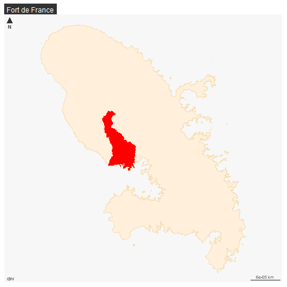
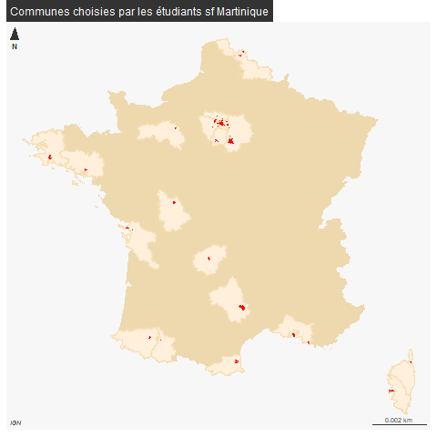
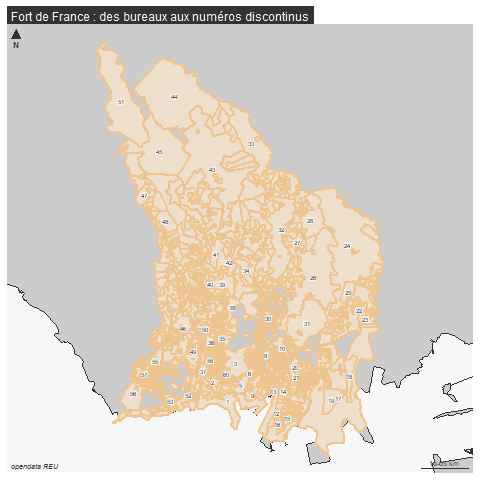

```{r setup, include=FALSE}
knitr::opts_chunk$set(eval  = FALSE)
knitr::opts_chunk$set(echo  = TRUE)
knitr::opts_chunk$set(warning  = FALSE)
``` 


```{r}
library(sf)
library(mapsf)
library(mapview)
```

# Objectif

On extrait pour chaque ville choisie par les étudiants :

- la géométrie de la ville d'après le cog (pb code insee)

- les bv

- les données électorales au bv

- les carreaux 1 km de filosofi

- les iris


# Base cog


Définition de la liste des villes de base.

Une première définition a été faite au 1er cours mais on reprend la liste du td3

## Première définition


```{r}
library(sf)
library(mapsf)
library(mapview)
```

52 communes

```{r}
bv$insee <- substring(bv$bureau,1,5) 
bvSel <- bv [bv$insee %in% communes,]
```

1255 bureaux

Vérification sur Paris


```{r}
paris <- unique(communes [grep('^75', communes)])
bvSelParis <- bvSel [grep("^75", bvSel$insee),]
mapview(bvSelParis, zcol="insee")
```

Seulement 2 arr alors que 3 éléments ds Paris

Export des mails concernés

```{r}
pbParis <- vendredi$adresseMail [vendredi$code.INSEE..minimum.10.bureaux. == '75056']
write.csv(pbParis, "data/pbParis.csv", fileEncoding="UTF-8")
paste0(pbParis, ";", collapse = "")
```

Correction suite réponse

```{r}
pbParisCorrige <- read.csv("data/pbParisCorrige.csv")
insee <- pbParisCorrige$correction [!is.na (pbParisCorrige$correction)]
bvSelParis <- bv [bv$insee %in% insee,]
table(bv$insee %in% insee)
```

```{r}
bvSel <- rbind(bvSel,bvSelParis)
```


```{r}
st_write(bvSel, "data/bv.gpkg", "bvVendredi", delete_layer = T)
bvSel <- st_read("data/bv.gpkg", "bvVendredi")
bvSel <- bvSel [ st_is_valid(bvSel$geom),]
agg <- aggregate(bvSel [,c("nom", "geom")], list(bvSel$insee, bvSel$nom), length)
names(agg)  [1:3] <- c("insee", "nom", "nbBureaux")
st_write(agg, "data/bv.gpkg", "bvVendrediAgg", delete_layer = T)
mapview(agg)
```

Manquants par rapport à la liste de départ


```{r}
pb <- setdiff(communes, agg$insee)
pb
# on enlève paris
pb  <- pb [-5]
bvPb <- bv [bv$insee %in% pb,]
# 29232 pour 29000 (Quimper), 66135 Perillos, 69123 Lyon, Croix Chapeau 1 bureau 71136
# Corrèze 19062 / Ajjaccio 2A004
unique(bvPb$nom)
table(bvPb$insee)
vendredi [vendredi$code.INSEE..minimum.10.bureaux. %in% bvPb$insee, c(1,2,3)]
```

Remplacements


```{r}
hist(table(bvSel$insee), main = "Nb de bureaux de vote", xlab = "Nb de bureaux", ylab = "Nb d'étudiants" )
table(bvSel$insee)
```


## Liste TD3

à partir de la feuille d'émargement TD3


```{r}
# recup fichier ville en character pour les codes commençant par zéro
ville <- read.csv("data/TD3Concept.csv", colClasses = "character", fileEncoding = "UTF-8")
ville <- ville [ville$prénom!="",]
ville <- ville [,2]
# 57 villes différentes 49 uniques 
ville <- unique(na.omit(ville))
# On rajoute Champs sur Marne, Perpignan, Paris 19, Bondy, Paris 15, Lourdes
ville <- c(ville,"77083", "66136", "75119","93010","75115", "65286")
```

55 villes uniques y compris bondy


### Dézippage fichier communes

Une fois suffit... mais comme on travaille sur gros...

```{r}
unzip(zipfile = "data/gros/communes-20220101-shp.zip", exdir = "data/gros")
```


### Première extraction


```{r}
fr <- st_read("data/gros/communes-20220101.shp")
# le code INSEE a 5 chiffres y compris le zéro
names(fr)
sel <- fr [fr$insee %in% ville,]
sel$insee
# 43
mapview(sel)
# attention une ville en DROM
(pb <- setdiff(ville, sel$insee))
```

12 pb dont codes insee Paris

### Paris

```{r}
Paris <- fr [fr$insee == "75056",]
pbParis <- pb [grep("^75", pb)]
mf_map(Paris)
# téléchargements arrondissements
paris <- st_read("data/arrondissements.geojson")
mf_map(paris, add = T)
parisSel <- paris [paris$c_arinsee %in% pbParis,] 
mf_map(parisSel, add = T, col="red")
mf_label(parisSel, var = "l_ar")
```

7 arrondissements, 12, 15, 16, 17, 18, 19 et 20

Reste pb faux codes insee, grrrr

```{r}
pb <- pb [!(pb  %in% pbParis)]
```

### Codes postaux

retrouver les code insee à partir des cp pour ces 5 communes
utilisation de l'api

```{r}
library(httr)
library(jsonlite)
```


```{r}
equiv <- NULL
for (i in pb){
  print(i)
  rqt <- paste0("https://geo.api.gouv.fr/communes?codePostal=",i)
  res <- httr::GET(rqt)
# dans res, on remarque le status à 200, c'est ok. et le format json
  tmp <- fromJSON(rawToChar(res$content))
  equiv <- rbind(equiv, tmp)
}
str(equiv)
equiv$code
selPb <- fr [fr$insee %in% equiv$code,]
selPb <- selPb [,c("insee", "nom")]
```


Reste la commune de Perillos et Ajaccio

```{r}
#66135
# Remplacement par Perpignan
#2A004
selCorse <- fr [fr$insee == "2A004", c("insee", "nom")]
```


### Enregistrement


```{r}
sel <- sel [,c("insee", "nom")]
sel <- rbind (sel, selCorse, selPb)
parisSel <- parisSel [,c("c_arinsee", "l_ar")]
names(parisSel)[1:2] <- c("insee", "nom")
tot <- rbind(parisSel, sel)
st_write(tot, "data/concept.gpkg", "ville", delete_layer = T)
```

53 villes y compris Bondy

vérifier Perpignan Lourdes et 15e

### Dernière vérif

On a 2 villes en moins, mais c'est normal

```{r}
setdiff(ville, tot$insee)
mapview(tot)
```

### Population et nom ville

On veut également récupérer la population des villes (pour comparaison avec votants 
plus loin)


pb sur les cp Paris

La donnée est bizarrement difficile à trouver.
Chat gpt renvoie sur les données santé (ARS), du coup on fait deux jointures


#### ARS

```{r}
data <- read.csv("data/t-popref-com.csv")
data <- data [,c("com_code", "popref_tot")]
tot <- st_read("data/concept.gpkg", "ville")
joint <- merge(tot [,1], data, all.x=T, by.x = "insee", by.y="com_code")
st_write(joint, "data/concept.gpkg", "ville", delete_layer = T)
```


#### Insee

```{r}
equiv <- NULL
insee <- tot$insee
for (i in insee){
  print(i)
  rqt <- paste0("https://geo.api.gouv.fr/communes?code=", i)
  res <- httr::GET(rqt)
# dans res, on remarque le status à 200, c'est ok. et le format json
  tmp <- fromJSON(rawToChar(res$content))
  equiv <- rbind(equiv, tmp)
}
str(equiv)
tot$insee
equiv$code
tot$dep <- substring(tot$insee,1,2)
```

##### Cas Paris

```{r}
equiv[equiv$code == 75056,]
jointParis <- merge(tot [, c("insee", "popref_tot", "dep")], equiv[equiv$code == 75056,], all.x=F, by.y = "codeDepartement", by.x="dep")
jointParis
```

##### Le reste

```{r}
jointReste <- merge(tot [, c("insee", "popref_tot", "dep")], 
                    equiv[equiv$code != 75056,], all.x=F, by.y = "code", by.x="insee")
names(jointReste)
names(jointParis)
nom <- names(jointReste)
nom <- nom [-c(5,9)]
nom
jointParis <- jointParis [,nom]
jointReste <- jointReste [,nom]
joint <- rbind(jointParis, jointReste)
st_write(joint, "data/concept.gpkg", "ville", delete_layer = T)
```


## Cartographie France

### Flux IGN dpt

Idée : utiliser les flux ign opur récupérer uniquement les dpt

```{r}
library(httr) # generic webservice package
library(ows4R) # interface pour services ogc (long à télécharger)
```


chargement couche ville

```{r}
tot <- st_read("data/concept.gpkg", "ville")
```


```{r}
wfs <- "https://data.geopf.fr/wfs/ows"
# connexion
dpt_client <- WFSClient$new(wfs, serviceVersion = "2.0.0")
```

format R6 OOP paradigme (objet$method())

On repère la couche dpt

```{r}
retour <- dpt_client$getFeatureTypes(pretty = TRUE)
retour [grep("departement", retour$title),]
```


```{r}
url <- parse_url(wfs)
url
url$query <- list(service = "wfs",
                  #version = "2.0.0", # facultative
                  request = "GetFeature",
                  typename = "BDCARTO_V5:departement",
                  outputFormat = "application/json"
                  )
request <- build_url(url)
data <- st_read(request)
# pb Fort de France, on coupe le dpt
which(tot$insee == "97209")
data [grep("^97",data$code_insee),]
data$code_insee [data$code_insee == 972] <- "97"
#data <- data [-c(97,99:101)]
```

```{r}
table(tot$dep)
dpt <- unique(names(table(tot$dep)))
```


```{r}
dptSel <- data [data$code_insee %in% dpt,]
```


## Carto

2 cartos car Fort de France

```{r}
png("img/communeConcept.png")
dptSel1 <- dptSel [dptSel$code_insee == "97",]
mf_init(dptSel1)
mf_map(data, col = "wheat2" , border = NA,add = T)
mf_map(dptSel, add = T, col = "antiquewhite1", border = "wheat")
mf_map(tot, col = "red", border = NA,add = T)
#mf_label(tot, var = "dpt")
mf_layout("Fort de France", credits = "IGN")
dev.off()
```


```{r, eval=FALSE}
png("img/communeConcept2.png")
dptSel2 <- dptSel [dptSel$code_insee != "97",]
mf_init(dptSel2)
mf_map(data, col = "wheat2" , border = NA,add = T)
mf_map(dptSel, add = T, col = "antiquewhite1", border = "wheat")
mf_map(tot, col = "red", border = NA,add = T)
#mf_label(tot, var = "dpt")
mf_layout("Communes choisies par les étudiants sf Martinique", credits = "IGN")
dev.off()
```



Nb de choix par zone

```{r}
table(tot$dep)
```


```{r}
tot [is.na(tot$codeRegion),]
```


# BV contours

On teste les contours INSEE et ceux de Rodrigo avec OSM
Le format "pmtiles" s'ouvre très bien mais le fichier a un carroyage.

```{r}
ville <- st_read("data/concept.gpkg", "ville")
ville$nom
```

53 communes

```{r}
# RODRIGO
bv <- st_read("data/gros/bureau.pmtiles")
# le pmtiles pose pb
bv <- st_read("data/gros/bureau-de-vote-insee-reu-openstreetmap.gpkg")
```

68596


```{r}
#bv <- st_read("data/gros/bv.geojson")
bvBondy <- bv [bv$insee == 93010, c("insee", "nom", "bureau")]
# doublons
bvBondy <- unique(bvBondy)
mapview(bvBondy)
st_write(bvBondy,"data/concept.gpkg", "bvBondy", delete_layer = T)
```


```{r}
bvCourt <- bv [!is.na(bv$bureau), c("insee", "nom", "bureau")]
# 40 303 villes avec plus d'un bureau
# pb des insee arrondissements, on recopie les codes insee des bureaux
bvCourt$insee <- substring(bvCourt$bureau,1,5) 
bvSel <- bvCourt [bvCourt$insee %in% ville$insee,]
```


1863


### Vérifications


sur Paris


```{r}
bvSelParis <- bvSel [grep("^75", bvSel$insee),]
mapview(bvSelParis, zcol="insee")
```

Lourdes


```{r}
bvSel [bvSel$nom == "Lourdes",]
```


```{r}
st_write(bvSel, "data/concept.gpkg", "bv", delete_layer = T)
bvSel <- st_read("data/concept.gpkg", "bv")
# pb géométrie : 11 bureaux
bvSelGeometrie <- bvSel [ !st_is_valid(bvSel$geom),]
bvSelGeometrie
bvSel <- bvSel [ st_is_valid(bvSel$geom),]
# On ne peut les laisser pour l'agrégation
agg <- aggregate(bvSel [,c("nom", "geom")], list(bvSel$insee, bvSel$nom), length)
names(agg)  [1:3] <- c("insee", "nom", "nbBureaux")
st_write(agg, "data/concept.gpkg", "bvAgg", delete_layer = T)
mapview(agg)
```

1852 bureaux

50 communnes

```{r}
pb <- setdiff(ville$insee, agg$insee)
pb
pb  <- pb [-3]
# Croix Chapeau et Corrèze
bvPb <- bv [bv$insee %in% pb, c("insee", "nom", "bureau")]
bvFin <- rbind(bvSel, bvPb)
```


1854 bureaux

```{r}
st_write(bvFin, "data/concept.gpkg", "bv", delete_layer = T)
```

tous valides !

## Distributions des bureaux

```{r}
vendredi <- read.csv("data/baseGeomatique.csv")
vendredi <- vendredi [vendredi$prénom != "",]
(tab <- sort(table (bvSel$insee)))
nb <- length(names(tab))
png("img/distributionBureauGeomatique.png")
hist(tab, main = paste0("Distribution du nombre de bureaux\n choix communes des ", length(vendredi$prénom)," étudiants"),
     sub = paste0(length(bvSel$insee), " bureaux au total pour ",nb," communes"),
     col = "coral", border = NA,
     xlab = "nb de bureaux",
     ylab = "nb de villes")
dev.off()
```


## Rapport nb bureaux taille ville


Il faut la population

```{r}
# récupération de la population par ville
df <- as.data.frame(tab) 
df
names(df) <- c("insee", "nbBureaux")
joint <- merge(ville, df, by = "insee")
joint [order(joint$population, decreasing = T),]
joint$population <- joint$population/1000
png("img/bvPOP.png")
plot(joint$nbBureaux, joint$population, col="coral3", pch = 20,
     xlab = "Nb de bureaux", ylab = "population (en milliers)")
# on soustrait les 2 valeurs.
joint <- joint [joint$population < 80,]
modele <- lm(population~nbBureaux, joint)
abline(modele, col = "darkgoldenrod1")
dev.off()
```


#### Cas particulier

La plus grosse ville c'est Lille

### Lille


```{r}
adresseBV <- read.csv("data/table-bv-reu.csv")
# 50 122
lille <- adresseBV [ grep('^59350',adresseBV$id_brut_insee),]
sort(lille$code)
write.csv (lille, "data/lilleBV.csv")
```


```{r}
lilleContour <- bv [bv$insee == 59350,]
mapview(lilleContour)
```


## Nettoyage

```{r}
bv <- st_read("data/concept.gpkg", "bv")
# 1854
bv2 <- bv [st_is_valid(bv),]
# 1854
bv2 <- st_cast(bv, "POLYGON")
#  4159 Du coup, pl polygone pour un bureau on supprime les petits poly
st_area(bv2)
st_crs(bv2)
bv2 <- st_transform(bv2,2154)
bv2$aire <- st_area(bv2)/10000
library(units)
bv2$aire <- drop_units(bv2$aire)
bv2 <- bv2 [bv2$aire > 5,]
```

1759, puis 1681 à la fin


Comparaison en terme de nb de bv

```{r}
bvTab <- table(bv$insee)
bv2Tab <- table(bv2$insee)
#On compare les 2 tableaux
sort(bvTab - bv2Tab)
```


Pas mal de perte, il faut regarder dans le détail, on tolère une différence de 3 bureaux.

```{r}
pb <- ville [ville$insee == 97209,]
```
Aie.

### Fort de France


```{r}
bv <- st_read("data/concept.gpkg", "bv")
mart <- bv [bv$nom == 'Fort-de-France',]
png("img/pbFortDeFrance.png")
mf_init(mart)
mf_map(dptSel, type = "base", bg = "cadetblue2", add = T)
#mf_map(fond, col = "antiquewhite1", border = "burlywood2", bg ="cadetblue2", add = T)
mf_map(mart, col = "antiquewhite2", border = "burlywood2", lwd = 2, add = T)
mart$bureau2 <- substring(mart$bureau,7,9)
mf_label(mart, var = "bureau2", cex = 0.5, halo = T)
mf_layout("Fort de France : des bureaux aux numéros discontinus", "opendata REU")
dev.off()
```




A voir au cas par cas.

```{r}
st_write(bv2, "data/concept.gpkg", "bvValide", delete_layer = T)
```


1681 bureaux enregistrés


### Nettoyage géométrie

sous Qgis, on passe sous éditeur de sommet, on efface les points
et on passe points to line

```{r}
bvBondy <- bv2 [bv2$insee == '93010',]
bvBondy <- st_union(bvBondy)
enveloppe <- st_convex_hull(bvBondy)
mf_map(enveloppe)
mf_map(bvBondy, add = T)
st_write(bvBondy, "data/concept.gpkg", "aggBondy", delete_layer = T)
st_write(enveloppe, "data/concept.gpkg", "enveloppeBondy", delete_layer = T)
```


nettoyage par la longueur de ligne

```{r}
ligne <- st_cast(bvBondy, "MULTILINESTRING")
ligne <-  st_cast(ligne, "LINESTRING")
ligne <- st_as_sf(ligne)
ligne$longueur <- st_length(ligne)
library(units)
ligne$longueur <- drop_units(ligne$longueur)
ligne <- ligne [ligne$longueur > 5000,]
mf_choro(ligne, var = "longueur")
poly <- st_cast(ligne, "POLYGON")
mf_map(poly)
```


# REU Bureaux de vote

## France entière

REU et adresses bv  en format parquet

```{r}
library(arrow)
adresse <- read_parquet("data/gros/table-adresses-reu.parquet")
adresse <- adresse [adresse$code_commune_ref  %in% ville$insee, ]
# 317 150 adresses
write_parquet(adresse, "data/gros/adresseBVsel.parquet")
adresseBV <- read_parquet("data/gros/table-bv-reu.parquet")
adresseBVSel <- adresseBV [adresseBV$code_commune %in% ville$insee,]
write_parquet(adresseBVSel, "data/gros/bureauxLoc.csv")
# 1779
```


## Bondy

```{r}
adresseBondy <- adresse [adresse$code_commune_ref == '93010',]
# 5698
```

```{r}
adresseBVBondy <- adresseBV [adresseBV$code_commune == 93010,]
write.csv(adresseBVBondy,"data/bureauxBondyLoc.csv")
```


# Géolocalisation avec la Ban R

```{r}
library(banR)
adresses <- adresseBVBondy [, c("libelle_reu", "voie_reu", "cp_reu", "commune_reu")]
adresses$compil <- paste(adresses$voie_reu, adresses$cp_reu, adresses$commune_reu, sep = " ")
adresses$compil
geoc <- geocode_tbl(tbl = adresses, adresse = compil)
geoc$latitude
mes_adresses_sf <- st_as_sf(geoc, coords = c("longitude", "latitude"), crs = 4326)
bondyLocBureaux <- mes_adresses_sf [, c("libelle_reu", "voie_reu")]
st_write(bondyLocBureaux, "data/concept.gpkg", "bondyLocBureau", delete_layer = T)
```


# Données électorales

### résultats des élections 2022

Comme avec les bv, les points de vigilance sont :

- les arrondissements de Marseille

- le DROM Martinique (Fort de France)

- les bv unique 

le code bureau est juste un numéro. 

L'objectif serait dés cette étape d'utiliser le code bureau : insee et numéro bureau.


```{r}
bv <- st_read("data/concept.gpkg", "bv")
# 1759
# jointure ville code insee pour les résultats
election2022 <- read.csv("data/gros/p2022-resultats-bureaux-t1.csv", fileEncoding = "UTF-8", header = T, colClasses = "character")
```


```{r}
# Pb pointe à pitre
Martinique <- election2022[grep("Fort-de", election2022$Commune),]
# extraction
election2022Sel <- election2022 [election2022$CodeInsee %in% ville$insee,]
# 2201 lg
length(unique(election2022Sel$CodeInsee))
# 44 - 7 communes
pb <- setdiff(ville$insee, election2022Sel$CodeInsee)
Paris <- election2022 [election2022$CodeInsee == "75056",]
Paris$CodeBdeVote
# 4 chiffres les 2 premiers l'arr les deux derniers le bureau
Paris$arr <- substring(Paris$CodeBdeVote,  1 ,2)
Paris$CodeInsee <- paste0("751", Paris$arr)
# filetre sur les arrondissements
Paris <- Paris [Paris$CodeInsee %in% pb,]
unique(Paris$CodeInsee)
```

Total

```{r}
election2022Sel
Martinique$CodeInsee <- "97209"
# suppression de la colonne arr
names(Paris)
Paris <- Paris [, -55]
election <- rbind(election2022Sel, Martinique, Paris)
write.csv(election,"data/election2022.csv", fileEncoding = "UTF-8")
```

2785 lg ou bv (1759 bv)


```{r}
bv$insee
election <- election [election$CodeInsee != "75056",]
write.csv(election, "data/election2022.csv", fileEncoding = "UTF-8")
```

1885


### combien de bv dans le fichier bv ? 17 et 18

cas particuliers à explorer (pour 2024)

```{r}
pb <- election2022 [election2022$INSEE_COM %in% c('13055', '69123'),]
lyon <- pb [pb$Libellé.de.la.commune == 'Lyon',]
lyon <- lyon [lyon$Code.du.b.vote %in% c(101:117),]
lyon$INSEE_COM <- '69381'
mars <- pb [pb$Libellé.de.la.commune == 'Marseille',]
mars <- mars [mars$Code.du.b.vote %in% nomBureauMars,]
mars$INSEE_COM <- '13201'
election2022Sel <- rbind(election2022Sel, lyon, mars)
```


pb de la décimale


```{r}
election2022 <- read.csv("data/election2022.csv", 
                         fileEncoding = "UTF-8", dec =",")
str(election2022$CodeBdeVote)
write.csv(election2022,"data/election2022.csv", fileEncoding = "UTF-8")
```


Ce fichier sera joint à celui des bureaux de vote.

# Carreaux

Utilisation des carreaux 1 km 
On fait une base sqlite pour cours SQL par commune ? Un .gpkg suffit

Les carreaux sont ceux du lien du cours :
https://www.insee.fr/fr/statistiques/4176293?sommaire=4176305

## Les données et la projection


On utilise selon l'humeur le gpkg ou le shp (en fonction des ordis)

```{r}
car <- st_read("data/gros/Filosofi2015_carreaux_1000m_metropole.gpkg")
st_layers("data/concept.gpkg")
car <- st_read("data/gros/Filosofi2015_carreaux_1000m_metropole.shp")
# 375 en 2154

```

Pb de la projection epsg 5490

```{r}
summary(st_area(carMartinique)/1000000)
carMartinique2154 <- st_transform(carMartinique, 2154)
summary(st_area(carMartinique2154)/1000000)
```

Donc rester dans la projection pour faire les stats. Les
carreaux sont faits pour faire 1km en Martinique

```{r}
ville <- st_read("data/concept.gpkg", "ville")
str(ville)
# nettoyage fichier
names(ville) [2] <- "nom"
ville <- ville [,-3]
# attention test sur 19e / Perpignan et Champs sur marne / Fort de France
# on a recupere le fichier du moodle...
st_crs(car)
summary(st_area(car))
car4326 <- st_transform(car, 4326)
summary(st_area(car4326))
# pas de différence quasiment
st_crs(ville)
ville <- st_transform(ville, 2154)

```

## Intersection bv carreaux générale

pas Martinique

```{r}
bv <- st_read("data/concept.gpkg", "bv")
# 1715
car <- st_read("data/gros/Filosofi2015_carreaux_1000m_metropole.gpkg")
car$id <- rownames(car)
st_crs(car)
st_crs(bv)
# ce n'est pas les carreaux qu'on transforme puisque base 1 km en 2154
bv <- st_transform(car, 2154)
# opération lente et resultat lourd
inter <- st_intersection(car, bv)
st_write(inter, "data/gros/concept.gpkg", "interBVCarreaux", delete_layer = T)
```

## Intersection carreaux ville

```{r}
# filtre sur une seule colonne
inter <- st_intersection(car [, c("Ind")], ville)
# ou pas (il faut se décider !)
inter <- st_intersection (car, ville)
inter
st_write(inter, "data/concept.gpkg", "interCar1kmVille", delete_layer = T)
# 1744 carreaux
str(inter)
mf_map(inter)
```

### Le coefficient

En % combien vaut l'aire du carré découpé ?
On modifie les données en conséquence avant l'enregistrement
et on ne travaille que sur la densité

### prorata du carreau

```{r}
inter$coeff <- round(st_area(inter)/10000,0)
# on ramène en base 100
summary(inter$coeff)
```

Application du coeff aux valeurs

```{r}
names(inter)
str(inter)
library(units)
inter$coeff <- drop_units(inter$coeff)
interProrata <- inter$coeff * inter [, c(2:31), dropgeom = T]
prorata <-  function(variable) {inter$coeff * variable}
lapply(inter [,c(2:31), drop = T], prorata)
```


## Export ville par ville

export des carrés ville par ville pour inclure Fort de France


```{r}
insee <- ville$insee
nb <- NULL
for (i in insee) {
  tmp <- inter [inter$insee == i,]
  id <- c(i, length(tmp$Id_carr1km))
  nb <- rbind(nb, id)
  st_write(tmp,"data/carreaux.gpkg", paste0("car_", i), delete_layer = T)
}
# verif
nb  <- data.frame(nb)
nb [nb$X2 == 0,]
# c'est Fort de France, bien sûr !
```

Fort de France


```{r}
carMartinique <- st_read("data/gros/Filosofi2015_carreaux_1000m_reg02.gpkg")
st_crs(carMartinique)
fDf <- ville [ville$insee == 97209,]
st_crs(fDf)
fDf <- st_transform(fDf, 5490)
interMartinique <- st_intersection (carMartinique [,"Ind"], fDf)
mf_map(interMartinique)
summary(st_area(inter)/10000000)
mf_map(interMartinique)
# verif du 1km pour les carreaux
summary(st_area(interMartinique)/1000000)
st_write(interMartinique, "data/carreaux.gpkg", "car_97209", delete_layer = T)
```

### Inter carreaux / communes


test sur qls villes pour visualiser les carreaux

```{r}
png("img/carreauxVille.png")
mf_init(ville [ville$insee == 75117,])
mf_map (inter, add = T, col= NA, border="blue")
mf_map(ville, add=T, border = "red", lwd = 3, col = NA)
mf_label(ville, var = "nom", halo=T, col= "red")
mf_layout("Quelques carreaux", "data.gouv, 2025")
```


verif carto


```{r}
mf_map(inter, "coeff", type="choro", add = T, alpha = 0.5, border = NA, leg_pos = NA )
mf_label(inter, "coeff")
dev.off()
inter$coeff
```


pb doublons ?
```{r}

```


TODO


Enregistrement

```{r}
st_write(inter, "data/concept.gpkg", "interCarVille" , delete_layer = T)
mf_map(inter)
```

1744 carreaux 

### Cas Bondy

```{r}
st_layers("data/concept.gpkg")
bv <- st_read("data/concept.gpkg", "bvBondy")
st_crs(bv)
st_crs(car)
bv <- st_transform(bv, 2154)
bondy <- st_union(st_convex_hull(bv))
interBondy <- st_intersection(car, bondy)
mf_map(interBondy)
```

Ecriture d'une base sqlite

```{r}
st_write(interBondy, "data/bondy.sqlite", "inter", delete_layer = T)
st_write(bv, "data/bondy.sqlite", "bv", delete_layer = T)
```


# Iris et données recensement


```{r}
ville <- st_read("data/concept.gpkg", "ville")
iris <- st_read("data/gros/CONTOURS-IRIS.shp")
irisMart <- st_read("data/gros/MARTINIQUE/CONTOURS-IRIS.shp")
dataIris <- read.csv("data/gros/BASE_TD_FILO_DEC_IRIS_2019.csv")  
iris$CODE_IRIS
dataIris$IRIS
```


12 481 de data pour 48 947 

Test sur Bondy

```{r}
irisBondy <- iris [iris$INSEE_COM == '93010',]
joint <- merge(irisBondy, dataIris, by.x = "CODE_IRIS", by.y = "IRIS")
joint$DEC_PIMP19
mf_map(joint, type = "choro", var = "DEC_PIMP19")
mf_map(irisBondy, col = NA, border = "red", add = T)
```


```{r}
joint <- merge(iris, dataIris, by.x = "CODE_IRIS", by.y = "IRIS")
jointMart <- merge(irisMart, dataIris, by.x = "CODE_IRIS", by.y = "IRIS")
# 11480
```

filtre

```{r}
jointSel <- joint [joint$INSEE_COM %in% ville$insee,]
jointMartSel <- jointMart [jointMart$INSEE_COM %in% ville$insee,]
```


verif sur Lourdes

```{r}
grep("Lourdes", unique(jointSel$NOM_COM))
```


```{r}
st_write(jointSel, "data/iris.gpkg", "irisMetropole")
st_write(jointMartSel, "data/iris.gpkg", "irisMartinique")
```

# Données examen


3 sujets une jointure attributaire et demande shéma de traitement sur jointure spatiale


```{r}
ville <- st_read("data/concept.gpkg", "ville")
# 53
ville <- st_drop_geometry(ville)
write.csv(ville, "data/ville.csv", fileEncoding = "UTF-8")
# on remet les lignes pour PAris
ville <- read.csv("data/ville.csv", fileEncoding = "UTF-8")
dpt <- st_read("data/gros/ADMIN-EXPRESS-COG_2-1__SHP__FRA_2020-11-20/ADMIN-EXPRESS-COG/1_DONNEES_LIVRAISON_2020-11-20/ADE-COG_2-1_SHP_WGS84G_FRA/DEPARTEMENT.shp")
region <- st_read("data/gros/ADMIN-EXPRESS-COG_2-1__SHP__FRA_2020-11-20/ADMIN-EXPRESS-COG/1_DONNEES_LIVRAISON_2020-11-20/ADE-COG_2-1_SHP_WGS84G_FRA/REGION.shp")
epci <- st_read("data/gros/ADMIN-EXPRESS-COG_2-1__SHP__FRA_2020-11-20/ADMIN-EXPRESS-COG/1_DONNEES_LIVRAISON_2020-11-20/ADE-COG_2-1_SHP_WGS84G_FRA/EPCI.shp")
st_write(dpt, "data/examen.gpkg", "dpt", delete_layer = T)
st_write(region, "data/examen.gpkg", "region", delete_layer = T)
st_write(epci, "data/examen.gpkg", "epci", delete_layer = T)
```


Jointure dpt

```{r}
dpt$INSEE_DEP
ville$codeDepartement
jointDPT <- merge(dpt, ville, by.x = "INSEE_DEP", by.y = "codeDepartement"  )
mf_map(jointDPT)
```

Jointure région


```{r}
ville$codeRegion
region$INSEE_REG
jointREGION <- merge(region, ville, by.x = "INSEE_REG", by.y = "codeRegion")
mf_map(jointREGION)
```

Jointure EPCI


```{r}
ville$codeEpci
epci$CODE_EPCI
jointEPCI <- merge(epci, ville, by.x = "CODE_EPCI", by.y = "codeEpci")
mf_map(jointEPCI)
```

