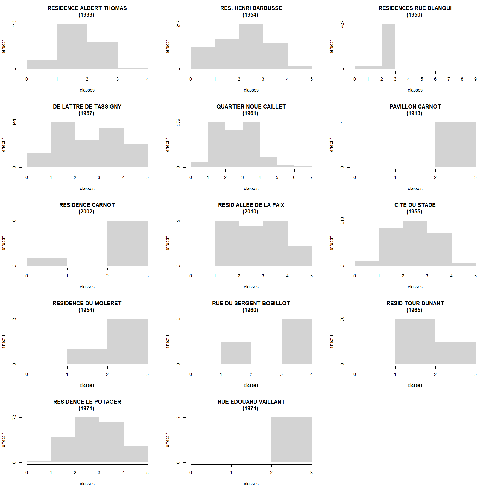
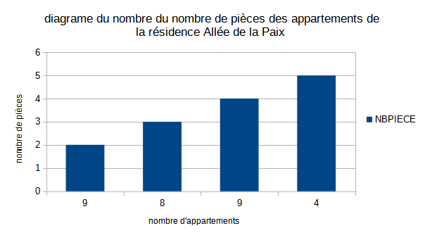
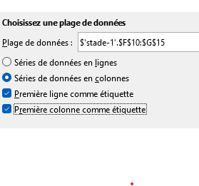

```{r setup, include=FALSE}
knitr::opts_chunk$set(echo = TRUE)
```


# Objet

Tous les scripts liés au RPLS car il va être utilisé.

# La donnée du cours

## La source
https://www.data.gouv.fr/fr/datasets/repertoire-des-logements-locatifs-des-bailleurs-sociaux/

### 2021

Prendre le .zip de 2021, petit test d'ouverture sous moodle (Introduction/bases informatiques)

```{r, eval=FALSE}
data <- read.csv("data/gros/rpls2021_geolocalise_OD_REG11_DEP93.csv", sep =";")
# distribution par commune
tab <- table(data$LIBCOM)
png("img/rpls93.png")
par(mar = c(10,4,2,2))
barplot(sort(tab), las = 2, border = NA, cex.names = 0.7)
abline(tab [ names(tab) == "Bondy"],0, col ="red")
dev.off()
write.csv(sort(tab), "data/dpt93RPLSCommune.csv")
# filtre sur Bondy
filtre <- data [data$LIBCOM == "Bondy",]
write.csv(filtre, "data/rplsBondy.csv", fileEncoding = "UTF-8")
```


C'est normalement ce fichier de données que nous allons utiliser pour le cours.


### 2019

Il y a un problème sur la donnée, prendre plutôt le millésime 2019


```{r, eval=FALSE}
rpls2019 <- read.csv2("data/gros/RPLS2019_detail_IDF_DEP_93.csv", dec = ",")
head(rpls2019)
rpls2021<- read.csv2("data/gros/rpls2021_geolocalise_OD_REG11_DEP93.csv", dec = ",")
```

```{r, eval=FALSE}
library(sf)
rpls2019 <- rpls2019 [rpls2019$CODEPOSTAL == '93140',]
rpls2021 <- rpls2021 [rpls2021$CODEPOSTAL == '93140',]
# verif x y complet
summary(rpls2019$Y)
# spatialisation des données
rpls2019sf <- st_as_sf(rpls2019, coords = c("X", "Y"), crs = st_crs(2154))
rpls2021sf <- st_as_sf(rpls2021, coords = c("X", "Y"), crs = st_crs(2154))
write.csv(rpls2019, "data/rplsBondy.csv", fileEncoding = "UTF-8")
st_write(rpls2019sf, "data/data.gpkg", "rpls2019", delete_layer = T)
st_write(rpls2021sf, "data/data.gpkg", "rpls2021", delete_layer = T, quiet = T)
```


```{r, eval=FALSE}
library(sf)
library(mapsf)
rpls2019 <- st_read("data/data.gpkg", "rpls2019",  stringsAsFactors = FALSE)
rpls2021 <- st_read("data/data.gpkg", "rpls2021")
mf_map(rpls2019, pch= 20, col = "red")
mf_map(rpls2021, col = "green", alpha = 0.8, add = T)
mf_legend(type = "typo", pos = "topright", val = c("2019", "2021"), pal = c("red", "green"), border = NA,
          title = "")
mf_layout("Comparaison rpls 2019 et 2021", credits = "RPLS")
```

## RPLS France entière

Au niveau de la France, entière, on calcule le nombre de logements sociaux
à l'échelle de la commune pour 2019.

Voir également, la référence au niveau du département (pour 10 M hbts)

https://www.insee.fr/fr/statistiques/2134423#titre-bloc-1

### Agrégation

L'agrégation du nombre d'appartements permet d'avoir les données au niveau communal.


```{r, eval = FALSE}
fic <- list.files("data/gros", "RPLS2019")
nb <- length(fic)
# on a 25 fichiers pour la France entière
# on crée une fonction pour lire et dénombrer le nb d'appartements par commune
denombrer <- function(fic){
  zone <- substring(fic, 17,99)
  data <- read.csv2(paste0("data/gros/",fic))
  tab <- table(data$LIBCOM)
  df <- data.frame(tab)
  names(df) <- c("code", "nb")
  df$zone <- zone
  return(df)
}
liste <- lapply(fic, denombrer)
# éclatement de la liste, transformation en dataframe
df <- NULL
for (i in 1:nb) {
  LIBCOM <- liste [[i]][,1]
  nb <- liste [[i]][,2]
  zone <- liste [[i]][,3]
  zone <- gsub( ".csv","", zone)
  tmp  <- data.frame(LIBCOM, nb, zone)
  df <- rbind(df, tmp)
}
# on enregistrer le fichier 
write.csv(df, "data/rplsFrSansCOG.csv", fileEncoding = "UTF-8")
```

### Observation du nombre d'appartements par zone, par commune


#### Communes par zone

```{r}
data <- read.csv("data/rplsFrSansCOG.csv", fileEncoding = "UTF-8")
tab <- table(data$zone)
barplot(tab, main = "Nb de communes avec logement social par zone",
     xlab = "zone", ylab = "nb de communes", las = 2)
```

En province, il y a également des logements sociaux répartis sur un ensemble plus grand
de communes.
Les régions avec le nombre le plus importants de communes avec des logements sociaux
sont Auvergne-Rhône Alpes et Nouvelle Aquitaine.


#### Nombre de logements sociaux par commune

L'amplitude de la variable est très importante.

```{r}
summary(data$nb)
hist(data$nb, breaks = c(0,7, 22, 322,85, 47000))
# c'est illisible, étendue trop grande, trop de données
data2000 <- data [data$nb > 2000,]
summary(data2000$nb)
# Médiane et moyenne se rapprochent
hist(data2000$nb)
# identification des communes
data [(data$nb > 20000),]
```

Le maximum c'est Toulouse...

### Jointure

On fait d'abord une jointure au niveau du libellé de la commune, que l'on vérifie par
rapport à la zone.

```{r}
cog <- read.csv("data/communes-01012019.csv", encoding = "UTF-8")
jointure <- merge(data, cog, by.x = "LIBCOM", by.y =  "libelle")
str(jointure)
# on ne retiendra que les lignes où correspondance deux derniers chiffres correspondent
jointure$reg2 <- sub("reg", "", jointure$zone)
jointure$reg2 <- sub("IDF_DEP_..", "11", jointure$reg2)
jointure$corresp <- NULL
jointure$corresp <- ifelse(jointure$reg == jointure$reg2, "ok", "non")
table(jointure$corresp)
# 10 communes perdues
res <- jointure [jointure$corresp == "ok",]
```

Suppression des doublons sur LIBCOM et zone

```{r}
fr <- read.csv("data/frVerif.csv", fileEncoding = "UTF-8")
names(data)
# 20 communes perdues
data$cle <- paste0(data [,"LIBCOM"], data[, "zone"])
doublons <- data  [!duplicated(data$cle),]
write.csv(doublons, "data/pbDoublon.csv", fileEncoding = "UTF-8")
# verif sur Allonnes
fr [fr$LIBCOM == "Allonnes",]
doublons [doublons$LIBCOM == "Allonnes",]
```

10222 communes au lieu de 10567.
Observation data finale

```{r}
data <- read.csv("data/pbDoublon.csv", fileEncoding = "UTF-8")
data [data$LIBCOM == "Allonnes",]
```


correction exercice cours 1


Exercice intitulé *dénombrement*

47 rendus sur 74


### Affichage de toutes les résidences

```{r}
library("sf")
library("mapsf")
dataResidence <- data [, c("COMPLGEO", "NBPIECE", "X", "Y")]
tab <- table (dataResidence$COMPLGEO)
names(tab)
# verif X et spatialisation
summary(dataResidence$Y)
dataResidencesf <- st_as_sf(dataResidence, coords = c("X", "Y"), crs = st_crs(2154))
table(dataResidencesf$COMPLGEO)
# centroid des polygones, on agrège par résidence, envlp convexe puis centroid)
agg <- aggregate(dataResidencesf [, "COMPLGEO"], by = list(dataResidencesf$COMPLGEO), length)
enveloppe <- st_convex_hull(agg )
ctr <- st_centroid(enveloppe)
mf_map(ctr, add = T)
ctr <- ctr [order (ctr$COMPLGEO),]
etik <- ctr [ctr$COMPLGEO > 50,]
# carto
mf_map(rpls2019sf)
mf_label(etik, var = "Group.1", overlap = F,cex = 0.6, halo = 1, bg = "antiquewhite1", offset = 2 )
mf_layout("Principales résidences HLM à Bondy (+ de 50 logements)", credits = "RPLS 2019")
# graphique
residence <- unique(data$COMPLGEO)
par(mar = c(4,12,4,4))
barplot(sort(table(data$COMPLGEO)), horiz = T, 
        main = "Nb de logements",
        las = 2, cex.names = 0.8, border = NA)

png("img/nbpiece.png", height = 1800, width = 1800, res = 150)
par(mfrow = c(5,3))
for (i in 1:14){
  print(residence [i])
  choix <- data [data$COMPLGEO == residence [i],]
  amplitude <- c(min(choix$NBPIECE), max(choix$NBPIECE))
  bks <- seq(0, amplitude [2], by = 1)
  hist(choix$NBPIECE, breaks = bks,include.lowest = F,
     main =  paste0( choix$COMPLGEO [1], "\n(", choix$CONSTRUCT [1],") "),
       xlab = "classes", ylab = "effectif", axes = F, border = NA)
  axis(side=1, at=bks, labels=bks)
  maxNBPIECES <- max(table(choix$NBPIECE))
  axis(side = 2, at= seq(0, maxNBPIECES, by = maxNBPIECES))
}
dev.off()
```




liste des problèmes rencontrés : 

### Pas grave mais attention

- nom du fichier... prénom.png

- attention choix de la série : résidence Carnot

- envoi copie d'écran et pas image

- tableau croisé dynamique plutôt que formule fréquence...

### Fondamental

- confusion somme et dénombrement

- graphique sur le TIG et pas sur le tableau condensé


- pas de paramétrage du graphique








### Questions

- autres sources

- intégration directe dans le moodle


