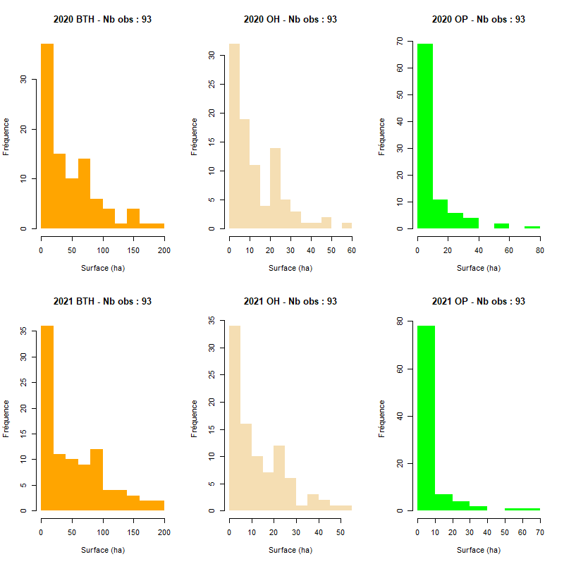
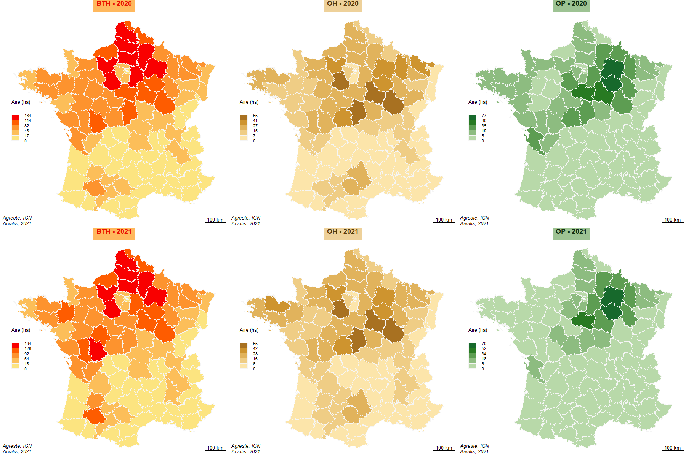

```{r setup, include=FALSE}
knitr::opts_chunk$set(echo = TRUE)
knitr::opts_chunk$set(cache = TRUE)
# Passer la valeur suivante à TRUE pour reproduire les extractions.
knitr::opts_chunk$set(eval = FALSE)
knitr::opts_chunk$set(warning = FALSE)
```


# Objet

Cartographier en valeur absolue les hac des cultures

remarque : pose le problème de la carto de la valeur absolue. essayer de proposer
systématiquement une carte avec valeur alternative de type part / total

Les exports sont sous format .xls

La liste des cultures comprend tous les départements (valeurs nulles) y compris la Corse. Seul Paris est absent.

En matière cartographique, on va au plus simple, 
  
  - pas de traitement de la valeur manquante parisienne, 
  
  - application de la même discrétisation aux 6 séries
  
  - pas de fond européen

# Librairies et répertoire

```{r}
library(sf)
library(cartography)
```

# Données

## Récup du chemin

```{r}
cheminW <-  paste0(Sys.getenv("oneDrive"), "\\data sauve\\")
cheminL <- "../../00_DATA/"
chemin <- ifelse( Sys.getenv("DESKTOP_SESSION") == "ubuntu", cheminL, cheminW)
```


## Contours

```{r}
# PB dans le st_read le fichier se transforme
chemin <- "../data/"
nomfic <-  paste0(chemin,"ign.gpkg")
dpt <- st_read(nomfic, "dpt_Corse", quiet = TRUE, stringsAsFactors = F)
nomficSimole <- paste0(chemin, "contours-geographiques-tres-simplifies-des-departements-2019.geojson")
dptS <-  st_read(nomficSimole, quiet = TRUE, stringsAsFactors = T)
fr <-  st_read(nomfic, "france", quiet = TRUE, stringsAsFactors = F)
```

Assemblage des fichiers csv

Les librairies R pour lire le .xls ne fonctionnent pas bien.
solution utiliser un bash sous linux (fichier convert.sh)

```{bash}
#!/bin/sh
for i in data/*.xls
    do soffice --headless --convert-to csv "$i" 
done
```


Assemblage des .csv


```{r}
# assemblage
noms <- list.files("../data/",pattern = ".csv")
data <- NULL
i <- 1
for (i in 1:length(noms)){
  tmp <- read.csv2(paste0("../data/",noms [i]), skip = 3, header = FALSE, fill = TRUE)
  # impossible d'importer la ligne de titre (accent de année)
  data <- rbind(data,tmp)
  print(i)
}
names(data) <-  c("dpt", "surface", "culture","S", "annee")
data <- data [,-4]
# le champs S pas nécessaire
# champs culture
code <- sort(table(data$culture))
knitr::kable(code)
data [grep ("CORSE",data$dpt),]
write.csv(data , "../dataS/data.csv", row.names = FALSE)
```

570 données, 190 par culture.

Jointure

```{r}
# jointure dpt : on récupère le numéro du dpt
data$INSEE_DEP <- substring(data$dpt, 1,2)
jointure <- merge(dpt, data, by = "INSEE_DEP")
# Enregistrement en format .gpkg 558 obs
st_write(jointure, "../dataS/data.gpkg", "jointure", row.names = FALSE,quiet = TRUE, delete_layer = TRUE)
```


Y-a-t-il des départements sans culture ?

```{r}
setdiff(dpt$INSEE_DEP, jointure$INSEE_DEP)
```

Uniquement Paris


data et couleurs pour cartes / graphique

```{r}
data <- st_read("../dataS/data.gpkg", "jointure", quiet = TRUE, stringsAsFactors = TRUE)
str(data)
data$annee <- as.factor(data$annee)
data$surface <-  as.numeric(data$surface)
# on va utiliser les facteurs dans les boucles de carto
table(data$culture, data$an)
# couleurs pour cultures 
lcouleurs <- list (OP = "orange.pal", OH = "sand.pal", BTH = "green.pal", BD = "wine.pal")
# trouver les couleurs correpsondant aux palettes
couleurs <- c("orange", "wheat", "green", "brown2")
```


# distributions

```{r}
png(
  "../img/distributions.png",
  width = 800,
  height = 800,
  res = 100
)
levels(data$an)
levels(data$culture)
par(mfrow = c(2, 3))
# année
i <- levels(data$an)[1]
for (i in levels(data$an)) {
  j <- levels(data$culture)[1]
  num <- 1
  for (j in levels(data$culture)){

  sel <- data[ data$an == i& data$culture == j,]
str(sel)
    hist(sel$surface,
       main = paste0(
          i," ",
          j,
          " - Nb obs : ", 
          nrow(sel)
          ) ,
       xlab = "Surface (ha)",
       ylab = "Fréquence",
       col = couleurs[4],
       border = NA)
    # couleur par rapport culture
  num <- num + 1
}
}
dev.off()
```



pas beaucoup d'évolution 2020 2021


# carto (par 6)

Fonction de cartographie

```{r}
cartographier <- function(data) {
  # année
  i <- levels(data$an)[1]
  for (i in levels(data$annee)) {
    j <- levels(data$culture)[1]
    num <- 1
    for (j in levels(data$culture)) {
      sel <- data[data$annee == i & data$culture == j,]
      par(mar = c(0, 0, 1.2, 0))
      #centrage sur l'ensemble de la France
      ghostLayer(fr$geom, bg = "white")
      choroLayer(
        sel,
        var =  "surface",
        method = "jenks",
        nclass = 5,
        col = carto.pal(pal1 = lcouleurs [[4]], 5),
        border = NA,
        legend.title.cex = 0.6,
        legend.values.cex = 0.5,
        legend.title.txt = "Aire (ha)",
        legend.border = "gray96",
        legend.pos = "left",
        add = TRUE
      )
      layoutLayer(
        title = paste0(j, " - ", i),
        tabtitle = TRUE,
        theme = lcouleurs [[num]],
        frame = FALSE,
        postitle = "center",
        author = "Arvalis, 2021",
        sources = "Agreste, IGN"
      )
      plot(
        dpt$geom,
        col = NA,
        lty = 3,
        lwd = 1,
        border = "gray96",
        add = TRUE
      )
      num <- num + 1
    }
  }
}
culture <- "BD"
annee <- "2020"
cartoSansBoucle <- function(culture, annee) {
      sel <- data[data$annee == annee & data$culture == culture,]
      # parametres couleurs
      colCulture <-  unlist(lcouleurs [culture]  )
      #par(mar = c(0, 0, 1.2, 0))
      #centrage sur l'ensemble de la France
      ghostLayer(dpt$geom, bg = "white")
      choroLayer(
        sel,
        var =  "surface",
        method = "jenks",
        nclass = 5,
        col = carto.pal(pal1 = colCulture, 5),
        border = NA,
        legend.title.cex = 0.6,
        legend.values.cex = 0.5,
        legend.title.txt = "Aire (ha)",
        legend.border = "gray96",
        legend.pos = "left",
        add = TRUE
      )
      layoutLayer(
        title = paste0(culture, " - ", annee),
        tabtitle = TRUE,
        theme = colCulture,
        frame = FALSE,
        postitle = "center",
        author = "Arvalis, 2021",
        sources = "Agreste, IGN",
        posscale = "bottomright",
        horiz = TRUE
      )
      plot(
        dpt$geom,
        col = NA,
        lty = 3,
        lwd = 1,
        border = "gray96",
        add = TRUE
      )
}
cartoSansBoucle("BD", "2020")
plot(dpt$geom)
```


Pour la carto, on reprend la même structure que pour les histo

En vignette

```{r}
png(
  paste0("../img/carto", ".png"),
  width = 600 * 3,
  height = 600 * 2,
  res = 200
)
par(mfrow = c(2, 3))

cartographier(data)

dev.off()
```



Carte par carte

```{r}
for (i in levels(data$annee)) {
  for (j in levels(data$culture)) {
    sizes <- getFigDim(dpt, width = 3000, res = 500)
png(
  paste0("../img/carto",i,"_",j, ".png"),
  width = sizes [1],
  height = sizes [2],
  res = 500
)
par(mar = c(0,0,1.2,0))
cartoSansBoucle(j, i)
dev.off()
  }
}
```


